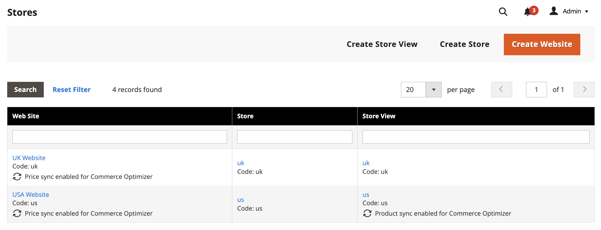
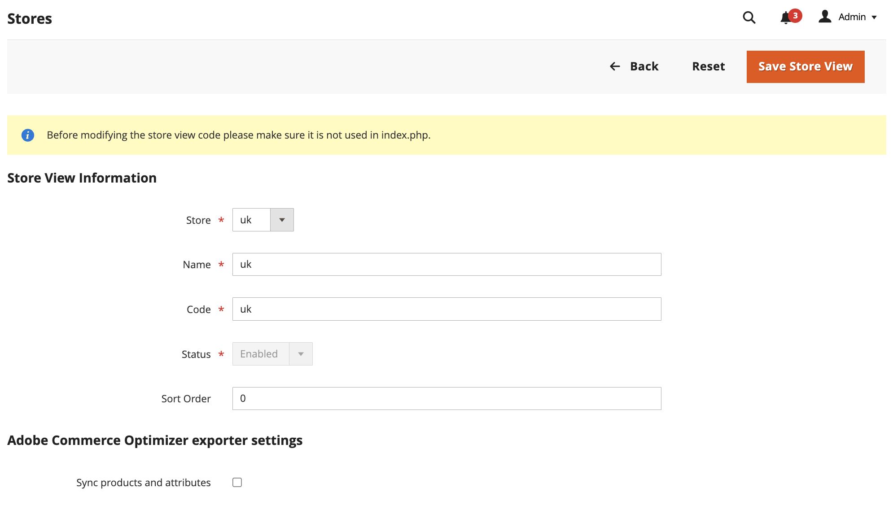
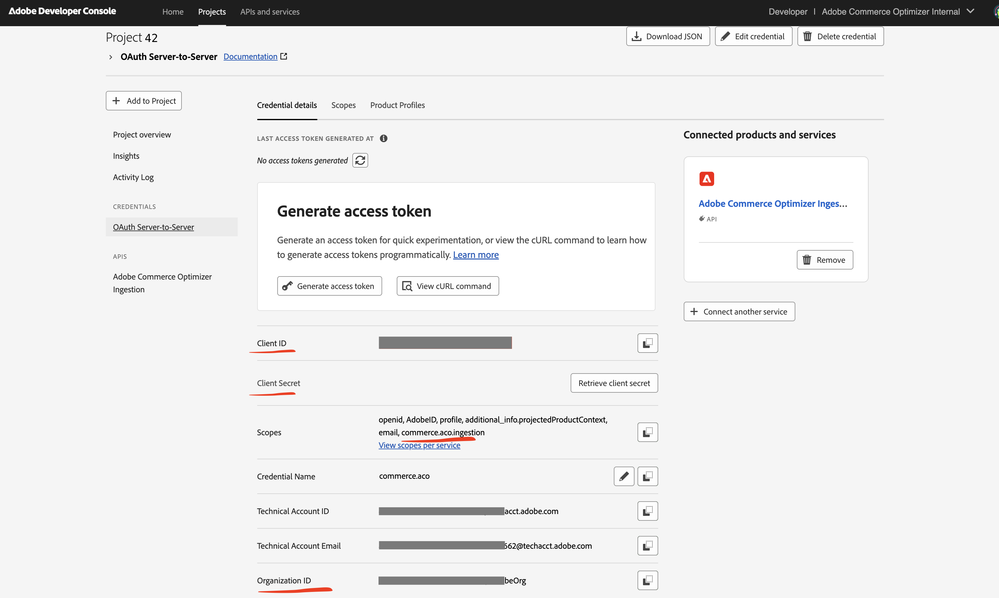

# Introdução

Instale e configure o [!DNL Adobe Commerce Optimizer Connector] para sincronizar seus dados de catálogo do [!DNL Adobe Commerce] com o [!DNL Adobe Commerce Optimizer] e, em seguida, monitore o status de sincronização de dados para garantir que sua vitrine eletrônica esteja atualizada.

{{aco-integration-environment-alignment}}

## Requisitos para usar a integração {#requirements-to-use-the-integration}

* [!DNL Adobe Commerce] 2.4.7+

   * PHP 8.2, 8.3 ou 8.4
   * Composer 2.x

* [!DNL Commerce Optimizer] licença com uma instância de sandbox provisionada.

* [Chaves de autenticação](https://experienceleague.adobe.com/en/docs/commerce-operations/installation-guide/prerequisites/authentication-keys) para baixar o metapackage do conector usando o Composer.

* Acesso de administrador a uma [[!DNL Commerce Optimizer] instância da sandbox](../optimizer/get-started.md).

O usuário [!DNL Adobe Commerce] que está configurando a integração deve ter:

* Acesso de administrador ao Administrador do Commerce.

* [Acesso de linha de comando ao [!DNL Adobe Commerce] servidor de aplicativos](https://experienceleague.adobe.com/en/docs/commerce-on-cloud/user-guide/project/user-access).

* Acesso de desenvolvedor à [Organização de IMS](https://experienceleague.adobe.com/en/docs/core-services/interface/administration/organizations?) onde o projeto [!DNL Commerce Optimizer] é provisionado.

>[!BEGINSHADEBOX]

## Remover extensões conflitantes {#remove-conflicting-extensions}

Se você tiver uma das seguintes extensões instaladas, desinstale-as antes de instalar o [!DNL Adobe Commerce Optimizer Connector]:

* [!DNL Adobe Commerce Live Search] (`magento/live-search`)
* [!DNL Adobe Commerce Product Recommendations] (`magento/product-recommendations`)
* [!DNL Adobe Commerce Catalog Service] (`magento/catalog-service`, `magento/catalog-service-installer`)
* **[!UICONTROL Data Management Dashboard]** (`magento-catalog-sync-admin`)

Os dados associados a essas extensões ainda estão disponíveis no banco de dados do Commerce. No entanto, ele não é exportado para [!DNL Commerce Optimizer] quando o conector está habilitado. Para implementar os recursos de pesquisa e merchandising fornecidos por essas extensões após habilitar o conector, configure-os na [[!DNL Commerce Optimizer] Interface do usuário do administrador](https://experienceleague.adobe.com/en/docs/commerce/optimizer/overview#quick-tour).

>[!IMPORTANT]
>
>Se essas extensões não forem removidas antes da habilitação do conector, você poderá ver telas de configuração com falha, dados duplicados em [!DNL Commerce Optimizer] porque os mesmos dados são exportados do conector e das extensões existentes e erros 401 ou 403 nos logs devido a conflitos na maneira como as extensões e o conector são autenticados com os serviços conectados.

>[!ENDSHADEBOX]

## Etapas de configuração {#configuration-steps}

Siga estas etapas para habilitar o [!DNL Adobe Commerce Optimizer Connector] e começar a sincronizar dados de [!DNL Adobe Commerce] com sua instância do [!DNL Commerce Optimizer].

1. **[Instale o [!DNL Adobe Commerce Optimizer Connector] pacote](#install-the-adobe-commerce-optimizer-connector-package)** usando o Composer para conectar sua instância do [!DNL Adobe Commerce] ao [!DNL Commerce Optimizer].

1. **[Personalize a configuração de exportação de escopos do Commerce](#customize-the-commerce-scopes-export-configuration)** do Administrador.

1. **[Habilitar a [!DNL Commerce Optimizer] integração](#enable-the-adobe-commerce-optimizer-integration)**.

1. **[Verifique se a sincronização de dados está funcionando](#verify-that-the-data-sync-is-working)**.

## Instalar o pacote [!DNL Adobe Commerce Optimizer Connector] {#install-the-adobe-commerce-optimizer-connector-package}

O [!DNL Adobe Commerce Optimizer Connector] é fornecido como um metapackage do Composer disponível a todos os comerciantes do Commerce com uma licença ativa para [!DNL Commerce Optimizer].

### Etapas de instalação

1. Adicionar o módulo `adobe-commerce/commerce-data-export-aco-adapter` usando o Composer:

   ```shell
   composer require adobe-commerce/commerce-data-export-aco-adapter
   ```

1. Implante as alterações no ambiente de preparo do [!DNL Adobe Commerce].

   Após a conclusão da implantação, a opção [!DNL Commerce Optimizer] fica disponível no menu Admin do Commerce. Selecione **[!UICONTROL Commerce Optimizer]** para abrir a instância do [!DNL Commerce Optimizer] diretamente do Administrador do Commerce.

>[!NOTE]
>
>Para obter instruções detalhadas sobre a instalação de extensões, consulte os guias a seguir:
>
>[Instalar extensão em [!DNL Adobe Commerce] na Infraestrutura em Nuvem](https://experienceleague.adobe.com/en/docs/commerce-on-cloud/user-guide/configure-store/extensions)
>
>[Instalar extensão em [!DNL Adobe Commerce] no local](https://experienceleague.adobe.com/en/docs/commerce-operations/installation-guide/tutorials/extensions)

## Personalizar a configuração de exportação de escopos do Commerce {#customize-the-commerce-scopes-export-configuration}

Por padrão, a sincronização de dados do catálogo é habilitada para todos os escopos do Commerce (sites, grupos de clientes e exibições de loja). Você pode personalizar as configurações de exportação para sincronizar dados apenas para escopos específicos com base nas necessidades comerciais. Por exemplo, se você tiver várias exibições de armazenamento que compartilham o mesmo idioma, poderá optar por exportar dados para apenas uma das exibições de armazenamento e usá-la como a [origem do catálogo](../optimizer/setup/catalog-sources.md) para várias exibições de catálogo em [!DNL Commerce Optimizer].

>[!IMPORTANT]
>
>A alteração das configurações de exportação aciona uma reindexação completa, que pode levar um tempo significativo, dependendo do tamanho do catálogo. A Adobe recomenda configurar os escopos do Commerce para sincronização com o [!DNL Commerce Optimizer] antes de habilitar a integração e iniciar a sincronização de dados inicial.

A tabela a seguir descreve quais dados são exportados em cada nível de escopo:

| Escopo | Dados exportados | Notas |
| ----- | ------------- | ----- |
| Site e grupo de clientes | Preços e catálogos de preços | Cada conjunto de preços é exportado como um [catálogo de preços](../optimizer/setup/pricebooks.md) usando a convenção de nomenclatura `&lt;website&gt;::&lt;SHA1 of customer group ID&gt;`. Todos os grupos de clientes do site estão incluídos. |
| Exibição de loja | Produtos e atributos do produto | Cada exibição de armazenamento cria uma [origem do catálogo](../optimizer/setup/catalog-sources.md) separada em [!DNL Commerce Optimizer]. |

{width="600" zoomable="yes"}

### Para alterar as configurações de exportação do escopo

1. No Administrador do Commerce, vá para **[!UICONTROL Stores]** > **[!UICONTROL Settings]** > **[!UICONTROL All Stores]**.

1. Selecione o site ou a exibição de loja que deseja configurar.

1. Nas **[!DNL Commerce Optimizer]configurações do exportador**, use a caixa de seleção para habilitar ou desabilitar a sincronização de dados conforme necessário.

   {width="500" zoomable="yes"}

1. Salve as alterações.

### Ativar e desativar comportamento

| Ação | Resultado |
| -------- | -------- |
| Desabilitar uma exibição de loja | **Desabilitar a sincronização remove os dados do catálogo da loja.** A origem do catálogo permanece em [!DNL Commerce Optimizer], mas todos os dados sincronizados são removidos na próxima execução de cron. |
| Desabilitar e depois habilitar novamente uma exibição de loja | A mesma origem de catálogo é preenchida novamente com uma ressincronização de dados completa. |

## Habilitar a integração do [!DNL Commerce Optimizer] {#enable-the-adobe-commerce-optimizer-integration}

Você habilita a integração e inicia a sincronização de dados executando o comando da CLI do `aco:config:init`. Esse comando conclui as seguintes etapas:

1. Obtém um token de acesso IMS usando credenciais fornecidas como argumentos de linha de comando.
1. Chama o serviço Commerce Cloud Manager (CCM) em `https://ccm.api.commerce.adobe.com/api/v1/tenants/{tenantId}/owner/{orgId}` para validar o locatário e extrair a URL de assimilação e a URL de Estúdio [!DNL Commerce Optimizer].
1. Salva toda a configuração (segredo do cliente criptografado) em `core_config_data`.
1. Agenda a sincronização completa inicial, invalidando todos os [!DNL Commerce Optimizer] indexadores de feed.

>[!IMPORTANT]
>
>O processamento da sincronização de dados é iniciado em segundo plano assim que você conclui a configuração. Dependendo do tamanho do catálogo, o processo de sincronização de dados pode levar de alguns minutos a várias horas.

### Obter detalhes de conexão necessários

No [Adobe Developer Console](https://developer.adobe.com/console), crie um novo projeto habilitado para o serviço de Assimilação do [!DNL Commerce Optimizer] e gere credenciais OAuth de servidor para servidor. Para obter instruções detalhadas, consulte [Obter credenciais IMS](https://developer.adobe.com/commerce/services/optimizer/data-ingestion/authentication/#obtain-ims-credentials) no *Guia do Desenvolvedor de Merchandising*.

Salve os seguintes valores da página de credenciais:

* **ID da Organização** (`org_id`)
* **ID do Cliente** (`client_id`)
* **Segredo do Cliente** (`client_secret`)

{width="500" zoomable="yes"}

### Obter detalhes da instância [!DNL Commerce Optimizer]

Obtenha a _ID do locatário_ do campo _[!DNL Instance Id]_na [[!DNL Instance details] página](../optimizer/get-started.md#manage-instances) da instância [!DNL Commerce Optimizer] ou da URL usada para acessar a instância. Por exemplo, em `https://experience.adobe.com/#/@&lt;your organization&gt;/in:&lt;tenant ID&gt;/commerce-optimizer-studio/home`.

1. No Administrador do Commerce, selecione **[!UICONTROL Adobe Commerce Optimizer]** para exibir a página de configuração com instruções.

   ![[!DNL Commerce Optimizer] página de configuração](./assets/aco-connector-admin-installation.png){width="500" zoomable="yes"}

1. Na linha de comando, [use SSH](https://experienceleague.adobe.com/en/docs/commerce-on-cloud/user-guide/develop/secure-connections) para se conectar ao ambiente de preparo [!DNL Adobe Commerce].

1. Execute o seguinte comando da CLI do [!DNL Adobe Commerce] para configurar a integração, substituindo os valores de espaço reservado pelos valores do seu projeto [!DNL Commerce Optimizer]:

   ```shell
   bin/magento aco:config:init --org_id=your-org --tenant_id=your-tenant --client_id=your-client-id --client_secret=your-secret
   ```

1. Verifique a conexão retornando ao Administrador do Commerce e selecionando a opção [!UICONTROL Adobe Commerce Optimizer].

   Ao selecionar a opção, ela abrirá a interface do usuário do [!DNL Commerce Optimizer] em uma nova guia.

## Verifique se a sincronização de dados está funcionando {#verify-that-the-data-sync-is-working}

{{$include /help/_includes/aco-connector/verify-optimizer-data-sync.md}}

## Próximas etapas

1. **Configurar [!DNL Commerce Optimizer] exibições e políticas de catálogo**

   Crie políticas e exibições de catálogo na interface do usuário do [!DNL Commerce Optimizer]. Observe que os catálogos de preços são criados automaticamente de [!DNL Adobe Commerce] grupos de clientes. Para obter instruções, consulte a documentação das [Exibições de catálogo](../optimizer/setup/catalog-view.md) e [Políticas](../optimizer/setup/policies.md) no *[!DNL Commerce Optimizer]Guia do Usuário*.

1. **Configurar uma Commerce Storefront em[!DNL Edge Delivery Services]**

   Siga a [documentação de configuração da loja](https://experienceleague.adobe.com/developer/commerce/storefront/setup/){target="_blank"} para conectar sua loja à instância do [!DNL Commerce Optimizer] e começar a fornecer experiências de comércio personalizadas.
