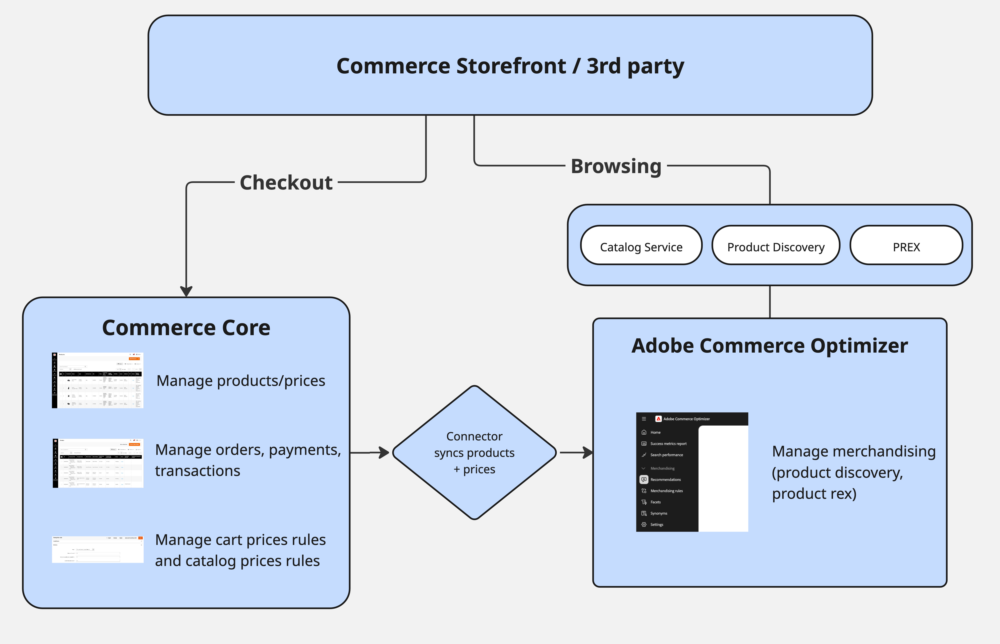
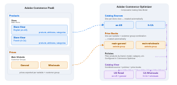

# [!DNL Adobe Commerce Optimizer Connector]

O [!DNL Adobe Commerce Optimizer Connector] é uma integração nativa e própria entre o [!DNL Adobe Commerce] (nuvem ou local) e o [!DNL Adobe Commerce Optimizer]. Ele sincroniza os dados de catálogo e preço dos seus armazenamentos do [!DNL Adobe Commerce] no [!DNL Adobe Commerce Optimizer] para que você possa:

- **Descoberta e recomendações de produtos orientadas por IA**
- Executar **frente de loja headless de alto desempenho** (incluindo frente de loja da Commerce alimentadas por [!DNL Edge Delivery Services])
- Analisar **antes e depois de** KPIs e integridade da sincronização de dados em um único local

O [!DNL Adobe Commerce] permanece como seu sistema de registro de produtos, preços e estrutura de catálogo. O [!DNL Adobe Commerce Optimizer] se torna sua experiência e camada de merchandising, oferecendo resultados rápidos e relevantes a qualquer vitrine ou canal conectado.

## Principais benefícios {#key-benefits}

| Benefício | O que isso significa para você |
| --- | --- |
| **Nenhum conector personalizado a ser compilado** | Use uma integração própria compatível em vez de escrever e manter feeds e scripts personalizados. |
| **Retorno do valor mais rápido com[!DNL Adobe Commerce Optimizer]** | Ative Pesquisas com IA, recomendações e headless na sua implantação existente do [!DNL Adobe Commerce]. |
| **Alinhado aos escopos do Commerce** | Mapeia automaticamente sites, exibições de loja e grupos de clientes em [!DNL Adobe Commerce Optimizer] construções de catálogo (Origens de Catálogo e Catálogos de Preços). |
| **Visibilidade operacional** | Monitore a integridade do feed, os últimos horários de sincronização e o status por SKU a partir de uma exibição dedicada do [!UICONTROL Data Feed Sync Status]. |
| **Caminho pronto para o futuro em direção a SaaS** | Fornece um caminho de modernização de baixo risco da PaaS para [!DNL Adobe Commerce as a Cloud Service] + [!DNL Adobe Commerce Optimizer], sem uma replataforma. |

## Arquitetura do conector {#connector-architecture}

O diagrama a seguir ilustra a arquitetura completa do conector, de [!DNL Adobe Commerce] até [!DNL Adobe Commerce Optimizer] e até as vitrines e os sistemas de check-out.

{width="700" zoomable="yes"}

Nesta arquitetura:

- [!DNL Adobe Commerce] (na nuvem ou no local) é o sistema de produtor de registro e feed
- O conector exporta feeds de catálogo, preço e categoria
- [!DNL Adobe Commerce Optimizer] assimila e normaliza os dados de feed em Fontes de Catálogo, Catálogos de Preços e Exibições de Catálogo
- As vitrines (vitrines do Commerce em [!DNL Edge Delivery Services] ou compilações headless personalizadas) chamam APIs do GraphQL [!DNL Adobe Commerce Optimizer] para descoberta e recomendações e chamam [!DNL Adobe Commerce] ou outra plataforma de terceiros conectada para operações de carrinho e check-out

## Como o conector funciona com o [!DNL Adobe Commerce] {#how-the-connector-works-with-adobe-commerce}

O [!DNL Adobe Commerce Optimizer Connector] opera usando seus escopos existentes do Commerce (sites e exibições de loja) e a segmentação de clientes para preencher o modelo de catálogo [!DNL Adobe Commerce Optimizer]:

{width="750" zoomable="yes"}

- **Exibição de loja → Fontes de Catálogo** — Cada exibição de loja se torna uma Source de Catálogo separada em [!DNL Adobe Commerce Optimizer]. Essa origem inclui atributos localizados do produto e quaisquer dados específicos da visualização da loja
- **Site → Catálogos de Preços** — Cada site do [!DNL Adobe Commerce] mapeia para um ou mais Catálogos de Preços no [!DNL Adobe Commerce Optimizer]. Preços do site e exportação de preços do grupo de clientes como catálogos de preços e entradas de preços
- **Grupo de clientes → Variantes de preço** — [!DNL Adobe Commerce] o preço do grupo de clientes aparece como entradas adicionais nos catálogos de preços relevantes

Depois que [!DNL Adobe Commerce Optimizer] assimilar os dados, você pode configurar:

- **Modos de Exibição e Políticas do Catálogo** no [!DNL Adobe Commerce Optimizer] Studio (para região de compilação, marca ou subconjuntos específicos do cliente)
- **Descoberta de Produto** (pesquisa, aspectos, regras de merchandising)
- **[!DNL Product Recommendations]**

Ao habilitar o conector, a instância [!DNL Adobe Commerce] permanece como o sistema de registro para dados de catálogo e preço. Ao atualizar dados no [!DNL Adobe Commerce], o conector sincroniza essas atualizações para a instância [!DNL Adobe Commerce Optimizer].

>[!NOTE]
>
>Para obter detalhes sobre a configuração de [!DNL Adobe Commerce Optimizer], consulte [[!DNL Adobe Commerce Optimizer] Ferramentas de merchandising](/help/optimizer/overview.md#quick-tour).

## Fluxos de trabalho típicos {#typical-workflows}

Estes fluxos de trabalho descrevem como as equipes configuram e usam o [!DNL Adobe Commerce Optimizer Connector]. Para obter detalhes sobre como configurar a integração e habilitar esses fluxos de trabalho, consulte [Introdução](/help/aco-connector/get-started.md).

### Instalação e configuração iniciais {#initial-setup}

Consulte [Etapas de configuração](/help/aco-connector/get-started.md#configuration-steps) no guia _Introdução_.

### Sincronização de dados em andamento {#ongoing-sync}

Após a configuração inicial, o conector suporta:

- **Sincronização completa do catálogo** para migração inicial ou grandes alterações estruturais
- **Sincronizações delta** para atualizações contínuas quando produtos ou preços mudam
- **Ressincronizar comandos** para feeds direcionados

Os seguintes feeds estão disponíveis para o [!DNL Adobe Commerce Optimizer Connector]:

- `products` - dados de produtos
- `productAttributes` - metadados para atributos de produto
- `priceBooks` - catálogos de preços
- `prices` - preços do produto
- `categories` - dados de categorias

Para obter detalhes adicionais, consulte os seguintes tópicos:

- Para operações de ressincronização de CLI [!DNL Adobe Commerce], consulte o [comando de ressincronização de CLI](/help/data-export/data-export-cli-commands.md#sync-using-cli-commands){target="_blank"}
- [[!DNL Adobe Commerce Optimizer Connector] módulos e pontos de extremidade de feed](/help/aco-connector/reference/connector-reference.md)
- [Mapeamento de campos para feeds de conector](/help/aco-connector/reference/field-mapping.md)

### Configurar merchandising e lojas {#merchandising-storefronts}

Quando os dados do [!DNL Adobe Commerce] estiverem disponíveis no [!DNL Adobe Commerce Optimizer], use o [[!DNL Adobe Commerce Optimizer] Studio](/help/optimizer/overview.md#quick-tour) para conectar as experiências de merchandising e de vitrine ao catálogo sincronizado. As próximas etapas típicas incluem:

- **Modos de exibição e políticas do catálogo** — Defina subconjuntos específicos de região, marca ou cliente e regras de acesso do menu [!UICONTROL Store setup]
- **Descoberta de produtos e recomendações** — Configure pesquisa, aspectos, regras de merchandising, sinônimos e unidades de recomendação no menu [!UICONTROL Merchandising]. O comportamento de pesquisa e recomendação é gerenciado em [!DNL Adobe Commerce Optimizer]; as configurações [!DNL Live Search] e [!DNL Product Recommendations] no Administrador [!DNL Adobe Commerce] não se aplicam mais a esses fluxos
- **Conexões da loja** — lojas Point Commerce em [!DNL Edge Delivery Services] ou compilações headless de terceiros no [!DNL Adobe Commerce Optimizer] locatário correto, exibição de catálogo e pontos de extremidade de API de Merchandising. Para obter um exemplo de integração de terceiros, consulte o [Salesforce Commerce Connector for [!DNL Adobe Commerce Optimizer]](/help/optimizer/developer/salesforce-connector.md)
- **Check-out** — Mantenha o carrinho, o check-out, o gerenciamento de pedidos e as contas de clientes em [!DNL Adobe Commerce] ou em uma plataforma conectada de terceiros. Use [!DNL App Builder] e [!DNL API Mesh] para entrega do carrinho quando necessário

Para obter uma orientação de configuração passo a passo, consulte [Introdução](/help/aco-connector/get-started.md) e as [[!DNL Adobe Commerce Optimizer] ferramentas de Merchandising](/help/optimizer/overview.md#quick-tour).

## Cenários compatíveis {#supported-scenarios}

O conector foi projetado para comerciantes B2C com [!DNL Adobe Commerce] em nuvem e implantações locais que desejam adotar o [!DNL Adobe Commerce Optimizer] sem reconstruir seu back-end.

**Casos de uso comuns:**

- **Modernizar somente a loja**
Mantenha seu back-end existente do [!DNL Adobe Commerce], mova o PLP/Search/PDP para [!DNL Edge Delivery Services] vitrines viabilizadas pelo [!DNL Adobe Commerce Optimizer]

- **Dimensionando desempenho de catálogo e pesquisa**
Descarregue a indexação e a pesquisa de catálogos pesados para os serviços SaaS de [!DNL Adobe Commerce Optimizer], mantendo a propriedade do produto e do preço em [!DNL Adobe Commerce]

- **Adoção incremental de SaaS**
Use o conector como uma etapa em direção a [!DNL Adobe Commerce as a Cloud Service] + [!DNL Adobe Commerce Optimizer], com um catálogo [!DNL Adobe Commerce] combinável compatível

## Responsabilidades e pré-requisitos de implementação {#responsibilities-prerequisites}

[!DNL Adobe Commerce] é a fonte da verdade para produtos, preços e grupos de clientes. Faça alterações em [!DNL Adobe Commerce]; o conector as sincroniza com [!DNL Adobe Commerce Optimizer].

**[!DNL Adobe Commerce Optimizer]é responsável por:**

- Modelagem de catálogo (Origens de catálogo, Catálogos de preços, Exibições de catálogo, Políticas)
- Detecção e recomendações de produtos
- Métricas de vitrine, painéis de sincronização de dados e relatórios de Métricas de sucesso

**O conector não:**

- Modificar fluxos de carrinho, check-out ou pedido de [!DNL Adobe Commerce]
- Provisionar automaticamente projetos da loja (a Commerce Storefront / [!DNL Edge Delivery Services] manipula isso)

**Antes de começar:**

- Verifique se [!DNL Adobe Commerce] atende à versão mínima e aos requisitos de [!DNL Adobe Commerce Optimizer Connector]. Consulte [Introdução](/help/aco-connector/get-started.md#requirements-to-use-the-integration) para obter detalhes.
- Verifique se você tem acesso à Organização IMS, uma instância [!DNL Adobe Commerce Optimizer] e as credenciais e os detalhes de região necessários.

## Mais ajuda sobre este tópico {#more-help-on-this-topic}

- Configure a integração e habilite os fluxos de trabalho principais: [Introdução ao [!DNL Adobe Commerce Optimizer Connector]](/help/aco-connector/get-started.md)
- Saiba mais sobre os conceitos e a arquitetura do [!DNL Adobe Commerce Optimizer]: [O que é o [!DNL Adobe Commerce Optimizer]?](/help/optimizer/overview.md)
- Entenda o mecanismo de sincronização, a inicialização e o tratamento de erros: [Pipeline de sincronização do conector](/help/aco-connector/connector-sync-pipeline.md)
- Mapeamento de dados em nível de campo para todos os feeds: [Mapeamento de campo para feeds de conector](/help/aco-connector/reference/field-mapping.md)
- Integre vitrines headless usando GraphQL e codificação de pacote: [Integração de vitrines headless](/help/aco-connector/headless-storefront.md)
- Diagnosticar problemas de sincronização e configuração: [Solução de problemas](/help/aco-connector/troubleshooting.md)
