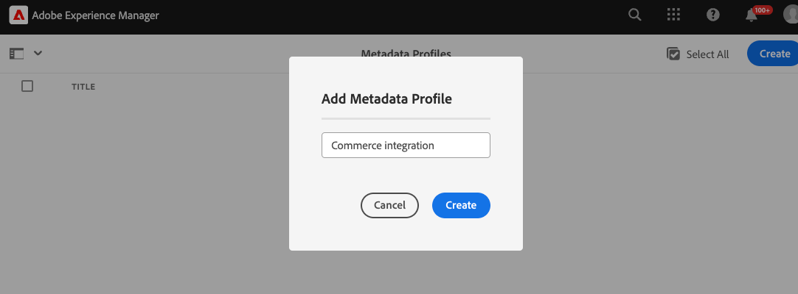

# Configurar o projeto do AEM Assets para suportar metadados do Commerce

Ao usar o AEM Assets como um sistema de gerenciamento de ativos digitais (DAM) para Commerce, a instalação do pacote `assets-commerce` permite gerenciar imagens e vídeos para produtos Commerce do ambiente de criação do AEM.

Conclua as seguintes etapas para configurar o projeto do AEM Assets com o código do pacote e os metadados necessários para gerenciar ativos do Commerce no ambiente de criação do AEM:

1. [Saiba mais sobre o ](#aem-commerce-assets-commerce-package-contents)

1. [Conclua as etapas de instalação para configurar o projeto do AEM Assets para ser compatível com os metadados do Commerce](#step-1-install-the-assets-commerce-package)

## Conteúdo do pacote **assets-commerce** do AEM Commerce

A Adobe fornece um código de pacote do AEM Commerce `assets-commerce` para adicionar namespace Commerce e recursos de esquema de metadados à configuração de ambiente do Experience Manager Assets as a Cloud Service.

Esse código de pacote adiciona os seguintes recursos ao ambiente de criação do AEM Assets:

* Um [namespace personalizado](https://github.com/ankumalh/assets-commerce/blob/main/ui.config/jcr_root/apps/commerce/config/org.apache.sling.jcr.repoinit.RepositoryInitializer~commerce-namespaces.cfg.json), `Commerce` para identificar propriedades relacionadas ao Commerce.

   * Um tipo de metadados personalizado `commerce:isCommerce` com o rótulo `Eligible for Commerce` para marcar ativos da Commerce associados a um projeto do Adobe Commerce.

   * Um tipo de metadados personalizado `commerce:skus` e um componente correspondente da interface do usuário para adicionar uma propriedade **[!UICONTROL Product Data]**. Os dados do produto incluem as propriedades de metadados para associar um ativo do Commerce às SKUs do produto.

     {width="600" zoomable="yes"}

   * Um tipo de metadados personalizado `commerce:roles` e `commerce:positions` atributos para mostrar como o ativo é visualizado no Commerce.

* Um formulário de esquema de metadados com uma guia Commerce que inclui os campos `Eligible for Commerce` e `Product Data` para marcar ativos do Commerce. O formulário também fornece opções para mostrar ou ocultar os campos `roles` e `position` da interface do AEM Assets.

  {width="600" zoomable="yes"}

* Um [ativo de Commerce marcado e aprovado](https://github.com/ankumalh/assets-commerce/blob/main/ui.content/src/main/content/jcr_root/content/dam/wknd/en/activities/hiking/equipment_6.jpg/.content.xml) `equipment_6.jpg` de amostra para oferecer suporte à sincronização de ativos inicial. Somente ativos aprovados do Commerce podem ser sincronizados do AEM Assets para o Adobe Commerce.

>[!NOTE]
>
> Consulte a página [readme](https://github.com/ankumalh/assets-commerce) para obter mais informações sobre o **código do pacote do AEM Commerce**.

## Pré-requisitos

Você precisa dos seguintes recursos e permissões para implantar o código do pacote `assets-commerce` no ambiente do AEM Assets as a Cloud Service AEM:

* [Acesso ao Programa e aos ambientes do AEM Assets Cloud Manager](https://experienceleague.adobe.com/en/docs/experience-manager-cloud-service/content/onboarding/journey/cloud-manager#access-sysadmin-bo) com as funções de Gerente de Programa e de Implantação.

* Um [ambiente de desenvolvimento local do AEM](https://experienceleague.adobe.com/en/docs/experience-manager-learn/cloud-service/local-development-environment-set-up/overview) e familiaridade com o processo de desenvolvimento local do AEM.

* Entenda a [estrutura do projeto do AEM](https://experienceleague.adobe.com/pt-br/docs/experience-manager-cloud-service/content/implementing/developing/aem-project-content-package-structure) e como implantar pacotes de conteúdo personalizados usando o Cloud Manager.

* A **ID da Organização IMS** configurada para a instância do Commerce.

## Etapa 1: instalar o pacote **assets-commerce**

1. Navegue até o AEM Cloud Manager, selecione um programa e [crie ambientes de produção e de preparo](https://experienceleague.adobe.com/en/docs/experience-manager-cloud-service/content/onboarding/journey/create-environments#creating-environments) que você deseja integrar ao Adobe Commerce.

1. Configure um [pipeline de implantação](https://experienceleague.adobe.com/en/docs/experience-manager-cloud-service/content/sites/administering/site-creation/quick-site/pipeline-setup#create-front-end-pipeline) ou verifique se o pipeline pode implantar alterações no ambiente selecionado.

1. [Clonar o repositório Git gerenciado pela Adobe](https://experienceleague.adobe.com/en/docs/experience-manager-cloud-service/content/sites/administering/site-creation/quick-site/retrieve-access#repo-access) para o programa selecionado.

1. No GitHub, baixe o código do pacote do [repositório do AEM Assets Commerce](https://github.com/ankumalh/assets-commerce).

1. Em seu [ambiente de desenvolvimento local do AEM](https://experienceleague.adobe.com/en/docs/experience-manager-learn/cloud-service/local-development-environment-set-up/overview), copie manualmente o código baixado no repositório gerenciado existente do Adobe.

1. Em todas as `filter.xml` e `pom.xml files` do seu projeto, substitua todas as ocorrências de `<my-app>` pelo nome do seu aplicativo.

>[!NOTE]
>
> Como alternativa, você pode instalar o código personalizado na configuração do projeto do AEM Assets como um pacote **Maven**.

1. Confirme as alterações e envie a ramificação de desenvolvimento local para o repositório Git do Cloud Manager.

1. No AEM Cloud Manager, [atualize o ambiente do AEM usando o pipeline para implantar seu código](https://experienceleague.dobe.com/en/docs/experience-manager-cloud-service/content/implementing/using-cloud-manager/deploy-code#deploying-code-with-cloud-manager).

1. Ir para qualquer ativo e editar suas propriedades para validar as alterações:

   * O esquema de metadados padrão inclui a guia **Commerce**.

   * As SKUs do produto e os campos `Eligible for Commerce` estão visíveis.

### A guia **Commerce** não está visível nas propriedades

Se a guia **Commerce** não aparecer nas propriedades, será necessário criar manualmente uma no editor de esquema de metadados.

1. Navegue até o editor de esquema de metadados.

1. Clique em **Editar** para modificar o formulário de esquema de metadados padrão.

1. Crie uma guia **Commerce** e selecione-a.

1. Arraste e solte o componente **Produto** na guia **Commerce** e mapeie-o para a propriedade `commerce:skus`.

1. Marque a caixa de seleção para **mostrar funções** e **mostrar ordem**.

1. Arraste e solte um componente **caixa de seleção** na guia **Commerce** e mapeie-o para a propriedade `commerce:isCommerce`. Defina **Sim** e **Não** como as opções.

Caso encontre outros problemas, crie um [tíquete de suporte](https://experienceleague.adobe.com/docs/commerce-knowledge-base/kb/help-center-guide/magento-help-center-user-guide.html#submit-ticket) ou entre em contato com o representante de vendas da Integração da AEM Assets para obter ajuda.

## Etapa 2: Opcional. Configurar um perfil de metadados

No ambiente de criação do AEM Assets, defina valores padrão para os metadados de ativos do Commerce criando um perfil de metadados. Em seguida, aplique o novo perfil às pastas do AEM Asset para usar automaticamente esses padrões. Essa configuração simplifica o processamento de ativos, reduzindo as etapas manuais.

Ao configurar o perfil de metadados, é necessário configurar apenas os seguintes componentes:

* Adicione uma guia Commerce. Essa guia ativa as definições de configuração específicas do Commerce adicionadas pelo modelo.

* Adicione o campo `Eligible for Commerce` à guia Commerce.

O componente da interface de dados do produto é adicionado automaticamente com base no modelo.

### Definir o perfil de metadados

1. Faça logon no ambiente de criação do Adobe Experience Manager.

1. No espaço de trabalho do Adobe Experience Manager, acesse o espaço de trabalho Administração de conteúdo do autor para o AEM Assets clicando no ícone Adobe Experience Manager.

   {width="600" zoomable="yes"}

1. Abra as Ferramentas do administrador selecionando o ícone de martelo.

   {width="600" zoomable="yes"}

1. Abra a página de configuração do perfil clicando em **[!UICONTROL Metadata Profiles]**.

1. **[!UICONTROL Create]** um perfil de metadados para a integração com o Commerce.

   {width="600" zoomable="yes"}

1. Adicione uma guia para metadados do Commerce.

   1. À esquerda, clique em **[!UICONTROL Settings]**.

   1. Clique em **[!UICONTROL +]** na seção da guia e especifique o **[!UICONTROL Tab Name]**, `Commerce`.

1. Adicione o campo `Eligible for Commerce` ao formulário.

   {width="600" zoomable="yes"}

   * Clique em **[!UICONTROL Build form]**.

   * Arraste o campo `Single Line text` para o formulário.

   * Adicione o texto `Eligible for Commerce` para o rótulo clicando em **[!UICONTROL Field Label]**.

   * Na guia Configurações, adicione o texto do rótulo a **Rótulo do Campo**.

   * Defina o texto do espaço reservado como `yes`.

   * No campo **[!UICONTROL Map to Property]**, copie e cole o seguinte valor

     ```terminal
     ./jcr:content/metadata/commerce:isCommerce
     ```

1. Opcional. Para sincronizar automaticamente ativos aprovados do Commerce à medida que forem carregados no ambiente AEM Assets, defina o valor padrão do campo _[!UICONTROL Review Status]_na guia `Basic` como `approved`.

1. Salve a atualização.

### Aplicar o perfil de metadados à pasta de origem dos ativos do Commerce

1. Na página [!UICONTROL  Metadata Profiles], selecione o perfil de integração do Commerce.

1. No menu de ações, selecione **[!UICONTROL Apply Metadata Profiles to Folders]**.

1. Selecione a pasta que contém os ativos do Commerce.

   Crie uma pasta do Commerce se ela não existir.

1. Clique em **[!UICONTROL Apply]**.

## Próximas etapas

* [!BADGE Somente PaaS]{type=Informative tooltip="Aplicável a projetos do Adobe Commerce na nuvem somente (infraestrutura do PaaS gerenciada pela Adobe)."} [Instalar pacotes do Adobe Commerce](configure-commerce.md).

* [!BADGE Somente SaaS]{type=Positive url="https://experienceleague.adobe.com/en/docs/commerce/user-guides/product-solutions" tooltip="Aplicável somente a projetos do Adobe Commerce as a Cloud Service e do Adobe Commerce Optimizer (infraestrutura SaaS gerenciada pela Adobe)."} [Configure a integração com o administrador do Commerce](setup-synchronization.md).
