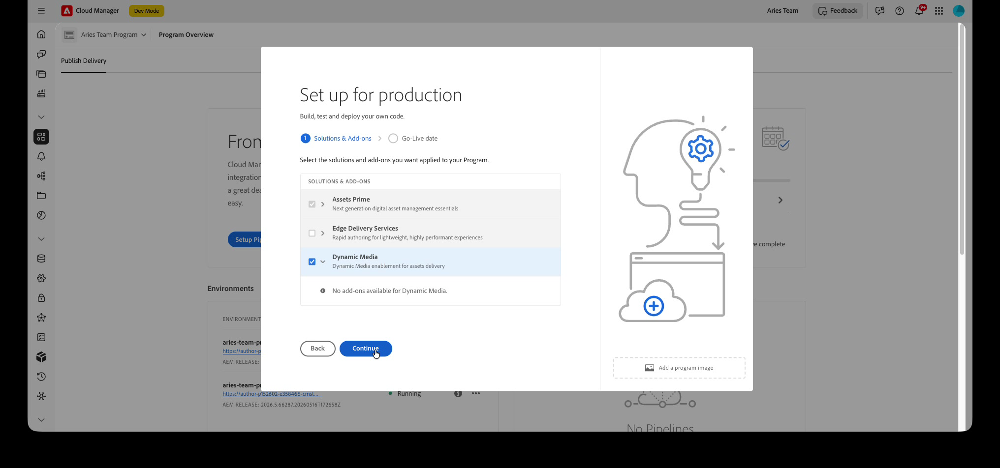
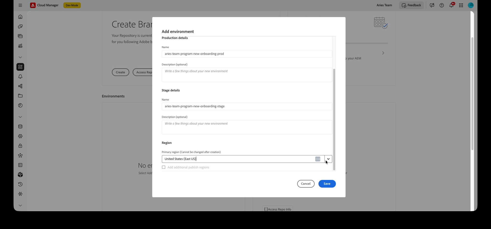
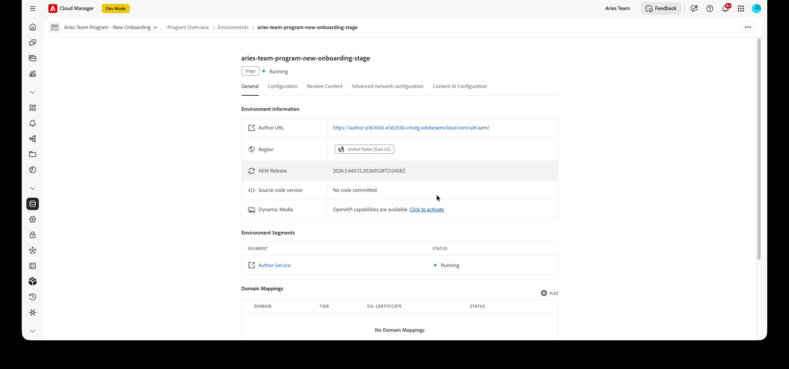
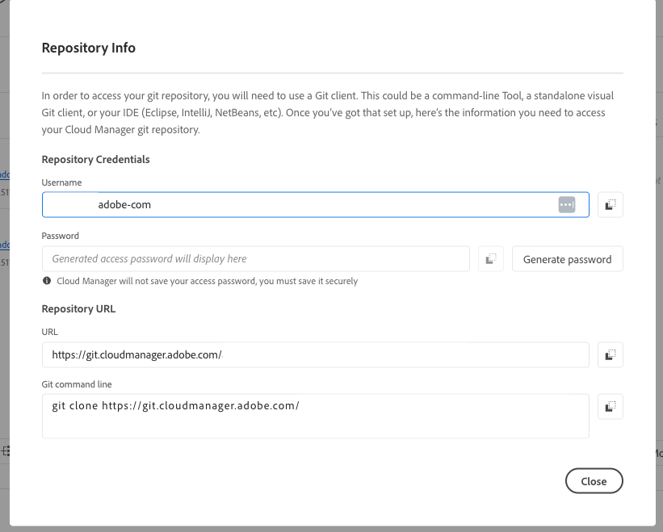
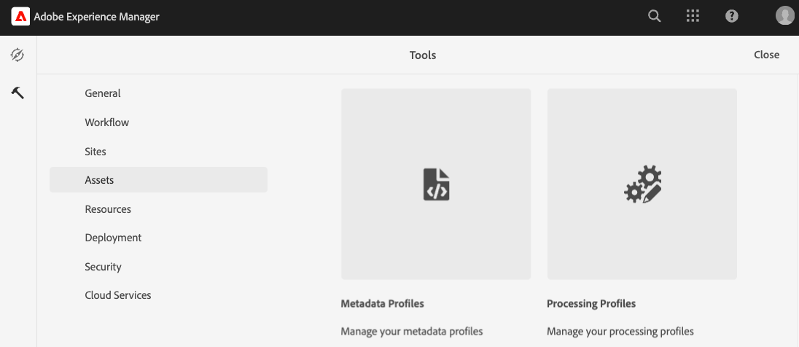
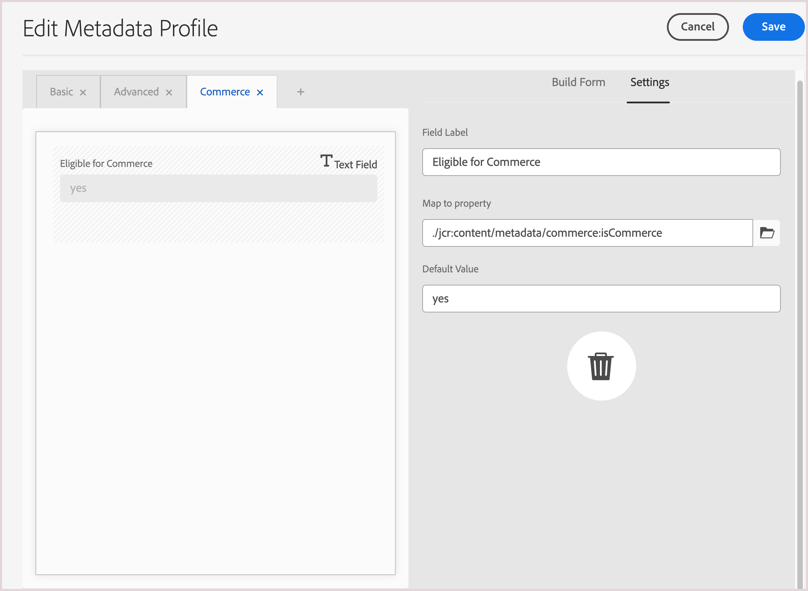

# Configurar o projeto do AEM Assets

Este tópico descreve como configurar seu projeto do AEM Assets para que o namespace do Commerce, o esquema de metadados e a guia [!UICONTROL Commerce] estejam disponíveis no ambiente de criação do AEM. Para obter informações sobre esses recursos, consulte [Metadados do Commerce no AEM Assets](../metadata.md).

Você tem duas opções para configurar o projeto AEM Assets:

* [!BADGE Recomendado]{type=Positive} **Integração de autoatendimento** — Nas versões `2026.5.26309` e posteriores do AEM, habilite a integração no Cloud Manager definindo uma variável de ambiente e ativando o Dynamic Media com recursos OpenAPI. Não é necessária nenhuma implantação de código personalizado. Consulte [Habilitar a integração do Commerce (autoatendimento)](#enable-aem-commerce-self-service).

* **Configuração manual** — implante o pacote `assets-commerce` por meio de um pipeline da Cloud Manager. Use essas etapas manuais quando precisar implantar um código de pacote personalizado ou se estiver em uma versão do AEM anterior à `2026.5.26309`. Consulte [Instalar o pacote assets-commerce manualmente](#install-the-assets-commerce-package-manually).

>[!TIP]
>
>Verifique a versão atual do AEM no menu superior direito: **[!UICONTROL Help]** > **[!UICONTROL About AEM]**.

## Habilitar a integração do Commerce (autoatendimento) {#enable-aem-commerce-self-service}

[!BADGE Com Suporte]{type=Informative tooltip="Compatível"} AEM versão `2026.5.26309` e posterior.

Em versões compatíveis do AEM, você habilita a integração do Commerce com o Cloud Manager sem implantar código personalizado. O namespace do Commerce, o esquema de metadados e a guia **[!UICONTROL Commerce]** são provisionados automaticamente quando você habilita a integração no serviço do Autor.

### Pré-requisitos de autoatendimento

* [Acesso ao Programa e aos ambientes do AEM Cloud Manager](https://experienceleague.adobe.com/en/docs/experience-manager-cloud-service/content/onboarding/journey/cloud-manager#access-sysadmin-bo) com as funções de Gerente de Programa e de Implantação.

* Um programa do AEM na versão `2026.5.26309` ou posterior.

* A **ID da Organização IMS** da sua instância do Commerce.

  A instância do Commerce e o ambiente de criação do AEM Assets devem estar na mesma organização IMS.

### Etapa 1: criar o programa e os ambientes

A criação de um programa no Cloud Manager é um único processo de assistente — o programa e seus ambientes são configurados em várias etapas e salvos juntos no final.

1. No Cloud Manager, selecione **[!UICONTROL Add Program]**.

1. Escolha **[!UICONTROL Set up for production]**, insira um nome de programa e selecione **[!UICONTROL Continue]**.

1. Na etapa **[!UICONTROL Solutions & Add-ons]**, selecione as soluções e os complementos necessários ao seu projeto, incluindo **[!UICONTROL Dynamic Media]**, e selecione **[!UICONTROL Continue]**.

   {width="600" zoomable="yes"}

1. Na etapa **[!UICONTROL Add Environment]**, insira nomes para os ambientes **Produção** e **Preparo** e, em seguida, selecione uma região.

   {width="600" zoomable="yes"}

1. Selecione **[!UICONTROL Save]** para criar o programa com seus ambientes.

### Etapa 2: ativar a variável de integração do Commerce

No Cloud Manager, abra o ambiente criado na Etapa 1 e, em seguida:

1. Selecione a guia **[!UICONTROL Configuration]**.

1. Adicione uma variável de ambiente com os seguintes valores e selecione **[!UICONTROL Add]** e **[!UICONTROL Save]**:

   | Campo | Valor |
   |---|---|
   | Nome | `COMMERCE_INTEGRATION_ENABLED` |
   | Valor | `true` |
   | Serviço aplicado | Autor |
   | Tipo | Variável |

   {width="600" zoomable="yes"}

   O ambiente é atualizado para aplicar a configuração. Aguarde até que o status do ambiente retorne para **[!UICONTROL Running]**.

### Etapa 3: ativar o Dynamic Media com recursos OpenAPI

1. Na guia do ambiente **[!UICONTROL General]**, localize **[!UICONTROL Dynamic Media]**.

1. Próximo a *Os recursos OpenAPI estão disponíveis*, selecione **[!UICONTROL Click to activate]**.

   {width="600" zoomable="yes"}

   A ativação é executada em segundo plano. Quando terminar, o ambiente estará pronto para a integração com o Commerce.

   >[!NOTE]
   >
   > Se **[!UICONTROL Click to activate]** não estiver disponível, abra um tíquete de suporte para habilitar o Dynamic Media com recursos OpenAPI.

### Etapa 4: validar a configuração

Alterne para o **ambiente do autor do AEM Assets** e abra qualquer ativo. Edite suas propriedades e confirme se o esquema de metadados padrão inclui a guia **[!UICONTROL Commerce]** e se os campos **[!UICONTROL Product Data]** e **[!UICONTROL Eligible for Commerce]** estão visíveis.

## Instalar o pacote de assets-commerce manualmente

>[!NOTE]
>
> Use este método manual para implantar o código de pacote personalizado ou se você estiver em versões do AEM anteriores a `2026.5.26309`. Em versões com suporte, use [Habilitar a integração do Commerce (autoatendimento)](#enable-aem-commerce-self-service).

### Pré-requisitos

Para implantar o código do pacote `assets-commerce` no ambiente AEM Assets as a Cloud Service AEM, você precisa dos seguintes recursos e permissões:

* [Acesso ao Programa e aos ambientes do AEM Assets Cloud Manager](https://experienceleague.adobe.com/en/docs/experience-manager-cloud-service/content/onboarding/journey/cloud-manager#access-sysadmin-bo) com as funções de Gerente de Programa e de Implantação.

* Um [ambiente de desenvolvimento local do AEM](https://experienceleague.adobe.com/en/docs/experience-manager-learn/cloud-service/local-development-environment-set-up/overview) e familiaridade com o processo de desenvolvimento local do AEM.

* Entenda a [estrutura do projeto do AEM](https://experienceleague.adobe.com/pt-br/docs/experience-manager-cloud-service/content/implementing/developing/aem-project-content-package-structure) e como implantar pacotes de conteúdo personalizados usando o Cloud Manager.

* A **ID da Organização IMS** da sua instância do Commerce. A instância do Commerce e o ambiente de criação do AEM Assets devem estar na mesma organização IMS.

* Para habilitar o [Dynamic Media com recursos OpenAPI](https://experienceleague.adobe.com/en/docs/experience-manager-cloud-service/content/assets/dynamicmedia/dynamic-media-open-apis/dynamic-media-open-apis-overview#enable-dynamic-media-open-apis):

>[!BEGINTABS]

>[!TAB Visuais do produto]

[!BADGE Somente SaaS]{type=Positive url="https://experienceleague.adobe.com/en/docs/commerce/user-guides/product-solutions" tooltip="Aplicável somente a projetos do Adobe Commerce as a Cloud Service e do Adobe Commerce Optimizer (infraestrutura SaaS gerenciada pela Adobe)."} O Dynamic Media com recursos OpenAPI é um autoatendimento para Exibições de produtos viabilizado pelo AEM Assets.

1. Navegue até o Cloud Manager.

1. Selecione o ambiente desejado.

1. Habilitar o **Dynamic Media com recursos OpenAPI**.

   Se o botão **Dynamic Media com recursos OpenAPI** não estiver ativo, abra um tíquete de suporte.

>[!TAB AEM Assets]

[!BADGE Somente PaaS]{type=Informative tooltip="Aplicável a projetos do Adobe Commerce na nuvem somente (infraestrutura do PaaS gerenciada pela Adobe)."} no AEM as a Cloud Service, envie um tíquete de suporte do Adobe com estas informações:

* Título: habilitar a OpenAPI do Dynamic Media para integrar totalmente o Adobe Commerce ao AEM Assets

  * Conteúdo do tíquete de suporte:

    * **[!UICONTROL AEM Program ID]**
    * **[!UICONTROL Adobe Commerce URL]**
    * **[!UICONTROL AEM Environment ID]**
    * **[!UICONTROL IMS Org ID]**

Depois de enviar o tíquete de suporte, o Adobe habilita o Dynamic Media com recursos OpenAPI no ambiente do Cloud Services e compartilha os detalhes, como a ID de cliente IMS, para você prosseguir com a integração.

>[!ENDTABS]

### Etapas de instalação

1. Navegue até o AEM Cloud Manager, selecione um programa e [crie ambientes de produção e de preparo](https://experienceleague.adobe.com/en/docs/experience-manager-cloud-service/content/onboarding/journey/create-environments#creating-environments) que você deseja integrar ao Adobe Commerce.

1. [Clonar o repositório Git gerenciado pela Adobe](https://experienceleague.adobe.com/en/docs/experience-manager-cloud-service/content/sites/administering/site-creation/quick-site/retrieve-access#repo-access) para o programa selecionado.

   {width="600" zoomable="yes"}

   Em **Pipelines** do Cloud Manager, selecione **[!UICONTROL Access Repo Info]** para abrir **[!UICONTROL Repository Info]**. Copie o valor **[!UICONTROL URL]** ou **[!UICONTROL Git command line]**, gere uma senha de acesso, se necessário, e clone localmente com seu cliente Git.

1. No GitHub, baixe o código do pacote do [repositório do AEM Assets Commerce](https://github.com/ankumalh/assets-commerce).

1. Em seu [ambiente de desenvolvimento local do AEM](https://experienceleague.adobe.com/en/docs/experience-manager-learn/cloud-service/local-development-environment-set-up/overview), copie manualmente o código baixado no repositório gerenciado existente do Adobe.

1. Em todos os arquivos `filter.xml` e `pom.xml` do seu projeto, substitua todas as ocorrências de &lt;my-app> pelo nome do seu aplicativo.

   >[!NOTE]
   >
   > Como alternativa, você pode instalar o código personalizado na configuração do projeto do AEM Assets como um pacote **Maven**.

1. Confirme as alterações e envie a ramificação de desenvolvimento local para o repositório Git do Cloud Manager.

1. Configure um [pipeline de implantação](https://experienceleague.adobe.com/en/docs/experience-manager-cloud-service/content/sites/administering/site-creation/quick-site/pipeline-setup#create-front-end-pipeline) ou verifique se o pipeline pode implantar alterações no ambiente selecionado.

   {width="600" zoomable="yes"}

   Quando o pipeline existir, abra o menu de ações (**...**) para **[!UICONTROL Run]**, **[!UICONTROL Edit]**, **[!UICONTROL View/Edit variables]** ou outras ações — consulte a documentação do pipeline de Cloud Manager vinculada acima.

1. No AEM Cloud Manager, [atualize o ambiente do AEM usando o pipeline para implantar seu código](https://experienceleague.adobe.com/en/docs/experience-manager-cloud-service/content/implementing/using-cloud-manager/deploy-code#deploying-code-with-cloud-manager).

1. Ir para qualquer ativo e editar suas propriedades para validar as alterações:

   * O esquema de metadados padrão inclui a guia **Commerce**.

   * As SKUs do produto e os campos `Eligible for Commerce` estão visíveis.

### A guia Commerce não está visível nas propriedades

Se a guia **Commerce** não aparecer nas propriedades, você deverá concluir manualmente as seguintes etapas no editor de esquema de metadados:

1. Navegue até o editor de esquema de metadados.

1. Selecione **Editar** para modificar o formulário de esquema de metadados padrão.

1. Crie uma guia **Commerce** e selecione-a.

1. Arraste e solte o componente **Produto** na guia **Commerce** e mapeie-o para a propriedade `commerce:skus`.

1. Marque a caixa de seleção para **mostrar funções** e **mostrar ordem**.

1. Arraste e solte um componente **caixa de seleção** na guia **Commerce** e mapeie-o para a propriedade `commerce:isCommerce`. Defina **Sim** e **Não** como as opções.

Caso encontre outros problemas, crie um [tíquete de suporte](https://experienceleague.adobe.com/en/docs/support-resources/adobe-support-tools-guide/adobe-commerce-support/adobe-commerce-help-center-user-guide#support-case) ou entre em contato com o representante de vendas da Integração da AEM Assets para obter ajuda.

## Configurar um perfil de metadados (opcional)

No ambiente de criação do AEM Assets, defina valores padrão para os metadados de ativos do Commerce criando um perfil de metadados. Para usar esses padrões automaticamente, aplique o novo perfil às pastas do AEM Asset. Essa configuração simplifica o processamento de ativos, reduzindo as etapas manuais.

Ao configurar o perfil de metadados, é necessário configurar apenas os seguintes componentes:

* Adicione uma guia Commerce. Essa guia ativa as definições de configuração específicas do Commerce adicionadas pelo modelo.

* Adicione o campo `Eligible for Commerce` à guia Commerce.

O componente da interface de dados do produto é adicionado automaticamente com base no modelo.

### Definir o perfil de metadados

1. Faça logon no ambiente de criação do Adobe Experience Manager.

1. No espaço de trabalho do Adobe Experience Manager, acesse o espaço de trabalho Administração de conteúdo do autor para o AEM Assets clicando no ícone Adobe Experience Manager.

   {width="600" zoomable="yes"}

1. Abra as Ferramentas do administrador selecionando o ícone de martelo.

   {width="600" zoomable="yes"}

1. Abra a página de configuração do perfil clicando em **[!UICONTROL Metadata Profiles]**.

1. **[!UICONTROL Create]** um perfil de metadados para a integração com o Commerce.

   {width="600" zoomable="yes"}

1. Adicione uma guia para metadados do Commerce.

   1. À esquerda, clique em **[!UICONTROL Settings]**.

   1. Clique em **[!UICONTROL +]** na seção da guia e especifique o **[!UICONTROL Tab Name]**, `Commerce`.

1. Adicione o campo `Eligible for Commerce` ao formulário.

   {width="600" zoomable="yes"}

   * Clique em **[!UICONTROL Build form]**.

   * Arraste o campo `Single Line text` para o formulário.

   * Adicione o texto `Eligible for Commerce` para o rótulo clicando em **[!UICONTROL Field Label]**.

   * Na guia Configurações, adicione o texto do rótulo a **Rótulo do Campo**.

   * Defina o texto do espaço reservado como `yes`.

   * No campo **[!UICONTROL Map to Property]**, copie e cole o seguinte valor

     ```terminal
     ./jcr:content/metadata/commerce:isCommerce
     ```

1. Opcional. Para sincronizar ativos aprovados do Commerce automaticamente à medida que forem carregados no ambiente AEM Assets, defina o valor padrão do campo _[!UICONTROL Review Status]_&#x200B;na guia `Basic` como `approved`.

1. Salve a atualização.

### Aplicar o perfil de metadados à pasta de origem dos ativos do Commerce

1. Na página **[!UICONTROL Metadata Profiles]**, selecione o perfil de integração do Commerce.

1. No menu de ações, selecione **[!UICONTROL Apply Metadata Profiles to Folders]**.

1. Selecione a pasta que contém os ativos do Commerce.

   Crie uma pasta do Commerce se ela não existir.

1. Selecione **[!UICONTROL Apply]**.

## Próximas etapas

* [!BADGE Somente PaaS]{type=Informative tooltip="Aplicável a projetos do Adobe Commerce na nuvem somente (infraestrutura do PaaS gerenciada pela Adobe)."} [Instalar pacotes do Adobe Commerce](configure-commerce.md).

* [!BADGE Somente SaaS]{type=Positive url="https://experienceleague.adobe.com/en/docs/commerce/user-guides/product-solutions" tooltip="Aplicável somente a projetos do Adobe Commerce as a Cloud Service e do Adobe Commerce Optimizer (infraestrutura SaaS gerenciada pela Adobe)."} [Configure a integração do Administrador](setup-synchronization.md).
