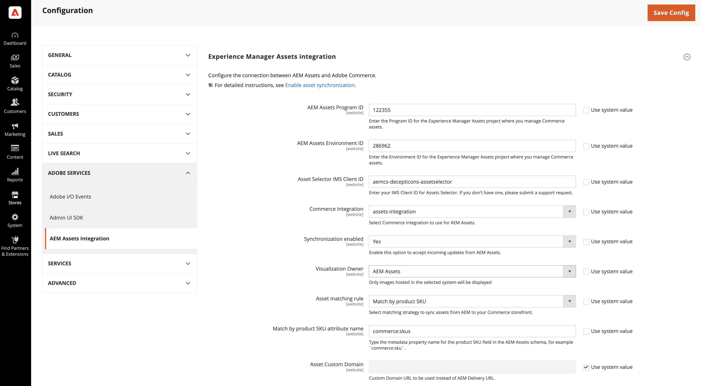
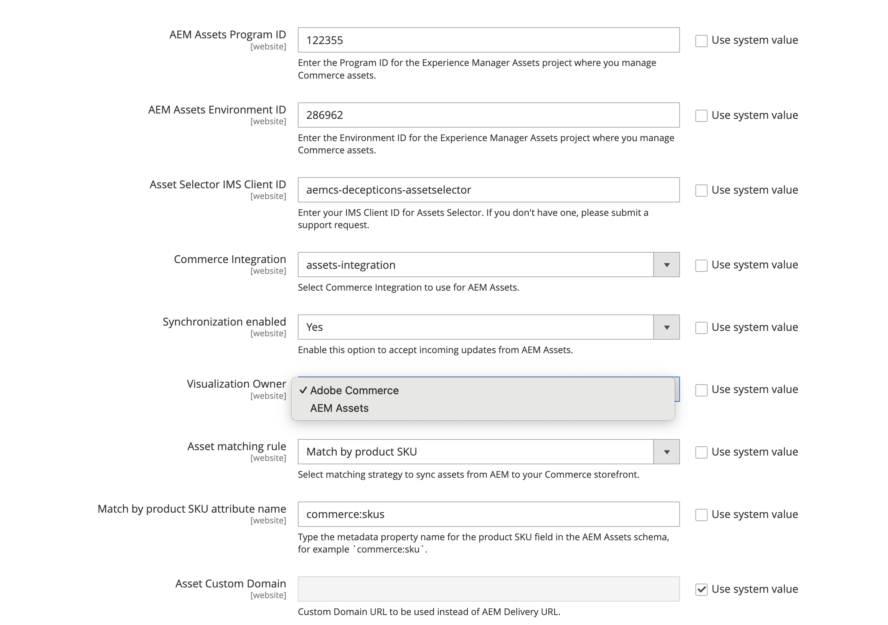

# Configurar a integração

Configure a integração conectando o Commerce à instância do AEM Assets e selecionando a estratégia correspondente para a sincronização de ativos.

Depois de identificar o projeto do AEM Assets, selecione a regra de correspondência para sincronizar ativos entre o Adobe Commerce e o AEM Assets.

* **[!UICONTROL Match by product SKU]** — Regra padrão que corresponde ao SKU nos metadados do ativo com o [SKU do produto Commerce](https://experienceleague.adobe.com/en/docs/commerce-operations/implementation-playbook/glossary#sku) para garantir que os ativos estejam associados aos produtos corretos.

* **[!UICONTROL Custom match]** — Regra de correspondência para cenários mais complexos ou requisitos de negócios específicos que exigem lógica de correspondência personalizada. A implementação da correspondência personalizada requer o desenvolvimento de código personalizado no Adobe Developer App Builder para definir como os ativos são correspondidos aos produtos. Mais detalhes em breve...

Para a configuração inicial, use a regra padrão *Corresponder por SKU de produto*.

## Requisitos

Antes de configurar a Integração do AEM Assets, verifique se você concluiu as seguintes etapas:

* [Configurar o projeto do AEM Assets](configure-aem.md)

* [!BADGE Somente PaaS]{type=Informative tooltip="Aplicável a projetos do Adobe Commerce na nuvem somente (infraestrutura do PaaS gerenciada pela Adobe)."} [Instale pacotes do Adobe Commerce](configure-commerce.md) para adicionar a extensão e gerar as credenciais e conexões necessárias para usar a extensão.

* [Permissões de usuário e IMS](permissions.md) — Configure as permissões necessárias para o Seletor de ativos e os campos de configuração preenchidos automaticamente (ID do programa, ID do ambiente, Mapeamento de domínio).

## Configurar a conexão

1. No Administrador do Commerce, abra a configuração da Integração do AEM Assets.

   1. Vá para **[!UICONTROL Store]** > Configuração > **[!UICONTROL ADOBE SERVICES]** > **[!UICONTROL AEM Assets Integration]**.

      {width="600" zoomable="yes"}

>[!INFO]
>
> A integração do AEM Assets só oferece suporte à configuração no escopo global (padrão). Não há suporte para a configuração no nível do site. Ao tentar configurar a integração no nível do site, o sistema ignora as configurações no nível do site e usa os valores de configuração global.

1. [!BADGE Somente PaaS]{type=Informative tooltip="Aplicável a projetos do Adobe Commerce na nuvem somente (infraestrutura do PaaS gerenciada pela Adobe)."} Insira o **[!UICONTROL Asset Selector IMS Client ID]**.

   Essa ID é necessária para habilitar o Seletor de ativos e preencher automaticamente os campos ID do programa e ID do ambiente. Consulte [Permissões de usuário e IMS](permissions.md) para obter esta ID. Para obter detalhes sobre o Seletor de ativos, consulte [Selecionar ativos manualmente](../synchronize/asset-selector-integration.md).

1. Selecione o ambiente AEM Assets **[!UICONTROL Program ID]** e **[!UICONTROL Environment ID]** nos menus suspensos.

   Os seletores são exibidos quando o usuário administrador do Commerce tem as [permissões de usuário](permissions.md#user-permissions-and-ims) necessárias para a experiência: as integrações do **Adobe Commerce as a Cloud Service**, **Adobe Commerce Optimizer** e **Adobe Commerce na infraestrutura da nuvem** podem preencher esses campos automaticamente a partir da sua sessão vinculada ao IMS, em vez de dependerem de IDs coladas.

   Se os seletores não estiverem disponíveis, copie **[!UICONTROL Program ID]** e **[!UICONTROL Environment ID]** do AEM Cloud Manager ou derive-os da URL do autor: `https://author-<ProgramID>-<EnvironmentID>.adobeaemcloud.com/` (substitua os espaços reservados pelos seus identificadores).

   Você deve limpar **[!UICONTROL Use system value]** em ambos os campos antes de poder colar ou selecionar novos valores manualmente.

   {width="600" zoomable="yes"}

1. [!BADGE Somente PaaS]{type=Informative tooltip="Aplicável a projetos do Adobe Commerce na nuvem somente (infraestrutura do PaaS gerenciada pela Adobe)."} Selecione o [[!UICONTROL Commerce integration]](configure-commerce.md#add-the-integration-to-the-commerce-environment) para solicitações de autenticação entre o Commerce e o serviço de correspondência de ativos.

1. Defina **[!UICONTROL Synchronization enabled]** como `Yes` para permitir que o Commerce aceite atualizações de entrada do AEM Assets.

   Depois de habilitar a integração, opções de configuração adicionais estão disponíveis para especificar os critérios de correspondência de ativos.

1. Selecione uma das regras de correspondência de ativos para sincronização de ativos na lista suspensa **[!UICONTROL Asset matching rule]**.

   * Selecione **[!UICONTROL Match by SKU]** para [correspondência automática padrão](../synchronize/default-match.md),
   * Selecione **[!UICONTROL Custom match]** para [correspondência automática personalizada](../synchronize/custom-match.md) (requer [Adobe Developer App Builder](https://experienceleague.adobe.com/en/docs/commerce-learn/tutorials/adobe-developer-app-builder/introduction-to-app-builder).)

1. Adicione o [nome do campo de metadados do AEM Assets](configure-aem.md#define-the-metadata-profile) definido para SKUs de produtos Commerce no campo **[!UICONTROL Match by product SKU attribute name]**, `commerce:skus` por padrão.

1. Selecione **[!UICONTROL Save Config]** para aplicar atualizações e iniciar a sincronização de ativos.

   A atualização de configuração aciona o processo de sincronização inicial, permitindo que o Commerce aceite atualizações recebidas do AEM Assets. O tempo necessário para a sincronização depende do volume de ativos e de configurações específicas. A integração utiliza processos automatizados para minimizar o tempo necessário para a sincronização.

### SLA de sincronização

O service level agreement (SLA) para a integração garante os seguintes níveis de desempenho de sincronização:

* `< 5 minutes for 99% of updates`

* `< 30 minutes for 99.9% of updates`

Esse nível de serviço garante que as páginas de produtos sempre exibam as imagens mais atualizadas, mantendo o conteúdo da loja preciso e visualmente atraente.

### Configurar o proprietário da visualização

A configuração **Proprietário da visualização** determina qual sistema fornece imagens de produto na integração:

* Adobe Commerce - Usa imagens hospedadas no Commerce.

* AEM Assets - Usa imagens sincronizadas do AEM.

O Administrador exibe as imagens disponíveis para esse proprietário, enquanto o restante das imagens é esmaecido e exibido com um rótulo **oculto**.

Consulte o tópico [definir detalhes da imagem](https://experienceleague.adobe.com/en/docs/commerce-admin/catalog/products/digital-assets/product-image#set-image-details){target=_blank} para obter detalhes sobre o comportamento de exibição da imagem.

>[!TIP]
>
> Durante a migração do Commerce para o AEM Assets, defina o **Proprietário da visualização** como Commerce para evitar links de imagens quebradas. Depois que todos os produtos forem sincronizados com o AEM Assets, alterne para o proprietário do AEM Assets para concluir a transição. Isso garante a disponibilidade contínua da imagem em todo o processo.

1. Navegue até **[!UICONTROL Store]** > Configuração > **[!UICONTROL ADOBE SERVICES]** > **[!UICONTROL AEM Assets Integration]**.

   {width="400" zoomable="yes"}

1. Selecione a origem **Proprietário da Visualização** para exibir as imagens.

1. Clique em **[!UICONTROL Save Config]** para aplicar atualizações e iniciar a sincronização de ativos.

### Opcional. Configurar o URL do domínio personalizado

Se o projeto AEM Assets as a Cloud Service tiver sido configurado com um [Nome de domínio personalizado](https://experienceleague.adobe.com/pt-br/docs/experience-manager-cloud-service/content/implementing/using-cloud-manager/custom-domain-names/add-custom-domain-name){target=_blank}, adicione o nome de domínio à configuração de armazenamento do Commerce para que a integração do AEM Assets para Commerce possa usá-lo.

1. Navegue até **[!UICONTROL Store]** > Configuração > **[!UICONTROL ADOBE SERVICES]** > **[!UICONTROL AEM Assets Integration]**.

   {width="700" zoomable="yes"}

1. Adicione a **URL de Domínio Personalizado** ao campo **[!UICONTROL Asset Custom Domain]**.

1. Clique em **[!UICONTROL Save Config]** para aplicar atualizações e iniciar a sincronização de ativos.

## Próxima etapa

* **Configurar a Commerce Storefront** — Para usar o AEM Assets com a Commerce Storefront da Edge Delivery Services, conclua a configuração da loja descrita no tópico [integração com o AEM Assets](https://experienceleague.adobe.com/developer/commerce/storefront/setup/configuration/aem-assets-configuration/) da *documentação da Adobe Commerce Storefront*.

* Configure [regras de correspondência](../synchronize/default-match.md) entre o Adobe Commerce e a integração do AEM Assets.

* [Gerenciar ativos do Commerce](../manage-assets.md).
