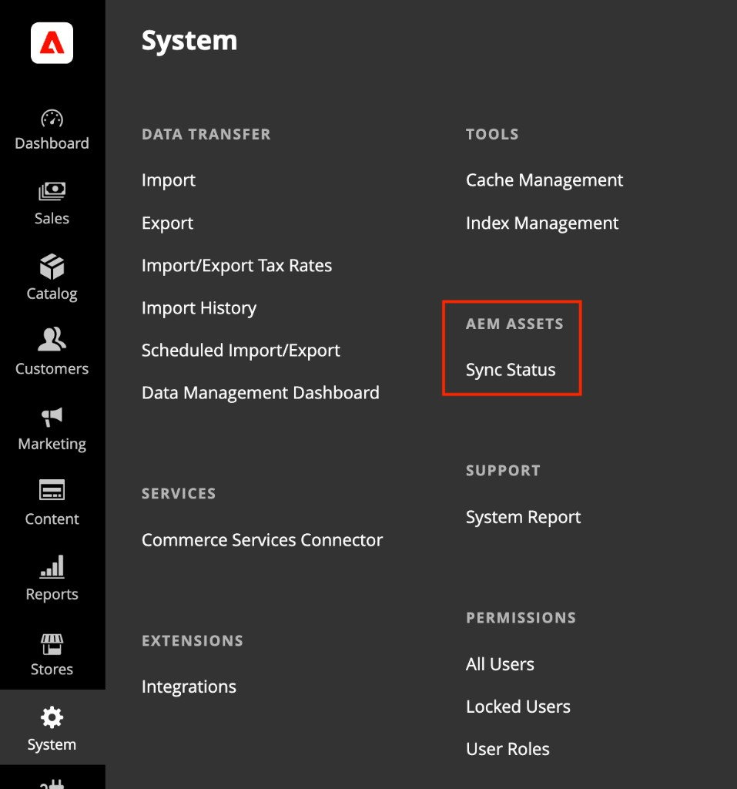

# Exibir status de sincronização do AEM Assets

A exibição **[!UICONTROL Sync Status]** fornece uma lista centrada em ativos de ativos sincronizados por meio da integração do AEM Assets. Use-o para localizar, revisar e solucionar problemas de ativos por seus próprios atributos, em vez de navegar produto a produto no catálogo.

{width="700" zoomable="yes"}

>[!NOTE]
>
> [!UICONTROL Sync Status] não está disponível para [!DNL Adobe Commerce Optimizer].

## Abrir Status de Sincronização

Na barra lateral _Admin_, navegue até **[!UICONTROL System]** > **[!UICONTROL AEM Assets]** > **[!UICONTROL Sync Status]**.

{width="600" zoomable="yes"}

## Integridade da sincronização da integração

Na parte superior da página, o banner **Status de sincronização do AEM** resume a integridade do pipeline e quantos eventos estão aguardando para serem processados. Selecione **[!UICONTROL Refresh]** para atualizar o banner de integridade da sincronização.

## Lista de ativos

A grade lista os ativos processados pelo pipeline de sincronização do AEM Assets e seu estado de sincronização atual. Cada linha representa um ativo e seu estado de sincronização no Commerce. Ele não representa um registro de produto.

| Coluna | Descrição |
|--------|-------------|
| **ID do ativo** | Identificador de ativo do AEM (por exemplo, `urn:aaid:aem:…`). |
| **Status** | Resultado da última tentativa de sincronização do ativo. Os valores possíveis são **Sucesso**, **Falha** ou **Aguardando**. |
| **Processando** | Data e hora de início do processamento do ativo. |
| **Despachado** | Data e hora de despacho do evento de sincronização. |
| **Erro** | Mensagem de erro quando **Status** indica uma falha; vazio quando a sincronização tiver êxito. |

### Filtrar ativos

1. Selecione **[!UICONTROL Filters]** para expandir o painel de filtro.

1. Insira uma **ID do ativo** ou escolha um valor de **Status**.

1. Selecione **[!UICONTROL Apply Filters]** para atualizar a grade ou **[!UICONTROL Cancel]** para fechar o painel sem aplicar as alterações.

Os filtros se aplicam aos dados no nível do ativo, permitindo isolar sincronizações com falha ou rastrear um ativo específico sem abrir produtos individuais.

## Sincronizações com falha

Quando o **Status** mostrar uma falha, verifique a coluna **Erro** na grade para obter a mensagem retornada pelo pipeline de sincronização.

Revise a mensagem de erro completa e os detalhes da última tentativa de sincronização para diagnosticar a falha.

[!BADGE Somente PaaS]{type=Informative tooltip="Aplicável a projetos do Adobe Commerce na nuvem somente (infraestrutura do PaaS gerenciada pela Adobe)."} Para obter soluções de problemas adicionais, consulte [Correspondência automática padrão](../synchronize/default-match.md). Os arquivos de log de integração estão disponíveis em `/var/log/aem-assets-integration.log` e `/var/log/aem-assets-integration-errors.log` na sua instância do Commerce.
