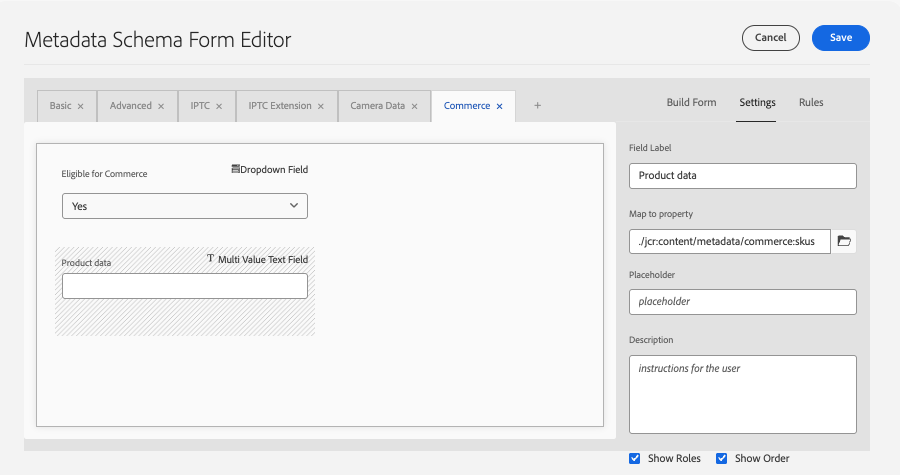

# Metadados do Commerce no AEM Assets

Os metadados do Commerce são o contrato entre o AEM Assets e a Commerce. Informa ao Commerce quais ativos são para o Commerce, a quais produtos eles pertencem e como devem ser usados ou exibidos. Esses metadados permitem que a integração do AEM Assets mapeie e sincronize os arquivos de ativos corretamente.

Os metadados do Commerce habilitam os seguintes recursos:

* **Marque um ativo como qualificado para Commerce** por meio do campo `commerce:isCommerce`.
* **Associe um ativo a uma ou mais SKUs do produto** por meio do campo `commerce:skus`.
* **Defina como o ativo aparece no Commerce** por meio dos campos `commerce:roles` e `commerce:positions`.
* **Adicionar texto alternativo específico do Commerce digitado pelo modo de exibição de repositório** por meio dos campos `commerce:altTextStoreViews` e `commerce:altTextValues`.
* **Exponha esses campos na interface** das propriedades do AEM Assets por meio de uma guia **[!UICONTROL Commerce]** e de um formulário de esquema.

Para configurar esses recursos no seu projeto do AEM, consulte [Configurar o projeto do AEM Assets](get-started/configure-aem.md). O restante deste tópico descreve como os metadados são fornecidos.

## Conteúdo do pacote de comércio de ativos do AEM Commerce

A Adobe fornece o pacote de código AEM Commerce `assets-commerce` para adicionar namespaces do Commerce e recursos de esquema de metadados à configuração do Experience Manager Assets as a Cloud Service.

Esse código de pacote adiciona os seguintes recursos ao ambiente de criação do AEM Assets:

* Um [namespace personalizado](https://github.com/ankumalh/assets-commerce/blob/main/ui.config/jcr_root/apps/commerce/config/org.apache.sling.jcr.repoinit.RepositoryInitializer~commerce-namespaces.cfg.json), `Commerce` para identificar propriedades relacionadas ao Commerce.

  * Um tipo de metadados personalizado `commerce:isCommerce` com o rótulo `Eligible for Commerce` para marcar ativos da Commerce associados a um projeto do Adobe Commerce.

  * Um tipo de metadados personalizado `commerce:skus` e um componente correspondente da interface do usuário para adicionar uma propriedade **[!UICONTROL Product Data]**. Os dados do produto incluem as propriedades de metadados para associar um ativo do Commerce às SKUs do produto.

    {width="600" zoomable="yes"}

  * Um tipo de metadados personalizado `commerce:roles` e atributos `commerce:positions` que mostram como o ativo é visualizado no Commerce. As quatro funções padrão (`image`, `small_image`, `thumbnail` e `swatch_image`) permanecem com suporte. Desde a versão 1.4.6 da extensão de Integração do AEM Assets, também é possível definir uma função de imagem personalizada no `commerce:roles`, como `hero` ou `custom_role_1`, para sincronizar uma função que o Commerce não define por padrão. Consulte [Correspondência automática personalizada](synchronize/custom-match.md) para saber como as funções de imagem personalizadas são assimiladas.

    >[!NOTE]
    >
    >O Commerce cria automaticamente um atributo de estilo `media_image` ausente para uma função personalizada.

  * Metadados de vários campos (_[!UICONTROL Alt texts]_) de texto alternativo para que os editores possam inserir texto alternativo para cada código de exibição de armazenamento do Commerce. O multicampo persiste em duas propriedades `String[]` alinhadas ao índice:

    * `commerce:altTextStoreViews` — armazena o código de exibição para cada linha.
    * `commerce:altTextValues` — texto alternativo correspondente no mesmo índice de cada entrada em `commerce:altTextStoreViews`.

    As implementações do App Builder que usam uma [correspondência externa](synchronize/custom-match.md){target=_blank} podem interceptar essas propriedades ao transformar cargas de ativos. Isso não altera a forma como as imagens do produto são atribuídas ou o escopo é definido no catálogo. Consulte [Texto alternativo localizado nos metadados do AEM Assets](#localized-alt-text-in-aem-assets-metadata).

* Um formulário de esquema de metadados com uma guia Commerce que inclui os campos `Eligible for Commerce` e `Product Data` para marcar ativos do Commerce. O formulário também fornece opções para mostrar ou ocultar os campos `roles` e `position` da interface do AEM Assets.

  {width="600" zoomable="yes"}

* Um [ativo de Commerce marcado e aprovado](https://github.com/ankumalh/assets-commerce/blob/main/ui.content/src/main/content/jcr_root/content/dam/wknd/en/activities/hiking/equipment_6.jpg/.content.xml) `equipment_6.jpg` de amostra para oferecer suporte à sincronização de ativos inicial. Somente ativos aprovados do Commerce podem ser sincronizados do AEM Assets para o Adobe Commerce.

>[!NOTE]
>
> Consulte a página [readme](https://github.com/ankumalh/assets-commerce) no GitHub para obter mais informações sobre o **código do pacote do AEM Commerce**.

## Texto alternativo localizado nos metadados do AEM Assets

O multicampo _[!UICONTROL Alt texts]_&#x200B;está disponível no editor de metadados de ativos da AEM Assets, na guia **[!UICONTROL Commerce]**, ao editar uma imagem qualificada.

>[!IMPORTANT]
>
> O comportamento de exibição por loja se aplica somente ao texto alternativo. A integração do AEM Assets não sincroniza imagens de produtos diferentes por exibição da loja do Adobe Commerce. As imagens de produto do AEM continuam a ser sincronizadas com o Commerce com o mesmo comportamento de atribuição de galeria de antes desta versão.

O multicampo contém uma linha por exibição de loja do Commerce. Cada linha tem duas entradas:

* **[!UICONTROL Store View Code]** — O identificador de exibição de armazenamento (por exemplo `default` ou `en_US`).

* **[!UICONTROL Alt Text]** — Texto alternativo para a exibição de armazenamento, limitado a 255 caracteres.

Selecione **[!UICONTROL Add]** para adicionar mais linhas para exibições de armazenamento adicionais. Para remover uma linha, selecione o ícone **[!UICONTROL Delete]** nessa linha para removê-la.

{width="600" zoomable="yes"}

Ao salvar, a validação do lado do cliente bloqueia o envio se qualquer linha tiver um _[!UICONTROL Store View Code]_&#x200B;vazio ou se duas linhas usarem o mesmo código de exibição de armazenamento (não diferencia maiúsculas de minúsculas).

Entradas de texto alternativo são mantidas nos metadados de ativos JCR como duas propriedades `String[]` alinhadas por índice:

* `commerce:altTextStoreViews`: Armazenar código de exibição para cada linha.
* `commerce:altTextValues`: texto alternativo correspondente no mesmo índice de cada entrada em `commerce:altTextStoreViews`.

Quando esses ativos são sincronizados com o Adobe Commerce, o texto alternativo de exibição por loja é gravado na galeria de mídia do produto para os códigos de exibição da loja correspondentes. O mapeamento de imagem subjacente não foi alterado.

Exemplo de valores de metadados:

```text
commerce:altTextStoreViews = ["en_US", "fr_FR"]
commerce:altTextValues = ["Running shoe", "Chaussure de course"]
```

Quando esses ativos são sincronizados com o Adobe Commerce, cada valor de texto alternativo é gravado no campo de imagem padrão **[!UICONTROL Label]** da Commerce para o código de exibição de loja correspondente. A integração não preenche uma coluna de banco de dados `alt_text` criada pelo cliente.

O texto alternativo é localizado por exibição da loja, mas a atribuição de imagem do produto subjacente e o mapeamento da galeria permanecem inalterados. Uma única atribuição de imagem continua a ser aplicada de acordo com o comportamento existente da galeria do Commerce.
