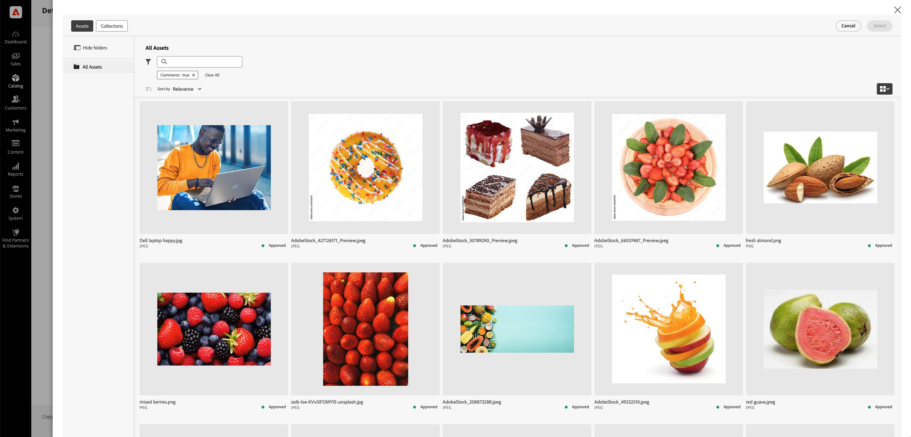

# Seleção manual de ativos

O **Seletor de ativos do AEM** permite que profissionais de marketing e merchandisers adicionem imagens facilmente do AEM Assets à Adobe Commerce, simplificando o processo de gerenciamento de ativos. Este método garante a consistência e a conformidade da marca, limitando a seleção de ativos àqueles revisados e aprovados no [!DNL DAM (Digital Asset Management system)].

O **Seletor de ativos do AEM** está disponível quando a ID do cliente IMS para o projeto do AEM Assets é configurada no Administrador do Commerce. Consulte [Configurar o Seletor de ativos do AEM](#configure-the-aem-asset-selector-in-adobe-commerce).

Quando a integração do **Seletor de ativos do AEM** é configurada, os profissionais de marketing e merchandisers podem:

* Gerencie imagens de categoria facilmente, garantindo que elas se alinhem às diretrizes de marca e campanha.
* [!BADGE Somente PaaS]{type=Informative tooltip="Aplicável a projetos do Adobe Commerce na nuvem somente (infraestrutura do PaaS gerenciada pela Adobe)."} atribua ativos diretamente no Page Builder para conteúdo visualmente rico.
* [!BADGE Somente SaaS]{type=Positive url="https://experienceleague.adobe.com/en/docs/commerce/user-guides/product-solutions" tooltip="Aplicável somente a projetos do Adobe Commerce as a Cloud Service e do Adobe Commerce Optimizer (infraestrutura SaaS gerenciada pela Adobe)."} Atribua o Assets diretamente na Commerce Storefront habilitada pela Edge Delivery Services para enriquecer visualmente o conteúdo.

>[!NOTE]
>
> O Seletor de ativos do AEM é um componente de front-end do AEM Assets para integrar o AEM Assets com aplicativos de criação. Para obter mais informações sobre este componente, consulte o [Seletor de ativos de microfront-end](https://experienceleague.adobe.com/en/docs/experience-manager-cloud-service/content/assets/manage/asset-selector/overview-asset-selector){target=_blank} no *Guia do Usuário do AEM as a Cloud Service*.

## Principais benefícios

A incorporação do Seletor de ativos do AEM no Painel de administração do Adobe Commerce oferece várias vantagens principais:

* **Consistência de marca** - Exibe somente ativos aprovados, minimizando o risco de imagens desatualizadas ou incompatíveis na loja.

* **Eficiência**-Permite que profissionais de marketing e merchandisers atribuam ativos rapidamente sem alternar entre plataformas diferentes.

* **Collaboration simplificado** - facilita o trabalho em equipe, permitindo a seleção direta de imagens do DAM, eliminando downloads e uploads manuais.

* **Qualidade de conteúdo aprimorada**-Garante o uso de imagens otimizadas de alta resolução nas páginas de produtos, categorias e Page Builder.

{width="600" zoomable="yes"}

## Configurar o Seletor de ativos AEM no Adobe Commerce

1. No Administrador do Commerce, navegue até **[!UICONTROL Store]** > Configuração > **[!UICONTROL ADOBE SERVICES]** > **[!UICONTROL AEM Assets Integration]**.

1. Preencha o campo **[!UICONTROL IMS Client ID]**.

1. **Salve** a configuração.

## Próximas etapas

* [Gerenciar imagens de categoria com o Seletor de ativos](../manage-assets.md#category-images)
* [Gerenciar imagens no conteúdo do Page Builder](../manage-assets.md#using-aem-asset-selector-in-page-builder)
