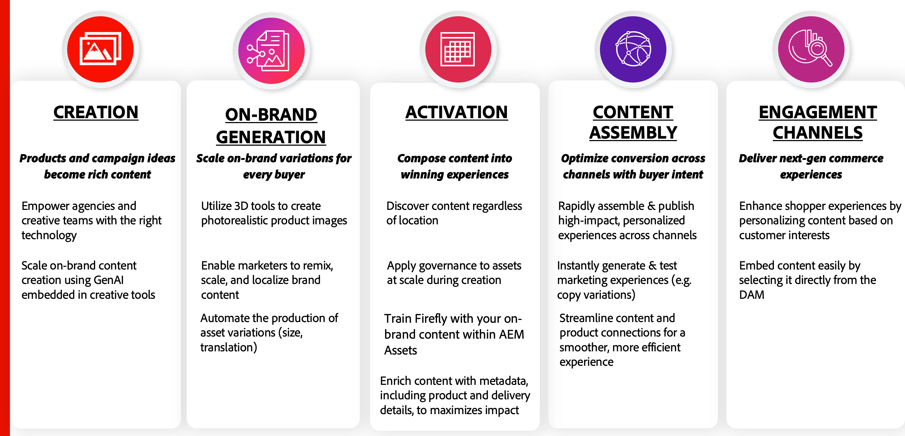

# Manter conteúdo preciso e relevante

Um fornecimento de conteúdo verdadeiro envolve uma combinação de pilares principais em **Criação e Produção**, **Fluxo de Trabalho e Planejamento** e **Entrega e Ativação**. Cada um desses pilares é valioso por si só e ajuda a gerar valor significativo para as organizações:

{width="600" zoomable="yes"}

Uma plataforma de comércio eletrônico é um dos canais de envolvimento mais importantes. Garantir atualizações perfeitas no sistema de gerenciamento de ativos garante que as vitrines comerciais sempre exibam as informações mais atualizadas do produto. Isso é essencial para atingir os três principais objetivos de qualquer **DAM (Digital Asset Management System)** &lt;> **integração com o Commerce**:

* Melhore o **Time-to-Market (TTM)** para lançamentos de novos produtos.

* Elimine ineficiências operacionais e reduza as interações manuais.

* Garanta a consistência da marca sempre disponibilizando conteúdo aprovado que se alinha às diretrizes da marca.

Para atingir esses objetivos, a integração do AEM Assets para Commerce é assinada dos eventos do **Adobe Commerce** e do **AEM Assets**, garantindo a sincronização dinâmica entre conteúdo e comércio.

## Alterações no catálogo do Adobe Commerce

A integração do AEM Assets acompanha eventos de criação de produtos acionados quando os produtos são criados no **Administrador** ou usando a **API**. Quando acionado, ele sincroniza ativos aprovados do DAM que estão associados ao novo SKU do produto.

Ao dissociar a criação de conteúdo do gerenciamento de catálogos, as empresas obtêm várias vantagens:

* As equipes de conteúdo podem operar de forma independente, garantindo que os ativos de alta qualidade estejam prontos para lançamentos de produtos.

* As atualizações de produtos permanecem rápidas porque a criação de ativos não atrasa as alterações no catálogo, permitindo maior agilidade no gerenciamento de novos produtos.

* A automação melhora a eficiência e a precisão, reduzindo as incompatibilidades entre os dados do produto e o conteúdo associado.

>[!NOTE]
>
> As importações de produtos CSV no PaaS e SaaS não acionam eventos de atualização. Use a API para importações e atualizações de catálogo.

## Alterações no ciclo de vida do AEM Assets

A integração também acompanha as alterações de status do ativo no AEM Assets. Como o Adobe Commerce serve como um canal de envolvimento, somente os ativos aprovados são exibidos na loja.

A integração automatiza o gerenciamento do ciclo de vida do ativo para garantir que o conteúdo da loja permaneça preciso e em conformidade com a marca.

* Somente os ativos aprovados são publicados, mantendo a integridade da marca e a conformidade normativa.

* Ativos desatualizados ou irrelevantes são removidos automaticamente, impedindo que conteúdo obsoleto apareça.

* A sincronização perfeita entre a aprovação de ativos e a exibição de produtos reduz os esforços e atrasos manuais.

Aproveitando a integração do Seletor de ativos da AEM, as empresas podem manter uma alteração simplificada, precisa e eficiente no fornecimento de conteúdo — melhorando a experiência do cliente e a eficiência operacional.
