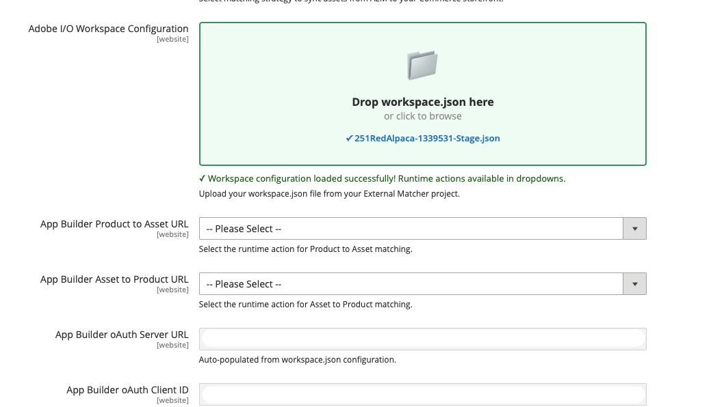

# Correspondência automática personalizada

Se a estratégia de correspondência automática padrão (**correspondência automática OOTB**) não estiver alinhada aos seus requisitos de negócios específicos, selecione a opção de correspondência personalizada. Esta opção oferece suporte ao uso do [Adobe Developer App Builder](https://experienceleague.adobe.com/pt-br/docs/commerce-learn/tutorials/extensibility/adobe-developer-app-builder/introduction-to-app-builder) para desenvolver um aplicativo de correspondência personalizado que lida com lógica de correspondência complexa ou com ativos provenientes de um sistema de terceiros que não pode preencher metadados no AEM Assets.

## Configurar correspondência automática personalizada

1. No Administrador do Commerce, navegue até **[!UICONTROL Store]** > Configuração > **[!UICONTROL ADOBE SERVICES]** > **[!UICONTROL AEM Assets Integration]**.

1. Selecione **[!UICONTROL Custom Matcher]** como regra de correspondência.

1. Ao selecionar esta regra de correspondência, o Administrador exibe campos adicionais para configurar os **pontos de extremidade** e os **parâmetros de autenticação** necessários para a lógica de correspondência personalizada.

### workspace.json

O campo **[!UICONTROL Adobe I/O Workspace Configuration]** fornece uma maneira simplificada de configurar a correspondência personalizada importando seu arquivo de configuração do App Builder `workspace.json`.

Você pode baixar o arquivo `workspace.json` da [Adobe Developer Console](https://developer.adobe.com/console). O arquivo contém todas as credenciais e detalhes de configuração do espaço de trabalho do App Builder.

+++Exemplo `workspace.json`

```json
{
  "project": {
    "id": "project_id",
    "name": "project_name",
    "title": "title_name",
    "org": {
      "id": "id",
      "name": "Organization_name",
      "ims_org_id": "ims_id"
    },
    "workspace": {
      "id": "workspace_id",
      "name": "workspace_name_id",
      "title": "workspace_title_id",
      "action_url": "https://action_url.net",
      "app_url": "https://app_url.net",
      "details": {
        "credentials": [
          {
            "id": "credential_id",
            "name": "credential_name_id",
            "integration_type": "oauth_server_to_server",
            "oauth_server_to_server": {
              "client_id": "client_id",
              "client_secrets": ["secret"],
              "technical_account_email": "xx@technical_account_email.com",
              "technical_account_id": "technical_account_id",
              "scopes": [
                "AdobeID",
                "openid",
                "read_organizations",
                "additional_info.projectedProductContext",
                "additional_info.roles",
                "adobeio_api",
                "read_client_secret",
                "manage_client_secrets"
              ]
            }
          }
        ],
        "services": [
          {
            "code": "AdobeIOManagementAPISDK",
            "name": "I/O Management API"
          }
        ],
        "runtime": {
          "namespaces": [
            {
              "name": "namespace_name",
              "auth": "example_auth"
            }
          ]
        },
        "events": {
          "registrations": []
        },
        "mesh": {}
      }
    }
  }
}
```

+++

1. Arraste e solte seu arquivo `workspace.json` do seu projeto do App Builder no campo **[!UICONTROL Adobe I/O Workspace Configuration]**. Como alternativa, você pode clicar em para procurar e selecionar o arquivo.

{width="600" zoomable="yes"}

1. O sistema automaticamente:

   * Valida a estrutura JSON
   * Extrai e preenche credenciais do OAuth
   * Busca as ações de tempo de execução disponíveis para o espaço de trabalho
   * Preenche as opções suspensas para os campos **[!UICONTROL Product to Asset URL]** e **[!UICONTROL Asset to Product URL]**

1. Selecione as ações de tempo de execução apropriadas nos menus suspensos para cada fluxo.

1. Clique em **[!UICONTROL Save Config]**.

## Salvar configuração assíncrona

Se a opção [Salvar Configuração Assíncrona](https://experienceleague.adobe.com/pt-br/docs/commerce-operations/performance-best-practices/configuration#asynchronous-configuration-save) estiver habilitada na instância do Commerce, as alterações de configuração serão enfileiradas e aplicadas por um consumidor assíncrono, em vez de serem salvas imediatamente na mesma solicitação. Para carregar um arquivo `workspace.json` para correspondência automática personalizada neste modo, conclua as seguintes etapas na ordem:

1. Confirme se o Salvamento da Configuração Assíncrona do Commerce está [habilitado](https://experienceleague.adobe.com/pt-br/docs/commerce-operations/performance-best-practices/configuration#asynchronous-configuration-save).

1. No Administrador, vá para **[!UICONTROL Stores]** > [!UICONTROL Settings] > **[!UICONTROL Configuration]** > **[!UICONTROL Adobe Services]** > **[!UICONTROL AEM Assets Integration]**.

1. Carregar o arquivo `workspace.json` atual do App Builder.

1. Salve a configuração.

1. Aguarde o consumidor de configuração assíncrono concluir o processamento do salvamento.

1. Verifique os valores de OAuth e a configuração de integração dependente.

1. Verifique se o registro de correspondência externa reflete a atualização.

>[!NOTE]
>
>Se o Salvamento de configuração assíncrono estiver desativado, o comportamento de salvamento síncrono normal será aplicado e você não precisará aguardar um consumidor da fila.

### Solução de problemas de salvamento de configuração assíncrona

| Sintoma | O que fazer |
| --- | --- |
| Os valores de OAuth permanecem inalterados após salvar | Confirme se você está executando a extensão de Integração do AEM Assets versão 1.4.7 ou posterior, carregue um novo arquivo `workspace.json` e aguarde a conclusão do processamento da fila antes de verificar os valores novamente. |
| Falha ao salvar após um upload inválido | Valide se o arquivo é um arquivo `workspace.json` bem formado e contém as credenciais esperadas do App Builder. |
| Nenhum arquivo foi carregado | A configuração armazenada existente permanece inalterada. |
| O registro de correspondência externa não é atualizado | Verifique se o consumidor da fila terminou o processamento, revise os logs do Commerce e confirme o status do registro do correspondência externo. |
| Salvamento de Configuração Assíncrona desabilitado | O comportamento normal de salvamento síncrono se aplica; esta seção de solução de problemas não se aplica. |

>[!NOTE]
>
>Se você desenvolver um observador de configuração para a integração do AEM Assets, não dependa de parâmetros de solicitação HTTP brutos. O Salvamento de configuração assíncrono e outros salvamentos de configuração programática podem executar o observador sem um contexto de solicitação de administrador.

## Pontos de extremidade da API do correspondedor personalizado

Ao criar um aplicativo de correspondência personalizado usando o [App Builder](https://experienceleague.adobe.com/pt-br/docs/commerce-learn/tutorials/extensibility/adobe-developer-app-builder/introduction-to-app-builder){target=_blank}, o aplicativo deve expor os seguintes pontos de extremidade:

* Ponto de extremidade **Ativo App Builder para URL do produto**
* Ponto de extremidade **Produto App Builder para URL do ativo**

### Ativo App Builder para endpoint do URL do produto

Esse endpoint recupera a lista de SKUs associadas a um determinado ativo:

#### Exemplo de uso

```javascript
const { Core } = require('@adobe/aio-sdk')

async function main(params) {

    // Build your own matching logic here to return the products that map to the assetId
    // var productMatches = [];
    // params.assetId
    // params.eventData.assetMetadata['commerce:isCommerce']
    // params.eventData.assetMetadata['commerce:skus'][i]
    // params.eventData.assetMetadata['commerce:roles']
    // params.eventData.assetMetadata['commerce:positions'][i]
    // ...
    // End of your matching logic

    // Set skip to true if the mapping hasn't changed
    const skipSync = false;

    return {
        statusCode: 200,
        body: {
            asset_id: params.assetId,
            product_matches: [
                {
                    product_sku: "<YOUR-SKU-HERE>",
                    asset_roles: ["thumbnail", "image", "swatch_image", "small_image"],
                    asset_position: 1
                }
            ],
            skip: skipSync
        }
    };
}

exports.main = main;
```

**Solicitação**

```text
POST https://your-app-builder-url/api/v1/web/app-builder-external-rule/asset-to-product
```

| Parâmetro | Tipo de dados | Descrição |
| --- | --- | --- |
| `assetId` | String | Representa a ID de ativo atualizada. |
| `eventData` | Objeto | Carga do evento associada ao ativo (por exemplo, metadados de ativos lidos pela correspondência de `eventData.assetMetadata`). |

**Resposta**

```json
{
  "asset_id": "{ASSET_ID}",
  "product_matches": [
    {
      "product_sku": "{PRODUCT_SKU_1}",
      "asset_roles": ["thumbnail", "image"]
    },
    {
      "product_sku": "{PRODUCT_SKU_2}",
      "asset_roles": ["thumbnail"]
    }
  ],
  "skip": false
}
```

| Parâmetro | Tipo de dados | Descrição |
| --- | --- | --- |
| `asset_id` | String | A ID do ativo que está sendo correspondida. |
| `product_matches` | Matriz | Lista de produtos associados ao ativo. |
| `skip` | Booleano | (Opcional) Quando `true`, o mecanismo de regra ignora a sincronização para este ativo (nenhuma atualização de mapeamento de produto). Quando `false` ou for omitido, o processamento normal será executado. Consulte [Ignorar processamento de sincronização](#skip-sync-processing). |

### Produto App Builder para endpoint do URL do ativo

Esse endpoint recupera a lista de ativos associados a determinada SKU:

#### Exemplo de uso

```javascript
const { Core } = require('@adobe/aio-sdk')

async function main(params) {
    // return asset matches for a product
    // Build your own matching logic here to return the assets that map to the productSku
    // var assetMatches = [];
    // params.productSku
    // ...
    // End of your matching logic

    // Set skip to true if the mapping hasn't changed
    const skipSync = false;

    return {
        statusCode: 200,
        body: {
            product_sku: params.productSku,
            asset_matches: [
                {
                    asset_id: "<YOUR-ASSET-ID-HERE>", // urn:aaid:aem:1aa1d5i2-17h8-40a7-a228-e3ur588deee1
                    asset_roles: ["thumbnail", "image", "swatch_image", "small_image"],
                    asset_format: "image", // can be "image" or "video"
                    asset_position: 1
                }
            ],
            skip: skipSync
        }
    };
}

exports.main = main;
```

**Solicitação**

```text
POST https://your-app-builder-url/api/v1/web/app-builder-external-rule/product-to-asset
```

| Parâmetro | Tipo de dados | Descrição |
| --- | --- | --- |
| `productSku` | String | Representa o SKU do produto atualizado. |
| `eventData` | Objeto | A carga útil do evento associada ao produto (por exemplo, os campos que sua correspondência usa do evento de entrada). |

**Resposta**

```json
{
  "product_sku": "{PRODUCT_SKU}",
  "asset_matches": [
    {
      "asset_id": "{ASSET_ID_1}",
      "asset_roles": ["thumbnail", "image"],
      "asset_position": 1,
      "asset_format": "image"
    },
    {
      "asset_id": "{ASSET_ID_2}",
      "asset_roles": ["thumbnail"],
      "asset_position": 2,
      "asset_format": "image"
    }
  ],
  "skip": false
}
```

| Parâmetro | Tipo de dados | Descrição |
| --- | --- | --- |
| `product_sku` | String | O SKU do produto que está sendo correspondido. |
| `asset_matches` | Matriz | Lista de ativos associados ao produto. |
| `skip` | Booleano | (Opcional) Quando `true`, o mecanismo de regra ignora a sincronização para este produto (nenhuma atualização de mapeamento de ativos). Quando `false` ou for omitido, o processamento normal será executado. Consulte [Ignorar processamento de sincronização](#skip-sync-processing). |

O parâmetro `asset_matches` contém os seguintes atributos:

| Atributo | Tipo de dados | Descrição |
| --- | --- | --- |
| `asset_id` | String | A ID do ativo. |
| `asset_roles` | Matriz | Funções do ativo. Usa as [funções de ativos do Commerce](https://experienceleague.adobe.com/pt-br/docs/commerce-admin/catalog/products/digital-assets/product-image#image-roles) com suporte, como `thumbnail`, `image`, `small_image` e `swatch_image`. Com a extensão 1.4.6 e posterior do AEM Assets Integration, funções de imagem personalizadas (como `hero` ou `custom_role_1`) também são aceitas. |
| `asset_format` | String | O formato do ativo. Os valores possíveis são `image` e `video`. |
| `asset_position` | Número | A posição do ativo na galeria de produtos. |

## Ignorar processamento de sincronização

O parâmetro `skip` permite que a correspondência personalizada ignore o processamento de sincronização de ativos ou produtos específicos.

Quando o aplicativo do App Builder retorna `"skip": true` na resposta, o mecanismo de regras não envia solicitações de atualização ou remoção de API para o Commerce desse ativo ou produto. Essa otimização reduz chamadas desnecessárias de API e melhora o desempenho.
