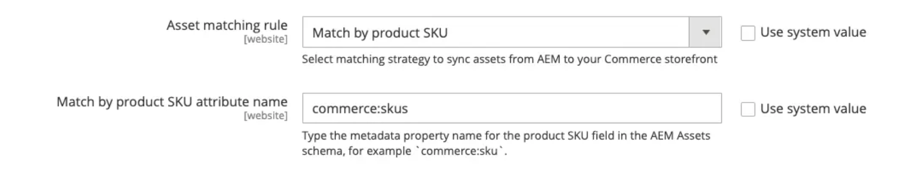

# Correspondência automática padrão

A integração do AEM Assets para Commerce fornece um mecanismo de correspondência automática padrão (**[!UICONTROL Match by product SKU]**) com base na configuração de metadados **AEM Assets**. Esta regra habilita a sincronização perfeita entre o **Adobe Commerce** e o **AEM Assets**, garantindo que os ativos sejam vinculados automaticamente às entidades de merchandising corretas.

## Configurar o mecanismo de correspondência automática

1. No Administrador do Commerce, navegue até **[!UICONTROL Store]** > Configuração > **[!UICONTROL ADOBE SERVICES]** > **[!UICONTROL AEM Assets Integration]**.

1. Especifique **[!UICONTROL Match by SKU]** como a regra de correspondência.

   {width="600" zoomable="yes"}

1. Insira o nome do campo de metadados usado para identificação de ativos na AEM Assets.

   >[!NOTE]
   >
   > Se o processo padrão de integração tiver sido seguido, esse valor deverá ser definido como `commerce:skus`.

## Como funciona o mecanismo de correspondência automática

Quando a regra de correspondência do **[!UICONTROL Match by product SKU]** é configurada no Administrador do Commerce, os arquivos de ativos do Commerce são sincronizados automaticamente do AEM Assets para o projeto do Commerce com base nos metadados de ativos configurados para cada arquivo. Você configura os metadados na guia **Commerce** do AEM no ambiente **autor do AEM Assets**:

{width="600" zoomable="yes"}

1. No AEM Assets, atualize os metadados da imagem para adicionar a associação do Adobe Commerce, `Commerce=yes`.

1. Configure os metadados ([!UICONTROL SKU], [!UICONTROL position] e [!UICONTROL role]) que vinculam o ativo à SKU do produto associado.

   >[!NOTE]
   >
   > Se um ativo for usado para vários produtos, configure os metadados para cada SKU associada.

Essa abordagem garante que os ativos digitais sejam vinculados e exibidos corretamente no Adobe Commerce. Ele também permite que os comerciantes e profissionais de marketing gerenciem funções e o posicionamento de ativos diretamente no AEM Assets, fornecendo um mecanismo consistente e centralizado para a seleção e a solicitação de imagens em todos os canais de envolvimento.
