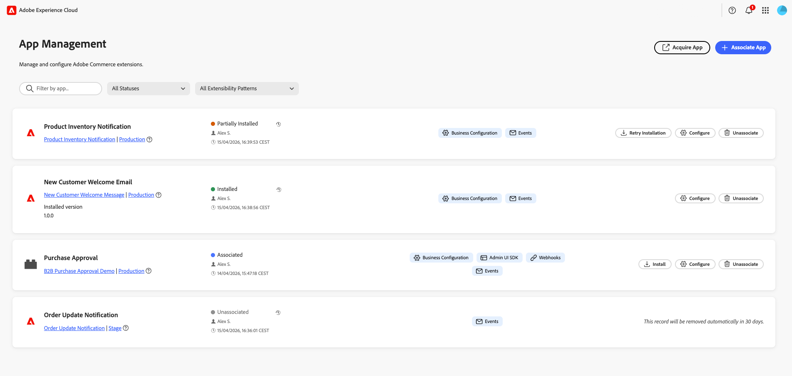

# Gerencie seu aplicativo

Um Gerenciador de aplicativos associa um aplicativo do App Builder à instância do Commerce. Os formulários de configuração são renderizados dinamicamente com base no esquema do aplicativo, portanto, não é necessário desenvolvimento personalizado da interface do administrador. O App Manager define as configurações por meio de formulários gerados automaticamente pelo Commerce.

{width="500" zoomable="yes"}

## Pré-requisitos

Antes de associar um aplicativo, verifique se você tem o seguinte:

| Requisito | Descrição |
|-------------|-------------|
| **Acesso de administrador** | Administrador do Commerce com [!DNL App Management] permissões |
| **Aplicativo implantado** | aplicativo App Builder implantado em sua organização e pronto para se conectar |
| **Acesso à organização** | Acesso à organização da Adobe em que o aplicativo é implantado |

## Tutorial

Assista a este vídeo para saber como associar um aplicativo a uma instância do Commerce e definir as configurações.

>[!VIDEO](https://video.tv.adobe.com/v/3478944)

## Associar um aplicativo

O processo de associação importa sites, lojas e visualizações de loja da Commerce e cria o link entre o aplicativo e a instância do Commerce.

Para vincular o aplicativo App Builder a uma instância do Commerce:

1. Navegue até **[!UICONTROL Apps]** > **[!UICONTROL App Management]**.

1. Clique em **[!UICONTROL Associate App]**.

   {width="500" zoomable="yes"}

1. Selecione um **[!UICONTROL Project]** na lista.

1. Selecione o **[!UICONTROL Workspace]**.

1. Clique em **[!UICONTROL Associate]**.

   {width="500" zoomable="yes"}

>[!WARNING]
>
>Se a sincronização de escopo falhar, a associação ainda será concluída. Você pode sincronizar os escopos manualmente mais tarde no modo de exibição **[!UICONTROL Manage Scopes]** na configuração do aplicativo associado.

## Definir configurações

Depois de associar um aplicativo no modo de exibição [!DNL App Management], defina suas configurações por meio do formulário:

1. Clique em **[!UICONTROL Configure]** no aplicativo associado.

1. O formulário exibe as configurações que o aplicativo pode definir.

1. Modifique os valores conforme necessário.

1. Clique em **[!UICONTROL Save]**.

### Configuração específica do escopo

Use a configuração específica do escopo quando sites, lojas ou visualizações de loja diferentes precisarem de configurações exclusivas. Por exemplo, habilite um recurso somente para uma região ou exibição de loja específica ou use configurações diferentes por marca. As configurações em um escopo mais baixo substituem as de escopos mais altos.

Para substituir valores globais em um nível de escopo específico:

1. Clique em **[!UICONTROL Change Scope]**.

1. Selecione um escopo na lista.

1. Modifique os valores para este escopo.

1. Clique em **[!UICONTROL Save]**.

## Gerenciar escopos

Acesse **[!UICONTROL Manage Scopes]** na tela de detalhes do aplicativo para gerenciar a hierarquia de escopo do seu aplicativo.

{width="500" zoomable="yes"}

| Ação | Descrição |
|--------|-------------|
| **[!UICONTROL Add root scope]** | Adicione um escopo que se aplica somente ao aplicativo. |
| **[!UICONTROL Sync Commerce scopes]** | Atualize a lista de sites, lojas e exibições de loja da Commerce depois de adicioná-los ou alterá-los. |
| **[!UICONTROL Import scopes]** | Importar escopos em massa de um arquivo. |

## Desassociar um aplicativo

Desassocie um aplicativo quando não precisar mais dele conectado à instância do Commerce. Por exemplo, talvez seja necessário desativar uma integração, alternar para um espaço de trabalho diferente ou limpar as configurações de teste.

>[!WARNING]
>
> Desassociar remove todos os valores de configuração dessa instância. Essa ação não pode ser desfeita.

Para remover um aplicativo de uma instância do Commerce:

1. Navegue até **[!UICONTROL Apps]** > **[!UICONTROL App Management]**.

1. Clique em **[!UICONTROL Unassociate]** no aplicativo.

1. Confirme a ação.

## Documentação relacionada

* [Solução de problemas [!DNL App Management]](troubleshooting.md) — Resolva problemas comuns com a associação e configuração do aplicativo.
