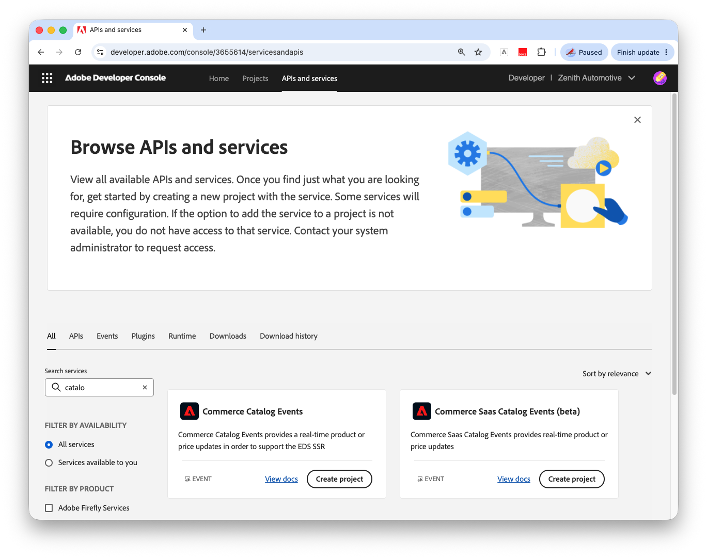
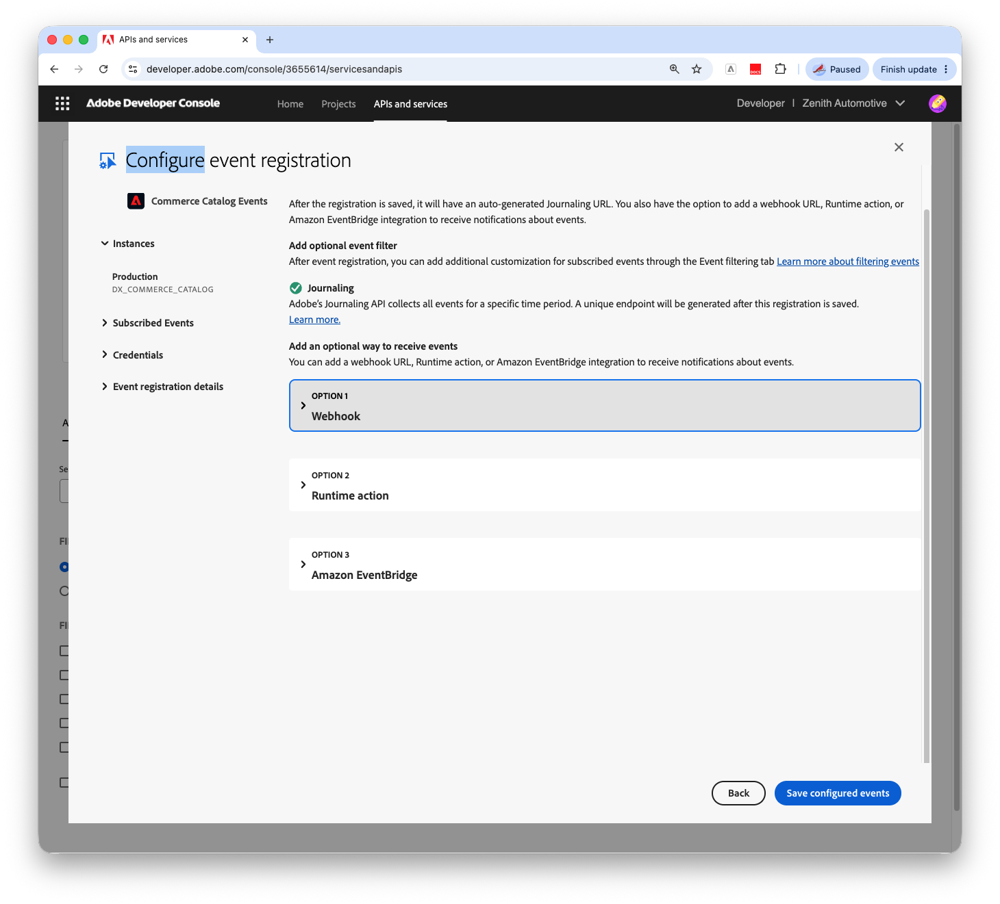

# Ativar e configurar eventos de catálogo com o Adobe I/O

Eventos de catálogo são notificações geradas por computador que descrevem alterações de catálogo com suporte disponibilizadas por meio do [!DNL Catalog Service]. Eles permitem fluxos de trabalho orientados por eventos, como:

* Manter caches ou serviços externos em sincronia com atualizações de catálogo.
* Acionando processos downstream quando produtos, variantes, preços ou categorias são alterados.
* Potencializando casos de uso do Experience Edge e do [!DNL Edge Delivery Services] que exigem atualizações de catálogo quase em tempo real.

Para obter o caminho de ponta a ponta de [!DNL Adobe Commerce] para os consumidores do evento, consulte [Entrega de evento até  [!DNL Adobe I/O Events]](#event-delivery-through-adobe-io-events).

## Tipos de evento suportados {#supported-event-types}

Os eventos do catálogo se concentram em alterações relevantes para a loja expostas por meio de [!DNL Adobe Developer Console]. As seguintes assinaturas são suportadas no momento.

| Inscrição | Eventos |
| --- | --- |
| Atualização do produto | Criar, atualizar e excluir alterações de produtos disponíveis por meio de [!DNL Catalog Service] |
| Atualização de preço | Precificar, criar, atualizar e excluir alterações que afetam os dados do catálogo da loja |

Cada evento inclui:

* Um identificador de evento que descreve o tipo de alteração.
* Contexto de entidade e ambiente, como ID de instância e SKU.
* Uma carga que descreve a entidade alterada e as informações relevantes do escopo.


## Exemplo de cargas de evento

**Evento ProductUpdated**

```json
{
  "imsOrgId": "aaa-0",
  "instanceId": "instance-9",
  "eventCode": "productUpdated",
  "sku": "1234",
  "links": [
    {"type":  "variantOf", "sku": "5678"}
   ],
  "scope": [
    { "storeViewCode": "US-us" },
    { "storeViewCode": "FR-fr" },
    { "storeViewCode": "DE-de" }
  ]
}
```

**Evento PriceUpdated**

```json
{
  "imsOrgId": "aaa-0",
  "instanceId": "instance-9",
  "eventCode": "priceUpdated",
  "sku": "1234",
  "scope": [
    {
      "websiteCode": "website1",
      "customerGroupCode": "customer-group-code1"
    },
    {
      "websiteCode": "website2",
      "customerGroupCode": "customer-group-code2"
    }
  ]
}
```

## Entrega de evento até [!DNL Adobe I/O Events] {#event-delivery-through-adobe-io-events}

O [!DNL Adobe I/O Events] entrega eventos de catálogo para suas integrações. O diagrama a seguir mostra o fluxo de alto nível das alterações no catálogo de [!DNL Adobe Commerce] até [!DNL Catalog Service] e [!DNL Adobe I/O Events] para os consumidores inscritos:


As etapas a seguir explicam cada entrega com mais detalhes:

1. **Adobe Commerce → Serviço de catálogo**

[!DNL Adobe Commerce] exporta dados do catálogo para [!DNL Catalog Service] usando as extensões de exportação de dados SaaS suportadas.

1. **Processamento do serviço de catálogo**

   * [!DNL Catalog Service] processa alterações de catálogo com suporte e as prepara para a entrega de eventos.

1. **Serviço de Catálogo → Adobe I/O Events**

* Eventos de catálogo publicados em [!DNL Adobe I/O Events].
* Os consumidores assinam usando o registro em log, webhooks, [!DNL Adobe I/O Runtime], Amazon EventBridge ou outros mecanismos de entrega com suporte.

[!DNL Adobe I/O Events] fornece:

* *Pelo menos uma entrega* por assinante (eventos duplicados são possíveis).
* Nenhuma garantia de pedido entre deliveries.

Seus consumidores devem lidar com eventos duplicados e delivery fora de ordem. Consulte [Idempotência](#idempotency) para obter orientação de implementação.

## Casos de uso {#use-cases}

Você pode usar Eventos de catálogo em vários cenários.

### Entrega estática de site e borda

* Gerar novamente ou invalidar páginas de catálogo e fragmentos de vitrine quando os dados de catálogo forem alterados.
* Evite a sondagem frequente de [!DNL Catalog Service] APIs.

### Indexação e armazenamento em cache de pesquisa

* Acione atualizações incrementais nos índices de pesquisa downstream.
* Atualizar camadas de cache ou exibições externas do catálogo quando os dados do produto ou da categoria forem alterados.

### Integração com sistemas externos

* Encaminhar alterações de catálogo para sistemas externos, como PIM, mecanismos de precificação ou outros sistemas de linha de negócios.
* Mantenha os aplicativos downstream sincronizados sem acesso direto ao banco de dados.

### Monitorização e observabilidade

Combinar eventos do Catálogo com monitoramento existente (por exemplo, [!DNL Grafana] e [!DNL Prometheus]) para:

* Monitorar a taxa de transferência de eventos.
* Detectar anomalias no volume de atualização do catálogo.

## Ativar eventos de catálogo {#enable-catalog-events}

Para ativar eventos de catálogo de ponta a ponta, siga estas etapas.

>[!PREREQUISITES]
>
>Antes de habilitar eventos de catálogo, verifique se você tem o seguinte:
>
>* Um ambiente Adobe Commerce com suporte habilitado para [!DNL Catalog Service].
>* [A conexão [!DNL Adobe I/O] está configurada para o Adobe Commerce](https://developer.adobe.com/commerce/extensibility/events/configure-commerce).
>* Acesso a [!DNL Adobe Developer Console] na mesma organização IMS em que o ambiente do Commerce é provisionado.
>* Para verificar a sincronização com os serviços SaaS do Commerce, use o **[!UICONTROL Data Management Dashboard]** no Administrador.
>* Recomendações de Produto v6.0, [!DNL Live Search] v4.1.0+ ou [!DNL Catalog Service] v1.17+ são necessárias para verificação do painel. A Adobe recomenda atualizar seu projeto do Commerce para as versões mais recentes compatíveis desses serviços. Para versões anteriores do serviço, use a [Sincronização de Catálogo](https://experienceleague.adobe.com/en/docs/commerce/user-guides/data-services/catalog-sync) para verificação de sincronização.


>[!NOTE]
>
>Para usar eventos de catálogo, primeiro configure o ambiente Commerce para [!DNL Adobe I/O Events] e, em seguida, registre uma assinatura de evento em [!DNL Adobe Developer Console].
>
>Se o ambiente não for exibido em [!DNL Adobe Developer Console] após a configuração, verifique se você entrou na organização IMS correta e se sua conta tem o acesso necessário. Se o ambiente ainda não for exibido, entre em contato com o Suporte da Adobe.

### Verificar dados do catálogo {#verify-catalog-data}

Verifique se [!DNL Catalog Service] tem dados de catálogo atuais da instância [!DNL Commerce] antes de configurar. Os eventos do catálogo dependem da conclusão de [!DNL SaaS Data Export] em dois estágios - confirme **ambos**:

1. Confirme a exportação do feed **do Commerce** com êxito.

   No Administrador [!DNL Adobe Commerce], abra a página [Status de sincronização do feed de dados](https://experienceleague.adobe.com/en/docs/commerce-admin/systems/data-transfer/data-sync/data-feed-sync-status) (**[!UICONTROL System]** > **[!UICONTROL Data Transfer]** > **[!UICONTROL Data Feed Sync Status]**) e confirme se o último status de exportação é bem-sucedido para cada feed do [!DNL Catalog Service].

1. Confirme a **sincronização bem-sucedida com os serviços Commerce conectados** do Administrador [!DNL Adobe Commerce].

   No Administrador [!DNL Adobe Commerce], abra o [Painel de Gerenciamento de Dados](https://experienceleague.adobe.com/en/docs/commerce-admin/systems/data-transfer/data-sync/data-dashboard) (**[!UICONTROL System]** > **[!UICONTROL Data Transfer]** > **[!UICONTROL Data Management Dashboard]**) e verifique se os dados dos produtos sincronizados incluem os produtos esperados.

### Registrar e assinar [!DNL Adobe I/O Events] {#register-events}

Defina em quais eventos do Commerce inscrever-se e registre-os no projeto.

Se sua instância não estiver na lista de seleção, ela não estará conectada a [!DNL Adobe I/O]. Para obter instruções sobre como corrigir o problema, consulte [Configurar a [!DNL Adobe I/O] conexão](https://developer.adobe.com/commerce/extensibility/events/configure-commerce#configure-the-adobe-io-connection) na documentação do *Adobe Commerce Developer*.

1. Do [!DNL Adobe Developer Console], faça logon na mesma organização IMS usada para o projeto do Commerce.

1. Crie um projeto para Eventos do catálogo Commerce ou adicione a API de eventos a um projeto existente.

   * Selecione **[!UICONTROL APIs and services]** na navegação superior.

   * Na página **[!UICONTROL Browse APIs and services]**, selecione a guia **[!UICONTROL Events]**.

   * Encontre rapidamente APIs de eventos do catálogo da Commerce. Digite _Catálogo_ na caixa de pesquisa ou filtre pelo produto **[!UICONTROL Commerce]**.

   * No cartão **[!UICONTROL Commerce Catalog Events]**, selecione **[!UICONTROL Project]**.

   {width="600" zoomable="yes"}

1. Configure o registro de eventos.

   Selecione a instância do Commerce da qual receberá notificações de eventos. Em seguida, selecione **[!UICONTROL Next]**.

   {width="600" zoomable="yes"}

1. Escolha os eventos nos quais se inscrever.

   Selecione as assinaturas de evento com suporte que você deseja receber, como **[!UICONTROL Product Update]** ou **[!UICONTROL Price Update]**. Em seguida, selecione **[!UICONTROL Next]**.

   {width="600" zoomable="yes"}

1. Adicionar credenciais OAuth de servidor para servidor.

   Insira um **[!UICONTROL Credential name]**. Em seguida, selecione **[!UICONTROL Next]**.

1. Insira um **[!UICONTROL Event registration name]** e um **[!UICONTROL Event registration description]**. Em seguida, selecione **[!UICONTROL Next]**.

1. Na tela de registro final, aceite o consumidor padrão, a API de registro.

   O consumidor padrão da API de registro no diário permite testar o registro de eventos e confirmar se os eventos foram entregues. Se você já configurou um webhook ou um consumidor de ação [!DNL Adobe I/O Runtime], selecione-o aqui. Caso contrário, edite o registro do evento posteriormente quando o consumidor estiver pronto.

   {width="600" zoomable="yes"}

1. Selecione **[!UICONTROL Complete registration]**.

### Configurar consumidor de eventos {#configure-consumer}

1. Configure um consumidor, como:

   * Um ponto de acesso de webhook
   * Uma ação [!DNL Adobe I/O Runtime]
   * Outro destino compatível

1. Se você não selecionou um consumidor durante o registro, edite o registro do evento para adicionar os detalhes do consumidor.

   * No [!DNL Adobe Developer Console], edite seu projeto. Em seguida, selecione o registro de evento que você criou.

   * Na página de detalhes do registro do evento, selecione **[!UICONTROL Edit Events Registration]**.

   * Selecione **[!UICONTROL Next]** até chegar à tela de seleção do consumidor. Em seguida, selecione o consumidor que você configurou.

   * Atualize o consumidor para o destino configurado. Em seguida, selecione **[!UICONTROL Save configured events]**.

### Validar o fluxo de eventos {#validate-event-flow}

Eventos de catálogo são ativados para seu ambiente. Quando os dados do catálogo são alterados no [!DNL Commerce], as atualizações fluem pelo [!DNL Catalog Service] para [!DNL Adobe I/O Events], e o consumidor que você se inscreveu recebe o evento de catálogo correspondente. Revise [Limites e práticas recomendadas](#limits-and-best-practices) antes de criar integrações de produção.
1. Faça uma alteração simples no catálogo com suporte, como atualizar um nome de produto ou alterar um preço.

1. Confirme os seguintes resultados:

   * A alteração está visível por meio de [!DNL Catalog Service] APIs.
   * O consumidor [!DNL Adobe I/O Events] recebe o produto ou evento de preço correspondente.


## Limites e práticas recomendadas {#limits-and-best-practices}

Ao criar eventos no catálogo, siga estas práticas recomendadas.

### Idempotência {#idempotency}

O [!DNL Adobe I/O Events] pode entregar o mesmo evento de catálogo mais de uma vez, e os eventos de um único produto podem chegar fora de ordem. Desenhar os consumidores para serem idempotentes ao:

* Uso de IDs de entidade com um campo de versão ou carimbo de data e hora.
* Ignorando com segurança notificações duplicadas para a mesma alteração.

### Taxa de transferência e contrapressão

Catálogos grandes com altas taxas de atualização podem gerar um volume de eventos significativo. Verifique se:

* Os consumidores podem processar eventos no rendimento máximo.
* Use buffering, agrupamento ou filas, quando necessário.

### Segurança e isolamento

* [!DNL Adobe I/O Events] impõe *isolamento do locatário*.
* Sua organização recebe eventos somente para seus próprios ambientes e direitos.

### Evolução do esquema

As cargas de evento de catálogo seguem o mesmo modelo conceitual que [!DNL Catalog Service] APIs. Para permanecer compatível com o encaminhamento:

* Evite a aplicação rigorosa de esquemas sempre que possível.
* Ignorar campos desconhecidos em vez de falhar.

## Solução de problemas de eventos de catálogo {#troubleshoot-catalog-events}

Se os eventos de catálogo estiverem ausentes ou atrasados, analise essas etapas.

1. **Verificar dados do Serviço de Catálogo**

   [Use a [!DNL Catalog Service] API](https://developer.adobe.com/commerce/webapi/graphql/schema/catalog-service/queries/) para confirmar se a alteração no catálogo foi armazenada com êxito.

1. **Verificar[!DNL SaaS Data Export]**

   Eventos de catálogo exigem dados atuais em [!DNL Catalog Service]. Confirme os dois estágios do caminho de exportação:

   * **Exportação do feed do Commerce** — Na página [Status de sincronização do feed de dados](https://experienceleague.adobe.com/en/docs/commerce-admin/systems/data-transfer/data-sync/data-feed-sync-status) ou em `var/log/saas-export.log`, confirme se os feeds [!DNL Catalog Service] foram exportados com êxito do [!DNL Commerce].

   * **Sincronizar com os serviços SaaS conectados do Commerce** — No [Painel de Gerenciamento de Dados](https://experienceleague.adobe.com/en/docs/commerce-admin/systems/data-transfer/data-sync/data-dashboard), [Sincronização de Catálogo](https://experienceleague.adobe.com/en/docs/commerce/user-guides/data-services/catalog-sync), ou em logs de exportação, confirme se os dados foram sincronizados com êxito no [!DNL Catalog Service].

   Para solucionar problemas de trabalhos de exportação e sincronização, consulte [Sincronizar dados com a Exportação de Dados SaaS](../data-export/data-sync-manage.md) e [Logs e solução de problemas](../data-export/troubleshooting/logging.md).

1. **Validar a configuração [!DNL Adobe I/O Events]**

   Confirme que:

   * Você está conectado à organização IMS correta em [!DNL Adobe Developer Console].
   * O provedor **[!UICONTROL Commerce Catalog Events]** está habilitado.
   * O ambiente e o provedor esperados **[!UICONTROL Commerce Catalog Events]** estão visíveis.
   * A assinatura está ativa.
   * Seu consumidor de ponto de extremidade, ação ou diário pode receber e processar eventos de teste.

1. **Contate o Suporte da Adobe**

   Ao abrir um tíquete de suporte, selecione o motivo do problema que corresponde ao **aplicativo do Adobe Commerce** e inclua as seguintes informações:

   * Detalhes do Serviço de catálogo (ambiente, região).
   * [!DNL Adobe I/O Events] Detalhes da assinatura.
   * Tempo aproximado e descrição de eventos ausentes.

   Para obter ajuda adicional, consulte [Tíquetes de suporte](https://experienceleague.adobe.com/en/docs/support-resources/adobe-support-tools-guide/adobe-commerce-support/adobe-commerce-help-center-user-guide#support-case).

>[!MORELIKETHIS]
>
>
>* [Integração e instalação](installation.md)
>* [Introdução ao Serviço de Catálogo](get-started.md)
>* [Sincronizar dados com a Exportação de dados SaaS](../data-export/data-sync-manage.md)
>* [Recuperar dados do catálogo com a API do GraphQL](https://developer.adobe.com/commerce/webapi/graphql/schema/catalog-service/queries/){target="_blank"}
>* [[!DNL Catalog Service] e API Mesh](mesh.md)
>* [Configurar a [!DNL Adobe I/O] conexão](https://developer.adobe.com/commerce/extensibility/events/configure-commerce#configure-the-adobe-io-connection){target="_blank"}
>* [[!DNL Adobe I/O Events]](https://developer.adobe.com/events/docs/guides/){target="_blank"}
