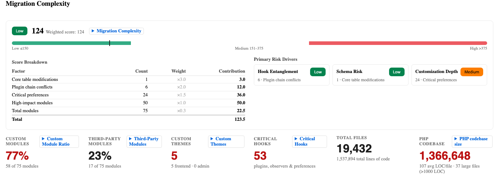
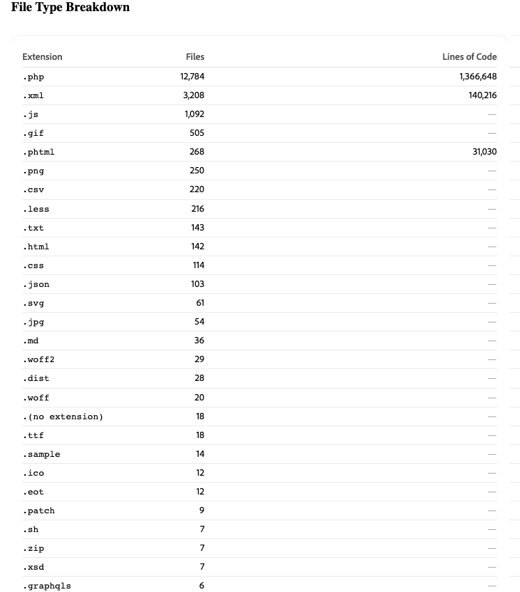
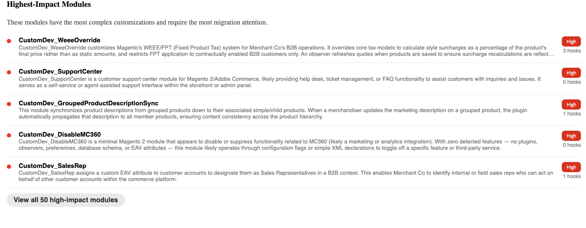
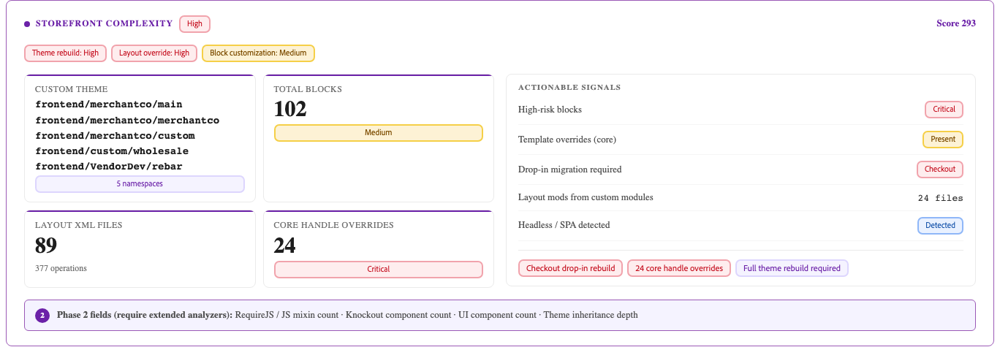
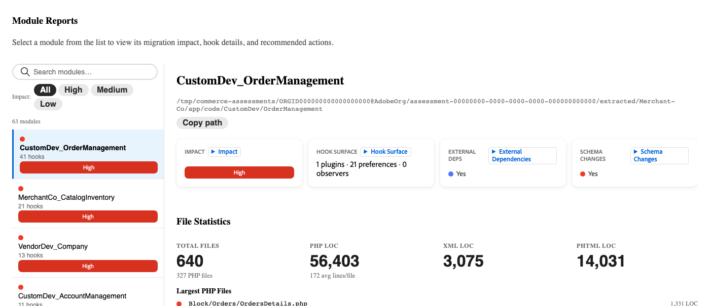

# Avaliação da migração

>[!IMPORTANT]
>
> A Avaliação de Migração só está disponível ao migrar projetos [!DNL Adobe Commerce on Cloud Infrastructure] ou [!DNL Adobe Commerce on-premises] para [!DNL Adobe Commerce as a Cloud Service].

Uma avaliação de migração do Commerce é uma análise automatizada da implementação existente do Adobe Commerce. As ferramentas da Adobe verificam sua base de códigos Commerce e produzem um relatório estruturado que faz o inventário de tudo o que foi construído, personalizado ou modificado. O relatório indica como as personalizações feitas na sua base de código afetam sua migração para o [!DNL Adobe Commerce as a Cloud Service].

Os relatórios de avaliação de migração processada estão acessíveis em `https://experience.adobe.com/@<ims-org-name>/commerce-migration-assessment/shared-assessments`. Não é necessário acesso ao ambiente de produção, exceto compartilhar inicialmente a base de código do projeto.

**A avaliação fornece:**

- Um inventário completo de cada módulo personalizado em sua loja, organizado por tipo e nível de impacto
- Uma classificação de complexidade de migração (alta, Medium ou baixa) calculada a partir de métricas de previsão de riscos
- Uma exibição priorizada do back-end de maior impacto e das áreas de loja que exigem planejamento de migração
- Uma descrição de cada módulo personalizado, que você pode usar como entrada direta para as ferramentas de desenvolvedor de IA do Adobe

## Noções básicas sobre o relatório de avaliação da migração

O relatório é organizado em três guias: **[!UICONTROL Summary]**, **[!UICONTROL Module Reports]** e **[!UICONTROL Report Reliability]**.

>[!NOTE]
>
>Nem todas as seções do relatório se aplicam a todas as lojas. A avaliação foi projetada para ser abrangente em todos os tipos possíveis de personalização e fatores de complexidade, mas sua loja tem apenas um subconjunto das seções listadas aqui.

## Guia Resumo

A guia **[!UICONTROL Summary]** fornece uma visão geral dos principais sinais organizados nestas áreas:

- Complexidade de migração
- Detalhamento do tipo de arquivo
- Módulos de maior impacto
- Drivers de migração
- Detalhamento da personalização

### Complexidade de migração

A seção Complexidade de migração contém a classificação de avaliação da loja em geral. Ele explica como a pontuação foi calculada e destaca seus principais fatores de risco.

**Pontuação de complexidade e complexidade da migração**

{width="600" zoomable="yes"}

A Pontuação de complexidade pesa cada entrada de acordo com a dificuldade de migração. A pontuação é mapeada para uma classificação de complexidade de migração usando limites fixos:

| Classificação | Intervalo de pontuação | Abordagem de migração típica |
| --- | --- | --- |
| Baixa | 150 ou inferior | Migração padrão - migração direta com coordenação de provedores de pagamento e migração de dados como fluxos de trabalho paralelos. |
| Medium | 151-375 | Migração modular - migrada em segmentos, triagem de módulos personalizados de alto impacto. |
| Alta | Acima de 375 | Uma migração em fases, provavelmente com duração de 12 a 24 meses. |

**Taxa de Módulo Personalizada**

{width="600" zoomable="yes"}

A porcentagem de seus módulos que foram criados especificamente para a sua implementação. Uma taxa maior significa que mais códigos personalizados devem ser auditados e migrados. A taxa média de módulos personalizados do cliente é de aproximadamente 62%.

>[!TIP]
>
>A proporção de módulo personalizada é um sinal de escopo, não um sinal de complexidade. Uma loja com 80% de módulos personalizados isolados e de baixo risco pode ser mais fácil de migrar do que uma loja com módulos personalizados de risco 40% maior. Use a Pontuação de complexidade e o número de conflitos de cadeia para avaliar a dificuldade. Use a Taxa de módulo personalizada para estimar o volume.

**Detalhamento do Tipo de Arquivo**

{width="600" zoomable="yes"}

Uma lista do número de arquivos na base de código, organizada por tipo.

**Módulos de maior impacto**

{width="600" zoomable="yes"}

Uma lista com curadoria dos módulos específicos da sua loja que exigem mais atenção da migração. Esses módulos geralmente são módulos que interagem com checkout, pagamentos ou gerenciamento de pedidos. Cada módulo de alto impacto precisa de seu próprio plano de migração. Essa lista é o melhor ponto de partida para conversas com sua equipe técnica.

### Complexidade da loja

{width="600" zoomable="yes"}

A seção Complexidade da loja mostra o esforço necessário para migrar a camada de apresentação de front-end da loja. Esse fluxo de trabalho é um fluxo de trabalho distinto da migração de código de back-end, abordado por desenvolvedores de front-end e que geralmente requer conversas de planejamento separadas.

>[!NOTE]
>
>Uma loja pode ter baixa complexidade de back-end e alta complexidade de loja. Sempre revise ambas as seções antes de definir o escopo do esforço de migração.

- Tema personalizado - o namespace do tema personalizado da sua loja (por exemplo, BrandName_Theme). A presença de um tema personalizado significa que é necessária uma recompilação completa do tema para [!DNL Adobe Commerce as a Cloud Service]. Cada loja avaliada com um namespace de tema personalizado deve planejar um fluxo de trabalho de migração de front-end dedicado.

- Total de blocos - O número de arquivos de bloco e modelo (.phtml) no armazenamento. Os blocos são os principais artefatos de renderização do lado do servidor, cada um representa uma tarefa de migração distinta.

| Contagem de blocos | Esforço |
| --- | --- |
| Menos de 100 | Linha de base - esforço padrão |
| 100-300 | Medium - planejar uma onda de front-end estruturada |
| Mais de 300 | Alto - priorize como um fluxo de trabalho dedicado |

### Drivers de migração

{width="600" zoomable="yes"}

A seção Drivers de migração exibe os principais fatores que determinam sua classificação de complexidade.

| Driver | Definição |
| --- | --- |
| Área de ocupação da personalização | O volume geral do código personalizado em relação à implementação total |
| Plug-ins e Observadores | Código que intercepta o comportamento principal da plataforma no tempo de execução |
| Preferências de classe | Um padrão de personalização frágil, que substitui completamente as classes principais e interrompe silenciosamente nas atualizações |
| Modelo de dados | Estruturas de banco de dados personalizadas e modificadas |
| Integrações | Sistemas externos conectados à sua loja |

Cada driver é exibido com um esforço Alto, Medium ou Baixo. Aborde primeiro os drivers de maior classificação ao determinar o escopo e o planejamento.

### Modelo de dados

{width="600" zoomable="yes"}

A seção Modelo de Dados exibe uma contagem de tabelas personalizadas, modificações nas tabelas do banco de dados principal [!DNL Adobe Commerce] e atributos Entity-Attribute-Value (EAV) críticos.

As modificações na tabela principal são a categoria mais difícil de migrar, pois criam dependências em uma versão de esquema da plataforma específica e têm um alto impacto na fórmula de Pontuação de complexidade.

>[!TIP]
>
>Se seu relatório listar mais de 15 modificações na tabela principal, planeje um fluxo de trabalho de migração de dados dedicado antes de determinar o escopo da migração do módulo de back-end.

## Detalhamento de personalização

{width="600" zoomable="yes"}

A seção Detalhamento da personalização fornece métricas detalhadas em cada categoria de personalização na loja.

>[!NOTE]
>
>Nem todas as subseções aparecem em todos os relatórios, somente as categorias detectadas na sua base de código são exibidas.
>
>As subseções que afetam a camada de apresentação de front-end são um fluxo de trabalho distinto da migração de código de back-end e geralmente exigem conversas de planejamento separadas.
>
>Uma loja pode ter baixa complexidade de back-end e alta complexidade de front-end. Sempre revise as subseções relacionadas ao back-end e à loja antes de definir o escopo do esforço de migração.

### XML de layout

O número de arquivos XML de layout e sua contagem total de operações. O XML de layout define a estrutura de cada página, incluindo quais blocos aparecem, os containers em que eles aparecem e os tipos de página em que estão.

Uma alta contagem de arquivos com muitas operações sinaliza personalização significativa da estrutura da página que deve ser rearquitetada.

### Substituições do identificador principal

O número de locais em que o XML de Layout substitui um identificador de página [!DNL Adobe Commerce] principal (por exemplo, `checkout_cart_index` ou `catalog_product_view`). As substituições do identificador principal são o sinal de layout de maior risco, pois modificam a estrutura da página no nível da plataforma e exigem recriação explícita.

| Substituir contagem | Esforço |
| --- | --- |
| 0 | Nenhuma substituição do layout principal |
| 1-3 | Risco de tempo de execução - cada substituição precisa de uma reconstrução de layout explícita |
| 4 ou mais | Crítico - planeje um sprint de migração de layout dedicado |

### Blocos

O número de arquivos de bloco e modelo (`.phtml`) em seu armazenamento. Os blocos são os artefatos de renderização do lado do servidor primário. Cada bloco representa uma tarefa de migração distinta.

| Contagem de blocos | Esforço |
| --- | --- |
| Menos de 100 | Linha de base - esforço padrão |
| 100-300 | Medium - planejar uma onda de front-end estruturada |
| Mais de 300 | Alto - priorize como um fluxo de trabalho dedicado |

### Blocos de alto risco

Blocos que tocam os caminhos de renderização principais, como renderização de check-out, exibição de carrinho e superfícies de front-end semelhantes. Quaisquer blocos de alto risco exigem uma avaliação individual da migração antes da programação.

### Temas e modelos de email

O namespace do tema personalizado do seu armazenamento (por exemplo, `BrandName_Theme`). A presença de um tema personalizado significa que é necessária uma reconstrução completa do tema. Cada loja avaliada com um namespace de tema personalizado deve planejar um fluxo de trabalho de migração de front-end dedicado.

### Substituições de modelo (principal modificado)

O número de modelos [!DNL Adobe Commerce] `.phtml` principais que foram substituídos. Cada substituição de modelo principal cria uma dependência em uma versão específica desse modelo. As atualizações da Platform que alteram o modelo interrompem a substituição silenciosamente.

### Migração drop-in necessária

A [!DNL Adobe Commerce as a Cloud Service] usa uma arquitetura de componentes de entrada modular para superfícies da loja, incluindo check-out, carrinho e detalhes do produto. As personalizações nessas superfícies devem ser recriadas como componentes internos. Essas personalizações podem abranger uma grande variedade de funcionalidades, como adicionar etapas de finalização personalizadas, modificar a lógica de exibição do carrinho ou estender a página de detalhes do produto.

O campo [!UICONTROL Drop-in migration required] indica quais áreas de vitrine exigem recriações suspensas.

>[!IMPORTANT]
>
>Se o **Check-out** estiver listado como um requisito de migração de check-in, planeje um fluxo de trabalho de check-out dedicado. Essa é a tarefa de migração de vitrine mais complexa e crítica para os negócios.

## Guia Relatórios do módulo

{width="600" zoomable="yes"}

A guia **[!UICONTROL Module Reports]** contém uma entrada dedicada para cada módulo personalizado em sua loja. Compartilhe essas informações com sua equipe técnica.

Para cada módulo, o relatório exibe:

| Nome do campo | Definição |
| --- | --- |
| O que faz | Uma descrição da finalidade e da função comercial do módulo personalizado |
| Nível de impacto | Impacto de **Alto**, **Medium** ou **Baixo** com base no comportamento de comércio que o módulo toca |
| Contagem de ganchos | O número de webhooks, que indica quantos locais este módulo intercepta o comportamento principal da plataforma |
| Recomendação de migração | **Recompilar**, **Refatorar**, **Substituir** com um recurso nativo ou **Remover** |
| Dependências | Com quais outros módulos este módulo interage, o que pode informar o sequenciamento de migração |

**Fluxo de trabalho**

1. Filtre primeiro para **Módulos de alto impacto**. Elas geram mais esforço e custo de migração.
1. Para cada módulo personalizado, determine as respostas para as seguintes perguntas:
   - Esse módulo ainda é usado ativamente?
   - O módulo pode ser substituído por um recurso [!DNL Adobe Commerce as a Cloud Service] nativo?
   - Se o módulo precisar ser recriado, qual funcionalidade sua substituição precisará fornecer?
1. Identifique os módulos personalizados que podem ser removidos ou substituídos. Cada uma reduz o escopo da migração antes que qualquer código seja escrito.
1. Copie a descrição de cada módulo personalizado com a recomendação de migração **Recompilar**. Essas descrições podem ser fornecidas diretamente para as ferramentas de desenvolvedor de IA da Adobe. Consulte [Ferramentas de desenvolvedor de IA para extensibilidade do Commerce](#ai-developer-tools-for-commerce-extensibility) para obter mais informações.

## Referência: termos principais

| Termo | Definição |
| --- | --- |
| **Módulo** | Um pacote personalizado e independente de funcionalidade. Sua loja pode ter de vinte a centenas de módulos. |
| **Plug-in (interceptor)** | Código que intercepta uma função do Commerce e altera seu comportamento antes, durante ou depois da execução. |
| **Observador** | O código que escuta um evento de plataforma específico, como &quot;pedido feito&quot;, e executa a lógica personalizada quando esse evento é acionado. |
| **Preferência (substituição de classe)** | Um tipo de personalização frágil que substitui completamente uma classe Commerce principal, que é interrompida silenciosamente quando a plataforma atualiza essa classe. |
| **Conflito de cadeia** | Quando dois ou mais plug-ins interceptam a mesma função e um não passa o controle para o próximo. Isso pode fazer com que os recursos parem de funcionar silenciosamente, sem mensagem de erro. |
| **Modificação da tabela principal** | Uma alteração estrutural nas tabelas de banco de dados integradas do Commerce, que cria uma dependência irreversível em uma versão de esquema da plataforma específica. Eles têm o peso mais alto na fórmula de Pontuação de complexidade. |
| **EAV (Entity-Attribute-Value)** | Um campo personalizado flexível adicionado a produtos ou clientes, por exemplo, um campo personalizado &quot;período de garantia&quot;. As altas contagens de EAV aumentam a complexidade da migração de dados. |
| **Densidade do gancho** | O número médio de plug-ins e observadores por módulo. Densidade maior significa que a personalização é mais estreitamente integrada na plataforma principal. |
| **Suspenso** | [!DNL Adobe Commerce's] abordagem modular para os componentes da loja (incluindo check-out, carrinho e páginas de detalhes do produto). O comportamento de check-out personalizado em [!DNL Adobe Commerce on Cloud Infrastructure] ou [!DNL Adobe Commerce on Premises] geralmente requer uma recriação de Entrega em [!DNL Adobe Commerce as a Cloud Service]. |
| **App Builder** | A plataforma de extensibilidade fora do processo do Adobe e a maneira recomendada de criar funcionalidade personalizada, substituindo extensões PHP em processo. |
| **XML de layout** | Arquivos de configuração que definem quais blocos aparecem em quais páginas. O XML de layout personalizado deve ser reestruturado para a estrutura de página [!DNL Adobe Commerce as a Cloud Service's]. |
| **Substituição de identificador principal** | Uma personalização de layout XML que modifica uma estrutura de página principal do Commerce globalmente. Eles têm o padrão de layout de maior risco para migração. |

## Ferramentas do desenvolvedor de IA para extensibilidade do Commerce

Você pode usar as descrições do módulo na guia **[!UICONTROL Module Reports]** como prompts para as ferramentas de desenvolvedor de IA da Adobe. A ferramenta ajuda você a criar e implantar uma extensão de substituição compatível com o [!DNL Adobe Commerce as a Cloud Service].

### O que as ferramentas fornecem

As [ferramentas de desenvolvedor de IA para extensibilidade do Commerce](https://developer.adobe.com/commerce/extensibility/developer-agent/) da Adobe incluem dois recursos principais.

- [!DNL Adobe Commerce] [!DNL App Builder] Servidor MCP - Uma integração de protocolo MCP que conecta os assistentes de codificação de IA diretamente à documentação do [!DNL Adobe Commerce], às APIs e aos padrões de desenvolvimento do App Builder. Os desenvolvedores podem descrever o que desejam criar e o servidor MCP fornece geração de código com reconhecimento de Commerce, orientação de arquitetura e automação de implantação no IDE.
- Habilidades do agente - Habilidades de IA pré-criadas que abrangem padrões comuns de extensibilidade do Commerce, como APIs REST, extensões de check-out, componentes da loja e integrações orientadas por eventos. As habilidades orientam a IA por meio de etapas de arquitetura, implementação, teste e implantação específicas para [!DNL Adobe Commerce as a Cloud Service] e [!DNL App Builder].

#### Instalar ferramentas de IA

Consulte [instalando as ferramentas do desenvolvedor de IA](https://developer.adobe.com/commerce/extensibility/developer-agent/coding-tools) para obter instruções completas e configurações específicas do IDE.

**Pré-requisitos:** Node.js 22.x, npm 9.0.0 ou superior, Adobe I/O CLI.

Instalar comando:

```bash
aio commerce extensibility tools-setup
```

### Criar prompts a partir do relatório de avaliação

Embora a avaliação forneça um blueprint para desenvolvimento, as ferramentas de IA permitem que sua equipe comece a criar imediatamente, antes que um plano de migração completo seja finalizado.

1. Abra a guia **[!UICONTROL Module Reports]** e encontre um módulo de Alto impacto com uma recomendação de **Recompilação**.
1. Leia a descrição do módulo, por exemplo:

```shell-session
Manages custom shipping rate calculations based on customer account tier and order    weight thresholds.
```

1. Abra o IDE, por exemplo, GitHub Copilot, Cursor ou Claude com o servidor MCP de extensibilidade do Commerce ativado.
1. Use a descrição do módulo para solicitar o agente de IA.
1. Revise o aplicativo [!DNL App Builder] com andaime e itere com o agente para refinar a implementação.

## Próximas etapas

1. Abra a guia **[!UICONTROL Summary]**. Revise a Complexidade da migração e os Módulos de maior impacto, e verifique as subseções Detalhamento da personalização. Se sua loja tiver um tema personalizado, blocos de alto risco ou um Check-out incluído na lista, planeje um fluxo de trabalho de front-end paralelo junto com a migração de back-end.
1. Compartilhe a guia **[!UICONTROL Module Reports]** com sua equipe técnica ou parceiro de desenvolvimento. Solicite que eles sinalizem todos os módulos personalizados que não são mais usados ativamente ou que possam ser substituídos por um recurso [!DNL Adobe Commerce as a Cloud Service].
1. Comece a criar suas personalizações. Use as descrições do módulo como entrada da ferramenta de IA para iniciar as extensões compatíveis com o andaime.
1. Agende uma chamada de apresentação com sua equipe de conta da Adobe. A Adobe pode analisar as descobertas com você, responder a qualquer pergunta sobre módulos específicos e sinais de vitrine e ajudar a mapear a abordagem de migração para seu perfil de complexidade.

## Recursos

- [!DNL Adobe Commerce as a Cloud Service]
   - [Visão geral](../overview.md)
   - [Visão geral da migração](./overview.md)
   - [Tutorial da extensão de classificações](../tutorials/ratings-extension.md)
   - [Tutorial do método de envio](../tutorials/shipping-method-extension.md)
- Extensibilidade
   - [Visão geral](https://developer.adobe.com/commerce/extensibility/)
   - [Ferramentas do desenvolvedor de IA](https://developer.adobe.com/commerce/extensibility/developer-agent/)
      - [Práticas recomendadas](https://developer.adobe.com/commerce/extensibility/developer-agent/best-practices)
      - [Configuração](https://developer.adobe.com/commerce/extensibility/developer-agent/coding-tools)
      - [Habilidades e prompts](https://developer.adobe.com/commerce/extensibility/developer-agent/skills-and-prompts)
      - [Casos de uso](https://developer.adobe.com/commerce/extensibility/developer-agent/use-cases)
   - [Visão geral do App Builder](https://developer.adobe.com/app-builder/docs/intro_and_overview/)
   - [App Builder para Adobe Commerce](https://experienceleague.adobe.com/en/docs/commerce-learn/tutorials/extensibility/adobe-developer-app-builder/introduction-to-app-builder)
   - Starter kits
      - [Kit inicial de integração de back-end](https://developer.adobe.com/commerce/extensibility/starter-kit/integration/)
      - [Checkout do kit inicial](https://developer.adobe.com/commerce/extensibility/starter-kit/checkout/)
- Desenvolvimento de vitrine
   - [Visão geral](https://experienceleague.adobe.com/developer/commerce/storefront/)
   - [Habilidades de IA da loja](https://experienceleague.adobe.com/developer/commerce/storefront/boilerplate/ai-agent-skills/)

>[!TIP]
>
>Entre em contato com o gerente de conta da solução para solicitar uma avaliação de migração da instância existente.
