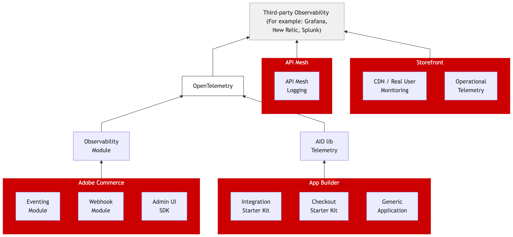

# Observabilidade

A capacidade de observação é um aspecto crítico da operação [!DNL Adobe Commerce as a Cloud Service]. Ele abrange a coleta, o processamento e a visualização de dados de telemetria, incluindo métricas, registro e rastreamento, para que você possa monitorar a integridade do aplicativo, diagnosticar problemas de desempenho e otimizar a confiabilidade da sua plataforma de comércio e suas integrações.

## [!DNL Adobe Commerce as a Cloud Service]

### Visão geral da capacidade de observação

A capacidade de observação oferece visibilidade sobre a integridade e o desempenho da loja da Adobe Commerce e de todos os aplicativos conectados da App Builder. Coletando dados de telemetria no ecossistema de comércio, você pode:

* **Rastrear métricas**, como tempos de resposta de API, taxas de solicitação e erro e utilização de recursos, para monitorar o desempenho em tempo real e detectar tendências.
* **Centralize logs** de seu aplicativo, infraestrutura, CDN e integrações em uma única exibição para obter uma solução de problemas mais rápida.
* **Rastrear solicitações** de ponta a ponta conforme elas fluem do front-end pela Commerce e pelos aplicativos conectados, ajudando a identificar gargalos e falhas antes que afetem os clientes.

Juntos, esses recursos ajudam você a identificar e resolver problemas rapidamente, otimizar o desempenho e garantir uma experiência confiável para seus clientes. A [visão geral de observabilidade](https://developer.adobe.com/commerce/extensibility/observability/) explica como o [!DNL Adobe Commerce as a Cloud Service] usa OpenTelemetry para unificar esta coleção de telemetria em eventos, webhooks e aplicativos App Builder.

{width="600" zoomable="yes"}

O Adobe Commerce oferece suporte às seguintes ferramentas de observabilidade por meio do OpenTelemetry:

* Elasticsearch
* Grafana
* Jaeger
* New Relic
* Prometeu
* Splunk
* Zipkin

### Configurar assinaturas

[Configurar assinaturas de observabilidade](https://developer.adobe.com/commerce/extensibility/observability/configuration/) em [!UICONTROL Admin] ou por meio da API REST para rotear logs, métricas ou rastreamentos para qualquer ponto de extremidade compatível com OpenTelemetry. Cada assinatura é direcionada a componentes específicos (webhooks, eventos ou [!UICONTROL Admin UI SDK]).

### API REST de capacidade de observação

A [API REST de observabilidade](https://developer.adobe.com/commerce/extensibility/observability/api/) fornece pontos de extremidade que criam, recuperam, atualizam e excluem assinaturas de observabilidade de forma programática. Use esses endpoints para automatizar a configuração nas instâncias.

## Adobe Developer App Builder

### Instrumentação do App Builder

[Implemente a observabilidade em [!DNL App Builder]](https://developer.adobe.com/commerce/extensibility/observability/app-builder/) para propagar o contexto de rastreamento do Commerce para suas ações [!DNL App Builder], de modo que os logs e rastreamentos de ambos os sistemas se correlacionem em sua plataforma de observabilidade. Abrange instrumentação para integrações baseadas em webhook e eventos.

A [!DNL App Builder] também fornece ferramentas internas para [gerenciar logs de aplicativos](https://developer.adobe.com/app-builder/docs/guides/app_builder_guides/application_logging/logging), incluindo acesso à CLI e à Developer Console, e encaminhamento de logs para soluções externas, como Splunk, Azure e New Relic.

### Biblioteca de telemetria

A biblioteca [`@adobe/aio-lib-telemetry`](https://github.com/adobe/aio-lib-telemetry/blob/main/docs/usage.md) é a que as ações do App Builder usam para emitir logs e rastreamentos compatíveis com OpenTelemetry. Abrange instalação, configuração e configuração do exportador.

### Desenvolvimento e teste local

[Teste sua configuração de observabilidade localmente](https://developer.adobe.com/commerce/extensibility/observability/local-development/) antes da implantação. Use [!DNL Grafana] para visualização e encaminhamento de túnel (por exemplo, [!DNL Ngrok]) para receber telemetria de uma instância remota do Commerce no computador de desenvolvimento.

## [!DNL API Mesh]

### Registro de API Mesh

O [registro em log da API Mesh](https://developer.adobe.com/graphql-mesh-gateway/mesh/advanced/logging/) permite monitorar e depurar solicitações que fluem pela malha usando IDs de raio. Exporte logs em massa ou encaminhe-os para plataformas como o [!DNL New Relic] para análise centralizada.

## Loja

### Monitoramento de CDN e usuário real

[Coleta de dados de RUM (Monitoramento de Usuário Real) de Proxy](https://experienceleague.adobe.com/developer/commerce/storefront/setup/configuration/content-delivery-network/#proxy-rum-through-the-origin-to-avoid-a-tls-handshake) por meio da sua origem CDN para eliminar um handshake de TLS extra e melhorar a medição de desempenho de front-end.

## Vídeos de observação

Os vídeos a seguir fornecem uma visão geral de alto nível das ofertas de observação em [!DNL Adobe Commerce as a Cloud Service]:

* [Vídeos de observabilidade do App Builder](https://experienceleague.adobe.com/en/docs/commerce-learn/tutorials/observability/overview){target="_blank"}
* [Vídeos da API Mesh](https://experienceleague.adobe.com/en/docs/commerce-learn/tutorials/extensibility/api-mesh/getting-started-api-mesh){target="_blank"}
