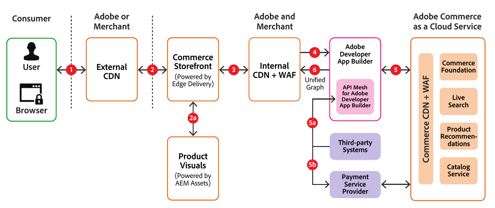

# Arquitetura de segurança e fluxo de dados

O exemplo a seguir ilustra como os dados normalmente fluem em [!DNL Adobe Commerce as a Cloud Service]:

## Narrativa do fluxo de dados

**Etapa 1**: o comprador digita a URL da vitrine do comerciante em seu navegador, que envia a URL para a Rede de Entrega de Conteúdo (CDN Externa) da Commerce Storefront.

**Etapa 2**: se a URL do site estiver armazenada em cache, o CDN da Loja a retornará ao comprador. Se ainda não estiver em cache, o que pode ocorrer se essa for a primeira solicitação de um recurso, o CDN externo encaminhará a solicitação do comprador para o CDN interno e armazenará a resposta em cache para solicitações subsequentes.

**Etapa 2a**: se a solicitação for para imagens ou vídeos, ela será enviada para [!DNL Product Visuals] para conclusão e retornada à loja.

**Etapa 3**: se a URL do site for armazenada em cache no CDN interno, ela será retornada desse cache. Caso contrário, será enviado para [!DNL API Mesh] e a resposta será armazenada em cache para as solicitações subsequentes.

**Etapa 4**: [!DNL API Mesh] atua como a camada de orquestração e determina se a solicitação deve ser enviada para [!DNL Adobe Commerce as a Cloud Service] ou para um sistema de terceiros para atender à solicitação.

>[!NOTE]
>
>O [!DNL API Mesh] só enviará solicitações para sistemas de terceiros se você tiver personalizado a configuração de malha para fazer isso.

**Etapa 5**: as solicitações enviadas a [!DNL Adobe Commerce as a Cloud Service] passam por um WAF (Firewall de Aplicativo Web) que bloqueia solicitações suspeitas ou mal-intencionadas. Se a URL solicitada estiver armazenada em cache no CDN [!DNL Commerce], ela será entregue a partir desse cache. Se não estiver em cache, ele será retornado de um ou mais microsserviços do [!DNL Adobe Commerce as a Cloud Service] (por exemplo, foundation, search e recommendations) e, em seguida, armazenado em cache para solicitações futuras.

**Etapa 5a**: se a solicitação for enviada para um sistema de terceiros, a resposta será retornada para [!DNL API Mesh].

**Etapa 5b**: se a solicitação for para processamento de pagamento, o provedor de serviço de pagamento renderizará um iframe na vitrine para que o comprador insira com segurança as informações do cartão de crédito e conclua a transação de pagamento.

**Etapa 6**: depois que as respostas do [!DNL Adobe Commerce as a Cloud Service] ou de serviços de terceiros forem recebidas por [!DNL API Mesh], elas serão agrupadas em um gráfico unificado e retornadas ao [!DNL Commerce Storefront] para atender à solicitação do comprador.
