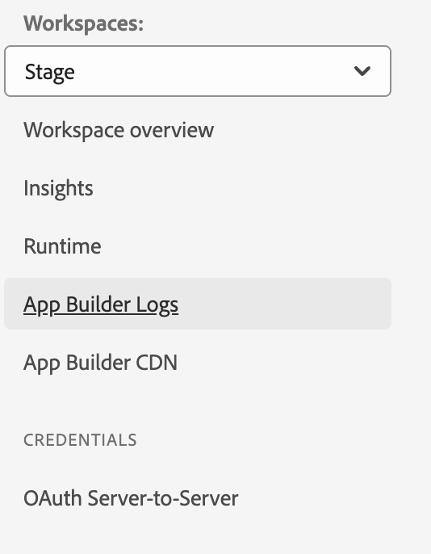
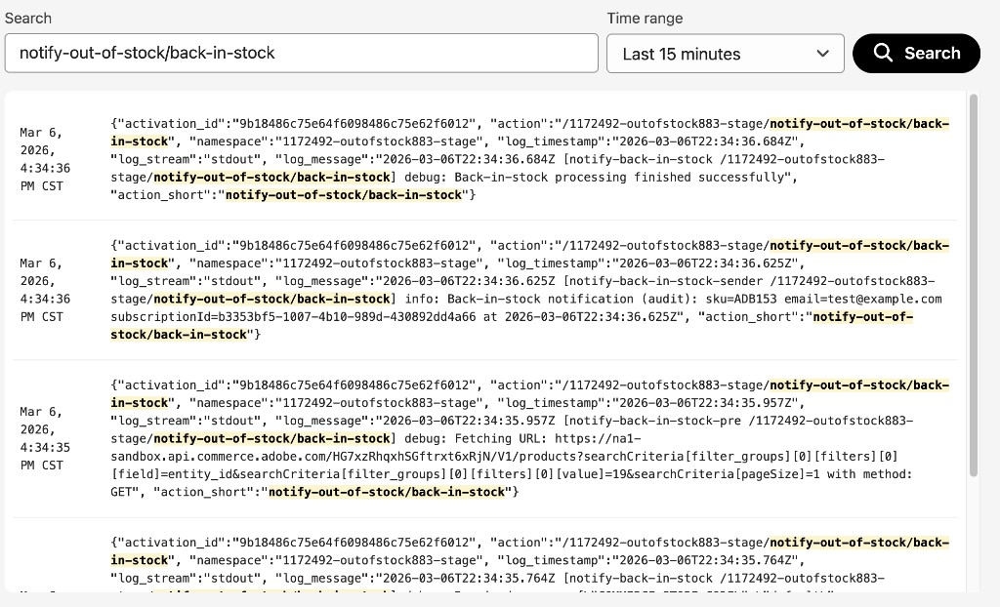
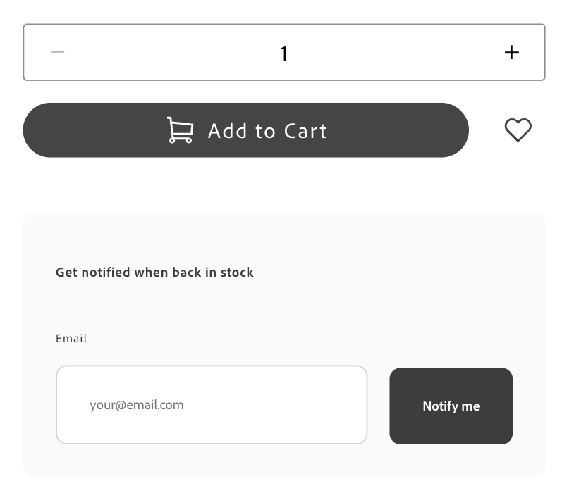

# Tutorial de extensão de notificação no estoque

Este tutorial o orienta por meio da criação de uma extensão de notificação no estoque para [!DNL Adobe Commerce as a Cloud Service] usando o [!DNL Adobe App Builder] e as ferramentas de desenvolvimento assistido por IA. A extensão permite que os compradores assinem produtos indisponíveis e recebam uma notificação quando o produto estiver de volta ao estoque.

Você constrói duas partes:

- **Extensão do App Builder** — uma API REST para gerenciar assinaturas indisponíveis (criar, ler, excluir) com detecção de retorno no estoque agendada e orientada por eventos.
- **Integração com a Loja** — Um formulário de assinatura na PDP (página de detalhes do produto) que aparece somente quando o produto ou variante selecionado está esgotado.

>[!NOTE]
>
>Os agentes de IA são não determinísticos. Os prompts, as perguntas e as saídas deste tutorial são exemplos. Seu agente pode produzir diferentes perguntas, requisitos ou propostas de arquitetura. Use os exemplos deste tutorial para orientar o agente em direção a um resultado semelhante.

Antes de começar, conclua os [pré-requisitos](./tutorial-prerequisites.md). Este tutorial usa o **kit inicial de integração**. Verifique se você já a clonou e concluiu as etapas de configuração descritas na página de pré-requisitos.

## Verificar pré-requisitos

Verifique se os seguintes pré-requisitos estão instalados:

```bash
# Check Node.js version (should be 22.x.x)
node --version

# Check npm version (should be 9.0.0 or higher)
npm --version

# Check Git installation
git --version

# Check Bash shell installation
bash --version
```

Se qualquer um dos comandos anteriores não retornar os resultados esperados, consulte os [pré-requisitos](./tutorial-prerequisites.md) para obter orientação.

Além disso, verifique o seguinte:

- Você tem uma instância [!DNL Adobe Commerce as a Cloud Service] com dados de produto. Consulte [Instâncias do Commerce Cloud Service](https://experienceleague.adobe.com/en/docs/commerce/cloud-service/overview){target="_blank"}.
- Você tem um projeto de vitrine conectado à sua instância [!DNL Commerce]. Se você não tiver uma, siga as etapas em [Criar uma vitrine](https://experienceleague.adobe.com/developer/commerce/storefront/get-started/create-storefront/){target="_blank"}.
- A CLI do `aem` está instalada:

  ```bash
  npm install -g @adobe/aem-cli
  ```

## Desenvolvimento de extensão

Esta seção orienta você no desenvolvimento de uma extensão de notificação em estoque para [!DNL Adobe Commerce as a Cloud Service] usando ferramentas de desenvolvimento assistido por IA. A extensão fornece uma API REST para gerenciamento de assinatura e detecta quando os produtos voltam ao estoque por meio de eventos do Commerce e uma verificação agendada.

1. Navegue até as configurações de MCP no seu agente de codificação.

   Por exemplo, no Cursor, vá para **[!UICONTROL Cursor]** > **[!UICONTROL Settings]** > **[!UICONTROL Cursor Settings]** > **[!UICONTROL Tools & MCP]**. Verifique se o conjunto de ferramentas `commerce-extensibility` está habilitado sem erros. Se você vir erros, desligue e ligue o conjunto de ferramentas.

   >[!NOTE]
   >
   >Ao trabalhar com ferramentas de desenvolvimento assistidas por IA, espere variações naturais no código e nas respostas geradas pelo agente.
   >Se encontrar algum problema com seu código, peça ao agente para ajudá-lo a depurá-lo.

1. Se você tiver alguma documentação adicionada ao contexto do cursor, desative-a.

   Navegue até **[!UICONTROL Cursor]** > **[!UICONTROL Settings]** > **[!UICONTROL Cursor Settings]** > **[!UICONTROL Indexing & Docs]** e exclua qualquer documentação listada.

### Etapa 1: fornecer o prompt inicial

Solicitar que o agente de IA inicie a implementação. Dizer ao agente para parar e fazer perguntas ajuda a orientar a implementação antecipadamente.

Digite o seguinte prompt na janela de bate-papo do agente:

```shell-session
Implement an Adobe Commerce as a Cloud Service extension to handle out-of-stock notifications for products.

The service should provide REST API endpoints for basic create, read, update, and delete (CRUD) operations on out-of-stock notifications, allowing storefronts to manage notifications for specific product SKUs.

Back-in-stock is detected by an inventory or product event or a scheduled action that checks Commerce API and then calls the REST API to send the notification.

STOP and ask me any clarifying questions you have about the requirements before you do any work.
```

>[!TIP]
>
>Dizer ao agente para PARAR e fazer perguntas antes de continuar ajuda a orientar a implementação no início do processo. Esse processo garante que as principais suposições e os requisitos ausentes sejam identificados antecipadamente e seja necessário para iniciar o fluxo de trabalho guiado neste tutorial.

### Etapa 2: Responda às perguntas do agente

O agente retorna com uma série de perguntas necessárias antes de começar a formar uma solução. O exemplo a seguir mostra perguntas e respostas típicas. Seu agente pode fazer perguntas diferentes, mas os tópicos geralmente são os mesmos.

**Exemplo de perguntas sobre o agente:**

1. **API REST — host e consumidores** — a API REST CRUD deve fazer parte deste aplicativo App Builder (por exemplo, ações da Web no Adobe I/O Runtime) que armazena chamadas? Quem o chamará (loja EDS, loja personalizada/headless ou ambas)? Você precisa do CORS, de acesso público (não autenticado) ou os chamadores usarão chaves de API, tokens OAuth ou Commerce?
1. **Modelo de dados** — O que uma &quot;notificação&quot; deve representar? Identificador do cliente (somente email ou também ID do cliente)? Identificador de produto (somente SKU ou SKU + exibição de loja)? O mesmo cliente pode assinar o mesmo SKU várias vezes ou as assinaturas devem ser desduplicadas?
1. **Detecção de volta ao estoque — evento versus agendado** — Deseja detecção orientada por evento (reage a um evento de inventário/produto da Commerce), detecção agendada (uma ação agendada que verifica periodicamente o estoque) ou ambos? O que deve significar &quot;enviar a notificação&quot; (chamar um webhook externo, enviar email ou registrá-lo)?
1. **Back-in-stock — Commerce source** — Você tem um nome de evento preferido ou o design deve usar qualquer evento de inventário/atualizado de estoque que a Commerce fornecer? Para verificações agendadas, qual API deve ser usada para obter o status do estoque por SKU?
1. **Persistência e multilocação** — `aio-lib-state` é o local certo para persistir assinaturas ou você tem um armazenamento externo? O design deve assumir vários locatários ou um único locatário?
1. **Semântica e ciclo de vida da CRUD** — &quot;excluir&quot; deve significar cancelar a assinatura? Você precisa de &quot;atualizar&quot;? Após o envio de uma notificação de devolução ao estoque, a assinatura deve ser removida automaticamente ou marcada como notificada?
1. **Não funcional** — Há limites de taxa ou assinaturas máximas a serem impostos? Alguma necessidade de conformidade (aceitação dupla, sinalizador de consentimento)?

**Exemplo de respostas:**

```shell-session
1. The CRUD REST API should be part of thie App Builder app. It will be called by the EDS Storefront. For this implementation there is no need for API keys or security tokens.
2. For this initial implementation the customer identifier will be the email, product is identified by SKU, customer emails should not be able to subscribe to the same SKU multiple times.
3. Implement both. For now instead of sending the notification, log it so I can audit in the Adobe Developer Console.
4. Research and use what the best event to use that commerce already provides. Research the simplest way to get the stock status by SKU.
5. Use the aio-lib-state. Single tenant for now
6. Delete means cancel subscription. Skip Update, it does not apply for this service. After subscription is sent, it should be marked as notified or removed so it won't send again until the user subscribes again.
7. No limits. Implement minimal compliance requirements.
```

>[!NOTE]
>
>Seu agente pode fazer perguntas diferentes. Use essas respostas como orientação para direcionar o agente para o mesmo resultado funcional: uma API REST com assinaturas de email e SKU, detecção de retorno no estoque agendada e orientada por eventos, persistência de `aio-lib-state` e notificações baseadas em log.

### Etapa 3: analisar requisitos e arquitetura

O agente gera requisitos e documentos de arquitetura para que você os revise. Verifique se os requisitos correspondem às respostas fornecidas e se a arquitetura abrange:

- Uma ação da API REST para CRUD de assinatura (criar, ler, atualizar e excluir)
- Um manipulador de devolução ao estoque acionado por eventos de inventário do Commerce
- Uma ação de check-stock programada como um fallback
- Persistência usando `aio-lib-state`

>[!NOTE]
>
>Os agentes de IA são não determinísticos e seus comportamentos diferem dependendo do modelo e do IDE. Você pode obter um conjunto diferente de perguntas que produzem um conjunto diferente de requisitos e arquitetura. Se sim, tente orientar o agente em uma direção de modo que a implementação corresponda ao que é apresentado neste tutorial antes de continuar.

### Etapa 4: Selecionar um plano de implementação

O agente oferece a opção de criar um plano de implementação detalhado ou de concluir uma implementação direta.

- Se quiser um plano revisável que possa ser executado em fases com mais controle, selecione a primeira opção.
- Se desejar que o agente faça a implementação completa com intervenção mínima, selecione a segunda opção.

### Etapa 5: implantar, integrar e assinar eventos

Depois que o agente concluir a implementação, ele fornecerá as próximas etapas para implantar o aplicativo, integrar a instância do Commerce e assinar eventos usando os seguintes comandos:

1. Implante a extensão:

   ```bash
   aio app deploy
   ```

1. Execute o script de integração para registrar o provedor de eventos no Commerce:

   ```bash
   npm run onboard
   ```

1. Assinar eventos do Commerce:

   ```bash
   npm run commerce-event-subscribe
   ```

1. Valide a subscrição do evento.

   Navegue até a instância do Commerce e abra **[!UICONTROL System]** > **[!UICONTROL Event Subscriptions]**.

   Você deve ver uma tabela de registros de eventos.

   {width="600" zoomable="yes"}

   {width="600" zoomable="yes"}

### Etapa 6: testar a extensão

Solicite ao agente que forneça etapas de teste. Como esse é um serviço de API, você pode solicitar instruções de linha de comando:

```shell-session
Give me step by step instructions to test the API service from the command line.
```

Siga as etapas fornecidas pelo agente. Os exemplos a seguir mostram comandos de teste típicos.

**Assinar uma SKU:**

```bash
API_URL="https://<your-runtime-url>/api/v1/web/notify-out-of-stock/api"; curl -X POST "$API_URL" \
  -H "Content-Type: application/json" \
  -d '{"email":"test@example.com","sku":"ADB153"}'
```

A resposta é semelhante a:

```json
{
  "createdAt": "2026-03-06T22:11:00.308Z",
  "email": "test@example.com",
  "id": "b3353bf5-1007-4b10-989d-430892dd4a66",
  "sku": "ADB153"
}
```

**Listar todas as assinaturas:**

```bash
curl -X GET "$API_URL"
```

A resposta retorna uma lista de todas as assinaturas ativas:

```json
{
  "subscriptions": [
    {
      "createdAt": "2026-03-06T22:11:00.308Z",
      "email": "test@example.com",
      "id": "b3353bf5-1007-4b10-989d-430892dd4a66",
      "sku": "ADB153"
    }
  ]
}
```

**Testar o fluxo de back-in-stock:**

1. Na instância do Commerce, edite um produto para o qual você criou uma assinatura.
1. Defina o status do estoque do produto para **[!UICONTROL Out of Stock]**.
1. Aguarde cerca de um minuto e alterne o status do estoque para **[!UICONTROL In Stock]**.

   {width="600" zoomable="yes"}

1. Aguarde cerca de cinco minutos para o evento ser acionado e enviado ao serviço.

1. No [!DNL Adobe Developer Console], navegue até a seção Logs do App Builder.

   {width="600" zoomable="yes"}

1. Nos logs, verifique se há entradas que confirmam que o evento foi processado e se o par de assinaturas email-SKU correto foi identificado.

   {width="600" zoomable="yes"}

>[!TIP]
>
>Você pode perguntar ao agente o que procurar nos registros para verificar se a ação de notificação foi registrada com êxito. Você também pode copiar e colar as entradas de registro para que o agente faça a verificação.

Após os processos do evento de retorno ao estoque, a solicitação da lista de assinaturas deve retornar uma entrada a menos, pois a assinatura notificada é removida.

### Criar o contrato de serviço

Agora que a implementação do serviço foi concluída, peça ao agente para criar um contrato de serviço para o trabalho da loja:

```shell-session
Create an API service contract for the Out of Stock notification service and its endpoints. Ensure that the service contract is clear and detailed enough for a frontend developer to implement the storefront UI integration without needing to ask additional questions about the API. Name this file OUT_OF_STOCK_NOTIFICATION_CONTRACT.md
```

Copie esse arquivo no projeto da loja para que o agente da loja possa referenciá-lo.

## Conectar à loja

Esta seção orienta você na implementação da parte da loja da extensão de notificação em estoque usando o [!DNL Edge Delivery Services] e as ferramentas de desenvolvimento assistido por IA. Você adiciona um formulário de assinatura à PDP (página de detalhes do produto) que é exibido somente quando o produto ou a variante selecionada está esgotado.

>[!NOTE]
>
>Os prompts fornecidos são pontos de partida. Embora você possa usá-los sem modificação, considere ter uma conversa natural com o agente.
>
>Ao trabalhar com ferramentas de desenvolvimento assistido por IA, há sempre variações naturais no código e nas respostas geradas pelo agente.
>
>Se encontrar algum problema com seu código, peça ao agente para ajudá-lo a depurá-lo.

### Pré-requisitos da loja

Antes de iniciar a integração da loja, verifique se você tem o seguinte:

- Um projeto de vitrine conectado à sua instância [!DNL Commerce]
- Ferramentas de IA da vitrine do Commerce [instaladas usando a CLI](./tutorial-prerequisites.md#install-the-storefront-ai-tools)
- O arquivo `OUT_OF_STOCK_NOTIFICATION_CONTRACT.md` copiado para o projeto da loja

### Etapa 1: Validar o ambiente

Abra o arquivo `config.json` e verifique se os valores de `commerce-core-endpoint` e `commerce-endpoint` apontam para o ponto de extremidade do GraphQL [!DNL Adobe Commerce as a Cloud Service].

```json
"commerce-core-endpoint": "https://na1-sandbox.api.commerce.adobe.com/<your-instance-id>/graphql",
"commerce-endpoint": "https://na1-sandbox.api.commerce.adobe.com/<your-instance-id>/graphql",
```

### Etapa 2: fornecer o prompt inicial

Com o contrato de serviço já em seu projeto, solicite que o agente crie a interface do usuário na página de detalhes do produto. Use o modo **Plano**, se disponível em seu agente, para impedir que o agente continue sem um plano.

```shell-session
Analyze @OUT_OF_STOCK_NOTIFICATION_CONTRACT.md. Add a form for subscribing to a notification for when a product is back in stock. Place this form on the product details page, underneath the add to cart and wishlist button. The form only displays when a product is out of stock. 

Use the project manager skill to plan this implementation.
```

>[!TIP]
>
>Especificamente, solicitar o uso da habilidade do gerente de projeto aciona o fluxo de trabalho em fases que ajuda a orientar a implementação no início do processo. Esse processo garante que as principais suposições e os requisitos ausentes sejam identificados com antecedência e oferece ao agente a oportunidade de apresentar detalhes e requisitos que talvez você não tenha pensado em fornecer no prompt original.

### Etapa 3: Responda às perguntas de planejamento

O agente retorna com uma série de perguntas que precisa responder antes de começar a formar uma solução. O exemplo a seguir mostra perguntas e respostas típicas. Seu agente pode fazer perguntas diferentes, mas os tópicos geralmente são os mesmos.

**Exemplo de perguntas sobre o agente:**

1. **URL base da API** — Como a vitrine deve obter o URL base da API de notificação de indisponibilidade? As opções podem incluir um bloco de configuração (por exemplo, uma tabela com `out-of-stock-api-base-url`), espaços reservados globais ou variáveis de ambiente, ou outra abordagem.
1. **Cópia** — A implementação deve usar espaços reservados para mensagens de erro e sucesso (por exemplo, para localização), ou usar inglês estático para esta implementação?
1. **Depois de assinar com êxito** — O formulário deve ocultar e mostrar apenas &quot;Você assinou&quot; (A), manter o formulário visível, mas desabilitado com uma mensagem de êxito acima dele (B) ou outro comportamento (C)?
1. **Produtos configuráveis** — A visibilidade do formulário deve ser baseada no valor `inStock` da variante selecionada, para que o formulário mostre quando a variante escolhida estiver indisponível?

**Exemplo de respostas:**

```shell-session
1. Global placeholder with baseurl value of `https://<your-runtime-url>/api/v1/web/notify-out-of-stock/api`
2. Use placeholders with static English fallback
3. B
4. Use selected variant's inStock value
```

>[!NOTE]
>
>Substitua `<your-runtime-url>` pela URL [!DNL Adobe I/O Runtime] real da sua implantação do App Builder.
>
>Seu agente pode fazer perguntas diferentes. Use essas respostas como orientação:
>
>- Use um espaço reservado global para o URL de base da API para que ele possa ser alterado sem modificações de código.
>- Use espaços reservados para uma cópia voltada para o usuário com inglês estático como fallback.
>- Após uma assinatura bem-sucedida, mantenha o formulário visível, mas desabilitado, com uma mensagem de sucesso acima dele.
>- Para produtos configuráveis, use o valor `inStock` da variante selecionada para controlar a visibilidade do formulário.

### Etapa 4: analisar requisitos e arquitetura

O agente atualiza o documento de requisitos para que você o revise. Verifique se:

- O formulário é exibido somente quando o produto ou a variante selecionada está esgotado.
- O formulário é colocado abaixo dos botões de adição ao carrinho e lista de desejos no PDP.
- A integração da API usa o URL de base de um espaço reservado global.
- Os estados de sucesso e erro são tratados de acordo com o contrato (201, 409, 400, 503/500).

>[!NOTE]
>
>Os agentes de IA são não determinísticos e seus comportamentos diferem dependendo do modelo e do IDE. Você pode obter um conjunto diferente de perguntas que produzem um conjunto diferente de requisitos e arquitetura. Se sim, tente orientar o agente em uma direção de modo que a implementação corresponda ao que é apresentado neste tutorial antes de continuar.

Durante a **Fase 2 (Planejamento de Arquitetura)**, o agente pesquisa a documentação e a base de código antes de propor uma arquitetura. Espere que o agente:

- Pesquise na documentação do [!DNL Commerce] os contêineres de entrada suspensa de PDP, slots e cargas de evento.
- Procure código existente relacionado a PDP no diretório `blocks` e na pasta `scripts/initializers/`.
- Explore definições de TypeScript para contêineres disponíveis e formas de contexto de slot.

Em seguida, o agente apresenta as opções de arquitetura. Revise o plano e instrua o agente a continuar.

### Etapa 5: Selecionar um plano de implementação

O agente oferece a opção de criar um plano de implementação detalhado ou de concluir uma implementação direta.

- Se quiser um plano revisável que possa ser executado em fases com mais controle, selecione a primeira opção.
- Se desejar que o agente faça a implementação completa com intervenção mínima, selecione a segunda opção.

Durante a **Fase 4 (Implementação)**, o agente gera código com base na arquitetura escolhida. Dependendo da abordagem, o agente usa várias habilidades especializadas:

- **Modelagem de conteúdo:** Se um novo bloco for necessário, o agente criará uma estrutura de conteúdo amigável para o autor.
- **Desenvolvimento de bloco:** o agente cria arquivos de bloco seguindo [!DNL Edge Delivery Services] convenções, incluindo funções de decoração de JavaScript, estilos CSS com escopo, rótulos ARIA para acessibilidade, carregamento e tratamento de estado de erro.
- **Personalização de inclusão:** se a arquitetura usar personalização de slots, o agente importará o contêiner correto, usará um slot verificado próximo ao título do produto e se inscreverá nos eventos de dados do produto para a SKU atual.

Observe o código que está sendo gerado e faça perguntas ou redirecione o agente, conforme necessário.

### Etapa 6: iniciar o servidor e testar

Depois que o agente concluir a implementação, inicie o servidor de desenvolvimento e teste o formulário.

1. Iniciar o servidor de desenvolvimento local:

   ```bash
   npm run start
   ```

1. Em um navegador, navegue até uma página de produto indisponível. Por exemplo:

   ```shell-session
   http://localhost:3000/products/<out-of-stock-product-slug>/<sku>
   ```

1. Verifique se o formulário de subscrição é exibido abaixo dos botões add-to-cart e wishlist.

Você pode fazer testes manuais ou solicitar que o agente use os recursos do navegador para testar:

```shell-session
Run complete browser testing. Use the following out of stock product 'http://localhost:3000/products/<out-of-stock-product-slug>/<sku>'
```

{width="600" zoomable="yes"}

### Etapa 7: limpar

Após ignorar ou concluir o teste, o agente solicitará que você prossiga para a fase final de **Limpeza**. Após a confirmação, o agente arquiva todos os artefatos de documentação criados durante a implementação.

## Solução de problemas

Use as seguintes dicas se encontrar problemas durante o tutorial:

- **Erros de API:** Use a CLI para enviar solicitações à API diretamente para verificar comportamentos. Por exemplo, use `curl` para testar cada ponto de extremidade independentemente.
- **Erros do agente:** Copie e cole mensagens de erro em uma sessão de chat do agente para ajudá-lo a depurar problemas. O agente pode diagnosticar problemas comuns, como variáveis de ambiente ausentes ou ações mal configuradas.
- **Pipeline de evento:** se os eventos de entrada em estoque não dispararem, verifique se você concluiu as etapas de integração e assinatura do evento. Verifique se `workspace.json` está no local correto e se o módulo Eventos da Commerce está habilitado.
- **Carga de status do estoque:** o Commerce pode enviar `is_in_stock` como uma cadeia de caracteres (`"1"`) em vez de um booleano (`true`). Se o manipulador back-in-stock não estiver acionando, peça ao agente para verificar o código do consumidor para comparações de tipo estritas e atualizá-lo para lidar com ambos os formatos.

## Resumo do tutorial

Este é um resumo dos tópicos abordados neste tutorial:

- **Desenvolvimento de extensão:** descrevendo nova funcionalidade para um agente de IA e gerando uma API REST funcional com operações CRUD usando [!DNL App Builder].
- **Arquitetura orientada por eventos**: configuração de eventos do Commerce e uma ação agendada para detectar quando os produtos voltarem ao estoque.
- **Implantação e teste locais:** Teste da API com `curl` e implantação usando o [!DNL Adobe I/O CLI].
- **Contratos de serviço:** criando contratos de API que conectam extensões de back-end e implementações de vitrine.
- **Integração de vitrine em fases:** Trabalhando com requisitos, arquitetura e implementação usando habilidades assistidas por IA.
- **Integração de entrega:** Adicionando um formulário de assinatura ao PDP usando contêineres e slots de entrega [!DNL Adobe Commerce].

## Próximas etapas

Use as seguintes sugestões para estender o serviço de notificação em estoque:

- **Enviar notificações reais:** Substitua a notificação baseada em log por um serviço de email como [!DNL Adobe Campaign] ou um provedor terceirizado.
- **Adicionar uma página de gerenciamento de assinatura:** Crie uma página de vitrine onde os compradores possam exibir e cancelar suas assinaturas ativas.
- **Suporte a implantações com vários locatários:** estenda o gerenciamento de estado para oferecer suporte a vários locatários do Commerce em um único aplicativo App Builder.
- **Adicionar limitação de taxa:** Implemente limites de taxa na API de assinatura para evitar abuso.
