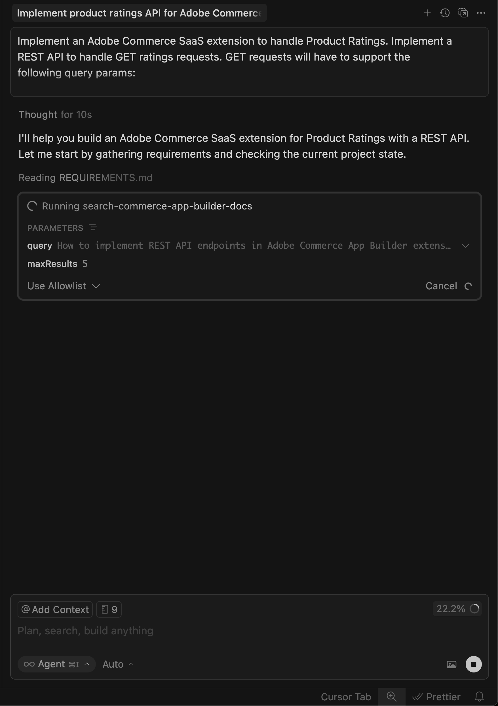
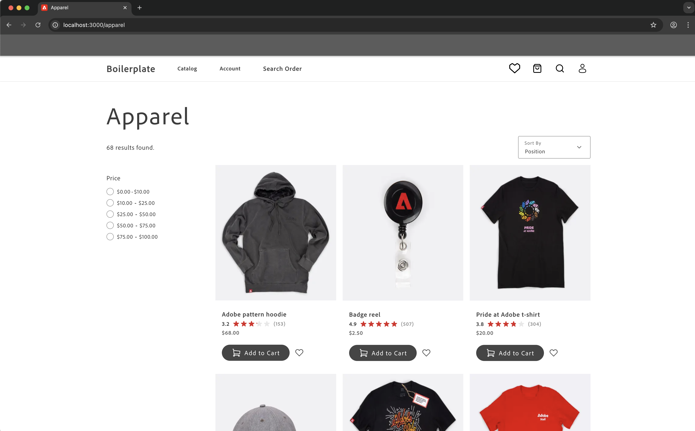

# Tutorial da extensão de classificações

Este tutorial o orienta por meio da criação de uma extensão de classificações de produto para o [!DNL Adobe Commerce as a Cloud Service] usando o [!DNL Adobe App Builder] e ferramentas de desenvolvimento assistido por IA.

Antes de começar, conclua os [pré-requisitos](./tutorial-prerequisites.md).

## Verificar pré-requisitos

Verifique se os seguintes pré-requisitos estão instalados:

```bash
# Check Node.js version (should be 22.x.x)
node --version

# Check npm version (should be 9.0.0 or higher)
npm --version

# Check Git installation
git --version

# Check Bash shell installation
bash --version
```

Se qualquer um dos comandos anteriores não retornar os resultados esperados, consulte os [pré-requisitos](./tutorial-prerequisites.md) para obter orientação.

## Desenvolvimento de extensão

Esta seção orienta você no desenvolvimento de uma extensão de classificações para o Adobe Commerce as a Cloud Service usando ferramentas de desenvolvimento assistido por IA.

1. Navegue até **[!UICONTROL Cursor]** > **[!UICONTROL Settings]** > **[!UICONTROL Cursor Settings]** > **[!UICONTROL Tools & MCP]** e verifique se o conjunto de ferramentas `commerce-extensibility` está habilitado sem erros. Se você vir erros, desligue e ligue o conjunto de ferramentas.

   {width="600" zoomable="yes"}

   >[!NOTE]
   >
   >Ao trabalhar com ferramentas de desenvolvimento assistidas por IA, espere variações naturais no código e nas respostas geradas pelo agente.
   >Se encontrar problemas com o código, você sempre poderá pedir ao agente para ajudá-lo a depurá-lo.

1. Desative qualquer documentação no contexto do cursor:

   * Navegue até **[!UICONTROL Cursor]** > **[!UICONTROL Settings]** > **[!UICONTROL Cursor Settings]** > **[!UICONTROL Indexing & Docs]** e exclua qualquer documentação listada.

   {width="600" zoomable="yes"}

1. Gerar código para uma extensão de classificações de produto:
   * Na janela Cursor chat, selecione o modo **[!UICONTROL Agent]**.
   * Digite o seguinte prompt:

   ```shell-session
   Implement an Adobe Commerce as a Cloud Service extension to handle Product Ratings.
   
   Implement a REST API to handle GET ratings requests.
   
   GET requests will have to support the following query parameters:
   
   sku -> product SKU
   ```

   >[!NOTE]
   >
   >Se o agente solicitar a pesquisa na documentação, permita.

1. Responda às perguntas do agente com precisão para ajudá-lo a gerar o melhor código.

   {width="600" zoomable="yes"}

   {width="600" zoomable="yes"}

1. Use o seguinte texto de exemplo para responder às perguntas do agente para configurar dados de classificações aleatórias:

   ```shell-session
   Yes, this headless extension is for Adobe Commerce as a Cloud Service storefront,
   but we do not need any authentication for the GET API because guest users should be able to use it on the storefront.
   
   This extension is called directly from the storefront, no async invocation, such as events or webhooks, is required.
   
   Start with just the GET API for now, we will implement other CRUD operations at a later time.
   
   We do not need a DB or storage mechanism right now, just return random ratings data between 1 and 5 and a ratings count between 1 and 1000.
   
   The API should only return the average rating for the product and the total number of ratings.
   We do not need to add tests right now.
   ```

   O agente cria um arquivo `requirements.md` que serve como a fonte da verdade para a implementação.

   {width="600" zoomable="yes"}

1. Revise o arquivo `requirements.md` e verifique o plano.

   Se tudo estiver correto, instrua o agente a migrar para a **Fase 2 - Planejamento de Arquitetura**.

1. Revise o plano de arquitetura.

1. Instrua o agente a prosseguir com a geração de código.

   O agente gera o código necessário e fornece um resumo detalhado com as próximas etapas.

   {width="600" zoomable="yes"}

   {width="600" zoomable="yes"}

   {width="600" zoomable="yes"}

### Testar a extensão localmente

As etapas a seguir abordam como verificar se a extensão funciona antes de implantá-la.

1. Peça ao agente para ajudá-lo a testar o código localmente.

   ```shell-session
   Test the ratings API locally on a dev server using cURL.
   ```

1. Siga as instruções do agente e confirme se a API está funcionando localmente.

   {width="600" zoomable="yes"}

   {width="600" zoomable="yes"}

### Implantar a extensão

Implante a extensão para [!DNL Adobe I/O Runtime] usando o agente.

1. Depois de verificar o código gerado, implante a extensão usando o seguinte prompt:

   ```shell-session
   Deploy the ratings API.
   ```

   O agente realiza uma avaliação de prontidão antes da implantação.

   {width="600" zoomable="yes"}

1. Quando estiver confiante nos resultados da avaliação, instrua o agente a prosseguir com a implantação.

   O agente usa o kit de ferramentas MCP para verificar, compilar e implantar automaticamente.

   {width="600" zoomable="yes"}

### Verificar a implantação

Teste a API antes de integrá-la à loja. O agente deve fornecer o local da nova ação e uma estratégia de teste.

{width="600" zoomable="yes"}

Também é possível testar a API manualmente usando o cURL em um terminal:

```bash
curl -s "https://<your-site>.adobeioruntime.net/api/v1/web/ratings/ratings?sku=TEST-SKU-123"
```

{width="600" zoomable="yes"}

### Integrar ao Edge Delivery Services

Para integrar a API de classificações a uma loja [!DNL Adobe Commerce] da plataforma [!DNL Edge Delivery Services], peça ao agente que crie um contrato de serviço com requisitos para a API de classificação:

```shell-session
Create a service contract for the ratings api that I can pass on to the storefront agent. Name it RATINGS_API_CONTRACT.md
```

{width="600" zoomable="yes"}

{width="600" zoomable="yes"}

Retorne ao terminal e execute o seguinte comando na pasta `extension` para copiar o arquivo de contrato para a pasta `storefront`:

```bash
cp RATINGS_API_CONTRACT.md ../storefront
```

## Conectar à loja

Esta seção orienta você na implementação da parte da loja da extensão de classificações usando o [!DNL Edge Delivery Services] e as ferramentas de desenvolvimento assistido por IA.

>[!NOTE]
>
>Os prompts fornecidos são pontos de partida. Embora você possa usá-los sem modificação, considere ter uma conversa natural com o agente.
>
>Ao trabalhar com ferramentas de desenvolvimento assistido por IA, há sempre variações naturais no código e nas respostas geradas pelo agente.
>
>Se encontrar algum problema com seu código, peça ao agente para ajudá-lo a depurá-lo.

### Pré-requisitos da loja

Antes de iniciar a integração da loja, verifique se você tem o seguinte:

* Um projeto de vitrine conectado à sua instância [!DNL Commerce]
* Ferramentas de IA da vitrine do Commerce [instaladas usando a CLI](./tutorial-prerequisites.md#install-the-storefront-ai-tools)

### Configurar o espaço de trabalho da loja

Prepare o ambiente da loja local para desenvolvimento.

1. Navegue até a pasta `storefront`:

   ```bash
   cd storefront
   ```

1. Abra a pasta de vitrine em uma nova janela Cursor.

   Como alternativa, se você tiver a [CLI do Cursor](https://cursor.com/docs/configuration/shell#installing-cli-commands) instalada, abra a janela usando o seguinte comando no terminal:

   ```bash
   cursor .
   ```

1. Iniciar o servidor de desenvolvimento local:

   ```bash
   npm run start
   ```

1. Em um navegador, navegue até uma página de produto:

   ```shell-session
   http://localhost:3000/products/llama-plush-shortie/adb336
   ```

1. Observe a página de detalhes do produto (PDP) da vitrine padronizada e observe a falta de classificações visuais do produto.

### Integrar a API de classificações

Use o agente para integrar a API de classificações na página de detalhes do produto da loja.

1. Use o seguinte prompt com seu agente:

   ```shell-session
   Integrate the ratings API into the PDP to show star ratings and a review count for products. Here's the service contract: @RATINGS_API_CONTRACT.md
   ```

1. O agente avalia a complexidade da tarefa e invoca um fluxo de trabalho em fases. Durante a **Fase 1 (Coleta de Requisitos)**, o agente cria um documento de requisitos e faz perguntas esclarecedoras como:

   * Onde as classificações devem aparecer no PDP?
   * Deve ser um novo bloco autônomo ou uma personalização de slot dentro do componente PDP existente suspenso?
   * Qual deve ser o fallback se a API não estiver disponível ou não retornar dados?
   * As classificações também devem aparecer na PLP (lista de produtos) ou somente no PDP?
   * Existem especificações ou modelos de design?

   Responda a essas perguntas com base nos requisitos do projeto. O agente atualiza o documento de requisitos e marca a fase como concluída.

1. Durante a **Fase 2 (Planejamento de Arquitetura)**, o agente pesquisa a documentação e a base de código antes de propor uma arquitetura. Espere que o agente:

   * Pesquise na documentação do [!DNL Commerce] os contêineres de entrada suspensa de PDP, slots e cargas de evento.
   * Procure código existente relacionado a PDP no diretório `blocks` e na pasta `scripts/initializers/`.
   * Explore definições de TypeScript para contêineres disponíveis e formas de contexto de slot.

   O agente apresenta opções de arquitetura como:

   * **Opção A:** Personalize um slot PDP existente para inserir classificações próximas ao título do produto — um toque mais leve e fácil de atualizar.
   * **Opção B:** Crie um novo bloco `product-ratings` autônomo que obtenha da API independentemente — mais flexível e dissociado.
   * **Opção C:** Crie um novo bloco que também escute eventos de entrega PDP para o SKU do produto — uma abordagem híbrida.

   O plano também inclui detalhes sobre a integração da API, considerações de desempenho (carregamento lento, armazenamento em cache), segurança (limpeza de entrada) e uma abordagem de teste.

   Revise o plano de arquitetura e instrua o agente a continuar.

1. Durante a **Fase 3 (Abordagem de implementação)**, o agente solicita que você escolha entre:

   * **Opção A:** Examine um plano de implementação detalhado antes da geração de código (veja primeiro todos os arquivos, padrões e estrutura de código).
   * **Opção B:** Prossiga diretamente para a geração de código.

   Selecione a abordagem de sua preferência.

1. Durante a **Fase 4 (Implementação)**, o agente gera código com base na arquitetura escolhida. Dependendo da abordagem, o agente usa várias habilidades especializadas:

   * **Modelagem de conteúdo:** Se um novo bloco for necessário, o agente criará uma estrutura de conteúdo amigável para o autor, como uma tabela de configuração com a URL do ponto de extremidade da API.
   * **Desenvolvimento de bloco:** o agente cria arquivos de bloco seguindo [!DNL Edge Delivery Services] convenções, incluindo funções de decoração de JavaScript, estilos CSS com escopo, rótulos ARIA para acessibilidade, carregamento e tratamento de estado de erro.
   * **Personalização de inclusão:** se a arquitetura usar personalização de slots, o agente importará o contêiner correto, usará um slot verificado próximo ao título do produto e se inscreverá nos eventos de dados do produto para a SKU atual.

   Observe o código que está sendo gerado e faça perguntas ou redirecione o agente, conforme necessário. O agente produz um resumo de prontidão de produção quando a geração do código é concluída.

1. Durante a **Fase 4.5 (Teste)**, o agente se oferece para testar a implementação. Se você aceitar, o agente:

   * Cria uma página de teste local com os scripts e estilos adequados.
   * Inicia um servidor de desenvolvimento.
   * Executa verificação baseada em navegador para renderização visual, interatividade, comportamento responsivo, acessibilidade e desempenho.
   * Gera um relatório de teste estruturado com os resultados.

   Siga o procedimento no navegador para confirmar o comportamento e relatar qualquer problema.

1. Observe as alterações na base de código e observe as atualizações na página do produto.

   Você deve ver as seguintes alterações no ambiente de desenvolvimento e no navegador:

   * Um componente de classificação de produto é criado automaticamente.
   * O componente é integrado ao PDP usando [slots internos](https://experienceleague.adobe.com/developer/commerce/storefront/dropins/customize/slots?lang=pt-BR) ou como um bloco autônomo, dependendo da arquitetura escolhida.
   * As estrelas são exibidas com proporções de preenchimento apropriadas com base nos valores de classificação da sua API.

   {width="600" zoomable="yes"}

## Resumo do tutorial

Este é um resumo dos tópicos abordados neste tutorial:

* **Desenvolvimento de extensão** Aprendendo a descrever novas funcionalidades para um agente de IA e gerar uma API REST funcional usando [!DNL App Builder].
* **Implantação e teste locais:** Teste da API localmente e implantação com o kit de ferramentas MCP.
* **Contratos de serviço:** criando contratos de API que conectam extensões de back-end e implementações de vitrine.
* **Integração de vitrine em fases:** Trabalhando com requisitos, arquitetura e implementação usando habilidades assistidas por IA.
* **Integração de aceitação:** Trabalhando com [!DNL Adobe Commerce] contêineres e slots de aceitação.
* **Reusabilidade de componente:** criação de componentes compartilhados usados em vários blocos.

## Próximas etapas

Use as seguintes sugestões para personalizar sua extensão de classificações ou criar suas próprias modificações:

### Alterar as cores das estrelas

Use o seguinte prompt com seu agente:

```shell-session
Change the star fill color to red.
```

**Resultado esperado:**

As estrelas mudam para vermelho.

{width="600" zoomable="yes"}

### Adicionar um modal de distribuição de classificação

As etapas a seguir mostram como o agente lida com recursos complexos da interface do usuário com referências visuais.

1. **Antes de iniciar:** Salve a imagem de modelo a seguir e cole-a no chat com o agente da loja.

   {width="600" zoomable="yes"}

1. Siga estas etapas para criar o modal de distribuição de classificações usando a imagem de referência como guia:

   * Atualize a API para retornar dados adicionais que representem a distribuição de classificações.
   * Atualize o contrato de API.
   * Atualize o contrato na base de código de vitrine.
   * Peça ao agente da loja que use a imagem de referência e o contrato de API atualizado para adicionar a distribuição de classificações à página PDP.

1. Observe as seguintes alterações na base de código e observe as atualizações na página do produto:

   * Como o agente interpreta o modelo visual
   * Se ela usa a estrutura apropriada do HTML para acessibilidade
   * Como ele lida com os estados de posicionamento e interação

#### Solução de problemas no modal de distribuição

Se o modal não se comportar conforme esperado, tente o seguinte:

* Se o modal não for exibido, verifique se há erros no console do navegador.
* Se o posicionamento estiver desativado, peça ao agente para corrigi-lo usando o seguinte formato:

  ```shell-session
  adjust the modal position to be...
  ```

{width="600" zoomable="yes"}
