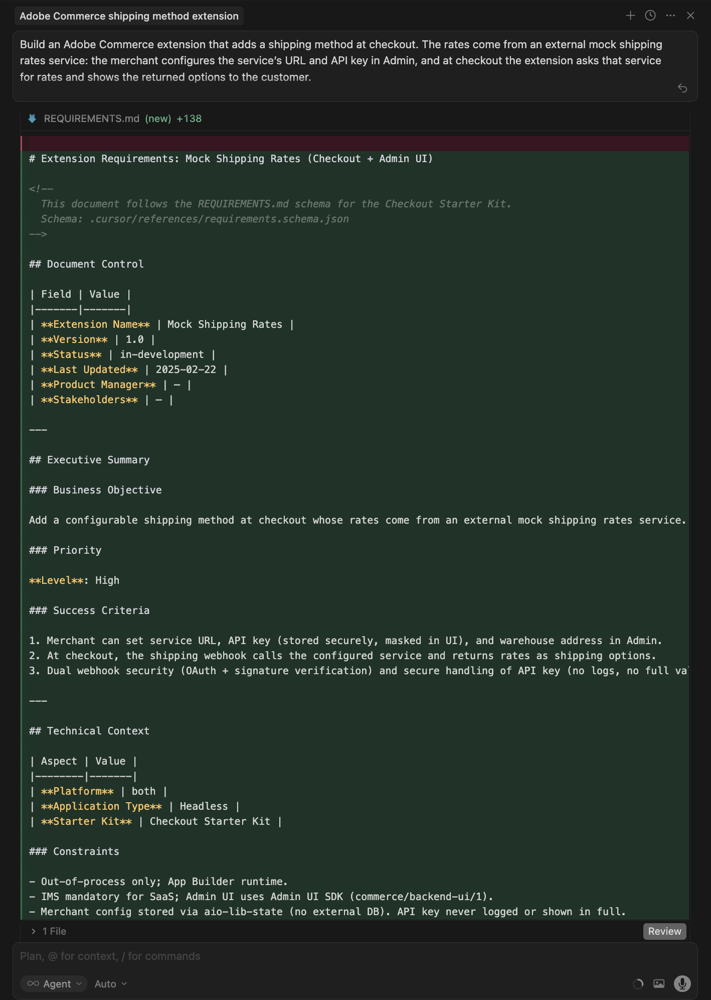
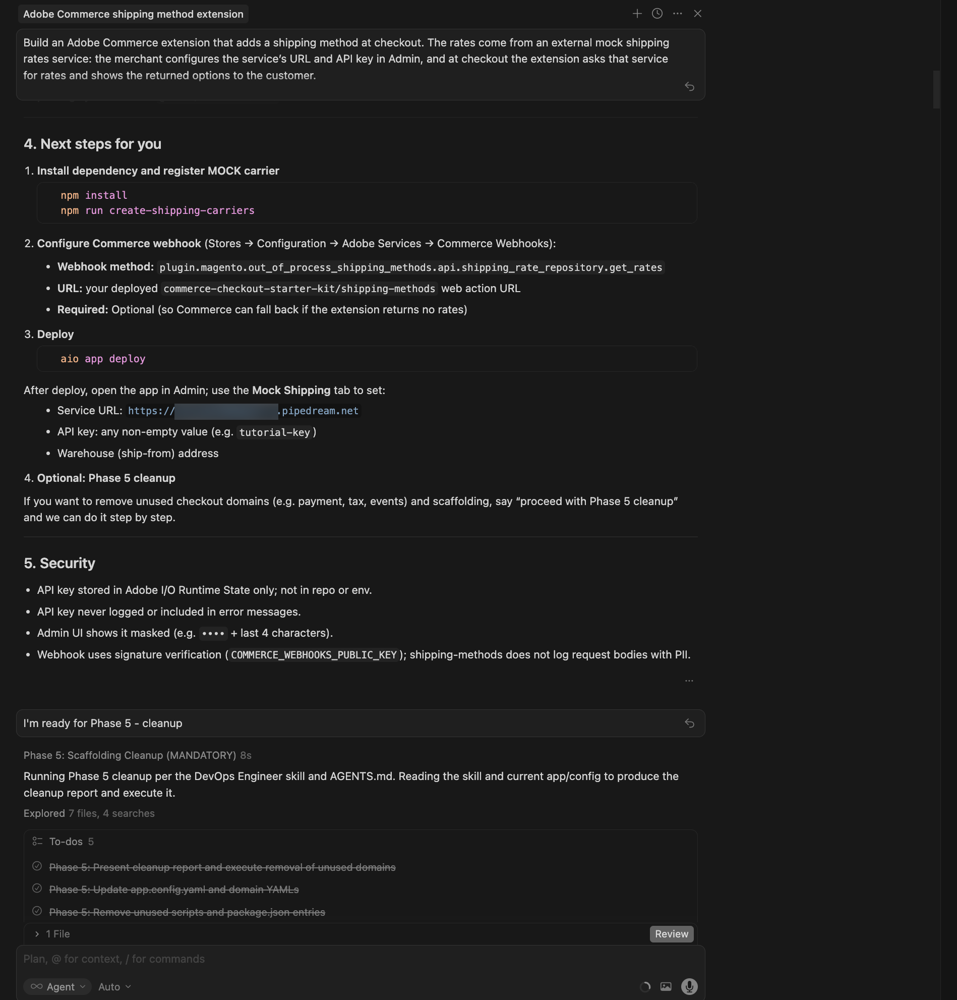
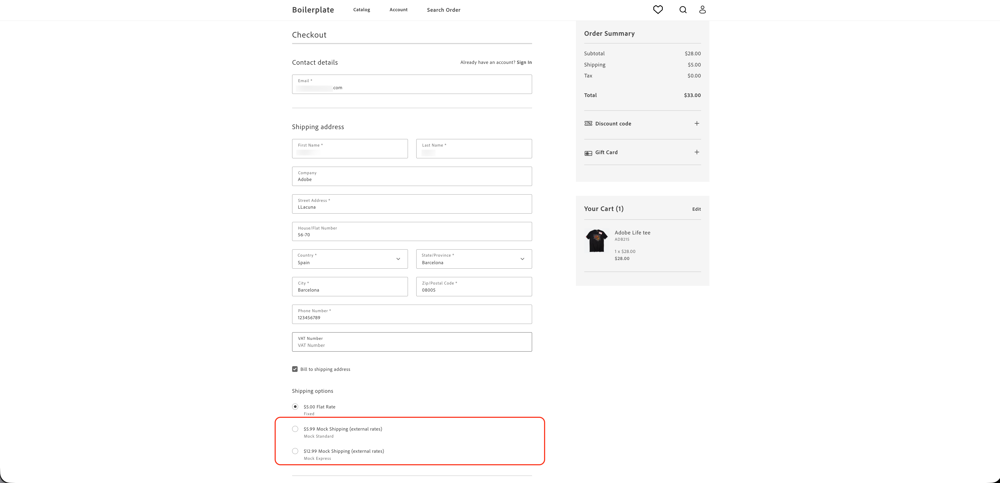

# Tutorial de extensão do método de envio

Este tutorial o orienta por meio da criação de uma extensão do método de envio para [!DNL Adobe Commerce as a Cloud Service] usando [!DNL Adobe App Builder], o [kit de início de check-out](https://developer.adobe.com/commerce/extensibility/starter-kit/checkout/){target="_blank"} e ferramentas de desenvolvimento assistido por IA.

A extensão adiciona um método de envio configurável na finalização da compra, onde as taxas vêm de um serviço de taxas de envio de modelo externo. Os comerciantes configuram o URL do serviço, a chave de API e o endereço do depósito (remessa de) na interface do administrador e, na finalização da compra, solicitam taxas desse serviço e exibem as opções retornadas ao cliente.

Antes de começar, conclua os [pré-requisitos](./tutorial-prerequisites.md).

## Verificar pré-requisitos {#tutorial-verify-prerequisites}

Verifique se os seguintes pré-requisitos estão instalados:

```bash
# Check Node.js version (should be 22.x.x)
node --version

# Check npm version (should be 9.0.0 or higher)
npm --version

# Check Git installation
git --version

# Check Bash shell installation
bash --version
```

Se qualquer um dos comandos anteriores não retornar os resultados esperados, consulte os [pré-requisitos](./tutorial-prerequisites.md) para obter orientação.

## Criar a API de taxas de envio simuladas

Após concluir os [pré-requisitos](./tutorial-prerequisites.md), crie a API de taxas de envio simuladas, para que você tenha a URL de serviço e a chave de API prontas ao configurar a extensão no [!DNL Commerce Admin]. A extensão chama uma API de taxas de envio externa. Para este tutorial, você usa uma API fictícia que permite executar o fluxo sem uma conta de operadora real. Você criará a API fictícia usando [Pipedream](https://pipedream.com) (conta gratuita necessária). A API fictícia usa um contrato de solicitação/resposta semelhante às APIs típicas de taxas de envio reais, portanto, conectar essa extensão a um provedor real posteriormente deve ser simples.

Para criar a API de modelo, baixe o [arquivo de especificação da API de taxas de modelo](../assets/mock-rates-api-spec.zip), abra-o e adicione o arquivo `.md` ao seu projeto (por exemplo, `docs/mock-rates-api-spec.md`).

**Hora:** deve levar aproximadamente **5-10 minutos** para criar a API fictícia.

### Criar um fluxo de trabalho e um acionador HTTP

1. Vá para [pipedream.com](https://pipedream.com) e inscreva-se ou faça logon.
1. Clique em **Novo fluxo de trabalho** (ou **Adicionar fluxo de trabalho**).
1. Para o acionador, selecione **HTTP / Webhook**.
1. Na configuração do acionador, defina a **Resposta HTTP** como **Retornar uma resposta personalizada do fluxo de trabalho**. Isso permite que a etapa Código envie a resposta JSON fictícia.
1. Pipedream exibe uma **URL de ponto de extremidade HTTP** exclusiva, como `https://123456.m.pipedream.net`.
1. **Copie esta URL** e use-a como a **URL de Serviço** ao configurar a extensão no Administrador do Commerce.

   {width="600" zoomable="yes"}

Não é necessário configurar **Autorização** no acionador; a API fictícia valida o cabeçalho `API-Key` na etapa Código.

### Adicionar a etapa Código

1. Clique no ícone **+** para adicionar uma etapa.
1. Escolha **Executar código Node.js** (Etapa de código).
1. **Substituir** o código padrão pela seguinte JavaScript.

   ```javascript
   export default defineComponent({
   async run({ steps, $ }) {
      const event = steps.trigger.event;
      const body = event.body ?? {};
      const headers = event.headers ?? {};
      const apiKey = headers["api-key"] ?? body.api_key ?? "";
   
      if (!apiKey || String(apiKey).trim() === "") {
         await $.respond({
         immediate: true,
         status: 401,
         headers: { "Content-Type": "application/json" },
         body: { error: "Missing or invalid API-Key header" },
         });
         return;
      }
   
      const shipment = body.shipment;
      if (!shipment || typeof shipment !== "object") {
         await $.respond({
         immediate: true,
         status: 400,
         headers: { "Content-Type": "application/json" },
         body: { error: "Missing or invalid shipment" },
         });
         return;
      }
   
      const rates = [
         {
         service_code: "mock_standard",
         service_name: "Mock Standard",
         carrier_friendly_name: "Mock Carrier",
         shipping_amount: { amount: 5.99 },
         shipment_cost: 5.99,
         cost: 5.99,
         },
         {
         service_code: "mock_express",
         service_name: "Mock Express",
         carrier_friendly_name: "Mock Carrier",
         shipping_amount: { amount: 12.99 },
         shipment_cost: 12.99,
         cost: 12.99,
         },
      ];
   
      await $.respond({
         immediate: true,
         status: 200,
         headers: { "Content-Type": "application/json" },
         body: { rates },
      });
   },
   });
   ```

1. Clique em **Implantar**.

   {width="600" zoomable="yes"}

O modelo retorna duas opções de taxa (Mock Standard e Mock Express) para qualquer solicitação válida que inclua um cabeçalho `API-Key` não vazio e um objeto `shipment`. Você configurará a Chave de API no [!DNL Commerce Admin] posteriormente neste tutorial. Você também especificará o URL do fluxo de trabalho Pipedream na mesma tela de configuração, portanto, anote-o.

## Desenvolvimento de extensão

Esta seção orienta você no desenvolvimento de uma extensão do método de envio para [!DNL Adobe Commerce as a Cloud Service] usando o [kit de início de check-out](https://developer.adobe.com/commerce/extensibility/starter-kit/checkout/){target="_blank"} e as ferramentas de desenvolvimento assistido por IA.

1. Navegue até as configurações de MCP no seu agente de codificação. Por exemplo, no Cursor, vá para **[!UICONTROL Cursor]** > **[!UICONTROL Settings]** > **[!UICONTROL Cursor Settings]** > **[!UICONTROL Tools & MCP]**. Verifique se o conjunto de ferramentas `commerce-extensibility` está habilitado sem erros. Se você vir erros, desligue e ligue o conjunto de ferramentas.

   {width="600" zoomable="yes"}

   >[!NOTE]
   >
   >Ao trabalhar com ferramentas de desenvolvimento assistidas por IA, espere variações naturais no código e nas respostas geradas pelo agente.
   >
   >Se encontrar problemas com o código, você sempre poderá pedir ao agente para ajudá-lo a depurá-lo.

1. Se você tiver alguma documentação adicionada ao contexto do cursor, desative-a. Navegue até [!UICONTROL **Cursor**] > [!UICONTROL **Configurações**] > [!UICONTROL **Configurações do cursor**] > [!UICONTROL **Indexação e documentos**] e exclua toda a documentação listada.

   {width="600" zoomable="yes"}

1. Conceda ao agente acesso à especificação da API de taxas simuladas para que ele possa implementar o cliente corretamente. Caso ainda não o tenha feito, baixe o [arquivo de especificação da API de taxas de modelagem](../assets/mock-rates-api-spec.zip), abra-o e adicione o arquivo `.md` ao seu projeto (por exemplo, `docs/mock-rates-api-spec.md`) e, em seguida, faça referência a esse arquivo no seu prompt.

1. Gere a extensão do método de envio:

   - Na janela de chat do agente, selecione o modo **Plano**, se disponível. Isso impede que o agente continue sem um plano.
   - Digite o seguinte prompt:

   ```shell-session
   Build an Adobe Commerce extension that adds a shipping method at checkout. The rates come from an external mock shipping rates service: the merchant configures the service's URL and API key in Admin, and at checkout the extension asks that service for rates and shows the returned options to the customer.
   
   External service (mock shipping rates API):
   - The service endpoint URL is configurable by the merchant (for example https://123456.m.pipedream.net).
   - The API is specified in ./docs/mock-rates-api-spec.md.
   
   The merchant must be able to configure the following in the Adobe Commerce Admin UI. Use the Adobe Commerce Admin UI SDK (or equivalent App Builder extensibility options for the Admin) to add a configuration screen where the merchant can set:
   - The service URL (where the extension sends rate requests).
   - An API key the service expects (any non-empty value for the mock). The API key is sensitive data: it must be stored securely and must never appear in logs, error messages, or in the UI in full (e.g. mask in the UI).
   - The warehouse (ship-from) address: name, phone, street, city, state, postal code, country. This is the origin used when requesting rates.
   ```

   >[!NOTE]
   >
   >Se o agente solicitar a pesquisa na documentação, permita.

   {width="600" zoomable="yes"}

1. Responda às perguntas do agente com precisão para ajudá-lo a gerar o melhor código. Se o agente perguntar qual kit ou modelo usar, direcione-o para o [kit inicial de check-out](https://developer.adobe.com/commerce/extensibility/starter-kit/checkout/){target="_blank"} com o domínio de envio e a extensão SDK da interface do administrador para que o webhook de envio e a tela de configuração do comerciante sejam implementados.

   O agente pode criar um arquivo `requirements.md` (ou equivalente) que sirva como a fonte da verdade para a implementação.

1. Revise o arquivo `requirements.md` (ou equivalente) e verifique o plano. Se tudo estiver correto, instrua o agente a migrar para o planejamento de arquitetura (ou **Fase 2**). Confirme que:

   - Uma ação **shipping-methods** (ou equivalente) lida com o webhook do Commerce e chama a API de taxas externas.
   - Uma ação **shipping-config** (ou equivalente) é compatível com o GET (configuração de leitura, chave de API mascarada) e SET (salvar URL do serviço, chave de API, endereço do warehouse), com a configuração armazenada com segurança, por exemplo, em Estado de Tempo de Execução.
   - A interface do Administrador inclui uma guia **Envio de Mock** (ou semelhante) com campos para URL de Serviço, chave de API (senha/mascarada) e endereço do warehouse.

   {width="600" zoomable="yes"}

1. Revise o plano de arquitetura quando o agente fornecê-lo.

   {width="600" zoomable="yes"}

1. Instrua o agente a prosseguir com a geração de código. O agente deve adicionar uma transportadora **mock** à configuração de transportadoras, permitindo que a Commerce aceite os métodos retornados e use o método de webhook `plugin.magento.out_of_process_shipping_methods.api.shipping_rate_repository.get_rates` (tipo de webhook **after**, obrigatório **Optional**).

   O agente gera o código necessário e fornece um resumo detalhado com as próximas etapas (incluindo instalação de dependências, registro da operadora simulada, configuração do webhook do Commerce e implantação).

   {width="600" zoomable="yes"}

   {width="600" zoomable="yes"}

### Limpar antes de implantar

Antes de implantar, remova o código de que o aplicativo não precisa. O kit de início de check-out pode incluir domínios não utilizados (por exemplo, pagamento, imposto ou eventos) e andaimes. Peça ao agente para removê-los e manter somente o envio e [!DNL Admin UI] partes usando um prompt como:

```shell-session
Proceed with Phase 5 cleanup.
```

O agente produz um relatório de limpeza, remove ações, configurações e scripts não utilizados e atualiza o projeto. Conclua esta etapa antes de implantar.

{width="600" zoomable="yes"}

### Implantar a extensão

1. Depois de verificar o código gerado, implante a extensão usando o seguinte prompt:

   ```shell-session
   Deploy the app.
   ```

   O agente executa uma avaliação de prontidão de pré-implantação (por exemplo, verificar `.env` para `COMMERCE_WEBHOOKS_PUBLIC_KEY`, `COMMERCE_BASE_URL` e variáveis OAuth/IMS se a interface do usuário do administrador ou a API do Commerce for usada).

   {width="600" zoomable="yes"}

1. Quando estiver confiante nos resultados da avaliação, instrua o agente a prosseguir com a implantação. O agente usa o kit de ferramentas MCP para verificar, compilar e implantar automaticamente.

   {width="600" zoomable="yes"}

### Pós-implantação

Após a implantação, conclua as etapas a seguir para registrar a portadora fictícia, configurar o webhook e [!DNL Admin UI] e verificar a extensão no check-out.

1. **Registrar a operadora simulada no Commerce** (executar uma vez após a implantação):

   ```bash
   npm run create-shipping-carriers
   ```

   Verifique se o `.env` tem `COMMERCE_BASE_URL` e uma credencial OAuth/IMS válida, para que o script possa registrar a operadora.

1. **Configurar o webhook de envio em [!DNL Commerce Admin]:**

   - Vá para **Lojas** > Configurações > **Configuração** > **Adobe Services** > **Webhooks do Commerce**.
   - Adicionar um webhook:
      - **Método do Webhook:** `plugin.magento.out_of_process_shipping_methods.api.shipping_rate_repository.get_rates`
      - **Tipo de Webhook:** **after**
      - **URL:** a URL de ação da Web **de métodos de envio** implantada (da saída de implantação ou do [!DNL Adobe Developer Console]).
      - **Obrigatório:** **Opcional** - Permite que o check-out ainda funcione se a API externa não retornar taxas.

   {width="600" zoomable="yes"}

1. **Configurar a extensão [!DNL Admin UI SDK]:**

   - Em [!DNL Commerce Admin], vá para **Lojas** > Configurações > **Configuração**.
   - Abra o **Adobe Services** > **Admin UI SDK**.
   - Defina **Habilitar SDK da Interface do Administrador** como **Sim** e clique em **Salvar Configuração** se ela ainda não estiver habilitada.
   - Clique em **Configurar extensões**, escolha o espaço de trabalho no qual seu aplicativo está implantado e clique em **Aplicar**. Você também pode selecionar a opção **Personalizado** e inserir o nome do espaço de trabalho.
   - Selecione o aplicativo [!DNL App Builder] na lista e salve. Se o aplicativo não for exibido, clique em **Atualizar registros** e tente novamente.

   {width="600" zoomable="yes"}

1. **Configurar o método de envio simulado na interface do Administrador do Adobe Commerce:**
   - Abra **Aplicativos** e selecione seu aplicativo.
   - Abra a guia **Envio Simulado** (ou equivalente).
   - Insira os seguintes detalhes:
      - **URL do Serviço:** a URL do fluxo de trabalho Pipedream copiada (por exemplo, `https://123456.m.pipedream.net`).
      - **Chave de API:** qualquer valor não vazio para o modelo, por exemplo `tutorial-key`.
      - **Endereço do depósito (origem da remessa):** nome, telefone, rua, cidade, estado, CEP, país.
   - Clique em **Salvar**. A configuração é armazenada no Estado de tempo de execução e é usada pela ação de métodos de envio.

   {width="600" zoomable="yes"}

1. **Verificar no check-out:** Adicione um produto ao carrinho, vá para o check-out e insira um endereço para remessa. Você deve ver as opções de envio de modelo, por exemplo **Padrão de modelo** e **Expresso de modelo**.

   {width="600" zoomable="yes"}

### Solução de problemas

- **A configuração não está sendo salva na interface do Administrador:** Se você vir &quot;Resposta não é uma &#39;message/http&#39; válida&quot; ou valores não atualizados após salvar, verifique os logs de ativação de tempo de execução para a ação de configuração, usando um comando semelhante ao seguinte:

  ```bash
  aio app logs --action CustomMenu/shipping-config --limit 20
  ```

  Causas comuns incluem o gateway que espera um formato de resposta específico (por exemplo, um corpo de sequência e `Content-Type: application/json`) ou a biblioteca de estado que requer valores de sequência. Certifique-se de que a ação armazene a configuração como uma sequência e a analise durante a leitura e que a ação de métodos de envio use a mesma análise. Revise o bate-papo ou registros do agente para obter a causa e a correção exatas.

- **&quot;A resposta deve conter pelo menos uma operação&quot;** (em logs de webhook): o Commerce exige que o webhook de remessa retorne pelo menos uma operação. Peça ao agente para garantir que a ação dos métodos de envio nunca retorne uma matriz de operações vazia (por exemplo, retornando uma taxa de fallback quando a API externa não retornar nenhuma taxa).

- **Nenhuma taxa de remessa no check-out:** Confirme se a URL e o método do webhook estão corretos, se a operadora do modelo está registrada (`npm run create-shipping-carriers`) e se a configuração de Envio do Modelo está definida no [!DNL Admin UI]. Verifique os logs de tempo de execução da ação dos métodos de envio quanto a erros de API ou validação. Certifique-se de que a ação retorne pelo menos uma operação. Portanto, [!DNL Commerce] não mostra &quot;A resposta deve conter pelo menos uma operação&quot;.

### Resumo do tutorial

Este é um resumo dos tópicos abordados neste tutorial:

- **Pré-requisitos e configuração:** verificação de ferramentas e criação da API de taxas de envio simuladas.
- **Desenvolvimento orientado por agentes:** uso do conjunto de ferramentas de extensibilidade de comércio para gerar requisitos, um plano de implementação e código para o webhook de remessa e a interface do Administrador.
- **Limpeza da fase 5:** Removendo domínios e scaffolding do kit de início de check-out não utilizados antes da implantação.
- **Implantação:** Avaliação de pré-implantação e implantação do kit de ferramentas MCP.
- **Configuração pós-implantação:** registrando a operadora simulada, configurando o webhook [!DNL Commerce], habilitando a extensão [!DNL Admin UI SDK] e configurando o Envio Simulado (URL de serviço, chave de API, warehouse) no [!DNL Admin UI].
- **Verificação:** opções de envio de modelo de confirmação aparecem no check-out.

### Próximas etapas

Para experimentação adicional com este tutorial, considere o seguinte:

- Automatize a configuração pós-implantação com um gancho que registre a operadora fictícia em [!DNL Commerce] e configure o webhook de remessa após cada implantação.
- Aponte a extensão para uma API de taxas de envio reais alterando a URL de Serviço e a chave de API no [!DNL Admin UI].
- Estenda o [!DNL Admin UI] para mostrar o status da operadora ou testar a conectividade com o serviço de taxas.
