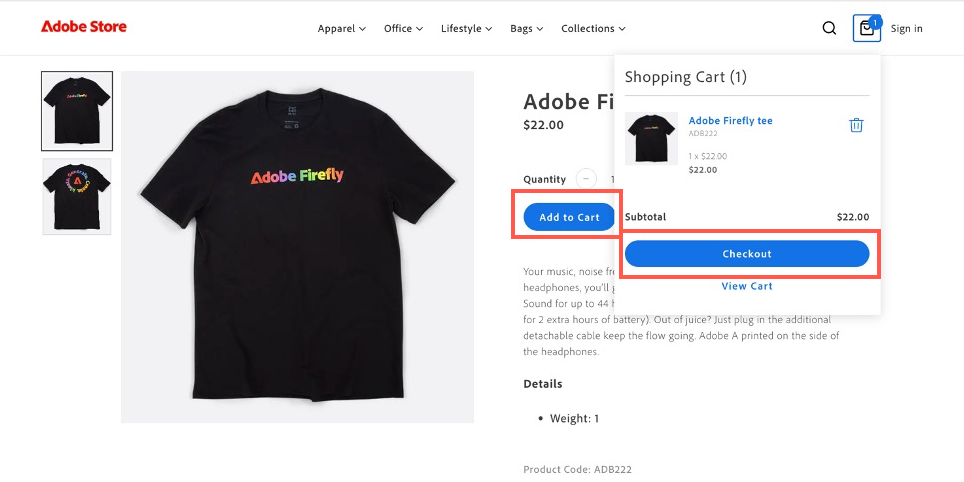

# Casos de uso

Os casos de uso a seguir demonstram funcionalidade principal e cenários de negócios com suporte do [!DNL Adobe Commerce as a Cloud Service]. Eles permitem acelerar o desenvolvimento e iniciar experiências de alto impacto.

Se encontrar algum problema, consulte a seção [Solução de problemas](#troubleshooting) para obter orientação.

## Pré-requisitos

Antes de tentar qualquer um desses casos de uso, conclua os seguintes pré-requisitos:

1. [Crie sua instância do Cloud Service](./getting-started.md#create-an-instance) usando estas opções:
   1. Selecione [!UICONTROL **Sandbox**] na lista suspensa [!UICONTROL **Ambiente**].
   1. Selecione [!UICONTROL **Adobe Store**] na lista suspensa [!UICONTROL **Dados de teste**].
1. [Faça logon em sua [!DNL Adobe Experience Cloud] conta](https://experience.adobe.com)
1. [Configure sua vitrine do Cloud Service](./storefront.md) usando estas opções:
   1. Selecione [!UICONTROL `adobe-commerce/adobe-demo-store`] para o modelo.
   1. Selecione [!UICONTROL **Escolher uma instância disponível (Mesh -> SaaS)**] para o método de conexão.

## Fluxo de trabalho de check-out

Esse fluxo de trabalho demonstra o processo de finalização para um cliente que compra um produto na loja e como você, como administrador, pode confirmar o pedido.

### Habilitar serviços de pagamento

1. No Administrador do Commerce, navegue até [!UICONTROL **Lojas**] > [!UICONTROL Settings] > [!UICONTROL **Configuração**] > [!UICONTROL **Métodos de pagamento**].

1. Na seção [!UICONTROL **Configuração Geral**], digite os `Payment Services Sandbox ID` e `Payment Services Sandbox Key`. Você pode obter essas IDs seguindo as etapas descritas em [Integração da sandbox](../payment-services/sandbox.md#sandbox-onboarding)

1. Defina a lista suspensa [!UICONTROL **Habilitar**] para [!UICONTROL **Sim**].

1. Clique em [!UICONTROL **Salvar configuração**].

### Comprar um produto

1. Vá para a [loja](./storefront.md) criada nos pré-requisitos.

1. Localize e selecione um produto. Faça as seleções de personalização necessárias. Depois clique em [!UICONTROL **Adicionar ao carrinho**].

   {width="600" zoomable="yes"}

1. Selecione o ícone do carrinho para visualizar seu carrinho.

   {width="600" zoomable="yes"}

1. Clique em [!UICONTROL **Check-out**].

   {width="600" zoomable="yes"}

1. Insira os detalhes de contato e as informações de entrega necessários. Você pode usar informações fictícias para este pedido.

1. Para fazer check-out, selecione [!UICONTROL **Cheque/Ordem de Pagamento**]. Se quiser usar um cartão de crédito, use um dos [cartões de teste fornecidos pelo Paypal](https://developer.paypal.com/tools/sandbox/card-testing/#link-teststaticcardnumbers). Você pode usá-los com qualquer data de expiração futura e qualquer CVC.

   {width="600" zoomable="yes"}

   {width="600" zoomable="yes"}

1. Clique em [!UICONTROL **Fazer pedido**].

### Confirmar o pedido

1. Abra o Administrador do Commerce: `<your store URL>/admin`.

1. Faça logon usando sua Adobe ID.

1. Navegue até [!UICONTROL **Vendas**] > [!UICONTROL **Pedidos**].

   {width="600" zoomable="yes"}

1. Procure o pedido feito e confirme os detalhes.

   {width="600" zoomable="yes"}

## Atualizar conteúdo da loja

Crie, edite e publique conteúdo diretamente na loja.

1. Abra a [vitrine](./storefront.md) que você criou nos pré-requisitos.

1. Abra o Construtor de vitrines. Navegando até `https://da.live/#/<GitHub User Name>/<Repository Name>/main/da/index.md`.

1. Abra a página [!UICONTROL **Índice**].

1. Abaixo do bloco Carrossel, insira um novo título editando a linha &quot;Bem-vindo à demonstração da Adobe Store&quot;.

1. Clique no ícone de envio e clique em [!UICONTROL **Visualizar**].

1. Revise a página de visualização e clique em [!UICONTROL **Publicar**].

1. Atualize a página da loja e confirme se suas alterações estão online agora.

## Experimentação contextual

O recurso de experimentação contextual do [!DNL Adobe Commerce] permite que você crie e gerencie experimentos em sua loja para testar diferentes conteúdos e configurações.

### Pré-requisitos

* Instalar a [extensão do AEM Sidekick](https://www.aem.live/docs/sidekick)

1. No Storefront Builder, selecione a página de índice e clique em [!UICONTROL **Copiar**].

1. Crie uma pasta [!UICONTROL **experimentos**] na pasta principal, clicando no botão [!UICONTROL **Novo**] e selecionando [!UICONTROL **Pasta**].

1. Crie uma pasta chamada **1234** na pasta [!UICONTROL **experiment**].

1. Cole as duas cópias da página de índice na pasta **1234**.

1. Abra cada página e renomeie-as como &quot;homev1&quot; e &quot;homev2&quot;. Estes são seus [desafiantes](https://www.aem.live/docs/experimentation#create-your-challenger-page).

1. Modifique cada página para incluir conteúdo diferente. Por exemplo, altere a imagem herói ou o texto. Você precisa identificar as diferenças entre cada página.

1. Publique cada uma de suas páginas desafiantes.

1. Abra a página de controle, a página de índice original.

1. Adicione um novo bloco com o título [!UICONTROL **metadata**].

1. Adicione as seguintes informações às linhas do bloco de metadados

   * Título - Adobe Commerce
   * Descrição - Uma loja da Web
   * Experimento - 1234
   * Variantes de experimento
      * `https://<your-site>.aem.live/experiments/1234/indexv1`
      * `https://<your-site>.aem.live/experiments/1234/indexv2`

   {width="600" zoomable="yes"}

1. Abra uma janela de navegação incógnita ou privada e navegue até a página principal.

1. Feche a janela de navegação privada e repita a etapa anterior. Cada vez que abrir a página, você verá uma variante aleatória criada.

## Aprimorar conteúdo da loja

Com o [!DNL AEM Assets], [!DNL Adobe Express] e [!DNL Firefly], você pode fazer rapidamente alterações em imagens que aparecem na sua vitrine eletrônica com um fluxo de trabalho simples e autodirigido.

### Pré-requisitos

* Requer acesso a [!DNL AEM Assets], [!DNL Adobe Express] e [!DNL Adobe Firefly].

### Personalizar o plano de fundo de uma imagem

Considere um cenário em que você deseja modificar rapidamente o plano de fundo de uma imagem de produto. A combinação de [!DNL Adobe Commerce], [!DNL AEM Assets] e [!DNL Adobe Express] permite concluir essa alteração em algumas etapas simples.

1. Abra a [loja](./storefront.md) criada nos pré-requisitos e navegue até um item que você deseja alterar. Anote o SKU ou o Código do produto.

1. Abra [!DNL AEM Assets], selecionando-o na [Adobe Experience Cloud](https://experience.adobe.com/#/home).

   Seletor ![[!DNL AEM Assets] mostrando a interface [!DNL Adobe Experience Cloud]](./assets/select-aem-assets.png){width="600" zoomable="yes"}

1. Clique em [!UICONTROL **Assets**].

   ![Opção de navegação do Assets na interface [!DNL AEM Assets]](./assets/click-assets.png){width="600" zoomable="yes"}

1. Procure o item por **SKU** ou **Código do Produto**.

1. Selecione o item que deseja editar e clique em [!UICONTROL **Abrir no Adobe Express**].

   {width="600" zoomable="yes"}

1. No painel [!UICONTROL **Imagem**], selecione [!UICONTROL **Inserir objeto**].

   {width="600" zoomable="yes"}

1. Na caixa de texto, descreva a imagem que deseja adicionar. Por exemplo, &quot;pinheiros nevados&quot;.

   {width="600" zoomable="yes"}

1. Ajuste o [!UICONTROL Brush size] e desenhe onde deseja adicionar a imagem gerada. Para este exemplo, desenhe ao redor do objeto existente para selecionar o plano de fundo.

1. Clique em [!UICONTROL **Gerar**] para exibir os resultados.

1. Escolha entre os diferentes resultados, selecionando a opção desejada e clicando em [!UICONTROL **Manter**].

1. Clique em [!UICONTROL **Suas Coisas**] para retornar ao editor de imagens.

1. Clique em [!UICONTROL **Salvar**] para especificar o tipo de imagem.

1. Clique em [!UICONTROL **Salvar**] novamente para salvar as alterações.

1. Na caixa de diálogo [!UICONTROL **Salvar ativo**], selecione a [!UICONTROL **pasta de Destino**] do Commerce.

   {width="600" zoomable="yes"}

1. Clique em [!UICONTROL **Salvar como novo ativo**] para salvar a imagem.

#### Adicionar a imagem a [!DNL Commerce AEM Assets]

1. No [Painel de Navegação](https://experienceleague.adobe.com/en/docs/experience-manager-cloud-service/content/sites/authoring/basic-handling#navigation-panel) de [!DNL AEM as a Cloud Service], selecione [!UICONTROL **Assets**] > [!UICONTROL **Arquivos**] > [!UICONTROL **Commerce**] e clique no ativo criado na seção anterior.

   ![Pasta do Commerce em [!DNL AEM Assets] com imagens do produto](./assets/commerce-folder.png){width="600" zoomable="yes"}

1. Clique em [!UICONTROL **Propriedades**].

   ![Botão Propriedades na barra de ferramentas [!DNL AEM Assets]](./assets/properties.png){width="600" zoomable="yes"}

1. Selecione a guia [!UICONTROL **Commerce**].

   {width="600" zoomable="yes"}

1. Verifique se [!UICONTROL **Ele existe no Adobe Commerce?O campo**] está definido como [!UICONTROL **Sim**].

1. Clique em [!UICONTROL **Adicionar**] e insira o SKU do produto ao qual você deseja adicionar o ativo.

   {width="600" zoomable="yes"}

1. Selecione a posição do ativo e o tipo de ativo.

1. Selecione a guia [!UICONTROL **Básico**] e altere a guia [!UICONTROL **Status da Revisão**] para [!UICONTROL **Aprovado**].

   {width="600" zoomable="yes"}

1. Clique em [!UICONTROL **Salvar e fechar**].

#### Confirmar a imagem no Commerce

1. No [!UICONTROL **Administrador**] do Adobe Commerce, navegue até [!UICONTROL **Catálogo**] > [!UICONTROL **Produtos**].

1. Selecione o produto ao qual você adicionou a imagem na seção anterior.

1. Expanda a seção [!UICONTROL **Imagens e Vídeos**].

   {width="600" zoomable="yes"}

1. Confirme se sua imagem agora está disponível na lista de imagens.

1. Retorne à loja e navegue até a página do produto modificado.

1. Confirme se a nova imagem aparece.

   {width="600" zoomable="yes"}

## Gerar variações

A função Gerar variações de [!DNL Adobe Commerce] aproveita a IA gerativa para automatizar a geração de conteúdo de alta qualidade, ajustar mensagens e publicar ativos na sua loja com facilidade.

### Gerar texto

1. Abra o site da loja usando o [Editor Universal](https://experienceleague.adobe.com/en/docs/experience-manager-cloud-service/content/implementing/developing/universal-editor/introduction).

1. Selecione o bloco de texto que deseja editar.

1. No painel [!UICONTROL **Propriedades**], clique em [!UICONTROL **Gerar Variações**].

1. Clique no botão [!UICONTROL **Gerar**].

1. Selecione ou personalize o texto gerado.

1. Clique em [!UICONTROL **Publicar**] para atualizar sua vitrine eletrônica.

### Gerar conteúdo e imagens

1. Abrir [[!DNL Generate Variations]](https://experienceleague.adobe.com/en/docs/experience-manager-cloud-service/content/generative-ai/generate-variations)

1. Selecione o modelo [!UICONTROL **Banner principal**].

1. Na caixa de texto [!UICONTROL **Explicar interação do usuário**], digite: &quot;Experiência para funcionários e parceiros da Adobe comprarem equipamentos da marca Adobe!&quot;.

1. Na [!UICONTROL **URL do conhecimento de domínio**], digite **www.adobestore.com**.

1. Clique em [!UICONTROL **Gerar**].

1. Selecione uma variação de conteúdo e clique em [!UICONTROL **Gerar imagem**].

1. Na lista suspensa [!UICONTROL **Tamanho da imagem**], selecione [!UICONTROL **Widescreen (16:9)**].

1. Na lista suspensa [!UICONTROL **Tipo de conteúdo**], selecione [!UICONTROL **Foto**].

1. Para a imagem de referência [!UICONTROL **Style**], selecione o banner de armazenamento do Adobe existente.

1. Selecione a imagem gerada que você deseja usar e clique em [!UICONTROL **Salvar**].

1. Repita esse processo com outras imagens de referência para gerar mais variações.

## Solução de problemas

Use as sugestões a seguir para resolver qualquer problema ao tentar utilizar esses tutoriais.

* Se você precisar de orientação sobre comandos ou sinalizadores:

   1. Execute `aio --help` para ver todos os comandos e sinalizadores disponíveis.
   1. Para comandos específicos, use o sinalizador `--help`. Por exemplo:
      * `aio console --help`
      * `aio commerce --help`

* Se você encontrar problemas de login inválidos:

   1. Executar `aio config clear`.
   1. Executar `aio auth login --force`.
   1. Faça logon no navegador.
   1. Selecione seu perfil.
   1. Volte para o terminal para continuar.

* Se o comando `init` falhar:

   1. Executar `aio api-mesh delete`.
   1. Execute `aio commerce init` novamente.

* Se você selecionou a organização, o projeto ou o espaço de trabalho errado antes de executar o comando `init`:

   1. Executar `aio console org select`.
   1. Executar `aio console project select`.
   1. Executar `aio console workspace select`.

* Se você tiver uma seleção de locatário inválida:

   1. Cancele a execução atual da CLI pressionando **Ctrl-C**.
   1. Executar `aio commerce init`.

* Se você encontrar uma instalação inválida do API Mesh:

   * Executar `aio api-mesh update mesh-config.json`.
