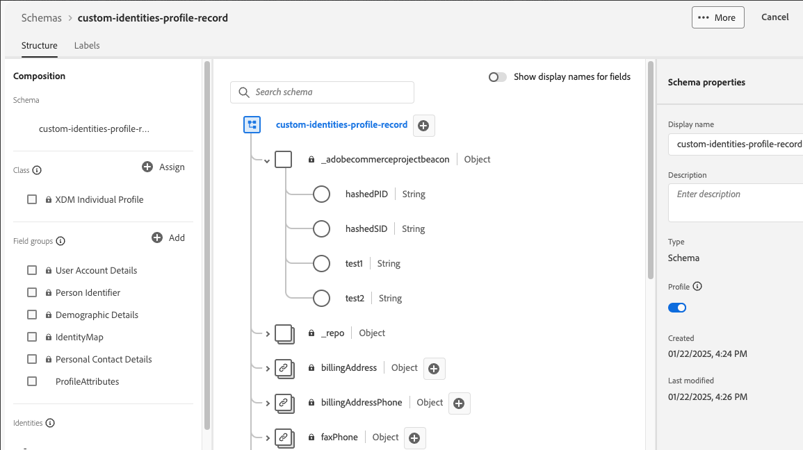

# Adicionar atributos personalizados a perfis

Os atributos de perfil personalizados permitem aprimorar a identificação do perfil do cliente no Experience Platform usando identificadores adicionais além do padrão `customerId` e `emailId`. Esses identificadores adicionais permitem uma correspondência mais precisa do cliente e uma integração de dados aprimorada entre a plataforma do Commerce e a Experience Platform.

>[!NOTE]
>
>Saiba como [adicionar atributos personalizados](custom-attributes.md) aos pedidos.

## Benefícios

- Use vários identificadores para melhorar a correspondência do cliente.
- Mapeie campos personalizados para atributos de identidade com base nas necessidades da sua empresa.
- Reduza perfis duplicados e melhore a precisão dos dados do cliente.
- Permita experiências do cliente mais direcionadas.

## Pré-requisitos

Antes de implementar atributos de identidade personalizados, verifique se você:

- [Instalar a extensão Conexão de Dados](install.md)
- [Conectar-se ao Adobe Experience Platform](connect-data.md)
- [Enviar dados de perfil do cliente](connect-data.md#send-customer-profile-data)

## Etapa 1: configurar o esquema do Experience Platform

1. Faça logon no Adobe Experience Platform e selecione seu esquema do Commerce.
1. [Adicionar campos de identidade personalizados](https://experienceleague.adobe.com/pt-br/docs/experience-platform/xdm/ui/resources/schemas?lang=en#custom-fields-for-standard-groups) no nível raiz:
   - `hashedPID` (Cadeia de caracteres) - Hash de identidade principal
   - `hashedSID` (Cadeia de caracteres) - Hash de identidade secundário
   - `primaryID` (Cadeia de caracteres) - Nome do campo de identidade principal
   - `secondaryID` (Cadeia de caracteres) - Nome do campo de identidade secundário



>[!NOTE]
>
>Você pode personalizar os nomes de campos exatos com base em seus requisitos. O exemplo usa `hashedPID` e `hashedSID` como os campos de identidade.

## Etapa 2: Criar classes de processador

Crie as seguintes classes de processador PHP em seu módulo personalizado:

### Classe AddressCustomHashId

Este processador hash `parent_id` e `entity_id` para endereços de clientes.

```php
<?php declare(strict_types=1);

namespace Magento\AepCustomerCustomAttributes\Event;
use Magento\AdobeCommerceEventsClient\Event\Event;
use Magento\AdobeCommerceEventsClient\Event\Processor\EventDataProcessorInterface;

class AddressCustomHashedId implements EventDataProcessorInterface
{
    public function process(Event $event, array $eventData): array
    {
        $pid = $eventData['parent_id'] ?? '';
        $sid = $eventData['entity_id'] ?? '';

        $eventData['profileAttributes']['hashedPID'] = hash('sha256', (string)$pid);
        $eventData['profileAttributes']['hashedSID'] = hash('sha256', (string)$sid);
        return $eventData;
    }
}
```

### classe AddressCustomId

Esse processador define os nomes de campo da ID primária e secundária para eventos de endereço.

```php
<?php declare(strict_types=1);

namespace Magento\AepCustomerCustomAttributes\Event;
use Magento\AdobeCommerceEventsClient\Event\Event;
use Magento\AdobeCommerceEventsClient\Event\Processor\EventDataProcessorInterface;

class AddressCustomId implements EventDataProcessorInterface
{
    public function process(Event $event, array $eventData): array
    {
        $eventData['profileAttributes']['primaryID'] = 'hashedPID';
        $eventData['profileAttributes']['secondaryID'] = 'hashedSID';

        // Ensure both IDs are present, otherwise, Commerce will default primary to customerId and secondary to emailId
        if (empty($eventData['profileAttributes']['primaryID']) || empty($eventData['profileAttributes']['secondaryID'])) {
            $eventData['profileAttributes']['primaryID'] = $eventData['customerId'] ?? '';
            $eventData['profileAttributes']['secondaryID'] = $eventData['email'] ?? '';
        }

        return $eventData;
    }
}
```

### classe CustomHashId

Este processador hash `entity_id` e `email` para perfis de clientes.

```php
<?php declare(strict_types=1);

namespace Magento\AepCustomerCustomAttributes\Event;
use Magento\AdobeCommerceEventsClient\Event\Event;
use Magento\AdobeCommerceEventsClient\Event\Processor\EventDataProcessorInterface;

class CustomHashedId implements EventDataProcessorInterface
{
    public function process(Event $event, array $eventData): array
    {
        $pid = $eventData['entity_id'] ?? '';
        $sid = $eventData['email'] ?? '';

        $eventData['profileAttributes']['hashedPID'] = hash('sha256', (string)$pid);
        $eventData['profileAttributes']['hashedSID'] = hash('sha256', (string)$sid);
        return $eventData;
    }
}
```

### Classe CustomId

Esse processador define os nomes de campo da ID primária e secundária para eventos de perfil.

```php
<?php declare(strict_types=1);

namespace Magento\AepCustomerCustomAttributes\Event;
use Magento\AdobeCommerceEventsClient\Event\Event;
use Magento\AdobeCommerceEventsClient\Event\Processor\EventDataProcessorInterface;

class CustomId implements EventDataProcessorInterface
{
    public function process(Event $event, array $eventData): array
    {
        $eventData['profileAttributes']['primaryID'] = 'hashedPID';
        $eventData['profileAttributes']['secondaryID'] = 'hashedSID';

        // Ensure both IDs are present, otherwise, Commerce will default primary to customerId and secondary to emailId
        if (empty($eventData['profileAttributes']['primaryID']) || empty($eventData['profileAttributes']['secondaryID'])) {
            $eventData['profileAttributes']['primaryID'] = $eventData['customerId'] ?? '';
            $eventData['profileAttributes']['secondaryID'] = $eventData['email'] ?? '';
        }

        return $eventData;
    }
}
```

>[!NOTE]
>Verifique se `primaryID` e `secondaryID` foram enviados nos dados do evento. Se um estiver ausente, o padrão do Commerce será:
>
>- primaryID = customerId
>- secondaryID = emailId

>[!BEGINSHADEBOX]

Após concluir estas duas etapas:

- Seu esquema do Commerce no Experience Platform pode assimilar adequadamente identidades personalizadas para seus dados de evento de perfil.
- As classes de processador em seu código Commerce PHP coletam informações de identificação personalizadas de eventos de perfil.

Agora, todos os dados de evento de perfil enviados do Commerce contêm suas informações de identificação personalizadas.

>[!ENDSHADEBOX]

## Exemplos de formato de dados

Os exemplos a seguir demonstram a estrutura JSON esperada para atributos de identidade personalizados em atributos de perfil e formatos completos de dados de perfil do cliente.

### Formato dos atributos do perfil

```json
{
  "profileAttributes": {
    "hashedPID": "d80eae6e96d148b3b2abbbc6760077b66c4ea071f847dab573d507a32c4d99a5",
    "hashedSID": "fa7359e288ce3104bd4317a4fb75f08c4a5feec472de2e415b8260fb3567ebe6",
    "warehousecode": "1256",
    "method": "ina2354",
    "source": "commerce",
    "primaryID": "hashedPID",
    "secondaryID": "hashedSID"
  }
}
```

### Estrutura completa do perfil do cliente

```json
{
  "id": 137,
  "entity_id": "137",
  "created_at": "2025-02-10 20:10:30",
  "updated_at": "2022-02-10 20:10:31",
  "email": "customer@example.com",
  "firstname": "John",
  "lastname": "Doe",
  "dob": "2007-10-01 00:00:00",
  "profileAttributes": {
    "hashedPID": "d80eae6e96d148b3b2abbbc6760077b66c4ea071f847dab573d507a32c4d99a5",
    "hashedSID": "fa7359e288ce3104bd4317a4fb75f08c4a5feec472de2e415b8260fb3567ebe6",
    "primaryID": "137",
    "secondaryID": "customer@example.com"
  },
  "_metadata": {
    "commerceEdition": "Adobe Commerce",
    "commerceVersion": "2.4.6",
    "eventsClientVersion": "1.9.0",
    "storeId": "1",
    "websiteId": "1",
    "storeGroupId": "1",
    "websiteCode": "base",
    "storeCode": "default",
    "storeViewCode": "main_website_store"
  }
}
```

## Solução de problemas

### PrimaryID ou secondaryID ausente

- **Sintoma:** Os dados são padronizados como customerId/emailId em vez de valores personalizados.
- **Solução:** verifique se `primaryID` e `secondaryID` estão definidos no objeto `profileAttributes`.

### Valores de hash inválidos

- **Sintoma:** valores de hash estão vazios ou malformados.
- **Solução:** verifique se os campos de origem (`parent_id`, `entity_id`, `email`) contêm dados válidos antes do hash.

### Os processadores não estão em execução

- **Sintoma:** atributos personalizados não aparecem nos dados do evento.
- **Solução:** verifique se os processadores estão registrados corretamente em `events.xml` e se o módulo está habilitado.

### Incompatibilidade de esquema do Experience Platform

- **Sintoma:** Os dados não aparecem no Experience Platform ou em erros de validação de esquema.
- **Solução:** verifique se o esquema do Experience Platform inclui os campos de identidade personalizados com tipos de dados corretos.
