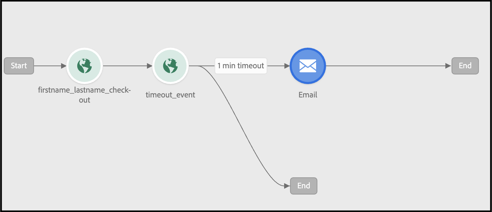

# Usar o Adobe Journey Optimizer para enviar um email de carrinho abandonado

Saiba como fornecer um email personalizado de reengajamento ou notificação se uma sessão do carrinho ou do navegador for abandonada. Neste artigo, você usa dados gerados de clientes que visualizaram vários produtos e categorias, interagiram com um produto ou gastaram tempo em uma página.

## Quais dados devo considerar usar?

Crie um carrinho abandonado, navegue por e-mail ou envie notificações usando dados de eventos da loja e do back office.

| Tipos de dados | Dados da vitrine (Eventos comportamentais) | Dados de back office (eventos do lado do servidor) |
|---|---|---|
| **Definição** | Cliques ou ações que os clientes realizam no site. | Informações sobre o ciclo de vida e detalhes de cada pedido (passado e atual). |
| **Eventos capturados pelo Adobe Commerce** | [pageView](https://experienceleague.adobe.com/en/docs/commerce/data-connection/event-forwarding/events#pageview)<br>[productPageView](https://experienceleague.adobe.com/en/docs/commerce/data-connection/event-forwarding/events)<br>[addToCart](https://experienceleague.adobe.com/en/docs/commerce/data-connection/event-forwarding/events#addtocart)<br>[openCart](https://experienceleague.adobe.com/en/docs/commerce/data-connection/event-forwarding/events#opencart)<br>[startCheckout](https://experienceleague.adobe.com/en/docs/commerce/data-connection/event-forwarding/events#startcheckout)<br>[completeCheckout](https://experienceleague.adobe.com/en/docs/commerce/data-connection/event-forwarding/events#completecheckout) | [orderPlaced](https://experienceleague.adobe.com/en/docs/commerce/data-connection/event-forwarding/events-backoffice#orderplaced)<br>[Histórico de pedidos](https://experienceleague.adobe.com/en/docs/commerce/data-connection/fundamentals/connect-data#send-historical-order-data) |

### O que outros clientes conquistaram?

Os clientes do Adobe [!DNL Commerce] atingiram impactos comerciais significativos ao implementarem campanhas de abandono personalizadas usando o Adobe [!DNL Commerce], Adobe [!DNL Journey Optimizer] e Adobe [!DNL Real-Time CDP].

Um varejista global de vestuário de várias marcas obteve:

- Conversão 1.9x ao clicar em novas campanhas
- Aumento de 57% na receita proveniente de jornadas de abandono omnicanal
- 41% de aumento na taxa de conversão de campanhas de reengajamento
- Mais de 1000 novos compradores contratados por semana

Uma empresa global de bebidas conseguiu:

- 36% de taxas de abertura de email de reengajamento
- Aumento de 21% nas taxas de clickthrough
- Aumento de 8,5% na taxa de conversão
- 89% dos abandonadores reengajados convertem

## Vamos começar

Esse caso de uso específico se concentra na criação de um email de carrinho abandonado usando dados da sua instância [!DNL Commerce] e enviando-o para o Adobe [!DNL Journey Optimizer].

### O que é o Adobe Journey Optimizer?

O [Adobe Journey Optimizer](https://experienceleague.adobe.com/docs/journey-optimizer/using/get-started/get-started.html) ajuda a personalizar a experiência de comércio para seus compradores. Por exemplo, você pode usar o Journey Optimizer para criar e entregar campanhas de marketing programadas, como promoções semanais para uma loja de varejo, ou gerar um email de carrinho abandonado se um cliente tiver adicionado um produto a um carrinho, mas não concluído o processo de finalização.

Neste tópico, você aprenderá a criar um email de carrinho abandonado ouvindo um evento `checkout` gerado da sua instância [!DNL Commerce] e respondendo a esse evento no Journey Optimizer.

>[!IMPORTANT]
>
>Para fins de demonstração, use seu ambiente de sandbox do [!DNL Commerce] para não diluir os dados do evento de produção com os dados do evento da loja e do back office enviados para a Experience Platform.

### Pré-requisitos

Antes de começar com essas etapas, verifique se:

- Você foi provisionado para usar o Adobe [!DNL Journey Optimizer]. Se não tiver certeza, consulte o integrador de sistemas ou a equipe de desenvolvimento que gerencia projetos e ambientes.
- Você [instalou](install.md) e [configurou](connect-data.md) a extensão [!DNL Data Connection] em [!DNL Commerce].
- Você [confirmou](connect-data.md#confirm-that-event-data-is-collected) que os dados do evento [!DNL Commerce] estão chegando à borda do Experience Platform.

## Etapa 1: criar um usuário no ambiente de sandbox do [!DNL Commerce]

Crie um usuário em seu ambiente de sandbox e confirme se as informações da conta do usuário aparecem no Experience Platform. Verifique se o email especificado é válido, pois é usado posteriormente nesta seção para enviar o email do carrinho abandonado.

1. Entre ou crie uma conta no ambiente de sandbox do [!DNL Commerce].

   {width="700" zoomable="yes"}

   Com a extensão [!DNL Data Connection] instalada e configurada, essas informações de conta são enviadas para a Experience Platform como um perfil.

1. Confirme se as informações da sua conta de usuário aparecem na seção **[!UICONTROL Profile]** do Experience Platform.

   Vá para **[!UICONTROL Profiles]** na Adobe Experience Platform. Clique em **[!UICONTROL Detail]** no perfil para ver o perfil que você criou.

   {width="700" zoomable="yes"}

## Etapa 2: Exibir eventos no Journey Optimizer

No ambiente de sandbox do [!DNL Commerce], acione eventos na loja visualizando páginas de produto, adicionando itens ao carrinho e concluindo várias outras atividades que um comprador realizaria. Em seguida, confirme se esses eventos estão fluindo para o Journey Optimizer.

1. Iniciar [Adobe Journey Optimizer](https://experienceleague.adobe.com/docs/journey-optimizer/using/get-started/user-interface.html).
1. Selecione **[!UICONTROL Profiles]**.
1. Defina **[!UICONTROL Identity namespace]** como `Email`.
1. Defina o **[!UICONTROL Identity value]** como seu endereço de email.
1. Selecione seu perfil e a guia **[!UICONTROL Events]**.

   {width="700" zoomable="yes"}

   Procure o evento `commerce.checkouts` e examine a carga do evento:

   ```json
   "personID": "84281643067178465783746543501073369488", 
   "eventType": "commerce.checkouts", 
   "_id": "4b41703f-e42e-485b-8d63-7001e3580856-0", 
   "commerce": { 
       "cart": {}, 
       "checkouts": { 
           "value": 1 
       } 
   ```

   Como você pode ver, a carga útil completa do evento contém dados avançados do evento. Na próxima seção, você configurará eventos no Journey Optimizer para ouvir e responder ao evento `commerce.checkouts` gerado pela sua loja [!DNL Commerce].

## Etapa 3: configurar eventos no Journey Optimizer

Configure dois eventos no Journey Optimizer: um evento escuta o evento `commerce.checkouts` do Commerce e o outro é um evento básico de tempo limite que aguarda um tempo específico para passar antes de acionar um email de carrinho abandonado.

### Criar um evento de ouvinte

1. Iniciar [Adobe Journey Optimizer](https://experienceleague.adobe.com/docs/journey-optimizer/using/get-started/user-interface.html).

1. Clique em **[!UICONTROL Configurations]** na seção **[!UICONTROL Administration]** do painel esquerdo.

1. No bloco **[!UICONTROL Events]**, clique em **[!UICONTROL Manage]**.

   {width="700" zoomable="yes"}

1. Na página **[!UICONTROL Events]**, clique em **[!UICONTROL Create Event]**.

1. Na navegação à direita, configure seu evento da seguinte maneira:

   1. Defina o **[!UICONTROL Name]** como: `firstname_lastname_checkout`.
   1. Defina **[!UICONTROL Type]** como **[!UICONTROL Unitary]**.
   1. Defina **[!UICONTROL Event id typ]e** como **[!UICONTROL Rule based]**.
   1. Defina **[!UICONTROL Schema]** para seu [!DNL Commerce] [esquema](update-xdm.md).
   1. Selecione **[!UICONTROL Fields]** para abrir a página **[!UICONTROL Fields]**. Em seguida, selecione os campos úteis para esse evento. Por exemplo, selecione todos os campos sob **[!UICONTROL Product list items]**, **[!UICONTROL Commerce]**, **[!UICONTROL eventType]** e **[!UICONTROL Web]**.
   1. Clique em **[!UICONTROL OK]** para salvar os campos selecionados.
   1. Clique dentro do campo **[!UICONTROL Event id condition]**. Em seguida, crie uma condição: `eventType` é igual a `commerce.checkouts` E `personalEmail.address` é igual ao endereço de email usado ao criar o perfil na seção anterior.

      {width="700" zoomable="yes"}

   1. Clique em **[!UICONTROL OK]**.
   1. Clique em **[!UICONTROL Save]** para salvar o evento.

### Criar um evento de tempo limite

1. Crie um evento no Journey Optimizer como você fez antes.

1. Na navegação à direita, configure seu evento da seguinte maneira:

   1. Defina o **[!UICONTROL Name]** como: `firstname_lastname_timeout`.
   1. Defina **[!UICONTROL Type]** como **[!UICONTROL Unitary]**.
   1. Defina **[!UICONTROL Event id type]** como **[!UICONTROL Rule based]**.
   1. Defina **[!UICONTROL Schema]** para seu [!DNL Commerce] [esquema](update-xdm.md).
   1. Defina os **[!UICONTROL Schema]**, **[!UICONTROL Fields]** e **[!UICONTROL Event id condition]** como iguais aos acima.
   1. Clique em **[!UICONTROL Save]** para salvar o evento.

Com esses dois eventos configurados, crie uma jornada que envie um email de carrinho abandonado.

## Etapa 4: criar uma jornada de check-out

Crie uma jornada que acompanhe o evento `commerce.checkouts` e envie um email de carrinho abandonado após um determinado tempo.

1. No Journey Optimizer, selecione **[!UICONTROL Journeys]** em **J[!UICONTROL OURNEY MANAGEMENT]**.
1. Clique em **[!UICONTROL Create Journey]**.
1. Especifique o nome da jornada.
1. Clique em **[!UICONTROL OK]** para salvar a jornada.
1. Na navegação à esquerda, na seção **[!UICONTROL EVENTS]**, procure o evento de check-out criado anteriormente: `firstname_lastname_checkout` e arraste e solte-o na tela.

   >[!TIP]
   >
   >Clicar duas vezes no evento adiciona-o automaticamente à tela.

1. Procure o evento de tempo limite e adicione-o à tela.
1. Clique duas vezes no evento de tempo limite.

   1. Na seção **[!UICONTROL Timeout]**, marque a caixa de seleção **[!UICONTROL Define the event time]**.
   1. No campo **[!UICONTROL Wait for]**, digite `1` e `Minute`.
   1. Marque a caixa de seleção **[!UICONTROL Set a timeout path]**.

   Com essa configuração de tempo limite, um comprador que realiza um check-out, mas não conclui o pedido em um minuto, aciona essa ramificação de tempo limite. Em um ambiente de produção real, isso seria definido por um período mais longo, como 24 horas.

1. Na navegação à esquerda em **[!UICONTROL ACTIONS]**, adicione a ação **[!UICONTROL Email]** à ramificação de tempo limite. Sua jornada deve ser semelhante ao seguinte:

   {width="700" zoomable="yes"}

### Criar email de carrinho abandonado

Crie um email de carrinho abandonado que é enviado quando um carrinho abandonado é detectado.

1. Na jornada criada acima, clique duas vezes no ícone **[!UICONTROL Email]** na tela.

1. Siga as [etapas](https://experienceleague.adobe.com/docs/journey-optimizer/using/content-management/personalization/personalization-use-cases/personalization-use-case-helper-functions.html#configure-email) do guia do Journey Optimizer para criar o email de carrinho abandonado.

Agora você tem uma jornada no Journey Optimizer que escuta o evento `commerce.checkouts` do seu armazenamento [!DNL Commerce] e um email de carrinho abandonado que é enviado após um período. A próxima seção mostra como testar a jornada.

## Etapa 5: acionar o evento de finalização em tempo real

Nesta seção, teste o evento em tempo real.

1. No Journey Optimizer, alterne para o modo Teste.

   {width="700" zoomable="yes"}

1. Para testar esta jornada em tempo real, abra outra guia do navegador e vá para o site do [!DNL Commerce] em seu ambiente de sandbox.

   1. Adicione um produto ao carrinho.
   1. Vá para a página de check-out.
   1. Na página de check-out, abandone o carrinho voltando para a página principal ou fechando sua guia.

      A jornada agora é acionada. Para confirmar, abra a guia que tem a jornada no Journey Optimizer. Você deve ver uma seta verde que mostra o caminho pelo qual o usuário passou.

1. Verifique o email na sua caixa de entrada.
