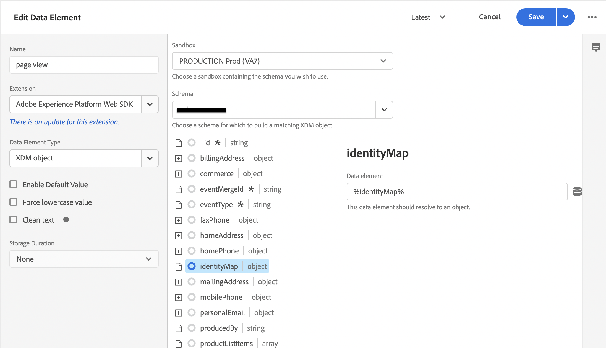

# Coletar dados do Commerce usando tags do Adobe Experience Platform

Embora você possa usar a extensão [!DNL Data Connection] para publicar e assinar eventos de vitrine eletrônica, alguns comerciantes já podem estar usando uma solução de coleção de dados, como as [marcas Adobe Experience Platform](https://experienceleague.adobe.com/docs/platform-learn/data-collection/tags/create-a-property.html?lang=pt-BR). Para esses comerciantes, o Adobe Commerce fornece uma opção somente de publicação na extensão [!DNL Data Connection] que usa o Adobe Commerce Event SDK.

![[!DNL Data Connection] Fluxo de Dados de Extensão](assets/tags-data-flow.png)
Fluxo de Dados de Extensão _[!DNL Data Connection]com Marcas_

Neste tópico, você aprenderá a mapear os valores de evento da loja fornecidos pela extensão [!DNL Data Connection] para a solução de tags da Adobe Experience Platform que você já está usando.

## Coletar dados do evento do Adobe Commerce

Para coletar dados do evento do Commerce:

- Instale o [Adobe Commerce Events SDK](https://github.com/adobe/commerce-events/tree/main/packages/storefront-events-sdk). Para vitrines do PHP, consulte o tópico [instalar](install.md). Para vitrines do PWA Studio, consulte o [guia do PWA Studio](https://developer.adobe.com/commerce/pwa-studio/integrations/adobe-commerce/aep/).

  >[!NOTE]
  >
  > **não** [configure](connect-data.md) a ID da organização e a ID da sequência de dados.

## Mapear dados da vitrine do Commerce para o Adobe Experience Platform

Para mapear dados da vitrine da Commerce para o Adobe Experience Platform, configure e instale o seguinte nas tags da Adobe Experience Platform:

1. [Configure uma propriedade de marca](https://experienceleague.adobe.com/docs/platform-learn/implement-in-websites/configure-tags/create-a-property.html?lang=pt-BR) na Coleção de dados da Adobe Experience Platform.

1. Em **Criação**, selecione **Extensões** e instale e configure as seguintes extensões:

   - [Camada de dados de clientes Adobe](https://experienceleague.adobe.com/docs/experience-platform/tags/extensions/client/client-data-layer/overview.html?lang=pt-BR)

   - [Adobe Experience Platform Web SDK](https://experienceleague.adobe.com/docs/experience-platform/edge/fundamentals/installing-the-sdk.html?lang=pt-BR)

1. [Publicar marca](https://experienceleague.adobe.com/docs/experience-platform/tags/publish/overview.html?lang=pt-BR) no ambiente de desenvolvimento.

1. Siga as etapas do **Mapeamento de Eventos** abaixo para configurar elementos de dados e regras para eventos específicos.

### Mapeamento de eventos

Como a coleta de dados usando tags é diferente do uso do Adobe Commerce Event SDK, é importante entender os termos equivalentes usados em ambas as estruturas.

| Termo das tags do Adobe Experience Platform | Termo do Adobe Commerce Event SDK |
|---|---|
| _elementos de dados_ | contexto |
| _regras_ | evento |
|  | _condições da regra_ - ouvintes de eventos (de ACDL)<br><br>_ações da regra_ - manipuladores de eventos (enviar para o Adobe Experience Platform) |

Ao atualizar os elementos de dados e as regras nas tags do Adobe Experience Platform com dados do evento específicos da Adobe Commerce, há algumas etapas comuns que você deve seguir.

Por exemplo, vamos adicionar o evento `signOut` do Adobe Commerce às tags da Adobe Experience Platform. As etapas descritas abaixo, exceto os valores específicos que você definiu, descrevem como adicionar [elementos de dados](https://experienceleague.adobe.com/docs/experience-platform/collection/e2e.html?lang=pt-BR#data-element) e [regras](https://experienceleague.adobe.com/docs/experience-platform/collection/e2e.html?lang=pt-BR#create-a-rule), que se aplicam a todos os eventos do Adobe Commerce que você está adicionando às marcas.

1. Criar um elemento de dados:

   
   _Criar novo elemento de dados_

1. Definir **Nome** como `sign out`.

1. Definir **Extensão** para `Adobe Experience Platform Web SDK`.

1. Definir **Tipo de Elemento de Dados** como `XDM object`.

1. Selecione a **Sandbox** e o **Esquema** que deseja atualizar.

1. Em **userAccount** > **logout**, defina o **value** no **Logout do visitante** como `1`.

   
   _Atualizar valor de Saída_

1. Selecione **Salvar**.

1. Criar uma regra:

   
   _Criar nova regra_

1. Selecione **Adicionar** em **EVENTOS**.

1. Definir **Extensão** para `Adobe Client Data Layer`.

1. Definir **Tipo de Evento** como `Data Pushed`.

1. Selecione **Evento Específico** e defina o **Evento/Chave para registrar-se em** como `sign-out`.

1. Selecione **Manter alterações** para salvar a nova regra.

1. Adicione uma ação.

1. Definir **Extensão** para `Adobe Experience Platform Web SDK`.

1. Definir **Tipo de Ação** como `Send Event`.

1. Definir **Instância** como `Alloy`.

1. Defina **Type** como `userAccount.logout`.

1. Definir **dados XDM** a `%sign out%`.

1. Clique em **Salvar**.

   Você criou um elemento de dados em seu esquema para o evento `signOut` da Adobe Commerce. Além disso, você criou uma regra com uma ação específica que deve ocorrer quando esse evento é acionado na loja do Adobe Commerce.

Repita as etapas acima nas tags para cada um dos eventos do Adobe Commerce descritos abaixo.

## Eventos disponíveis

Para cada um dos eventos a seguir, mapeie os eventos do Adobe Commerce para o XDM seguindo as etapas acima.

- [&quot;signOut&quot;](#signout)
- [&quot;signIn&quot;](#signin)
- [&quot;createAccount&quot;](#createaccount)
- [`editAccount`](#editaccount)
- [&quot;pageView&quot;](#pageview)
- [&quot;productView&quot;](#productview)
- [&quot;searchRequestSent&quot;](#searchrequestsent)
- [&quot;searchResponseReceived&quot;](#searchresponsereceived)
- [&quot;addToCart&quot;](#addtocart)
- [&quot;openCart&quot;](#opencart)
- [&quot;viewCart&quot;](#viewcart)
- [&quot;removeFromCart&quot;](#removefromcart)
- [&quot;initiateCheckout&quot;](#initiatecheckout)
- [&quot;placeOrder&quot;](#placeorder)

### signOut

Acionado quando um comprador tenta sair.

#### Elementos de dados

Crie o seguinte elemento de dados:

1. Sair:

   - **Nome**: `Sign out`
   - **Extensão**: `Adobe Experience Platform Web SDK`
   - **Tipo de Elemento de Dados**: `XDM object`
   - **Grupo de Campos**: `userAccount` > `logout`
   - **Logout do Visitante**: **Valor** = `1`

#### Regras 

- **Nome**: `Sign out`
- **Extensão**: `Adobe Client Data Layer`
- **Tipo de evento**: `Data Pushed`
- **Evento específico**: `sign-out`

##### Ações

- **Extensão**: `Adobe Experience Platform Web SDK`
- **Tipo de ação**: `Send event`
- **Tipo**: `userAccount.logout`
- **Dados XDM**: `%sign-out%`

### signIn

Acionado quando um comprador tenta entrar.

#### Elementos de dados

Crie os seguintes elementos de dados:

1. Email da conta:

   - **Nome**: `account email`
   - **Extensão**: `Adobe Client Data Layer`
   - **Tipo de Elemento de Dados**: `Data Layer Computed State`
   - **[Opcional] caminho**: `accountContext.emailAddress`

1. Tipo de conta:

   - **Nome**: `account type`
   - **Extensão**: `Adobe Client Data Layer`
   - **Tipo de Elemento de Dados**: `Data Layer Computed State`
   - **[Opcional] caminho**: `accountContext.accountType`

1. ID da conta:

   - **Nome**: `account id`
   - **Extensão**: `Adobe Client Data Layer`
   - **Tipo de Elemento de Dados**: `Data Layer Computed State`
   - **[Opcional] caminho***: `accountContext.accountId`

1. Entrar:

   - **Nome**: `sign in`
   - **Extensão**: `Adobe Experience Platform Web SDK`
   - **Tipo de Elemento de Dados**: `XDM object`
   - **Grupo de Campos**: `person` > `accountID`
   - **ID da Conta**: **Valor** = `%account id%`
   - **Grupo de Campos**: `person` > `accountType`
   - **Tipo de Conta**: **Valor** = `%account type%`
   - **Grupo de Campos**: `person` > `personalEmailID`
   - **Endereço de Email Pessoal**: **Valor** = `%account email%`
   - **Grupo de Campos**: `personalEmail` > `address`
   - **Endereço**: **Valor** = `%account email%`
   - **Grupo de Campos**: `userAccount` > `login`
   - **Logon do Visitante**: **Valor** = `1`

#### Regras 

- **Nome**: `sign in`
- **Extensão**: `Adobe Client Data Layer`
- **Tipo de evento**: `Data Pushed`
- **Evento específico**: `sign-in`

##### Ações

- **Extensão**: `Adobe Experience Platform Web SDK`
- **Tipo de ação**: `Send event`
- **Tipo**: `userAccount.login`
- **Dados XDM**: `%sign in%`

### createAccount

Disparado quando um comprador tenta criar uma conta.

#### Elementos de dados

Crie os seguintes elementos de dados:

1. Email da conta:

   - **Nome**: `account email`
   - **Extensão**: `Adobe Client Data Layer`
   - **Tipo de Elemento de Dados**: `Data Layer Computed State`
   - **[Opcional] caminho**: `accountContext.emailAddress`

1. Tipo de conta:

   - **Nome**: `account type`
   - **Extensão**: `Adobe Client Data Layer`
   - **Tipo de Elemento de Dados**: `Data Layer Computed State`
   - **[Opcional] caminho**: `accountContext.accountType`

1. ID da conta:

   - **Nome**: `account id`
   - **Extensão**: `Adobe Client Data Layer`
   - **Tipo de Elemento de Dados**: `Data Layer Computed State`
   - **[Opcional] caminho**: `accountContext.accountId`

1. Criar conta:

   - **Nome**: `Create account`
   - **Extensão**: `Adobe Experience Platform Web SDK`
   - **Tipo de Elemento de Dados**: `XDM object`
   - **Grupo de Campos**: `person` > `accountID`
   - **ID da Conta**: **Valor** = `%account id%`
   - **Grupo de Campos**: `person` > `accountType`
   - **Tipo de Conta**: **Valor** = `%account type%`
   - **Grupo de Campos**: `person` > `personalEmailID`
   - **Endereço de Email Pessoal**: **Valor** = `%account email%`
   - **Grupo de Campos**: `personalEmail` > `address`
   - **Endereço**: **Valor** = `%account email%`
   - **Grupo de Campos**: `userAccount` > `createProfile`
   - **Criação de Perfil de Conta**: **Valor** = `1`

#### Regras 

- **Nome**: `Create account`
- **Extensão**: `Adobe Client Data Layer`
- **Tipo de evento**: `Data Pushed`
- **Evento específico**: `create-account`

##### Ações

- **Extensão**: `Adobe Experience Platform Web SDK`
- **Tipo de ação**: `Send event`
- **Tipo**: `userAccount.createProfile`
- **Dados XDM**: `%create account%`

### editAccount

Disparado quando um comprador tenta editar uma conta.

#### Elementos de dados

Crie os seguintes elementos de dados:

1. Email da conta:

   - **Nome**: `account email`
   - **Extensão**: `Adobe Client Data Layer`
   - **Tipo de Elemento de Dados**: `Data Layer Computed State`
   - **[Opcional] caminho**: `accountContext.emailAddress`

1. Tipo de conta:

   - **Nome**: `account type`
   - **Extensão**: `Adobe Client Data Layer`
   - **Tipo de Elemento de Dados**: `Data Layer Computed State`
   - **[Opcional] caminho**: `accountContext.accountType`

1. ID da conta:

   - **Nome**: `account id`
   - **Extensão**: `Adobe Client Data Layer`
   - **Tipo de Elemento de Dados**: `Data Layer Computed State`
   - **[Opcional] caminho**: `accountContext.accountId`

1. Editar conta:

   - **Nome**: `Edit account`
   - **Extensão**: `Adobe Experience Platform Web SDK`
   - **Tipo de Elemento de Dados**: `XDM object`
   - **Grupo de Campos**: `person` > `accountID`
   - **ID da Conta**: **Valor** = `%account id%`
   - **Grupo de Campos**: `person` > `accountType`
   - **Tipo de Conta**: **Valor** = `%account type%`
   - **Grupo de Campos**: `person` > `personalEmailID`
   - **Endereço de Email Pessoal**: **Valor** = `%account email%`
   - **Grupo de Campos**: `personalEmail` > `address`
   - **Endereço**: **Valor** = `%account email%`
   - **Grupo de Campos**: `userAccount` > `updateProfile`
   - **Criação de Perfil de Conta**: **Valor** = `1`

#### Regras

- **Nome**: `Edit account`
- **Extensão**: `Adobe Client Data Layer`
- **Tipo de evento**: `Data Pushed`
- **Evento específico**: `edit-account`

##### Ações

- **Extensão**: `Adobe Experience Platform Web SDK`
- **Tipo de ação**: `Send event`
- **Tipo**: `userAccount.updateProfile`
- **Dados XDM**: `%edit account%`

### pageView

Acionado quando qualquer página é carregada.

#### Elementos de dados

Crie os seguintes elementos de dados:

1. Nome da página:

   - **Nome**: `page name`
   - **Extensão**: `Adobe Client Data Layer`
   - **Tipo de Elemento de Dados**: `Data Layer Computed State`
   - **[Opcional] caminho**: `pageContext.pageName`

#### Regras 

- **Nome**: `page view`
- **Extensão**: `Adobe Client Data Layer`
- **Tipo de evento**: `Data Pushed`
- **Evento específico**: `page-view`

##### Ações

- **Extensão**: `Adobe Experience Platform Web SDK`
- **Tipo de ação**: `Send event`
- **Tipo**: `web.webPageDetails.pageViews`
- **Dados XDM**: `%page view%`

### productView

Acionado quando qualquer página de produto é carregada.

#### Elementos de dados

Crie os seguintes elementos de dados:

1. Nome do produto:

   - **Nome**: `product name`
   - **Extensão**: `Adobe Client Data Layer`
   - **Tipo de Elemento de Dados**: `Data Layer Computed State`
   - **[Opcional] caminho**: `productContext.name`

1. SKU do produto:

   - **Nome**: `product sku`
   - **Extensão**: `Adobe Client Data Layer`
   - **Tipo de Elemento de Dados**: `Data Layer Computed State`
   - **[Opcional] caminho**: `productContext.sku`

1. URL da imagem do produto:

   - **Nome**: `product image`
   - **Extensão**: `Adobe Client Data Layer`
   - **Tipo de Elemento de Dados**: `Data Layer Computed State`
   - **[Opcional] caminho**: `productContext.mainImageUrl`

1. Moeda do produto:

   - **Nome**: `product currency`
   - **Extensão**: `Adobe Client Data Layer`
   - **Tipo de Elemento de Dados**: `Data Layer Computed State`
   - **[Opcional] caminho**: `productContext.pricing.currencyCode`

1. Código da moeda:

   - **Nome**: `currency code`
   - **Extensão**: `Core`
   - **Tipo de Elemento de Dados**: `Custom Code`
   - **Abrir Editor**:

   ```bash
   return _satellite.getVar('product currency') || _satellite.getVar('storefront').storeViewCurrencyCode
   ```

1. Preço especial:

   - **Nome**: `special price`
   - **Extensão**: `Adobe Client Data Layer`
   - **Tipo de Elemento de Dados**: `Data Layer Computed State`
   - **[Opcional] caminho**: `productContext.pricing.specialPrice`

1. Preço normal:

   - **Nome**: `regular price`
   - **Extensão**: `Adobe Client Data Layer`
   - **Tipo de Elemento de Dados**: `Data Layer Computed State`
   - **[Opcional] caminho**: `productContext.pricing.regularPrice`

1. Preço do produto:

   - **Nome**: `product price`
   - **Extensão**: `Core`
   - **Tipo de Elemento de Dados**: `Custom Code`
   - **Abrir Editor**:

   ```bash
   return _satellite.getVar('product regular price') || _satellite.getVar('product special price')
   ```

1. Exibição do produto:

   - **Nome**: `product view`
   - **Extensão**: `Adobe Experience Platform Web SDK`
   - **Tipo de Elemento de Dados**: `XDM object`
   - **Grupo de Campos**: `productListItems`. Selecione **Fornecer itens individuais** e clique no botão **Adicionar item**. Como essa exibição é para um PDP, é possível preencher com um único item.
   - **Grupo de Campos**: `productListItems` > `name`
   - **Nome**: **Valor** = `%product name%`
   - **Grupo de Campos**: `productListItems` > `SKU`
   - **SKU**: **Valor** = `%product sku%`
   - **Grupo de Campos**: `productListItems` > `priceTotal`
   - **Preço total**: **Valor** = `%product price%`
   - **Grupo de Campos**: `productListItems` > `currencyCode`
   - **Código de moeda**: **Valor** = `%currency code%`
   - **Grupo de Campos**: `productListItems` > `ProductImageUrl`
   - **ProductImageUrl**: **Valor** = `%product image%`
   - **Grupo de Campos**: `commerce` > `productViews` > `value`
   - **valor**: **Valor** = `1`

#### Regras 

- **Nome**: `product view`
- **Extensão**: `Adobe Client Data Layer`
- **Tipo de evento**: `Data Pushed`
- **Evento específico**: `product-page-view`

##### Ações

- **Extensão**: `Adobe Experience Platform Web SDK`
- **Tipo de ação**: `Send event`
- **Tipo**: `commerce.productViews`
- **Dados XDM**: `%product view%`

### searchRequestSent

Acionado por eventos no popover &quot;pesquisar ao digitar&quot; e por eventos nas páginas de resultados da pesquisa.

#### Elementos de dados

Crie os seguintes elementos de dados:

1. Entrada de pesquisa

   - **Nome**: `search input`
   - **Extensão**: `Adobe Client Data Layer`
   - **Tipo de Elemento de Dados**: `Data Layer Computed State`
   - **[Opcional] caminho**: `searchInputContext.units[0]`

1. Pesquisar frase de entrada

   - **Nome**: `search input phrase`
   - **Extensão**: `Core`
   - **Tipo de Elemento de Dados**: `Custom Code`
   - **Abrir Editor**:

   ```bash
   return _satellite.getVar('search input').phrase;
   ```

1. Pesquisar classificação de entrada

   - **Nome**: `search input sort`
   - **Extensão**: `Core`
   - **Tipo de Elemento de Dados**: `Custom Code`
   - **Abrir Editor**:

   ```bash
   const searchInput = _satellite.getVar('search input');
   const sortFromInput = searchInput ? searchInput.sort : [];
   const sort = sortFromInput.map((searchSort) => {
       return {
           attribute: searchSort.attribute,
           order: searchSort.direction,
       };
   });
   return sort;
   ```

1. Pesquisar filtros de entrada

   - **Nome**: `search input filters`
   - **Extensão**: `Core`
   - **Tipo de Elemento de Dados**: `Custom Code`
   - **Abrir Editor**:

   ```bash
   const searchInput = _satellite.getVar('search input');
   const filtersFromInput = searchInput ? searchInput.filter : [];
   const filters = filtersFromInput.map(
       (searchFilter) => {
           let value = [];
           let isRange = false;
           if (searchFilter.eq) {
               value.push(searchFilter.eq);
           } else if (searchFilter.in) {
               value = searchFilter.in;
           } else if (searchFilter.range) {
               isRange = true;
               value.push(String(searchFilter.range.from));
               value.push(String(searchFilter.range.to));
           }
           return {
               attribute: searchFilter.attribute,
               value,
               isRange,
           };
       }
   );
   
   return filters;
   ```

1. Solicitação de pesquisa:

   - **Nome**: `search request`
   - **Extensão**: `Adobe Experience Platform Web SDK`
   - **Tipo de Elemento de Dados**: `XDM object`
   - **Grupo de Campos**: `siteSearch` > `phrase`
   - **value**: ainda não disponível
   - **Grupo de Campos**: `siteSearch` > `sort`. Selecione **Fornecer todo o objeto**.
   - **Grupo de Campos**: `siteSearch` > `filter`. Selecione **Fornecer todo o objeto**.
   - **Grupo de Campos**: `searchRequest` > `id`
   - **Identificador Exclusivo**: **Valor** = `%search request ID%`
   - **Grupo de Campos**: `searchRequest` > `value`
   - **valor**: **Valor** = `1`

#### Regras 

- **Nome**: `search request sent`
- **Extensão**: `Adobe Client Data Layer`
- **Tipo de evento**: `Data Pushed`
- **Evento específico**: `search-request-sent`

##### Ações

- **Extensão**: `Adobe Experience Platform Web SDK`
- **Tipo de ação**: `Send event`
- **Tipo**: `searchRequest`
- **Dados XDM**: `%search request%`

### searchResponseReceived

Acionado quando o Live Search retorna resultados para o pop-over &quot;pesquisar ao digitar&quot; ou para a página de resultados da pesquisa.

#### Elementos de dados

Crie os seguintes elementos de dados:

1. Resultados da pesquisa:

   - **Nome**: `search results`
   - **Extensão**: `Adobe Client Data Layer`
   - **Tipo de Elemento de Dados**: `Data Layer Computed State`
   - **[Opcional] caminho**: `searchResultsContext.units[0]`

1. Número de produtos do resultado da pesquisa:

   - **Nome**: `search result number of products`
   - **Extensão**: `Core`
   - **Tipo de Elemento de Dados**: `Custom Code`
   - **Abrir Editor**:

   ```bash
   return _satellite.getVar('search result').products.length;
   ```

1. Produtos com resultados de pesquisa:

   - **Nome**: `search result products`
   - **Extensão**: `Core`
   - **Tipo de Elemento de Dados**: `Custom Code`
   - **Abrir Editor**:

   ```bash
   const searchResult = _satellite.getVar('search result');
   const productsFromResult = searchResult.products ? searchResult.products : [];
   const products = productsFromResult.map(
       (product) => {
           return { SKU: product.sku, name: product.name };
       }
   );
   return products;
   ```

1. Sugestões de resultados da pesquisa:

   - **Nome**: `search result products`
   - **Extensão**: `Core`
   - **Tipo de Elemento de Dados**: `Custom Code`
   - **Abrir Editor**:

   ```bash
   const searchResult = _satellite.getVar('search result');
   const suggestionsFromResult = searchResult.suggestions ? searchResult.suggestions : [];
   const suggestions = suggestionsFromResult.map((suggestion) => suggestion.suggestion);
   return suggestions;
   ```

1. URL da imagem do produto:

   - **Nome**: `product image`
   - **Extensão**: `Adobe Client Data Layer`
   - **Tipo de Elemento de Dados**: `Data Layer Computed State`
   - **[Opcional] caminho**: `productContext.mainImageUrl`

1. Resposta da pesquisa:

   - **Nome**: `search response`
   - **Extensão**: `Adobe Experience Platform Web SDK`
   - **Tipo de Elemento de Dados**: `XDM object`
   - **Grupo de Campos**: `siteSearch` > `suggestions`. Selecione **Fornecer todo o objeto**.
   - **Elemento de dados**: `%search result suggestions%`
   - **Grupo de Campos**: `siteSearch` > `numberOfResults`
   - **valor**: `%search result number of products%`
   - **Grupo de Campos**: `productListItems`. Selecione **Fornecer todo o objeto**.
   - **Grupo de Campos**: `productListItems` > `ProductImageUrl`
   - **ProductImageUrl**: **Valor** = `%product image%`
   - **Elemento de dados**: `%search result products%`
   - **Grupo de Campos**: `searchResponse` > `id`
   - **Identificador Exclusivo**: **Valor** = `%search response ID%`
   - **Grupo de Campos**: `searchResponse` > `value`
   - **valor**: **Valor** = `1`

#### Regras 

- **Nome**: `search response received`
- **Extensão**: `Adobe Client Data Layer`
- **Tipo de evento**: `Data Pushed`
- **Evento específico**: `search-response-received`

##### Ações

- **Extensão**: `Adobe Experience Platform Web SDK`
- **Tipo de ação**: `Send event`
- **Tipo**: `searchResponse`
- **Dados XDM**: `%search response%`

### addToCart

Acionado quando um produto é adicionado a um carrinho ou sempre que a quantidade de um produto no carrinho é incrementada.

#### Elementos de dados

Crie os seguintes elementos de dados:

1. Nome do produto:

   - **Nome**: `product name`
   - **Extensão**: `Adobe Client Data Layer`
   - **Tipo de Elemento de Dados**: `Data Layer Computed State`
   - **[Opcional] caminho**: `productContext.name`

1. SKU do produto:

   - **Nome**: `product sku`
   - **Extensão**: `Adobe Client Data Layer`
   - **Tipo de Elemento de Dados**: `Data Layer Computed State`
   - **[Opcional] caminho**: `productContext.sku`

1. Código da moeda:

   - **Nome**: `currency code`
   - **Extensão**: `Adobe Client Data Layer`
   - **Tipo de Elemento de Dados**: `Data Layer Computed State`
   - **[Opcional] caminho**: `productContext.pricing.currencyCode`

1. Preço especial do produto:

   - **Nome**: `product special price`
   - **Extensão**: `Adobe Client Data Layer`
   - **Tipo de Elemento de Dados**: `Data Layer Computed State`
   - **[Opcional] caminho**: `productContext.pricing.specialPrice`

1. URL da imagem do produto:

   - **Nome**: `product image`
   - **Extensão**: `Adobe Client Data Layer`
   - **Tipo de Elemento de Dados**: `Data Layer Computed State`
   - **[Opcional] caminho**: `productContext.mainImageUrl`

1. Preço normal do produto:

   - **Nome**: `product regular price`
   - **Extensão**: `Adobe Client Data Layer`
   - **Tipo de Elemento de Dados**: `Data Layer Computed State`
   - **[Opcional] caminho**: `productContext.pricing.regularPrice`

1. Produto  preço:

   - **Nome**: `product price`
   - **Extensão**: `Core`
   - **Tipo de Elemento de Dados**: `Custom Code`
   - **Abrir Editor**:

   ```bash
   return _satellite.getVar('product regular price') || _satellite.getVar('product special price') 
   ```

1. Carrinho:

   - **Nome**: `cart`
   - **Extensão**: `Adobe Client Data Layer`
   - **Tipo de Elemento de Dados**: `Data Layer Computed State`
   - **[Opcional] caminho**: `shoppingCartContext`

1. ID do carrinho:

   - **Nome**: `cart id`
   - **Extensão**: `Core`
   - **Tipo de Elemento de Dados**: `Custom Code`
   - **Abrir Editor**:

   ```bash
   return _satellite.getVar('cart').id
   ```

1. Adicionar ao carrinho:

   - **Nome**: `add to cart`
   - **Extensão**: `Adobe Experience Platform Web SDK`
   - **Tipo de Elemento de Dados**: `XDM object`
   - **Grupo de Campos**: `productListItems`. Selecione **Fornecer itens individuais** e clique no botão **Adicionar item**. Como essa exibição é para um PDP, é possível preencher com um único item.
   - **Grupo de Campos**: `productListItems` > `name`
   - **Nome**: **Valor** = `%product name%`
   - **Grupo de Campos**: `productListItems` > `SKU`
   - **SKU**: **Valor** = `%product sku%`
   - **Grupo de Campos**: `productListItems` > `priceTotal`
   - **Preço total**: **Valor** = `%product price%`
   - **Grupo de Campos**: `productListItems` > `currencyCode`
   - **Grupo de Campos**: `productListItems` > `ProductImageUrl`
   - **ProductImageUrl**: **Valor** = `%product image%`
   - **Código de moeda**: **Valor** = `%currency code%`
   - **Grupo de Campos**: `commerce` > `cart` > `cartID`
   - **ID do carrinho**: **Valor** = `%cart id%`
   - **Grupo de Campos**: `commerce` > `productListAdds` > `value`
   - **valor**: **Valor** = `1`

#### Regras 

- **Nome**: `add to cart`
- **Extensão**: `Adobe Client Data Layer`
- **Tipo de evento**: `Data Pushed`
- **Evento específico**: `add-to-cart`

##### Ações

- **Extensão**: `Adobe Experience Platform Web SDK`
- **Tipo de ação**: `Send event`
- **Tipo**: `commerce.productListAdds`
- **Dados XDM**: `%add to cart%`

### openCart

Disparado quando um novo carrinho é criado, o que acontece quando um produto é adicionado a um carrinho vazio.

#### Elementos de dados

Crie o seguinte elemento de dados:

1. Abrir carrinho:

   - **Nome**: `open cart`
   - **Extensão**: `Adobe Experience Platform Web SDK`
   - **Tipo de Elemento de Dados**: `XDM object`
   - **Grupo de Campos**: `commerce` > `productListOpens` > `value`
   - **valor**: **Valor** = `1`
   - **Grupo de Campos**: `commerce` > `cart` > `cartID`
   - **ID do carrinho**: **Valor** = `%cart id%`
   - **Grupo de Campos**: `productListItems`. Para `productListItems`, vários itens podem ser pré-calculados. Selecione **productListItems** > **Fornecer toda a matriz**.

#### Regras 

- **Nome**: `open cart`
- **Extensão**: `Adobe Client Data Layer`
- **Tipo de evento**: `Data Pushed`
- **Evento específico**: `open-cart`

##### Ações

- **Extensão**: `Adobe Experience Platform Web SDK`
- **Tipo de ação**: `Send event`
- **Tipo**: `commerce.productListOpens`
- **Dados XDM**: `%open cart%`

### viewCart

Disparado quando qualquer página do carrinho é carregada.

#### Elementos de dados

Crie os seguintes elementos de dados:

1. Loja:

   - **Nome**: `storefront`
   - **Extensão**: `Adobe Client Data Layer`
   - **Tipo de Elemento de Dados**: `Data Layer Computed State`
   - **[Opcional] caminho**: `storefrontInstanceContext`

1. URL da imagem do produto:

   - **Nome**: `product image`
   - **Extensão**: `Adobe Client Data Layer`
   - **Tipo de Elemento de Dados**: `Data Layer Computed State`
   - **[Opcional] caminho**: `productContext.mainImageUrl`

   1. Carrinho:

   - **Nome**: `cart`
   - **Extensão**: `Adobe Client Data Layer`
   - **Tipo de Elemento de Dados**: `Data Layer Computed State`
   - **[Opcional] caminho**: `shoppingCartContext`

1. ID do carrinho:

   - **Nome**: `cart id`
   - **Extensão**: `Core`
   - **Tipo de Elemento de Dados**: `Custom Code`
   - **Abrir Editor**:

   ```bash
   return _satellite.getVar('cart').id
   ```

1. Itens da lista de produtos:

   - **Nome**: `product list items:`
   - **Extensão**: `Core`
   - **Tipo de Elemento de Dados**: `Custom Code`
   - **Abrir Editor**:

   ```bash
   const storefrontContext = _satellite.getVar('storefront');
   const cart = _satellite.getVar('cart');
   
   const returnList = [];
   cart.items.forEach(item => {
       const selectedOptions = [];
       item.configurableOptions?.forEach(option => {
           selectedOptions.push({
               attribute: option.optionLabel,
               value: option.valueLabel,
           });
       });
   
       const productListItem = {
           SKU: item.product.sku,
           name: item.product.name,
           quantity: item.quantity,
           priceTotal: item.prices.price.value * item.quantity,
           currencyCode: item.prices.price.currency ? item.prices.price.currency : storefrontContext.storeViewCurrencyCode,
           selectedOptions: selectedOptions,
       };
   
       returnList.push(productListItem);
   });
   return returnList;
   ```

1. Exibir carrinho:

   - **Nome**: `view cart`
   - **Extensão**: `Adobe Experience Platform Web SDK`
   - **Tipo de Elemento de Dados**: `XDM object`
   - **Grupo de Campos**: `productListItems`. Para `productListItems`, pode haver vários itens pré-calculados. Selecione **productListItems** > **Popular toda a matriz**.
   - **Elemento de dados**: `%product list items%`
   - **Grupo de Campos**: `productListItems` > `ProductImageUrl`
   - **ProductImageUrl**: **Valor** = `%product image%`
   - **Grupo de Campos**: `commerce` > `cart` > `cartID`
   - **ID do carrinho**: **Valor** = `%cart id%`
   - **Grupo de Campos**: `commerce` > `productListViews` > `value`
   - **valor**: **Valor** = `1`

#### Regras

- **Nome**: `view cart`
- **Extensão**: `Adobe Client Data Layer`
- **Tipo de evento**: `Data Pushed`
- **Evento específico**: `shopping-cart-view`

##### Ações

- **Extensão**: `Adobe Experience Platform Web SDK`
- **Tipo de ação**: `Send event`
- **Tipo**: `commerce.productListViews`
- **Dados XDM**: `%view cart%`

### removeFromCart

Acionado quando um produto é removido de um carrinho ou sempre que a quantidade de um produto no carrinho é reduzida.

#### Elementos de dados

Crie os seguintes elementos de dados:

1. Nome do produto:

   - **Nome**: `product name`
   - **Extensão**: `Adobe Client Data Layer`
   - **Tipo de Elemento de Dados**: `Data Layer Computed State`
   - **[Opcional] caminho**: `productContext.name`

1. SKU do produto:

   - **Nome**: `product sku`
   - **Extensão**: `Adobe Client Data Layer`
   - **Tipo de Elemento de Dados**: `Data Layer Computed State`
   - **[Opcional] caminho**: `productContext.sku`

1. Código da moeda:

   - **Nome**: `currency code`
   - **Extensão**: `Adobe Client Data Layer`
   - **Tipo de Elemento de Dados**: `Data Layer Computed State`
   - **[Opcional] caminho**: `productContext.pricing.currencyCode`

1. Preço especial do produto:

   - **Nome**: `product special price`
   - **Extensão**: `Adobe Client Data Layer`
   - **Tipo de Elemento de Dados**: `Data Layer Computed State`
   - **[Opcional] caminho**: `productContext.pricing.specialPrice`

1. Preço normal do produto:

   - **Nome**: `product regular price`
   - **Extensão**: `Adobe Client Data Layer`
   - **Tipo de Elemento de Dados**: `Data Layer Computed State`
   - **[Opcional] caminho**: `productContext.pricing.regularPrice`

1. Produto  preço:

   - **Nome**: `product price`
   - **Extensão**: `Core`
   - **Tipo de Elemento de Dados**: `Custom Code`
   - **Abrir Editor**:

   ```bash
   return _satellite.getVar('product regular price') || _satellite.getVar('product special price') 
   ```

1. Carrinho:

   - **Nome**: `cart`
   - **Extensão**: `Adobe Client Data Layer`
   - **Tipo de Elemento de Dados**: `Data Layer Computed State`
   - **[Opcional] caminho**: `shoppingCartContext`

1. ID do carrinho:

   - **Nome**: `cart id`
   - **Extensão**: `Core`
   - **Tipo de Elemento de Dados**: `Custom Code`
   - **Abrir Editor**:

   ```bash
   return _satellite.getVar('cart').id
   ```

1. Remover do carrinho:

   - **Nome**: `remove from cart`
   - **Extensão**: `Adobe Experience Platform Web SDK`
   - **Tipo de Elemento de Dados**: `XDM object`
   - **Grupo de Campos**: `productListItems`. Selecione **Fornecer itens individuais** e clique no botão **Adicionar item**. Como essa exibição é para um PDP, é possível preencher com um único item.
   - **Grupo de Campos**: `productListItems` > `name`
   - **Nome**: **Valor** = `%product name%`
   - **Grupo de Campos**: `productListItems` > `SKU`
   - **SKU**: **Valor** = `%product sku%`
   - **Grupo de Campos**: `productListItems` > `priceTotal`
   - **Preço total**: **Valor** = `%product price%`
   - **Grupo de Campos**: `productListItems` > `currencyCode`
   - **Código de moeda**: **Valor** = `%currency code%`
   - **Grupo de Campos**: `commerce` > `cart` > `cartID`
   - **ID do carrinho**: **Valor** = `%cart id%`
   - **Grupo de Campos**: `commerce` > `productListRemovals` > `value`
   - **valor**: **Valor** = `1`

#### Regras 

- **Nome**: `remove from cart`
- **Extensão**: `Adobe Client Data Layer`
- **Tipo de evento**: `Data Pushed`
- **Evento específico**: `remove-from-cart`

##### Ações

- **Extensão**: `Adobe Experience Platform Web SDK`
- **Tipo de ação**: `Send event`
- **Tipo**: `commerce.productListRemovals`
- **Dados XDM**: `%remove from cart%`

### initiateCheckout

Acionado quando o comprador clica em um botão de check-out.

#### Elementos de dados

Crie os seguintes elementos de dados:

1. Loja:

   - **Nome**: `storefront`
   - **Extensão**: `Adobe Client Data Layer`
   - **Tipo de Elemento de Dados**: `Data Layer Computed State`
   - **[Opcional] caminho**: `storefrontInstanceContext`

1. URL da imagem do produto:

   - **Nome**: `product image`
   - **Extensão**: `Adobe Client Data Layer`
   - **Tipo de Elemento de Dados**: `Data Layer Computed State`
   - **[Opcional] caminho**: `productContext.mainImageUrl`

1. Carrinho:

   - **Nome**: `cart`
   - **Extensão**: `Adobe Client Data Layer`
   - **Tipo de Elemento de Dados**: `Data Layer Computed State`
   - **[Opcional] caminho**: `shoppingCartContext`

1. ID do carrinho:

   - **Nome**: `cart id`
   - **Extensão**: `Core`
   - **Tipo de Elemento de Dados**: `Custom Code`
   - **Abrir Editor**:

   ```bash
   return _satellite.getVar('cart').id
   ```

1. Itens da lista de produtos:

   - **Nome**: `product list items`
   - **Extensão**: `Core`
   - **Tipo de Elemento de Dados**: `Custom Code`
   - **Abrir Editor**:

   ```bash
   const storefrontContext = _satellite.getVar('storefront');
   const cart = _satellite.getVar('cart');
   
   const returnList = [];
   cart.items.forEach(item => {
       const selectedOptions = [];
       item.configurableOptions?.forEach(option => {
           selectedOptions.push({
               attribute: option.optionLabel,
               value: option.valueLabel,
           });
       });
   
       const productListItem = {
           SKU: item.product.sku,
           name: item.product.name,
           quantity: item.quantity,
           priceTotal: item.prices.price.value * item.quantity,
           currencyCode: item.prices.price.currency ? item.prices.price.currency : storefrontContext.storeViewCurrencyCode,
           selectedOptions: selectedOptions,
       };
   
       returnList.push(productListItem);
   });
   return returnList;
   ```

1. Iniciar check-out:

   - **Nome**: `initiate checkout`
   - **Extensão**: `Adobe Experience Platform Web SDK`
   - **Tipo de Elemento de Dados**: `XDM object`
   - **Grupo de Campos**: `productListItems`. Para `productListItems`, pode haver vários itens pré-calculados. Selecione **productListItems** > **Popular toda a matriz**.
   - **Elemento de dados**: `%product list items%`
   - **Grupo de Campos**: `productListItems` > `ProductImageUrl`
   - **ProductImageUrl**: **Valor** = `%product image%`
   - **Grupo de Campos**: `commerce` > `cart` > `cartID`
   - **ID do carrinho**: **Valor** = `%cart id%`
   - **Grupo de Campos**: `commerce` > `checkouts` > `value`
   - **valor**: **Valor** = `1`

#### Regras 

- **Nome**: `initiate checkout`
- **Extensão**: `Adobe Client Data Layer`
- **Tipo de evento**: `Data Pushed`
- **Evento específico**: `initiate-checkout`

##### Ações

- **Extensão**: `Adobe Experience Platform Web SDK`
- **Tipo de ação**: `Send event`
- **Tipo**: `commerce.checkouts`
- **Dados XDM**: `%initiate checkout%`

### placeOrder

Disparado quando o comprador faz um pedido.

#### Elementos de dados

Crie os seguintes elementos de dados:

1. Email da conta:

   - **Nome**: `account email`
   - **Extensão**: `Adobe Client Data Layer`
   - **Tipo de Elemento de Dados**: `Data Layer Computed State`
   - **[Opcional] caminho**: `accountContext.emailAddress`

1. Loja:

   - **Nome**: `storefront`
   - **Extensão**: `Adobe Client Data Layer`
   - **Tipo de Elemento de Dados**: `Data Layer Computed State`
   - **[Opcional] caminho**: `storefrontInstanceContext`

1. URL da imagem do produto:

   - **Nome**: `product image`
   - **Extensão**: `Adobe Client Data Layer`
   - **Tipo de Elemento de Dados**: `Data Layer Computed State`
   - **[Opcional] caminho**: `productContext.mainImageUrl`

1. Carrinho:

   - **Nome**: `cart`
   - **Extensão**: `Adobe Client Data Layer`
   - **Tipo de Elemento de Dados**: `Data Layer Computed State`
   - **[Opcional] caminho**: `shoppingCartContext`

1. ID do carrinho:

   - **Nome**: `cart id`
   - **Extensão**: `Core`
   - **Tipo de Elemento de Dados**: `Custom Code`
   - **Abrir Editor**:

   ```bash
   return _satellite.getVar('cart').id
   ```

1. Ordem:

   - **Nome**: `order`
   - **Extensão**: `Adobe Client Data Layer`
   - **Tipo de Elemento de Dados**: `Data Layer Computed State`
   - **[Opcional] caminho**: `orderContext`

1. Pedido do Commerce:

   - **Nome**: `commerce order`
   - **Extensão**: `Core`
   - **Tipo de Elemento de Dados**: `Custom Code`
   - **Abrir Editor**:

   ```bash
   const order = _satellite.getVar('order');
   const storefront = _satellite.getVar('storefront');
   
   if (order.payments && order.payments.length) {
       payments = order.payments.map(payment => {
           return {
               paymentAmount: payment.total,
               paymentType: payment.paymentMethodCode,
               transactionID: order.orderId.toString(),
           };
       });
   } else {
       payments = [
           {
               paymentAmount: order.grandTotal,
               paymentType: order.paymentMethodCode,
               transactionID: order.orderId.toString(),
           },
       ];
   }
   
   return {
       purchaseID: order.orderId.toString(),
       currencyCode: storefront.storeViewCurrencyCode,
       payments,
   };
   ```

1. Remessa da ordem:

   - **Nome**: `order shipping`
   - **Extensão**: `Core`
   - **Tipo de Elemento de Dados**: `Custom Code`
   - **Abrir Editor**:

   ```bash
   const order = _satellite.getVar('order');
   return {
       shippingMethod: order.shipping.shippingMethod,
       shippingAmount: order.shipping.shippingAmount || 0,
   }
   ```

1. ID da promoção:

   - **Nome**: `promotion id`
   - **Extensão**: `Core`
   - **Tipo de Elemento de Dados**: `Custom Code`
   - **Abrir Editor**:

   ```bash
   return _satellite.getVar('order').appliedCouponCode
   ```

1. Itens da lista de produtos:

   - **Nome**: `product list items`
   - **Extensão**: `Core`
   - **Tipo de Elemento de Dados**: `Custom Code`
   - **Abrir Editor**:

   ```bash
   const storefrontContext = _satellite.getVar('storefront');
   const cart = _satellite.getVar('cart');
   
   const returnList = [];
   cart.items.forEach(item => {
       const selectedOptions = [];
       item.configurableOptions?.forEach(option => {
           selectedOptions.push({
               attribute: option.optionLabel,
               value: option.valueLabel,
           });
       });
   
       const productListItem = {
           SKU: item.product.sku,
           name: item.product.name,
           quantity: item.quantity,
           priceTotal: item.prices.price.value * item.quantity,
           currencyCode: item.prices.price.currency ? item.prices.price.currency : storefrontContext.storeViewCurrencyCode,
           selectedOptions: selectedOptions,
       };
   
       returnList.push(productListItem);
   });
   return returnList;
   ```

1. Fazer pedido:

   - **Nome**: `place order`
   - **Extensão**: `Adobe Experience Platform Web SDK`
   - **Tipo de Elemento de Dados**: `XDM object`
   - **Grupo de Campos**: `productListItems`. Para `productListItems`, pode haver vários itens pré-calculados. Selecione **productListItems** > **Popular toda a matriz**.
   - **Elemento de dados**: `%product list items%`
   - **Grupo de Campos**: `productListItems` > `ProductImageUrl`
   - **ProductImageUrl**: **Valor** = `%product image%`
   - **Grupo de Campos**: `commerce` > `order`
   - **Identificador Exclusivo**: **Valor** = `%commerce order%`
   - **Grupo de Campos**: `commerce` > `shipping`
   - **Identificador Exclusivo**: **Valor** = `%order shipping%`
   - **Grupo de Campos**: `commerce` > `promotionID`
   - **ID da promoção**: **Valor** = `%promotion id%`
   - **Grupo de Campos**: `commerce` > `purchases` > `value`
   - **valor**: **Valor** = `1`
   - **Endereço de Email Pessoal**: **Valor** = `%account email%`
   - **Grupo de Campos**: `personalEmail` > `address`
   - **Endereço**: **Valor** = `%account email%`

#### Regras 

- **Nome**: `place order`
- **Extensão**: `Adobe Client Data Layer`
- **Tipo de evento**: `Data Pushed`
- **Evento específico**: `place-order`

##### Ações

- **Extensão**: `Adobe Experience Platform Web SDK`
- **Tipo de ação**: `Send event`
- **Tipo**: `commerce.order`
- **Dados XDM**: `%place order%`

## Definir identidade em eventos de vitrine

Os eventos de vitrine contêm informações de perfil baseadas nos campos `personalEmail` (para eventos de conta) e `identityMap` (para todos os outros eventos de vitrine). A extensão [!DNL Data Connection] ingressa e gera perfis com base nesses dois campos. Cada campo, no entanto, tem etapas diferentes a seguir para criar perfis:

>[!NOTE]
>
>Se você tiver uma configuração anterior que depende de campos diferentes, poderá continuar a usá-los.

- `personalEmail` - Aplica-se somente a eventos de conta. Siga as etapas, regras e ações descritas [acima](#createaccount)
- `identityMap` - Aplica-se a todos os outros eventos da loja. Consulte o exemplo a seguir.

### Exemplo

As etapas a seguir mostram como configurar um evento `pageView` com `identityMap` na extensão [!DNL Data Connection]:

1. Configurar elemento de dados com código personalizado para ECID:

   
   _Configurar elemento de dados com código personalizado_

1. Selecione [!UICONTROL Open Editor] e adicione o seguinte código personalizado:

   ```javascript
   return alloy("getIdentity").then((result) => {
       var identityMap = {
           ECID: [
           {
               id: ecid,
               primary: true
           }
           ],
           email: [
           {
               id: email,
               primary: false
           }
           ]
       };
     _satelite.setVar("identityMap", identityMap);
   });
   ```

1. Atualizar esquema XDM com `identityMap` definido como ECID:

   
   _Definir identityMap como ECID_

1. Defina as ações da regra que recuperam a ECID:

   
   _Recuperar ECID_

## Definir identidade em eventos de back office

Ao contrário dos eventos da loja que usam a ECID para identificar e vincular informações de perfil, os dados de eventos de back office são baseados em SaaS e, portanto, nenhuma ECID está disponível. Para eventos de back office, você deve usar o email para identificar exclusivamente os compradores. Nesta seção, você aprenderá a vincular dados do evento do back office a uma ECID usando email.

1. Criar um elemento do mapa de identidade.

   
   _Criar mapa de identidade de back office_

1. Selecione [!UICONTROL Open Editor] e adicione o seguinte código personalizado:

```javascript
const IdentityMap = {
  "ECID": [
    {
      id:  _satellite.getVar('ECID'),
      primary: true,
    },
  ],
};
 
if (_satellite.getVar('account email')) {
    IdentityMap.email = [
        {
            id: _satellite.getVar('account email'),
            primary: false,
        },
    ];
}
return IdentityMap;
```

1. Adicione este novo elemento a cada campo `identityMap`.

   
   _Atualizar cada identityMap_

## Definição do consentimento

Ao instalar a extensão [!DNL Data Connection] no Adobe Commerce, o consentimento da coleta de dados é habilitado por padrão. A recusa é gerenciada por meio do [`mg_dnt` cookie](https://experienceleague.adobe.com/docs/commerce-admin/start/compliance/privacy/compliance-cookie-law.html?lang=pt-BR). Você pode seguir as etapas descritas aqui se optar por usar o `mg_dnt` para gerenciar o consentimento. A [documentação do Adobe Experience Platform Web SDK](https://experienceleague.adobe.com/docs/experience-platform/edge/consent/supporting-consent.html?lang=pt-BR) tem várias opções adicionais para gerenciar o consentimento.

1. Crie um elemento de dados (`%do not track cookie%`) do **Código personalizado principal** para o cookie `mg_dnt`:

   
   _Criar não rastrear elemento de dados_

1. Crie um elemento de dados (`%consent%`) **Código personalizado principal** que retorne `out` se o cookie estiver definido e `in` caso contrário:

   
   _Criar elemento de dados de consentimento_

1. Configure a Extensão Adobe Experience Platform Web SDK com o elemento de dados `%consent%`:

   
   _Atualizar o SDK com consentimento_

## Avisos

- Não seguir as etapas para desativar a coleta do Experience Platform resulta na contagem dupla de eventos
- A não configuração de mapeamentos/eventos conforme descrito neste tópico pode afetar os painéis do Adobe Analytics
- Não é possível configurar o Target por meio da extensão [!DNL Data Connection] se a coleta de dados estiver desabilitada
