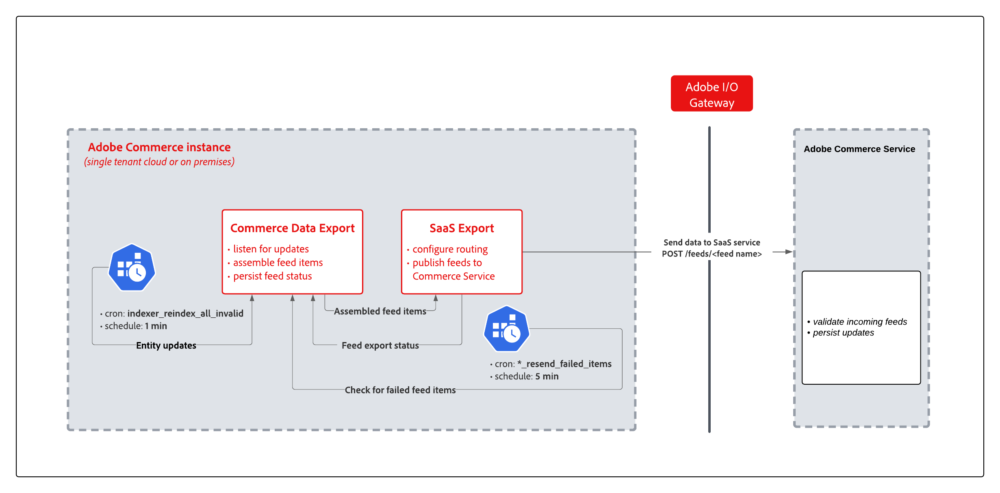

# Sincronizar dados com a exportação de dados SaaS

Quando você instala um serviço do [!DNL Adobe Commerce] que requer exportação de dados, como Serviço de Catálogo, Live Search ou Recomendações de Produto, uma coleção de módulos de exportação de dados SaaS é instalada para gerenciar o processo de coleta e sincronização de dados.

A exportação de dados SaaS move os dados do produto de uma instância do Adobe Commerce para a plataforma de serviços da Commerce de forma contínua para manter os dados atualizados. Por exemplo, as Recomendações de produto exigem informações atuais do catálogo para retornar com precisão as recomendações com nomes, preços e disponibilidade corretos. Para obter detalhes sobre o monitoramento do processo de sincronização, consulte [Exibir e gerenciar o processo de sincronização](data-sync-manage.md).

O diagrama a seguir mostra o fluxo de exportação de dados SaaS.

{width="900" zoomable="yes"}

Quando os dados do catálogo são alterados no [!DNL Adobe Commerce], a sincronização percorre esses estágios.

1. **Detecção de alteração de entidade** - O sistema Mview da Magento detecta alterações de linha em tabelas de banco de dados assinadas (por exemplo, `catalog_product_entity`) e grava entradas em uma tabela de log de alterações.
1. **Indexação de feed** - O indexador de feed lê o changelog, carrega dados de entidade das tabelas de origem e monta itens de feed.
1. **Coleta e transformação de dados** - Os provedores registrados no esquema de feed [`et_schema.xml`](extensibility-and-customizations.md#feed-schema-overview) coletam dados de campo.
1. **Desduplicação de hash** - Um hash de conteúdo é calculado para cada item de feed. Os itens cujo hash não foi alterado desde a última exportação são ignorados, portanto, somente os dados modificados são transmitidos.
1. **Envio de HTTP** - Os itens de feed são enviados como lotes HTTP POST autenticados para o Serviço de Assimilação de Feed SaaS do Adobe.
1. **Persistência do status** - O status de resposta da API é gravado de volta na [tabela de feed](reference/feed-table-reference.md) para cada item.
1. **Nova tentativa com falha** - Os itens que não foram exportados são automaticamente repetidos por um trabalho cron agendado.

>[!NOTE]
>
>Para [!DNL Adobe Commerce Optimizer Connector] implantações, [!DNL SaaS Data Export] manipula a detecção de alteração de entidade e o assembly de feed. O conector mapeia os feeds para o formato [!DNL Catalog Data Ingestion API] e os envia para [!DNL Adobe Commerce Optimizer]. Consulte [Pipeline de sincronização do conector](../aco-connector/connector-sync-pipeline.md) para controle de escopo, envio e tratamento de erros.

>[!NOTE]
>
>Para garantir uma programação perfeita e evitar interrupções nas operações do site, a Adobe recomenda estimar o volume de dados e o tempo de sincronização antes de iniciar qualquer sincronização do feed de dados. Essa estimativa é importante ao planejar sincronizações iniciais ou atualizações de catálogos em larga escala, como alterações de preço em massa. Para obter detalhes, consulte [Estimar volume de dados e tempo de transmissão para sincronização de dados](estimate-data-volume-sync-time.md)

## Modos de sincronização

A exportação de dados SaaS tem dois modos para processar feeds de entidade:

- **Modo de exportação imediata** — Neste modo, os dados são coletados e enviados imediatamente para o Commerce Service em uma única iteração. Esse modo acelera a entrega de atualizações de entidades ao serviço do Commerce e reduz o tamanho do armazenamento das tabelas de feed.

- **Modo de exportação herdado** — Neste modo, os dados são coletados em um único processo. Em seguida, um trabalho cron envia os dados coletados para os serviços de comércio conectados. Nas entradas do log de exportação de dados, os feeds que usam o modo herdado são rotulados como `(legacy)`.

## Tipos de sincronização

A exportação de dados SaaS suporta três tipos de sincronização - sincronização completa, sincronização parcial e nova tentativa de sincronização de itens com falha.

### Sincronização completa

Depois de conectar uma instância do Adobe Commerce ao Commerce Service, execute uma sincronização completa para enviar dados de feed de entidade do Adobe Commerce para o serviço conectado.

>[!NOTE]
>
>A sincronização completa é principalmente para a fase de integração. Evite o uso regular para evitar a sobrecarga do banco de dados. Após a sincronização inicial, as alterações em andamento são sincronizadas automaticamente usando a sincronização parcial.

>[!NOTE]
>
>O comando `saas:resync` transmite apenas itens novos, itens atualizados e itens cuja exportação falhou anteriormente. Os itens cujo hash de conteúdo não foi alterado desde a última exportação são ignorados.

### Sincronização parcial {#partial-sync}

Com a sincronização parcial, a exportação de dados SaaS envia automaticamente as atualizações do aplicativo Commerce, como alterações de nome de produto ou atualizações de preço, para os serviços de comércio conectados.
Para que a sincronização parcial funcione, o aplicativo Commerce requer a seguinte configuração:

- [O agendamento de tarefas é habilitado através de trabalhos cron](https://experienceleague.adobe.com/docs/commerce-operations/installation-guide/next-steps/configuration.html?lang=pt-BR)
- Todos os indexadores de exportação de dados SaaS estão configurados no modo `Update by Schedule`.

### Repetir sincronização de itens com falha {#retry-failed-items-sync}

A sincronização Repetir itens com falha usa um processo separado para reenviar itens que não foram sincronizados devido a erros durante o processo de sincronização, por exemplo, um erro de aplicativo, uma interrupção de rede ou um erro de serviço SaaS. Os trabalhos cron `*_resend_failed_items` no grupo `resync_failed_feeds_data_exporter` lidam com isso automaticamente a cada 5 minutos.

## Trabalhos cron agendados

Os grupos cron a seguir automatizam o pipeline em uma programação fixa.

| Grupo Cron | Trabalho Cron | Finalidade | Cronograma |
|---|---|---|---|
| `index` | `indexer_update_all_views` | Processa os changelogs do Mview e aciona as atualizações parciais do feed | A cada 1 minuto |
| `index` | `indexer_reindex_all_invalid` | Executa uma ressincronização completa para índices de feed marcados como &quot;Reindexação necessária&quot; | A cada 1 minuto |
| `resync_failed_feeds_data_exporter` | `*_resend_failed_items` | Detecta itens de feed com falha e os reenvia | A cada 5 minutos |
| `commerce_data_export` | `saas_data_exporter` | Envia dados para feeds do modo herdado (pedidos, escopos) | A cada 5 minutos |
| `commerce_data_export` | `cleanup_deleted_feed_items` | Limpa itens de feed excluídos sincronizados após o período de retenção (7 dias) | Todos os dias às 2:00 AM |

## Envio de feed e tratamento de erros HTTP {#feed-submission-and-http-error-handling}

Os itens de feed são enviados como lotes JSON autenticados compactados com gzip por HTTP POST. A tabela a seguir mostra como os códigos de resposta HTTP são mapeados para o status de exportação e para o comportamento de nova tentativa.

| Código de status | Tentar novamente? | Significado |
|-------------|--------|---------------------------------------------------------------------------------------------------------------------|
| 200 | Não | Aceito com êxito |
| 400 | Não | Dados inválidos ou falha na validação - requer investigação manual. Verifique `var/log/saas-export-errors.log` para obter detalhes. |
| 429 | Sim | Acerto de limite de taxa - reduzir `thread_count` em [configurações de processamento de exportação](customize-export-processing.md) |
| 5xx | Sim | Erro do lado SaaS - nova tentativa automática |
| 2 | Sim | O item está programado para nova tentativa |

Além de falhas de nível HTTP, erros de nível de aplicativo, como falhas de processamento local ou interrupções de rede, também são agendados para repetição automática pelos trabalhos cron `*_resend_failed_items`.

Monitorar status por feed da página [[!UICONTROL Data Feed Sync Status]](https://experienceleague.adobe.com/pt-br/docs/commerce-admin/systems/data-transfer/data-sync/data-feed-sync-status) no Administrador do Commerce.

>[!MORELIKETHIS]
>
> - [Gerenciar sincronização](data-sync-manage.md) — Verifique o status da sincronização e ressincronize os feeds manualmente.
> - [Esquema da tabela de feed](reference/feed-table-reference.md) — Inspecione o status do nível de item e os detalhes do erro.
> - [Melhore o desempenho da exportação de dados](customize-export-processing.md) — Ajuste o tamanho do lote e a contagem de threads.
