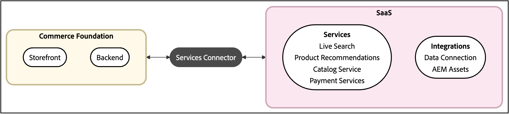

# Guias de serviços da Adobe Commerce

Os serviços da Adobe Commerce fornecem recursos avançados que ampliam sua loja, simplificam integrações e otimizam o gerenciamento de dados.

## Como o Commerce se conecta aos serviços?

Todos os serviços do Commerce se conectam à sua instância do Commerce por meio do [Commerce Services connector](saas.md).

Quando o Commerce Services Connector está configurado, você tem acesso aos seguintes recursos:

- **Serviços de vitrine** - recursos alimentados por IA para descoberta de produtos, recomendações e pagamentos
- **Serviços de integração** - Conexões com a Adobe Experience Platform, a AEM Assets e outras soluções da Adobe

Esses serviços ajudam a aumentar as conversões, fornecer experiências personalizadas e usar melhor os dados de comércio no ecossistema do Adobe.

>[!NOTE]
>
>A Adobe recomenda atualizar para a versão mais recente compatível de todos os serviços da Commerce. Consulte as [notas de versão](release-notes-all.md).

Além desses recursos, há ferramentas que permitem monitorar o fluxo de dados da instância do Commerce para a plataforma SaaS. Essas ferramentas de dados podem sincronizar os dados automaticamente e ajudar você a otimizar o desempenho.

## Serviços disponíveis

>[!BEGINTABS]

>[!TAB Serviços de vitrine]

Os serviços da Storefront são um grupo de recursos alimentados por IA que otimizam a descoberta de produtos, personalizam as interações com o cliente e simplificam o processamento de pagamentos para aumentar o engajamento e as conversões. Com os serviços de vitrine, você pode aprimorar a experiência de compra e impulsionar o crescimento dos negócios.

<table style="table-layout:fixed">
<tr style="border: 0;">
   <td valign="top">
      
      

         <a href="../catalog-service/overview.md">
         <strong>Serviço de catálogo</strong>
         </a>
      

      

         <em>Ofereça aos seus clientes uma experiência de produto otimizada enquanto aumenta o desempenho, melhora a escalabilidade e aumenta as conversões.</em>
      

   </td>
   <td valign="top">
      
      

         <a href="../live-search/overview.md">
         <strong>[!DNL Live Search]</strong>
         </a>
      

      

         <em>Implemente esta ferramenta de pesquisa habilitada por IA que fornece resultados mais inteligentes, rápidos e relevantes para compradores B2C.</em>
      

   </td>
   <td valign="top">
      
      

         <a href="../product-recommendations/overview.md">
         <strong>Recomendações de produto</strong>
         </a>
      

      

         <em>Adicione recomendações alimentadas por IA com base no comportamento do comprador, nas tendências populares, na similaridade do produto e muito mais.</em>
      

   </td>
   <td valign="top">
      
      

         <a href="../payment-services/guide-overview.md">
         <strong>Serviços de pagamento</strong>
         </a>
      

      

         <em>Impulsione a satisfação do cliente com diversos métodos de pagamento, incluindo prestações sem juros e exibições simplificadas de processamento de pagamento, ordens e faturas.</em>
      

   </td>
</tr>
</table>

>[!TAB Serviços de integração]

Os serviços de integração se referem a recursos que conectam sua instância do Commerce a outros produtos ou serviços no Adobe.

<table style="table-layout:fixed">
<tr style="border: 0;">
   <td valign="top">
      
      

         <a href="../data-connection/overview.md">
         <strong>[!DNL Data Connection]</strong>
         </a>
      

      

         <em>Aproveite a conexão entre o Adobe Commerce e a borda do Adobe Experience Platform para usar dados do Commerce para outros produtos da Adobe Experience Cloud, como o Adobe Analytics e o Adobe Target.</em>
      

   </td>
   <td valign="top">
      
      

          <a href="../aem-assets-integration/overview.md">
         <strong>integração com o AEM Assets</strong>
         </a>
      

      

         <em>Simplifique o gerenciamento de ativos digitais usando um sistema integrado ao Adobe Experience Manager para gerenciar conteúdo de mídia avançada.</em>
      

   </td>
   <td valign="top">
      
      

         <a href="../app-management/overview.md">
         <strong>Gerenciamento de aplicativos</strong>
         </a>
      

      

         <em>Associe, configure e gerencie aplicativos do App Builder com sua instância do Commerce por meio da interface do Administrador.</em>
      

   </td>
</tr>
</table>

>[!TAB Ferramentas de dados]

As ferramentas de dados ajudam você a gerenciar e otimizar o fluxo de informações entre sua instância do Commerce e os serviços conectados. Essas ferramentas garantem a sincronização eficiente de dados, monitoram operações de sincronização e melhoram o desempenho, descarregando processos que consomem muitos recursos.

<table style="table-layout:fixed">
<tr style="border: 0;">
   <td valign="top">
       
      

         <a href="../data-export/overview.md">
         <strong>[!DNL SaaS Data Export]</strong>
         </a>
      

      

         <em>Sincronizar automaticamente dados de catálogo, pedido e inventário da Adobe Commerce com os serviços conectados. Use comandos da CLI do Commerce ou o <strong>Painel de Gerenciamento de Dados</strong> para gerenciar o processamento de sincronização.</em>
      

   </td>
   <td valign="top">
      
      

          <a href="../price-index/price-indexing.md">
         <strong>Indexador de preços SaaS</strong>
         </a>
      

      

         <em>Otimize o desempenho do site descarregando tarefas que consomem muitos recursos, como indexação e cálculo de preços, do aplicativo Commerce para a infraestrutura em nuvem da Adobe.</em>
      

   </td>
   <td valign="top">
      
      

          <a href="https://experienceleague.adobe.com/pt-br/docs/commerce-admin/systems/data-transfer/data-sync/data-dashboard" target="_blank">
         <strong>Painel de gerenciamento de dados</strong>
         </a>
      

      

         <em>Rastreie facilmente a sincronização de dados do Commerce e acione a ressincronização a partir de um painel unificado no Administrador do Commerce. Obtenha insights valiosos sobre a disponibilidade de dados para exibição oportuna a seus compradores.</em>
      

   </td>
</table>

>[!NOTE]
>
>O Painel de gerenciamento de dados está disponível sem custo adicional para os comerciantes do Commerce que usam as Recomendações de produto v6.0.0, o Live Search v4.1.0 ou o Serviço de catálogo v1.17 com uma licença ativa. Os comerciantes que usam versões anteriores do serviço podem usar a [Sincronização de Catálogo](../landing/catalog-sync.md) para gerenciar e rastrear a sincronização de dados.

>[!ENDTABS]

## Quais problemas os serviços da Commerce podem resolver?

Se você deseja dimensionar seus negócios, melhorar a experiência do cliente ou tomar decisões orientadas por dados, os Serviços Adobe Commerce fornecem soluções para desafios comuns da Commerce:

| Problema | Desafio | Solução |
|---------|-----------|----------|
| Melhorar a descoberta e a conversão de produtos | Os compradores não conseguem encontrar o que estão procurando, resultando em altas taxas de rejeição e vendas perdidas. | Use o [Live Search](../live-search/overview.md) e o [Product Recommendations](../product-recommendations/overview.md) para fornecer pesquisa baseada em IA com tolerância a erros de digitação, resultados instantâneos de &quot;pesquisa ao digitar&quot;, facetas dinâmicas e recomendações personalizadas de produtos com base no comportamento do comprador em tempo real. |
| Criar experiências personalizadas omnicanal | Seus dados de comércio estão em silos, impedindo que você forneça experiências personalizadas entre canais. | Use a [Conexão de Dados](../data-connection/overview.md) para enviar dados comportamentais, transacionais e de perfil à Adobe Experience Platform. Crie segmentos de clientes sofisticados, crie campanhas de carrinho abandonadas, públicos-alvo semelhantes e analise tendências sazonais em toda a jornada do cliente. |
| Simplifique o gerenciamento de ativos digitais | O gerenciamento de imagens de produtos e mídia avançada em vários sistemas é demorado e sujeito a erros. | A [Integração do AEM Assets](../aem-assets-integration/overview.md) fornece gerenciamento de ativos centralizado, conectando o Adobe Commerce a um projeto do Adobe Experience Manager Assets, simplificando os fluxos de trabalho e garantindo experiências de marca consistentes em todos os pontos de contato. |
| Otimizar o processamento de pagamentos | As opções de pagamento limitadas e as más experiências de pagamento estão prejudicando a satisfação e a conversão dos clientes. | Os [Serviços de Pagamento](../payment-services/guide-overview.md) oferecem vários métodos de pagamento, incluindo prestações sem juros, com um painel unificado para gerenciar pagamentos, pedidos e faturas. |
| Gerenciar a sincronização de dados em escala | A indexação com muitos recursos está atrasando seu site e você não pode rastrear problemas de sincronização de dados facilmente. | [Exportação de Dados SaaS](../data-export/overview.md), [Indexador de Preços SaaS](../price-index/price-indexing.md) e o [Painel de Gerenciamento de Dados](https://experienceleague.adobe.com/pt-br/docs/commerce-admin/systems/data-transfer/data-sync/data-dashboard) sincronizam automaticamente dados de catálogo, pedido e inventário, descarregam cálculos de preço na infraestrutura de nuvem da Adobe e fornecem visibilidade em tempo real sobre o status da sincronização. |
| Conquiste clientes perdidos e reduza os retornos | As altas taxas de rotatividade do cliente e de retorno do produto estão afetando a lucratividade. | Combine a [Conexão de Dados](../data-connection/overview.md) com o Adobe Journey Optimizer e o Real-Time CDP para identificar padrões de retorno, criar campanhas de retorno, segmentar clientes por comportamento e enviar campanhas de reengajamento personalizadas por email e SMS. |
| Tomar decisões de merchandising orientadas por dados | Você não tem certeza de quais produtos promover ou quando executar promoções. | O [Live Search](../live-search/overview.md) fornece insights de desempenho de pesquisa e ferramentas de merchandising para acessar métricas principais, analisar termos de pesquisa e usar regras de merchandising inteligentes para impulsionar ou enterrar produtos com base no comportamento real do cliente e nas metas comerciais. |
| Mantenha a conformidade com dados confidenciais | Você precisa lidar com dados confidenciais do cliente enquanto mantém a conformidade com a HIPAA. | A [Conexão de Dados](../data-connection/overview.md) está pronta para HIPAA, permitindo que você compartilhe dados de back-office com a Experience Platform enquanto mantém a conformidade e lida sistematicamente com solicitações de privacidade. |

## Como os serviços da Commerce trabalham em conjunto

Os serviços da Adobe Commerce são criados em uma plataforma unificada. Ao usar vários serviços, você se beneficia de:

- **Pipeline de dados unificado** - Os dados de produtos, preços e inventário são sincronizados automaticamente em todos os serviços, eliminando a necessidade de entrada de dados duplicados ou integrações personalizadas.
- **Personalização em tempo real** - O comportamento do cliente de pesquisa, navegação e compras potencializa as recomendações inteligentes e a classificação em toda a loja.
- **Integração consistente da loja** - Independentemente de você estar usando uma loja da Commerce com Edge Delivery Services, PWA Studio ou implementações headless, os mesmos menus suspensos e APIs funcionam perfeitamente em todas as plataformas.
- **Suporte a várias lojas e vários idiomas** - Todos os serviços respeitam automaticamente as exibições da loja, os segmentos de clientes e as configurações de catálogo B2B sem configurações adicionais.
- **Visuais avançados do produto** - Quando você integra com o AEM Assets, as imagens otimizadas do produto são exibidas de forma consistente em resultados de pesquisa, páginas de produto e recomendações.
- **Dados do cliente conectados** - Use a Conexão de Dados para compartilhar comportamento de compra com a Adobe Experience Platform, o Real-Time CDP e o Journey Optimizer, permitindo a personalização entre canais e a otimização de campanhas.

Por exemplo, quando um comprador pesquisa um produto usando o Live Search, o adiciona ao carrinho depois de visualizar uma Recomendação de produto e conclui a compra com Serviços de pagamento, toda essa atividade flui perfeitamente pelo pipeline de dados unificado. Esses dados de comportamento alimentam melhores resultados de pesquisa e recomendações mais relevantes para os futuros compradores.

>[!NOTE]
>
>Você deve configurar a coleta de dados do evento para habilitar o compartilhamento de dados comportamentais entre serviços. Consulte [Configurar Commerce Services](saas.md#saas-configuration) para obter instruções sobre a configuração.

Cada serviço pode ser usado de forma independente, mas combiná-los cria uma experiência de compra mais inteligente e personalizada.

{{$include /help/_includes/templated/whats-new.md}}

<!-- Last updated from includes: 2026-05-22 20:54:53 -->
