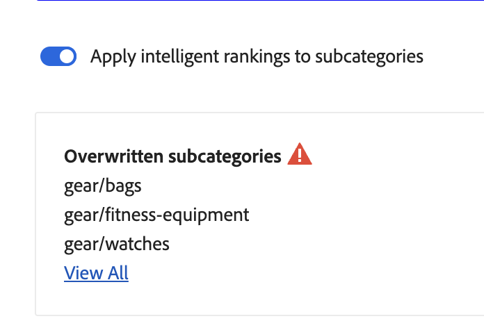

# Merchandising de categoria

O merchandising por categoria permite que os proprietários de lojas apliquem [!DNL Live Search] [regras](rules.md) de classificação inteligente a categorias e subcategorias de produtos.

Este vídeo é uma introdução ao Merchandising por categoria.

>[!VIDEO](https://video.tv.adobe.com/v/3448856?captions=por_br)

O recurso é acessado no Administrador em **Marketing** > SEO e pesquisa > **[!DNL Live Search]** > **Merchandising de categorias**.

>[!NOTE]
>
>O Merchandising por categoria está disponível com [!DNL Live Search] [3.0.0 ou superior](release-notes.md). Se você vir o espaço de trabalho Categoria de merchandising, mas ele não estiver preenchido com dados, atualize o módulo [!DNL Live Search].

A exibição de Merchandising por categoria mostra regras de categoria definidas, com colunas para:

* Categoria
* Estratégia de classificação
* Classificação herdada
* Última atualização
* Ação

Você pode pesquisar uma categoria ou subcategoria no campo &quot;Pesquisar por categoria&quot;.

## Estratégias de classificação

O Merchandising por categoria usa os mesmos tipos de classificação que com [produtos individuais](rules-workspace.md).
Há dois tipos de classificação: Inteligente e Manual.

**A classificação inteligente** aproveita a análise de dados comportamentais de vitrine pela [Adobe Sensei](https://www.adobe.com/sensei.html) para classificar todos os produtos nas categorias escolhidas por um determinado algoritmo. Depois que uma classificação inteligente é escolhida, espera-se que a ordem específica dos produtos mude com o tempo, à medida que os dados subjacentes são reanalisados pela Adobe Sensei continuamente. Por exemplo, os principais produtos de tendências serão alterados automaticamente com o tempo, à medida que as preferências do comprador forem alteradas.
Os métodos de classificação inteligente são:

* Mais comprados: classifica os produtos de acordo com a frequência com que foram comprados pelos compradores nos sete dias anteriores.
* Mais adicionados ao carrinho: classifica os produtos de acordo com a frequência com que foram adicionados ao carrinho pelos compradores nos sete dias anteriores.
* Mais visualizados: classifica os produtos de acordo com a frequência com que foram visualizados pelos compradores nos sete dias anteriores.
* Recomendado para você: com base no comportamento anterior e atual de cada comprador no local, o classifica os produtos de acordo com a probabilidade de o comprador interagir com cada um.
* Tendências: classifica os produtos por retomadas recentes de popularidade com base nas visualizações.
* Nenhum: classifica os produtos de acordo com sua ordem padrão.

**A classificação manual** permite que os usuários substituam a ordem de classificação automática de produtos definindo regras manuais de fixação, reforço, enterramento e ocultação.

## Classificação herdada

Como comerciante, você pode querer selecionar todas as categorias de roupas femininas para serem classificadas por &quot;tendências&quot;. Isso inclui as subcategorias &quot;Calças femininas&quot;, &quot;Camisas femininas&quot; e &quot;Acessórios femininos&quot;. As categorias masculinas não devem ser afetadas. Você pode usar classificações herdadas para fazer isso.

Ao selecionar um método de classificação inteligente para uma categoria ou subcategoria que tenha subcategorias, você pode ativar a opção **Aplicar classificações inteligentes a subcategorias**. Isso aplica o método de classificação a todas as subcategorias.

Essas subcategorias agora herdam essa regra da categoria principal (&quot;Sim&quot; na coluna Classificação herdada). Na coluna Ação, as únicas opções disponíveis são **Editar Regra** e **Exibir Detalhes**. A opção **Excluir** está desabilitada para regras herdadas em subcategorias. Excluir a herança de subcategoria requer desfazer a herança da categoria principal.

Qualquer categoria ou subcategoria pode ter somente uma classificação Inteligente aplicada de cada vez. Eles também podem ter classificações manuais adicionais aplicadas.

Se você aplicar uma classificação inteligente a uma categoria e ativar a opção **Aplicar classificação inteligente às subcategorias**, qualquer classificação inteligente já aplicada às subcategorias será substituída.

{width="700"}

Se você clicar em **Exibir tudo**, uma caixa de diálogo será aberta com detalhes das alterações propostas.

Ao adicionar uma classificação inteligente diretamente a uma categoria que tem uma classificação inteligente herdada, a herança é substituída pela nova classificação inteligente.

Ao excluir a classificação Inteligente da categoria, a herança é restabelecida.
Em ambos os cenários, qualquer classificação manual é mantida.

Se você remover uma classificação inteligente de uma categoria e a herança da subcategoria for selecionada, somente as classificações inteligentes herdadas serão removidas das subcategorias. As classificações manuais não estão sujeitas à herança e permanecerão.

Será exibida uma caixa de diálogo explicando quais subcategorias herdadas são afetadas por quaisquer alterações feitas em uma categoria de nível superior.

{width="1200"}

## Criar uma regra de categoria

Para criar uma regra de categoria:

1. Clique no botão **Adicionar regra**.
1. No modo de exibição _Selecionar Categoria_, clique nas categorias e subcategorias.
1. Marque a caixa de seleção para selecionar a categoria que deseja classificar.
1. Clique em **Aplicar**.

   

1. Na exibição _Adicionar regra de categoria_, selecione o método de classificação inteligente que deseja aplicar à categoria.
A página Visualização de categoria mostra os resultados reais da classificação selecionada, usando os dados do Live Search.
1. Clique em **Salvar e publicar** para salvar a regra.

O serviço [!DNL Live Search] processa a regra e a ativa no armazenamento quando concluído.

## Modificar uma regra de categoria

Para modificar uma regra existente:

1. Clique em **...** na coluna Ação e escolha **Editar**.
1. Na exibição de regra Editar Categoria, faça as alterações necessárias e clique em **Salvar e Publicar**.

As alterações são refletidas no armazenamento quando [!DNL Live Search] processou a alteração.

## Excluir uma regra de categoria

Para excluir uma regra de categoria:

1. Clique em **...** na coluna Ação e escolha **Excluir**.
1. No modal _Excluir regra_, selecione **Excluir** para remover a regra ou **Cancelar** para cancelar a ação.

## Classificação manual

A classificação manual permite substituir a ordem do produto determinada pelas regras de Classificação inteligente (se houver) e controlar manualmente onde os produtos aparecem nos resultados.

Eventos são ações que modificam os resultados da pesquisa quando condições definidas são atendidas. Uma classificação manual pode ter até 25 eventos.

* Aumentar: move um produto para cima nos resultados da pesquisa.
* Enterro: move um produto para baixo nos resultados da pesquisa.
* Fixar um produto: move um produto para uma posição específica nos resultados.
* Ocultar um produto: exclui um produto dos resultados da pesquisa.

Criar uma classificação manual:

1. Configure uma regra de classificação Inteligente para uma categoria conforme descrito acima. Os resultados da consulta aparecerão na exibição de Página de categoria de visualização. Ele usa seus dados reais do Live Search para visualizar os resultados.

1. Clique e arraste um produto na exibição da Página Visualizar categoria. Arraste e solte-o na posição desejada. Os campos Produto e Posição são automaticamente preenchidos no painel Eventos.

Você também pode clicar no ícone de pino para fixar um produto no local atual. Use o menu de contexto de reticências para &quot;Fixar na parte superior&quot; ou &quot;Fixar na parte inferior&quot;.

Para adicionar um evento manualmente:

1. Em Classificação Manual, clique no menu **Selecionar um evento** e escolha um evento a ser realizado quando as condições associadas forem atendidas.
1. Insira o nome do produto que você deseja que seja afetado. Os produtos são sugeridos à medida que você digita.
1. Para vários eventos, escolha outros eventos que deseja acionar quando as condições forem atendidas.

>[!NOTE]
>
>As regras são aplicadas quando uma categoria específica é aberta na loja e uma regra existe para essa categoria. Para regras de merchandising por categoria, a ordem de classificação padrão é &quot;Classificar por: Posição&quot;. Se um comprador alterar a ordem de classificação, todos os produtos ocultos, fixados e enterrados não serão mais classificados.
