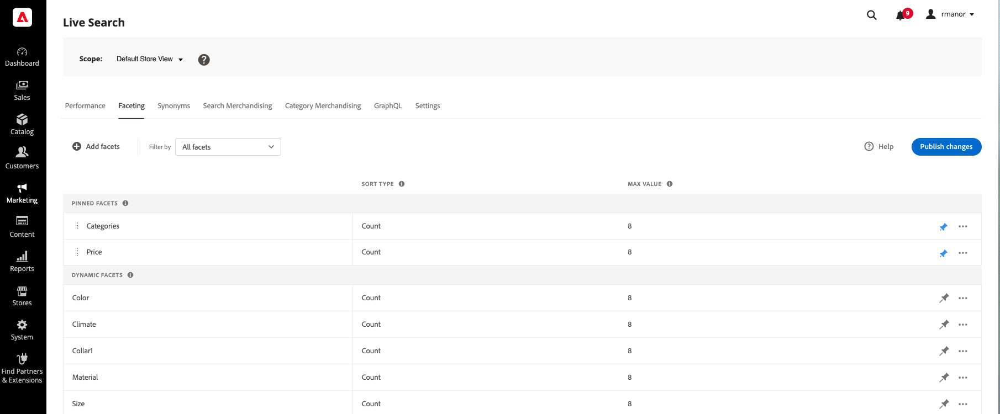

# Faceting Workspace

O espaço de trabalho *Faceting* lista todas as facetas disponíveis no momento e fornece acesso às ferramentas necessárias para configurar e gerenciar facetas. As facetas fixadas aparecem primeiro na lista de facetas existentes, seguidas pelas facetas dinâmicas. A lista pode ser filtrada para mostrar todas as facetas, ou apenas aquelas que estão fixadas ou dinâmicas.

## Definir o escopo

Se a instalação do Adobe Commerce incluir vários modos de exibição de armazenamento, defina o **Escopo** como [modo de exibição de armazenamento](https://experienceleague.adobe.com/docs/commerce-admin/start/setup/websites-stores-views.html#scope-settings) ao qual as configurações das facetas se aplicam.

## Filtrar a lista

1. Clique no controle **Filtrar por**.
1. Escolha uma das seguintes opções:

   * Todos os filtros
   * Fixado
   * Dinâmico

## Adicionar uma faceta

1. Clique em **Adicionar aspectos**.
1. Consulte [Adicionar facetas](facets-add.md) para obter instruções detalhadas.

## Descrições da coluna

| Coluna | Descrição |
|--- |--- |
| (primeira coluna) | Lista as facetas fixadas e dinâmicas pelo [rótulo](facets-type.md) que está visível para o comprador. |
| Tipo de classificação | A [ordem de classificação](facets-type.md) dos valores de facetas. As facetas são classificadas alfabeticamente para todas as [!DNL Commerce] lojas. Para implementações [headless], os aspectos podem ser classificados em ordem alfabética ou por contagem. Opções: alfabética, contagem (somente headless) |
| Valor máximo | O número de valores de facetas que estão disponíveis na loja como filtros, com um máximo de 10. |

## Controles

| Controle | Descrição |
|--- |--- |
| Adicionar facetas | Abre o [editor de facetas](facets-add.md). |
| Filtrar por | Determina o [tipo de facetas](facets-type.md) que aparecem na lista. Opções: Tudo, Fixo, Dinâmico |
