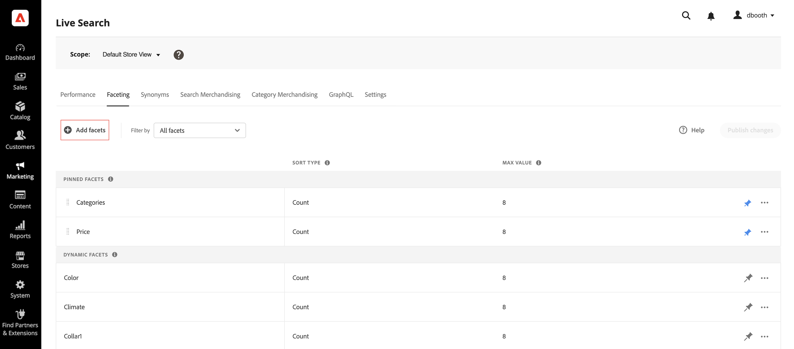
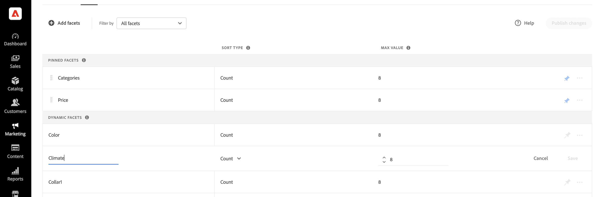

# Adicionar facetas

Qualquer atributo de produto filtrável pode ser usado como uma faceta, exceto o status de estoque (`quantity_and_stock_status`). O painel *[!UICONTROL Add facets]* lista as facetas atuais e facilita a atribuição de atributos de produto adicionais como facetas. Durante esse processo de três etapas, um atributo é escolhido para ser usado como uma faceta, as propriedades são editadas, se necessário, e as alterações são publicadas na loja.

>[!NOTE]
>
>Para obter informações sobre como gerenciar a exibição de produtos por status de estoque, consulte [Gerenciar produtos indisponíveis](manage-out-of-stock-products.md).

## Etapa 1: adicionar uma faceta

1. No Administrador, vá para **Marketing** > SEO e pesquisa > **[!DNL Live Search]**.
1. Na guia *Faceting*, clique em **Adicionar facetas**.
1. Na lista *Adicionar aspectos*, cada atributo disponível tem um  separado. Conclua uma das opções a seguir:

   * Na lista *Atributos de faceta*, escolha o atributo de produto que você deseja usar como faceta e clique em **Adicionar**.
   * Para localizar um atributo de produto específico, insira os primeiros caracteres do nome do atributo na caixa *Pesquisar*. Em seguida, clique em **Adicionar**.

     Para configurar os intervalos e agrupamentos de facetas de preços, consulte [Configurações](settings.md). Para saber mais, vá para [Tipos de facetas](facets-type.md).
A faceta é adicionada à parte inferior da lista *Facetas Dinâmicas* e o botão *Publicar alterações* fica disponível.

1. Se a faceta que você deseja adicionar não puder ser encontrada, vá para **Lojas** > Atributos > **Produto** e verifique se o atributo tem as [propriedades necessárias](facets.md) para ser usado como uma faceta. Se necessário, atualize as seguintes propriedades da loja do atributo:

   * **[!UICONTROL Use in Search]** -  `Yes`
   * **[!UICONTROL Use in Layered Navigation]** -  `Filterable (with results)`
   * **[!UICONTROL Use in Search Results Layered Navigation]** -  `Yes`

1. Quando solicitado, atualize o cache.

   A faceta ficará disponível na loja na próxima vez que o catálogo for sincronizado com [!DNL Live Search]. Se a faceta não estiver disponível após duas horas, consulte [Sincronizar dados do catálogo](install.md#sync).

## Etapa 2: Editar propriedades da faceta (Opcional)

1. Para editar as propriedades da faceta, clique em **Mais** () opções na coluna à direita.
1. No menu, clique em **Editar**. Em seguida, ajuste as seguintes propriedades, conforme necessário.

   * Rótulo - ([Headless](facets-type.md) somente) Insira o rótulo de facetas que você deseja usar.
   * Tipo de classificação - As facetas são classificadas alfabeticamente para todas as [!DNL Commerce] lojas. Para implementações headless, os aspectos podem ser classificados em ordem alfabética ou por contagem. Opções: alfabética, contagem (somente headless)
   * Valor máximo - Insira o número máximo de valores de facetas exibidos na loja. Entradas válidas: 0 - 100; Padrão: 8

1. Quando terminar, clique em **Salvar**.

   

1. Para fixar a faceta na parte superior da lista *Filtros*, clique no pino cinza ().
1. Para alterar a ordem da faceta fixada, clique no ícone **Mover** () e arraste a linha para uma nova posição na seção *Facetas fixadas*.

## Etapa 3: publicar alterações

1. Quando a faceta estiver concluída, clique em **Publicar alterações**.
1. Aguarde até que a faceta apareça no armazenamento.

   Se a faceta não estiver disponível após duas horas, consulte [Verificar exportação](install.md#sync) nas instruções de instalação.

## Descrições dos campos

| Campo | Descrição |
|--- |--- |
| Rótulo | (Somente [Headless](facets-type.md)) O [rótulo de faceta](facets-type.md) que está visível na loja pode ser editado para manter a consistência com a sua marca. |
| Tipo de classificação | O método usado para [classificar](facets-type.md) facetas. Todas as [!DNL Commerce] vitrines classificam os aspectos somente em ordem alfabética. Implementações headless também podem classificar por `Count`. Opções: Alfabético - Classifica aspectos em ordem alfabética. Contagem - (Somente headless) Classifica facetas com base no número de correspondências encontradas. |
| Valor máximo | O número máximo de valores que podem ser exibidos na loja para cada faceta. Os aspectos que representam um intervalo de valores são distribuídos uniformemente. Entradas válidas: 0 - 100; Padrão: 8 |

### Controles

| Controle | Descrição |
|--- |--- |
|  | Fixa ou desfixa uma faceta na parte superior da lista *Filtros*. |
|  | Exibe um menu de mais ações que podem ser aplicadas à faceta selecionada. Opções: Editar, Excluir |
|  | Use o ícone *Mover* para arrastar uma faceta fixada para outro local na seção *Facetas fixadas*. |
