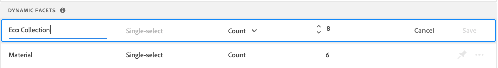

# Gerenciar facetas

Siga estas instruções para atualizar as propriedades dos aspectos existentes ou alterar sua apresentação na loja.

## Configurar agrupamentos de facetas de preço

Consulte [Configurações](settings.md) para configurar intervalos e agrupamentos de facetas de preços.

## Editar faceta

1. Localize a faceta que deseja editar.
1. Se houver muitas facetas na lista, defina *Filtrar por* para uma das seguintes opções:

   * Fixado
   * Dinâmico

   Para saber mais, vá para [Tipos de facetas](facets-type.md).

   

1. Para editar as propriedades da faceta, clique em **Mais** (...) opções.
1. Clique em **Editar**

   

1. Para editar o rótulo da faceta, siga um destes procedimentos:

   * Para uma loja [!DNL Commerce], edite o [rótulo do atributo](https://experienceleague.adobe.com/docs/commerce-admin/catalog/product-attributes/product-attributes.html).
   * Para uma implementação headless, clique no valor na primeira coluna e edite o texto conforme necessário.

   

1. (Somente headless) Para alterar o método usado para classificar valores de facetas, clique no valor na coluna *Tipo de classificação* e escolha uma das seguintes opções:

   * Em ordem alfabética
   * Contagem

   

1. Na coluna **Valor Máx.**, defina o número máximo (de 0 a 10) de valores de filtro de facetas a serem mostrados na vitrine.
1. Quando terminar, clique em **Salvar**.

   Suas alterações não aparecerão na loja até que sejam publicadas.

## Fixar/desfixar faceta

O pin altera a cor quando clicado e é usado para mover a faceta para a seção *Facetas Fixadas* ou *Facetas Dinâmicas*.

1. Para fixar uma faceta na parte superior da lista *Filtros*, localize a faceta na lista *Facetas Dinâmicas* e clique no pino cinza ().

   O pin fica azul e a faceta é movida para a seção *Facetas Fixadas*.

1. Para desafixar uma faceta, localize-a na lista *Facetas Fixadas* e clique no pino azul ().

   O pino fica cinza e a faceta se move para a seção *Facetas Dinâmicas*.

   

>[!NOTE]
>
>A ordenação de facetas fixadas pode ser inconsistente se houver dois rótulos com o mesmo nome.

## Mover faceta fixada

>[!NOTE]
>
>A ordenação de facetas fixadas só é suportada em implementações headless. Se facetas ordenadas forem necessárias, use o widget PLP [!DNL Live Search].

A ordem das facetas fixadas pode ser alterada movendo a linha para uma posição diferente. As facetas fixadas têm um ícone *Mover* () no início da linha. Diferentemente das facetas fixadas, as facetas dinâmicas não podem ser movidas.

1. Localize a faceta na seção *Facetas Fixadas* da lista.
1. Use o ícone **Mover** () para arrastar a linha para uma nova posição na seção *Facetas Fixadas*.

   Depois que as alterações forem publicadas, as facetas reordenadas aparecerão na lista de *Filtros* da vitrine.

## Excluir faceta

1. Localize a faceta na lista e clique em **Mais** (...) opções.
1. Clique em **Excluir**.
1. Quando for solicitada a confirmação, clique em **Excluir faceta**.
A faceta é removida da loja após as alterações serem publicadas.

## Publicar alterações

1. Para atualizar a loja com suas alterações, clique em **Publicar alterações**.
1. Aguarde cerca de 15 minutos para que as atualizações apareçam em sua loja.
