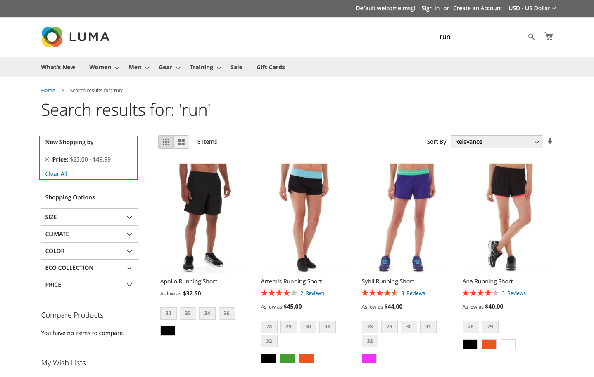

# Tipos de facetas

[!DNL Live Search] usa uma variedade de tipos de facetas e elas aparecem na lista *Filtros* somente quando relevantes. A lista de aspectos disponíveis muda de acordo com os produtos retornados. As seguintes características afetam sua apresentação e comportamento:

* Facetas fixadas - As facetas mais usadas podem ser fixadas no topo da lista. As facetas restantes estão listadas na ordem *Tipo de classificação* depois das facetas fixadas.
* Aspectos dinâmicos - Atributos de produto que o [Adobe AI](https://business.adobe.com/br/ai.html) considera mais relevantes para um conjunto de produtos e uma consulta. O cálculo leva em conta os metadados do atributo de todo o catálogo e determina, no momento da consulta, os aspectos mais relevantes da consulta.

  >[!NOTE]
  >
  >Se você observar que erros de tempo limite estão aparecendo na resposta de consulta do GraphQL após a criação de facetas dinâmicas, altere todas as facetas para fixadas para ver se isso resolve os problemas de desempenho.

* Aspectos populares - Atributos de produto que estão presentes com mais frequência nos resultados da pesquisa.
* Facetas de preço - Devolver produtos por faixa de preço. Você pode especificar o número de seleções e o intervalo de preços no espaço de trabalho [*Configurações*](settings.md).

No momento da consulta, [!DNL Live Search] gera os resultados da pesquisa em grupos de aspectos dinâmicos e populares.

## Opções de frente de loja e headless

Os aspectos renderizados para a loja [!DNL Commerce] são processados pelo adaptador de pesquisa, que roteia solicitações e renderiza os resultados na loja. Todas as facetas de vitrine do [!DNL Commerce] são classificadas alfabeticamente com opções de seleção única, independentemente do tipo de entrada atribuído ao atributo correspondente. Os aspectos disponíveis na loja são renderizados de acordo com o tema atual e refletem as personalizações feitas na apresentação da navegação em camadas.

Por outro lado, as implementações [headless](https://developer.adobe.com/commerce/php/architecture/technical-vision/web-api) são processadas pela API e oferecem suporte a opções adicionais. As facetas headless podem ser classificadas alfabeticamente ou por contagem, e podem ter opções de seleção única ou múltipla.

### Rótulos de facetas

Para [!DNL Commerce] vitrines, o rótulo da faceta é determinado pelas [*Propriedades do Atributo*](https://experienceleague.adobe.com/pt-br/docs/commerce-admin/catalog/product-attributes/create/attribute-product-create). Para lojas com vários modos de exibição, rótulos adicionais podem ser definidos em *Gerenciar Rótulos*. Para implementações headless, os rótulos são editados no [espaço de trabalho de facetamento](faceting-workspace.md).

### Tipo de classificação

Todas as facetas renderizadas para a loja são classificadas alfabeticamente. Para implementações headless, os aspectos podem ser classificados em ordem alfabética ou por contagem.

| Tipo de classificação | Descrição |
|--- |--- |
| Em ordem alfabética | Na lista *Filtros* da loja, os aspectos são classificados em ordem alfabética. |
| Contagem | (Somente headless) Para implementações headless, as facetas também podem ser classificadas pelo número de valores encontrados por faceta no conjunto atual de produtos retornados. |
