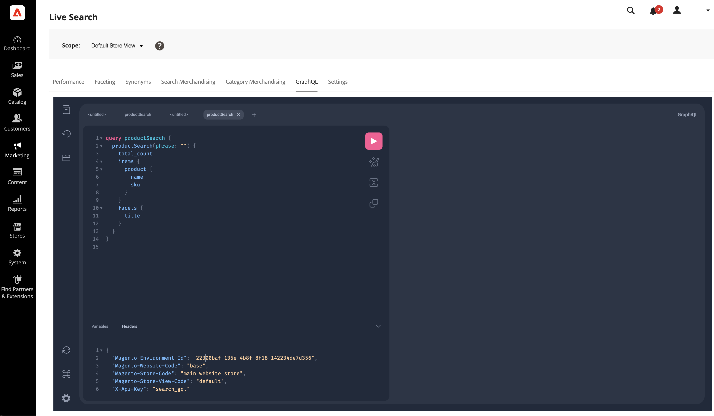

# GraphQL

O espaço de trabalho *GraphQL* permite que os administradores criem e testem consultas do GraphQL usando seus próprios dados.

Este espaço de trabalho dá suporte às consultas [`productSearch`](https://developer.adobe.com/commerce/webapi/graphql/schema/live-search/queries/product-search/) e [`attributeMetadata`](https://developer.adobe.com/commerce/webapi/graphql/schema/live-search/queries/attribute-metadata/).



```graphql
query productSearch {
  productSearch(phrase: "a306") {
    total_count
    items {
      product {
        sku
        name
      }
    }
    facets {
      title
    }
  }
}
```

Variáveis:

```json
{
  "Magento-Environment-Id": "xxxxxxxx-xxxx-xxxx-xxxx-xxxxxxxxxxxx",
  "Magento-Website-Code": "base",
  "Magento-Store-Code": "base",
  "Magento-Store-View-Code": "default",
  "X-Api-Key": "search_gql"
}
```
