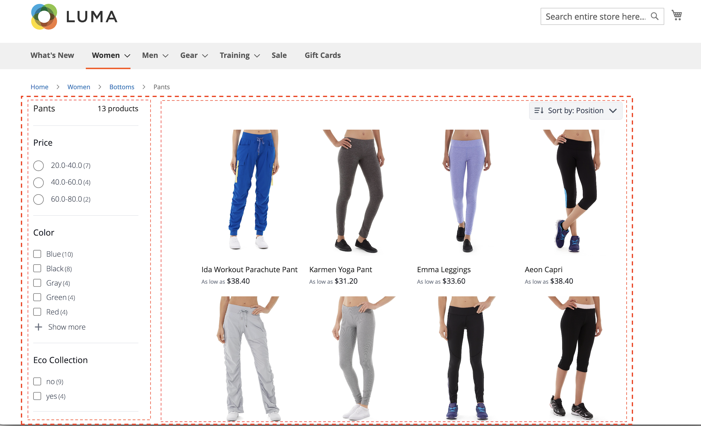
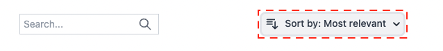
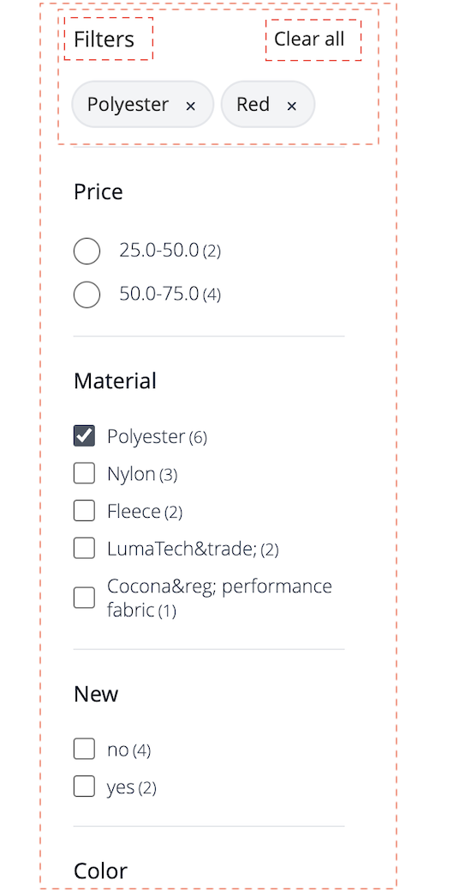
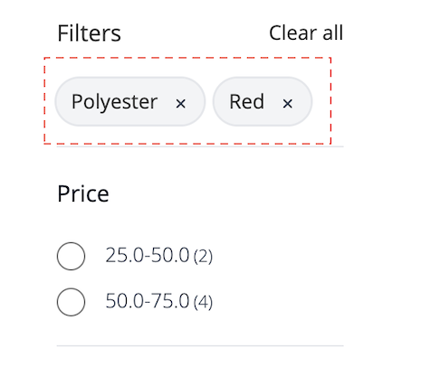

# Widget da página de listagem de produtos

O [!DNL Live Search Product Listing Page Widget] (PLP) usa a plataforma Commerce Services para fornecer uma página de listagem de produtos com desempenho, pesquisável e compatível com facetas. Este tópico descreve como ativar e estilizar o widget PLP.

## Ativar o dispositivo PLP

Quando o serviço [!DNL Live Search] é instalado, a funcionalidade de pesquisa padrão é convertida para [!DNL Live Search] automaticamente.

O widget PLP [!DNL Live Search] é habilitado por padrão para novas instalações.

Se você estiver atualizando o [!DNL Live Search] e o widget PLP já tiver sido desativado, ele permanecerá assim.

>[!NOTE]
>
>Se você estiver migrando do Adaptador de Pesquisa obsoleto, consulte o [guia de migração](migrate-to-plp.md) para obter orientações detalhadas sobre cenários, pré-requisitos e instruções passo a passo.

Para ativar o dispositivo PLP:

1. No Administrador do Adobe Commerce, acesse Lojas → Configurações → Configuração.
1. Na navegação à esquerda, clique em **[!UICONTROL Live Search]** > **[!UICONTROL Storefront Features]**.
1. Clique na seção [!UICONTROL Storefront Features].
1. Definir [!UICONTROL Enable Product Listing Widget] = Sim
1. Salvar configuração
1. Se solicitado, limpe o cache ( vá para Sistema > Ferramentas > Gerenciamento de cache > [!UICONTROL Flush Magento Cache]).

>[!IMPORTANT]
>
>Quando o [!DNL Live Search Product Listing Page Widget] está habilitado, a direção da ordem de classificação em uma página de listagem de produtos não pode ser alterada.

## Recursos do widget

O widget PLP fornece os seguintes recursos prontos para uso:

- Botões Adicionar ao carrinho - Disponível somente para produtos simples.
- Várias imagens por produto — a imagem pode mudar quando uma cor diferente é escolhida para um produto configurável.
- Suporte para amostras de cores - Observe que o atributo de cor deve ser escrito `color` para que o código seja validado corretamente.

### Personalização do widget

Além dos recursos prontos do widget PLP, você pode personalizar ainda mais o widget para incluir os seguintes recursos:

- Filtrar por atributos
- Suporte a vários idiomas
- Controles deslizantes de preço

Para obter informações sobre como personalizar o widget PLP para lidar com os recursos acima, consulte o arquivo readme do `storefront-product-listing-page` no seguinte [repositório](https://github.com/adobe/storefront-product-listing-page/). O arquivo readme neste repositório fornece um exemplo de como personalizar o dispositivo PLP e implantar essas personalizações no seu site.

>[!WARNING]
>
>Se você personalizar o widget PLP usando o código disponível no repositório, será responsável pela manutenção e pelas atualizações necessárias. Quaisquer novos recursos de widget PLP lançados pelo Adobe podem ser incompatíveis com sua implementação personalizada.

## Exemplo de estilo

Você pode personalizar a aparência do widget PLP para corresponder ao seu site usando o [CSS](https://developer.adobe.com/commerce/frontend-core/guide/css/).

>[!NOTE]
>
>Elementos com classes personalizadas em um tema do Adobe Commerce não são herdados. Esses elementos devem ser direcionados por sua classe específica para corresponder às classes personalizadas; as classes de ação principais não funcionarão em um botão de widget. Os elementos genéricos de destino dentro do CSS são herdados; `button` aplica-se aos botões do widget.

Os divs realçados contêm a classe de destino `ds-sdk-product-item__product-name`.


Personalize o nome do produto adicionando uma regra para torná-lo em letras maiúsculas.

```css
.ds-sdk-product-item__product-name {
 text-transform: uppercase;
}
```


## Classes CSS

### Lista de produtos

- `.ds-sdk-product-list`: div externa
- `.ds-sdk-product-list__grid`: div interna


#### Paginação de lista de produtos

- `.ds-plp-pagination`


- `.ds-plp-pagination_item`


- `.ds-plp-pagination_item--current`


### Widgets

- `.ds-widgets`: div externa
- `.ds-widgets__actions`: div interna do lado esquerdo
- `.ds-widgets__results`: div interna do lado direito



### Lista suspensa Classificar

- `.ds-sdk-sort-dropdown`



- `.ds-sdk-sort-dropdown__button`


- `.ds-sdk-sort-dropdown__items`


- `.ds-sdk-sort-dropdown__items--item`


- `.ds-sdk-sort-dropdown__items--item-selected`


- `.ds-sdk-sort-dropdown__items--item-active`


### Facetas

- `.ds-plp-facets`
- `.ds-plp-facets__header`
- `.ds-plp-facets__header_title`
- `.ds-plp-facets__header__clear-all`

{width="350"}

- `.ds-plp-facets__pills`
- `.ds-sdk-pill`

{width="350"}

- `.ds-sdk-pill__label`
- `.ds-sdk-pill__cta`

{width="350"}

- `.ds-plp-facets__list`

{width="350"}

- `.ds-sdk-input`
- `.ds-sdk-input__label`
- `.ds-sdk-product-item__product-swatch-group`
- `ds-sdk-product-item__product-swatch-item`
- `.ds-sdk-input_fieldset_show-more`


- `.ds-sdk-labelled-input`


- `.ds-sdk-labelled-input__input`
- `.ds-sdk-labelled-input__label`


### Item do produto

- `.ds-sdk-product-item`
- `.ds-sdk-product-item__image`
- `.ds-sdk-product-item__product-name`
- `.ds-sdk-product-item__product-options`
- `.ds-sdk-product-price`
   - `.ds-sdk-product-price--no-discount`
   - `.ds-sdk-product-price--grouped`
   - `.ds-sdk-product-price--bundle`
   - `.ds-sdk-product-price--discount`


### Carregando

- `.ds-sdk-loading`
- `.ds-sdk-loading__spinner`
- `.ds-sdk-loading__spinner-label`


## Desabilitar o dispositivo PLP

Para desativar o dispositivo PLP:

1. Vá para **Lojas** > Configurações > **Configuração** > **[!DNL Live Search]** > **Recursos de Vitrine** e defina **Habilitar Widgets de Listagem de Produtos** como &quot;Não&quot;.
1. Selecione **Salvar configuração** para salvar a configuração.
