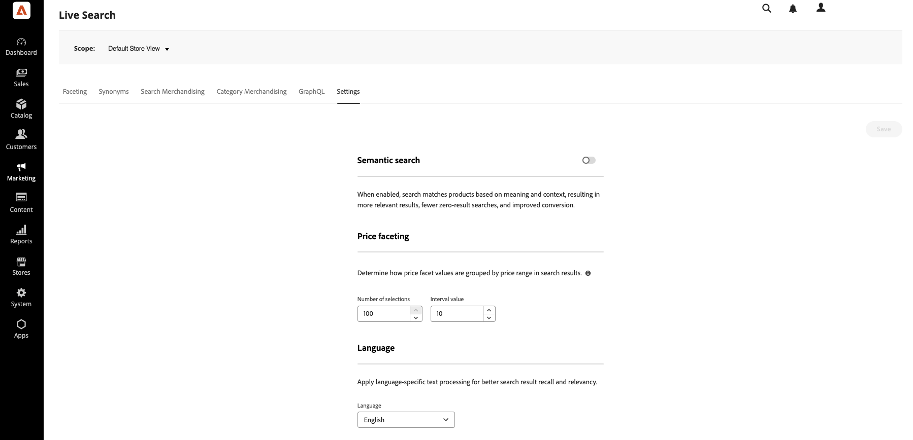

# Configurações

Use o espaço de trabalho **Configurações** para configurar a pesquisa semântica, intervalos e intervalos de facetas de preços e o idioma padrão do índice.

## Pesquisa semântica {#semantic-search}

A pesquisa semântica usa IA para corresponder produtos com base no significado e no contexto, não apenas palavras-chave exatas. Quando o **[!UICONTROL Semantic search]** estiver habilitado, os compradores que usam linguagem natural ou texto que não corresponde ao texto do catálogo ainda poderão encontrar produtos relevantes. O [!DNL Live Search] fornece correspondência de palavra-chave e semântica em uma experiência de pesquisa unificada na loja. A pesquisa semântica funciona com sua configuração existente; as [regras de pesquisa](rules.md), os [sinônimos](synonyms.md), os [aspectos](facets.md), os aumentos e o [merchandising de categoria](category-merch.md) continuam sendo aplicados.

**Para habilitar a pesquisa semântica (somente PaaS):**

1. No Administrador, vá para **Marketing** > *SEO e pesquisa* > **[!DNL Live Search]**.
1. No espaço de trabalho **Configurações**, habilite **[!UICONTROL Semantic search]**.

   Quando ativada, a pesquisa corresponde a produtos com base no significado e no contexto, resultando em resultados mais relevantes, menos pesquisas de resultado zero e conversão aprimorada.

1. Clique em **[!UICONTROL Save]**.

   Atualização dos resultados da pesquisa após a conclusão da indexação. Para um catálogo de médio porte, a indexação pode levar até meia hora. Para catálogos grandes com milhões de produtos, pode levar algumas horas.

>[!NOTE]
>
> A pesquisa semântica está disponível somente para **catálogos em inglês**. Se você definir **Idioma** para um catálogo em idioma diferente do inglês (consulte [Idioma](#language)), o **[!UICONTROL Semantic search]** será desabilitado automaticamente.

Para obter benefícios, orientação de validação, práticas recomendadas, solução de problemas e limitações, consulte [Pesquisa semântica](semantic-search.md).

### Descrições dos campos

| Campo | Descrição |
| --- | --- |
| Pesquisa semântica | Quando habilitado, [!DNL Live Search] usa significado e contexto juntamente com a correspondência de palavra-chave. Os atributos de catálogo predefinidos são usados automaticamente; nenhuma configuração de atributo é necessária no Administrador. Habilitado por padrão para [!DNL Adobe Commerce as a Cloud Service]; os comerciantes do PaaS habilitam-no manualmente. |

## Faceting de preço {#price-faceting}

Você pode especificar o número de grupos de faixas de preços e como os valores de preços são distribuídos entre eles. Cada faixa de preços sobrepõe o grupo anterior em um. Por exemplo, cinco grupos com um intervalo de 20 criam as seguintes faixas de preço: 0-20, 20-40, 40-60, 60-80 e >80. Se não houver produtos suficientes no catálogo para preencher todos os intervalos definidos, a exibição dos grupos disponíveis será ajustada de acordo. Por exemplo: 0-20, 60-80, >80.

**Para configurar a faceta de preços:**

1. No Administrador, vá para **Marketing** > *SEO e pesquisa* > **[!DNL Live Search]**.
1. No espaço de trabalho **Configurações** em *Facetagem de preços*, faça o seguinte:
   * Insira o **Número de seleções** ou agrupamentos de preços que estarão disponíveis. Com o [!DNL Live Search] 4.4.0, é possível definir até 100 agrupamentos de preços. As versões anteriores permitiam 50 agrupamentos de preços.
   * Insira o **Valor do intervalo** ou o intervalo de preços para cada grupo. O valor máximo é 40.000.000.
1. Clique em **[!UICONTROL Save]**.

   Leva aproximadamente 15 minutos para as configurações atualizadas estarem disponíveis na loja.

### Descrições dos campos

| Campo | Descrição |
|--- |--- |
| Número de seleções | Especifica o número de agrupamentos de intervalo de preços que podem ser usados como filtros de pesquisa na loja. Valor padrão: 8, Valor máximo: 100 (a partir de [!DNL Live Search] 4.4.0) |
| Valor do intervalo | Especifica o intervalo de preço para cada grupo. Por exemplo, cinco seleções com um valor de intervalo de 20 cria cinco agrupamentos de 0-20, 20-40, 40-60, 60-80 e >80. Valor padrão: 5, Valor máximo: 40.000.000 |

## Idioma {#language}

A configuração Idioma informa a [!DNL Live Search] qual idioma esperar ao ler o catálogo e gravar o índice.

As línguas têm diferentes conjuntos de regras para a gramática: como as palavras são separadas, tempos verbais e formas de palavras, por exemplo.
A configuração Idioma garante que o conjunto correto de regras seja aplicado ao mecanismo de indexação.

Defina a configuração Idioma para o idioma principal do catálogo. Ao alterar o idioma do índice, pode levar de 5 a 60 minutos para refletir a alteração na loja, dependendo do tamanho e da complexidade do catálogo.

| Idioma | Código |
|----|----|
| Árabe | ar |
| Armênio | hy |
| Basco | eu |
| Bengali | bn |
| Brasileiro | pt-br |
| Búlgaro | bg |
| Catalão | ca |
| Chinês (simplificado) | zh-cn |
| Chinês (tradicional) | zh-tw |
| Tcheco | cs |
| Dinamarquês | da |
| Holandês | nl |
| Inglês | en |
| Estoniano | et |
| Finlandês | fi |
| Francês | fr |
| Galego | gl |
| Alemão | de |
| Grego | el |
| Hindi | oi |
| Húngaro | hu |
| Indonésio | id |
| Irlandês | ga |
| Italiano | it |
| Japonês (Katakana) | ja |
| Coreano | ko |
| Letão | lv |
| Lituano | lt |
| Norueguês | não |
| Persa | fa |
| Português | pt |
| Romeno | ro |
| Russo | ru |
| Sorani | ku |
| Espanhol | es |
| Sueco | sv |
| Turco | tr |
| Tailandês | th |
