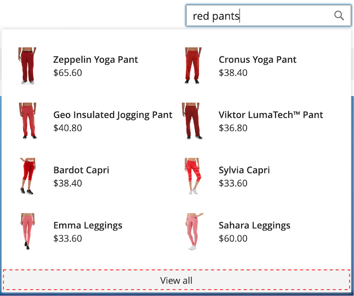
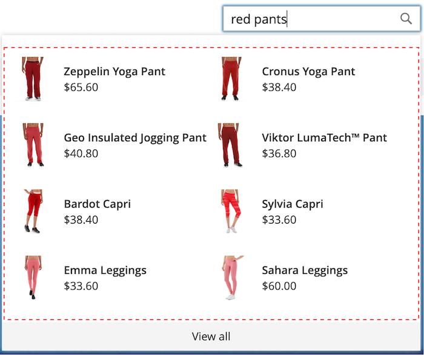
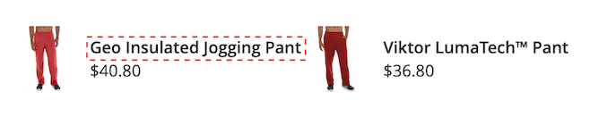
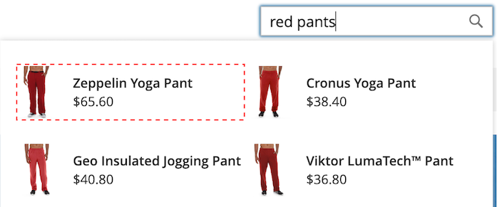

# [!DNL Storefront Popover]

Quando [!DNL Live Search] está [instalado](install.md), um [!DNL popover] aparece na vitrine quando os compradores digitam na caixa [Pesquisa](https://experienceleague.adobe.com/en/docs/commerce-admin/catalog/catalog/search/search#quick-search). Com cada caractere digitado, o [!DNL popover] é atualizado com os produtos sugeridos e as imagens em miniatura dos principais resultados da pesquisa.

[!DNL Live Search] retorna resultados para uma consulta de dois caracteres ou mais. Para uma correspondência parcial, o número máximo de caracteres por palavra é 20. O número de caracteres em uma consulta &quot;pesquisar ao digitar&quot; não é configurável.

![[!DNL Live Search popover]](assets/storefront-search-as-you-type.png)

>[!TIP]
>
>Saiba como definir atributos de produto como pesquisável no artigo [Configuração do Live Search](workspace.md).

## [!DNL Popover] tamanho da página

O tamanho da página de [!DNL popover] determina quantas linhas de produtos preenchidos automaticamente podem ser retornadas. Durante a instalação do Live Search, o valor `page_size` é alterado para o valor atual da configuração [Pesquisa no Catálogo](https://experienceleague.adobe.com/en/docs/commerce-admin/config/catalog/catalog) - `Autocomplete Limit`.

Por padrão, o valor Pesquisa no catálogo - Limite de preenchimento automático é definido como oito linhas (ou linhas). Para alterar o tamanho da página de [!DNL popover], faça o seguinte:

1. Na barra lateral *Admin*, vá para **Lojas** > Configurações > **Configuração**.
1. No painel esquerdo, expanda **Catálogo** e escolha **Catálogo** na lista de configurações.
1. Expanda a seção *Pesquisa no catálogo*.
1. Defina o **Limite de preenchimento automático** para o número de linhas que você deseja permitir no [!DNL popover].
1. Quando terminar, clique em **Salvar configuração**.

## Exemplo de estilo [!DNL Popover]

Você pode personalizar a aparência do widget [!DNL Popover] para que ele corresponda ao estilo e às diretrizes de marca da sua empresa.

O [!DNL storefront popover] sempre exibe o produto `name` e `price`, e a seleção de campos não é configurável. Entretanto, os elementos [!DNL popover] podem ser estilizados usando as classes [CSS](https://developer.adobe.com/commerce/frontend-core/guide/css/). Por exemplo, as declarações a seguir alteram a cor de fundo do contêiner e rodapé [!DNL popover].

```css
.livesearch.popover-container {
    background-color: lavender;
}

.livesearch.view-all-footer {
    background-color: magenta;
}
```

## Visibilidade do contêiner

O componente pai de `.livesearch.popover-container` é `.search-autocomplete`.  A classe `.active` indica a visibilidade do container. A classe `.active` é adicionada condicionalmente quando [!DNL popover] está aberto.

```css
.search-autocomplete.active   /* visible */
.search-autocomplete          /* not visible */
```

Para obter mais informações sobre o estilo de elementos de vitrine, consulte [Folhas de estilos em cascata (CSS)](https://developer.adobe.com/commerce/frontend-core/guide/css/) no [Guia do Desenvolvedor de Front-end](https://developer.adobe.com/commerce/frontend-core/guide/).

## Seletores de classe

Você pode usar os seguintes seletores de classe para estilizar os elementos de contêiner e produto no [!DNL popover].

- `.livesearch.popover-container`
- `.livesearch.view-all-footer`
- `.livesearch.products-container`
- `.livesearch.product-result`
- `.livesearch.product-name`
- `.livesearch.product-price`

### Seletores de classe de contêiner

#### .livesearch.popover-container

![[!DNL Popover] contêiner](assets/livesearch-popover-container.png)

#### .livesearch.view-all-footer



### Seletores de classe do produto

#### .livesearch.products-container



#### .livesearch.product-result


#### .livesearch.product-name



#### .livesearch.product-price


#### link do produto .livesearch



## Trabalhar com um tema modificado {#working-with-modified-theme}

Você pode usar o [!DNL storefront popover] com um [tema](https://developer.adobe.com/commerce/frontend-core/guide/themes/) personalizado que herda os arquivos necessários do *Luma*. O bloco `top.search` no `header-wrapper` do módulo `Magento_Search` não deve ser modificado.

```html
<referenceContainer name="header-wrapper">
   <block class="Magento\Framework\View\Element\Template" name="top.search" as="topSearch" template="Magento_Search::form.mini.phtml">
      <arguments>
         <argument name="configProvider" xsi:type="object">Magento\Search\ViewModel\ConfigProvider</argument>
      </arguments>
   </block>
</referenceContainer>
```

## Desabilitando o [!DNL popover]

Para desabilitar o [!DNL popover] e restaurar a funcionalidade padrão de [Pesquisa Rápida](https://experienceleague.adobe.com/en/docs/commerce-admin/catalog/catalog/search/search#quick-search), digite o seguinte comando:

```bash
bin/magento module:disable Magento_LiveSearchStorefrontPopover
```

## Implementações headless

Para aqueles com implementações headless, você pode instalar o [!DNL Live Search popover] usando um [pacote npm](https://www.npmjs.com/package/@magento/ds-livesearch-storefront-utils).
