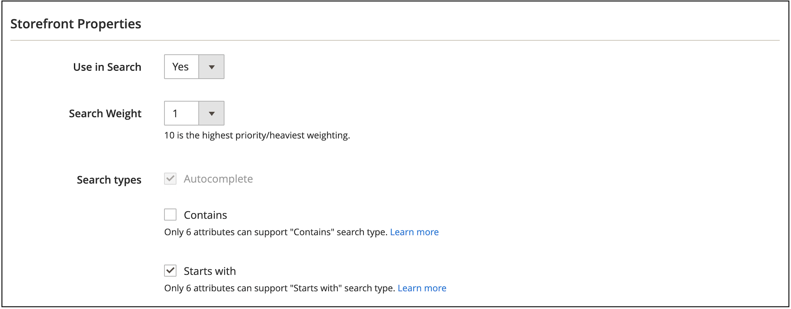

# Configuração do Live Search

O espaço de trabalho é onde você configura, gerencia e monitora o desempenho do [!DNL Live Search]. O menu na parte superior fornece acesso às ferramentas em cada área funcional. Os recursos disponíveis refletem a seleção de menu atual.

## Coleção de dados

Para garantir que cada área funcional do espaço de trabalho contenha os dados corretos, é necessário configurar a coleta de dados com base na implementação de vitrine selecionada:

1. Luma - A coleção de dados está disponível e pronta para uso.
1. Headless - a coleta de dados deve ser configurada manualmente, dependendo da implementação da loja.

Se você estiver usando uma loja headless, consulte a seguinte documentação para obter mais informações sobre os eventos necessários que precisam ser adicionados:

- [Eventos necessários](https://developer.adobe.com/commerce/services/shared-services/storefront-events/#live-search) para o painel do Live Search.
- [Coletor de eventos de vitrine](https://developer.adobe.com/commerce/services/shared-services/storefront-events/collector/) que precisa ser adicionado como pré-requisito.
- [Exemplos](https://github.com/adobe/commerce-events/tree/main/examples) da estrutura de eventos.

### Clientes da área de saúde

Se você for um cliente da área de saúde e tiver instalado a [extensão HIPAA do Data Services](../data-connection/hipaa-readiness.md#installation), que faz parte da [conexão de dados](../data-connection/overview.md), os dados do evento de vitrine usados por [!DNL Live Search] não serão mais capturados. Isso ocorre porque os dados do evento da loja são gerados no lado do cliente. Para continuar capturando e enviando dados do evento da loja, habilite novamente a coleção de eventos para [!DNL Live Search]. Consulte [configuração geral](https://experienceleague.adobe.com/en/docs/commerce-admin/config/general/general#data-services) para saber mais.

## Definir o escopo

Inicialmente, o [escopo](https://experienceleague.adobe.com/docs/commerce-admin/start/setup/websites-stores-views.html#scope-settings) de todas as configurações de [!DNL Live Search] está definido como `Default Store View`. Se a instalação do [!DNL Commerce] incluir vários modos de exibição de repositório, defina o **Escopo** como [modo de exibição de repositório](https://experienceleague.adobe.com/docs/commerce-admin/start/setup/websites-stores-views.html) ao qual as configurações das facetas se aplicam.

## Opções de Menu

| Opção | Descrição |
|--- |--- |
| [Desempenho](performance.md) | O Painel fornece o insight para desempenho de pesquisa de produtos. |
| [Facetagem](facets.md) | Filtragem de alto desempenho que usa várias dimensões de valores de atributo para refinar os critérios de pesquisa. |
| [Sinônimos](synonyms.md) | Estenda o alcance da pesquisa para incluir palavras que os compradores podem usar para encontrar produtos diferentes daqueles no catálogo. |
| [Pesquisar Merchandising](rules.md) | Modelar a experiência de pesquisa com regras lógicas que acionam ações programadas. Impulsione, bloqueie, marque ou oculte produtos para calibrar os resultados da pesquisa e oferecer suporte às suas metas comerciais. |
| [Merchandising de categoria](category-merch.md) | Aplicar regras e Merchandising inteligente no nível da categoria. |
| [GraphQL](graphql.md) | Os desenvolvedores conectados ao Administrador da loja podem compor e testar consultas com dados reais do catálogo. Para saber mais, acesse [Visão geral do GraphQL](https://developer.adobe.com/commerce/webapi/graphql/schema/live-search/) na documentação do desenvolvedor do [!DNL Live Search]. |
| [Configurações](settings.md) | Determine como os valores de facetas de preços são agrupados por intervalo de preços na loja e defina o idioma de indexação. |

## Definir atributos como pesquisáveis

Para produzir resultados altamente direcionados, revise o conjunto de atributos de produto [pesquisáveis](https://experienceleague.adobe.com/docs/commerce-admin/catalog/product-attributes/product-attributes.html) (`searchable=true`). Para garantir relevância, torne os atributos pesquisáveis somente se eles tiverem conteúdo com significado claro e conciso. Evite usar atributos que contenham texto menos preciso e longo, como `description`, que, embora habilitado para pesquisa por padrão, pode reduzir a precisão dos resultados da pesquisa. Por exemplo, se uma pessoa procurar por &quot;shorts&quot; e houver camisas com uma descrição que inclua o termo &quot;mangas curtas&quot;, as camisas serão incluídas nos resultados da pesquisa.

Para permitir que os atributos sejam pesquisáveis, conclua as seguintes etapas:

1. No Administrador, vá para **Lojas** > *Atributo* > **Produto**.
1. Selecione o atributo que você deseja pesquisar, como `color`.
1. Selecione **Propriedades da vitrine** e defina **Usar na Pesquisa** como `yes`.

[!DNL Live Search] também respeita o [peso](https://experienceleague.adobe.com/docs/commerce-admin/catalog/catalog/search/search-results.html#weighted-search) de um atributo de produto, conforme definido no Adobe Commerce. Atributos com um peso maior aparecerão mais altos nos resultados da pesquisa.

Os seguintes atributos são sempre pesquisáveis:

- `sku`
- `name`
- `categories`

### Pesquisa em camadas e expansão de tipos de pesquisa

A pesquisa em camadas, ou pesquisa dentro de uma pesquisa, é um sistema de filtragem eficiente baseado em atributos que estende a funcionalidade de pesquisa tradicional para incluir parâmetros de pesquisa adicionais. Esses parâmetros de pesquisa adicionais permitem uma descoberta de produtos mais precisa e flexível.

>[!NOTE]
>
>A pesquisa em camadas está disponível no Live Search 4.6.0.

Com a pesquisa em camadas, é possível:

- Permitir que os compradores pesquisem nos resultados da pesquisa.
- Use a indexação de pesquisa `startsWith` e `contains` na segunda camada da pesquisa em camadas para refinar ainda mais os resultados.

Os recursos de pesquisa avançada são implementados por meio do parâmetro `filter` na [`productSearch` query](https://developer.adobe.com/commerce/webapi/graphql/schema/live-search/queries/product-search/) usando operadores específicos:

- **Pesquisa em camadas** - Pesquisar em outro contexto de pesquisa - Com esse recurso, você pode realizar até duas camadas de pesquisa para suas consultas de pesquisa. Por exemplo:

   - **Pesquisa de Camada 1** - Pesquise por &quot;motor&quot; em `product_attribute_1`.
   - **Pesquisa de camada 2** - Pesquise por &quot;número de peça 123&quot; em `product_attribute_2`. Este exemplo procura por &quot;número de peça 123&quot; nos resultados por &quot;motor&quot;.

  A pesquisa em camadas está disponível para a indexação de pesquisa `startsWith` e a indexação de pesquisa `contains` na segunda camada da pesquisa em camadas, conforme descrito abaixo:

- **startsWith indexação de pesquisa** - Pesquisar usando a indexação `startsWith`. Esse novo recurso permite:

   - Procurando produtos em que o valor do atributo começa com uma string especificada.
   - Configurar uma pesquisa &quot;termina com&quot; para que os compradores possam pesquisar produtos em que o valor do atributo termina com uma determinada string. Para habilitar uma pesquisa &quot;termina com&quot;, o atributo de produto precisa ser assimilado na ordem inversa, e a chamada de API também deve ser uma sequência invertida. Por exemplo, se você deseja procurar um nome de produto que termine com &quot;calças&quot;, é necessário enviá-lo como &quot;stnap&quot;.

- **contém a indexação de pesquisa** - Pesquise um atributo usando a indexação contains. Esse novo recurso permite:

   - Procurando uma consulta em uma cadeia de caracteres maior. Por exemplo, se um comprador procurar o número de produto &quot;PE-123&quot; na cadeia de caracteres &quot;HAPE-123&quot;.

      - Observação: este tipo de pesquisa é diferente da [pesquisa de frase](https://developer.adobe.com/commerce/webapi/graphql/schema/live-search/queries/product-search/#phrase) existente, que executa uma pesquisa de preenchimento automático. Por exemplo, se o valor do atributo do seu produto for &quot;calças de ar livre&quot;, uma pesquisa de frase retornará uma resposta para &quot;fora da panela&quot;, mas não retornará uma resposta para &quot;ou formigas&quot;. A contém busca, no entanto, retorna uma resposta para &quot;ou formigas&quot;.

Essas novas condições aprimoram o mecanismo de filtragem de consultas de pesquisa para refinar os resultados da pesquisa. Essas novas condições não afetam a consulta de pesquisa principal.

#### Implementação

1. No Administrador, [defina um atributo de produto](https://experienceleague.adobe.com/en/docs/commerce-admin/catalog/product-attributes/product-attributes-add#step-5-describe-the-storefront-properties) para ser pesquisável.

   Consulte a lista de [atributos](https://experienceleague.adobe.com/en/docs/commerce-admin/catalog/product-attributes/attributes-input-types) pesquisáveis.

1. Especifique o recurso de pesquisa para esse atributo, como **Contém** (padrão) ou **Começa com**. Você pode especificar no máximo seis atributos a serem habilitados para **Contém** e seis atributos a serem habilitados para **Começa com**. Além disso, para a indexação **Contains**, o comprimento da sequência de caracteres é limitado a 50 caracteres ou menos.

   

1. Consulte a [documentação do desenvolvedor](https://developer.adobe.com/commerce/webapi/graphql/schema/live-search/queries/product-search/#filtering-using-search-capability) para obter exemplos de como atualizar suas chamadas de API do [!DNL Live Search] usando os novos recursos de pesquisa do `contains` e do `startsWith`.

   Você pode implementar essas novas condições na página de resultados da pesquisa. Por exemplo, você pode adicionar uma nova seção na página, onde o comprador pode refinar ainda mais os resultados da pesquisa. Você pode permitir que os compradores selecionem atributos específicos do produto, como &quot;Fabricante&quot;, &quot;Número da peça&quot; e &quot;Descrição&quot;. A partir daí, eles pesquisam dentro desses atributos usando as condições `contains` ou `startsWith`.

### Quando usar a pesquisa em camadas em vez de facetas

A pesquisa em camadas e os aspectos atendem a diferentes objetivos na descoberta de produtos, e escolher entre eles depende do seu caso de uso específico:

**Usar pesquisa em camadas quando:**

- Você precisa pesquisar nos resultados da pesquisa usando vários critérios.
- Trabalhar com números de peça, SKUs ou especificações técnicas onde os usuários conhecem informações parciais.
- Os compradores precisam restringir os resultados passo a passo com critérios aninhados.
- Você deseja reduzir o número de chamadas de API combinando vários critérios de pesquisa em uma única consulta.
- Você precisa implementar padrões de pesquisa específicos da empresa que vão além da navegação facetada padrão.

**Usar facetas quando:**

- Fornecendo filtragem típica de categoria, preço, marca e atributo
- Oferecer opções de filtro intuitivas que os usuários podem entender e selecionar facilmente
- Mostrando opções disponíveis com base nos resultados da pesquisa atual
- Exibir contagens e intervalos de filtros que ajudam os usuários a entender as opções disponíveis
- Trabalhar com características comuns do produto, como cor, tamanho, material e assim por diante.

**Prática recomendada:** use a pesquisa em camadas para pesquisas técnicas complexas em que os usuários tenham critérios específicos e use aspectos para filtragem padrão de comércio eletrônico em que os usuários desejam explorar e restringir as opções visualmente.

## Facetas e sinônimos

Facetas e sinônimos são outra maneira de melhorar a experiência de pesquisa para seus compradores.

[Facetas](facets.md) são atributos de produto definidos em [!DNL Live Search] para serem filtráveis. Você pode definir qualquer atributo filtrável como uma faceta em [!DNL Live Search], mas há [limites](boundaries-limits.md) para quantas facetas você pode pesquisar de uma vez.

>[!NOTE]
>
>Um atributo de produto só poderá ser filtrado se a configuração do atributo de produto tiver as propriedades necessárias: *Usar na Pesquisa = Sim*, *Usar na Navegação em Camadas de Resultados da Pesquisa=sim* e *Usar na Navegação em Camadas=Filtrável (com resultados)*. Se essas propriedades estiverem ausentes, o atributo não estará visível na configuração Faceta. Para obter instruções de configuração, consulte [Adicionar uma faceta](facets-add.md#add-a-facet).

[Sinônimos](synonyms.md) são termos que você pode definir para ajudar a orientar os usuários sobre o produto correto. Os usuários que procuram calças podem digitar &quot;calças&quot; ou &quot;pretas&quot;. É possível definir sinônimos para que esses termos de pesquisa direcionem os usuários aos resultados de &quot;calças&quot;.

## Configurações do Commerce

A seção a seguir descreve as definições de configuração do Commerce com e sem suporte para [!DNL Live Search].

### Valores de configuração compatíveis

>[!IMPORTANT]
>
>É altamente recomendável usar os widgets de lista de produtos, habilitados por padrão no Live Search 4.0.0. Os widgets são destinados a substituir completamente a implementação de adaptadores em versões futuras. Consulte [habilitar widgets de lista de produtos](install.md#enable-product-listing-widgets) para saber mais.

| Definição da configuração do Commerce | Descrição | Suportado pelo Popover | Suportado pelo adaptador |
|---|---|---|---|
| Lojas > Configuração > Catálogo > Catálogo > Pesquisa no catálogo > Permitir todos os produtos por página | Se definida como `Yes`, inclui a opção `ALL` no controle &quot;Mostrar por Página&quot;. | Sim. Máximo de 500 produtos | Sim. Máximo de 500 produtos |
| Lojas > Configuração > Catálogo > Catálogo > Pesquisa no catálogo > Duração mínima da consulta | O número mínimo de caracteres permitidos em uma pesquisa de catálogo. | Sim | Sim |
| Lojas > Configuração > Catálogo > Catálogo > Pesquisa no catálogo > Produtos por página em valores permitidos da grade | Determina o número de produtos exibidos na exibição de grade. | Sim | Sim |
| Lojas > Configuração > Catálogo > Catálogo > Pesquisa no catálogo > Produtos por página no valor padrão da grade | Determina o número de produtos exibidos por página por padrão na exibição de grade. | Sim. Máximo de 500 produtos | Sim. Máximo de 500 produtos |
| Lojas > Configuração > Catálogo > Inventário > Exibir Produtos Sem Estoque | Exibe os produtos que estão esgotados. | Sim | Sim |
| Lojas > Configuração > Moeda > Moeda de Exibição Padrão | A moeda principal usada para exibir preços. | Sim | Sim |
| Lojas > Configuração > Geral > Configuração de Moeda > Opções de Moeda > Moeda Base | A moeda principal usada para todas as transações de pagamento online. | Sim | Sim |

Os preços na Página de listagem de produtos do widget e Popover são convertidos para a Moeda de exibição padrão usando as Taxas de moeda configuradas.

### Valores de configuração não suportados

| Definição da configuração do Commerce | Descrição | Notas |
|---|---|---|
| Lojas > Configuração > Catálogo > Loja > Modo de lista | Determina o formato da lista de resultados da pesquisa. | É renderizado corretamente, mas os eventos não são enviados para algumas interações de página |
| Lojas > Configuração > Catálogo > Catálogo > Pesquisa no catálogo > Duração máxima da consulta | O número máximo de caracteres permitidos em uma pesquisa de catálogo. | Não implementado; os Serviços de Pesquisa aceitam até 255 caracteres |
| Configuração > Vendas > Imposto > Configurações De Exibição De Preço > Exibir Preços Do Produto No Catálogo | Determina se os preços dos produtos publicados no catálogo incluem ou excluem imposto, ou mostram duas versões do preço: uma com e outra sem imposto |  |
| Lojas > Configuração > Catálogo > Loja > Lista de Produtos Classificar por | Determina a ordem de classificação da lista de resultados da pesquisa. | Não se aplica ao [!DNL Live Search] [Widget da página de listagem de produtos](plp-styling.md) |

### Pesquisar termos

[!DNL Live Search] dá suporte a [redirecionamentos de termo de pesquisa](https://experienceleague.adobe.com/docs/commerce-admin/catalog/catalog/search/search-terms.html) em implementações em que o Adobe Commerce lida com o roteamento, como no Luma e outros temas baseados em php.
