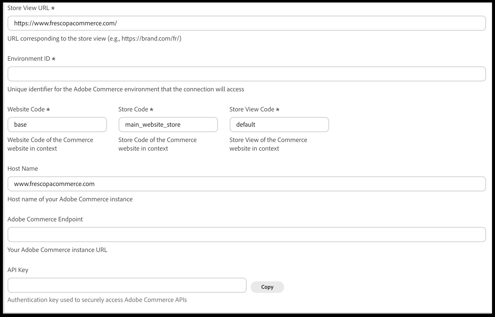

# Conectar [!DNL Adobe Commerce] a [!DNL Adobe LLM Optimizer]

>[!IMPORTANT]
>
>O acesso a essa integração é restrito. Entre em contato com o Gerente técnico de conta para obter mais detalhes.

Este artigo explica como conectar seu catálogo do [!DNL Adobe Commerce] disponível para o LLM Optimizer.

>[!NOTE]
>
>Este artigo se concentra no lado do Commerce da integração. Para obter informações gerais sobre o LLM Optimizer, consulte a [documentação do produto LLM Optimizer](https://experienceleague.adobe.com/pt-br/docs/llm-optimizer/using/home).

## Habilitar os serviços Commerce necessários {#enable-commerce-services}

Trabalhe com seu administrador do Commerce ou parceiro de implementação para garantir o seguinte:

- Os dados do catálogo que o LLM Optimizer deve ler são **exportados ou sincronizados** de acordo com sua arquitetura (incluindo qualquer exportador de dados SaaS ou conector em sua implantação).
- O acesso à API, as credenciais e as URLs de ambiente (sandbox vs produção) correspondem ao **locatário** que você pretende usar no LLM Optimizer.

## Configurar a conexão do Commerce no LLM Optimizer {#configure-commerce-connection}

**Para configurar a conexão do Commerce:**

1. Na interface do usuário do [!DNL Adobe LLM Optimizer], abra a **Configuração do cliente** e selecione a guia **[!UICONTROL Commerce]**.

   

1. Clique em **[!UICONTROL Add Store View]** para criar uma nova linha ou expandir uma entrada de exibição de armazenamento existente para editá-la.
1. Insira o **[!UICONTROL Store View URL]** (obrigatório).

   Use a URL de vitrine para essa exibição de loja, incluindo qualquer localidade ou prefixo de caminho (por exemplo, `https://brand.example.com/` ou `https://brand.example.com/fr/`).

1. Digite o **[!UICONTROL Environment ID]** (obrigatório) — o identificador do ambiente Adobe Commerce ao qual o LLM Optimizer deve se conectar.
1. Insira **[!UICONTROL Website Code]**, **[!UICONTROL Store Code]** e **[!UICONTROL Store View Code]** (obrigatório).

   Esses valores devem corresponder aos códigos no Administrador do Commerce para a exibição de site, loja e loja conectada.

1. Opcional: digite **[!UICONTROL Host Name]** com o nome de host da sua instância do Commerce (por exemplo, `www.example.com`) se esse valor for diferente da URL.
1. Insira o **[!UICONTROL Adobe Commerce Endpoint]** — o URL base da sua instância do Adobe Commerce usada para acesso à API.
1. Insira ou cole o **[!UICONTROL API Key]** usado para autenticar solicitações para APIs do Commerce.

   Clique em **[!UICONTROL Copy]** ao lado do campo se precisar copiar a chave em outro lugar com segurança.

1. Clique em **[!UICONTROL Save]** para armazenar a configuração.

Depois de salvar, aguarde a conclusão de qualquer **sincronização inicial** ou trabalho de validação antes de confiar nos resultados de catálogo ou auditoria para essa exibição de armazenamento.

Para remover uma configuração de exibição de repositório, abra essa entrada e clique em **[!UICONTROL Delete]**.

### Descrições dos campos {#commerce-connection-fields}

| Campo | Descrição |
| --- | --- |
| Armazenar URL de exibição | O URL público da visualização de loja que o LLM Optimizer deve tratar como no escopo para fluxos de trabalho de catálogo e auditoria. |
| ID do ambiente | Identificador de ambiente do Commerce (na sua nuvem, na documentação de implantação ou no Admin, quando aplicável). |
| Código do site | Commerce **[!UICONTROL Website Code]** para o site proprietário do catálogo. |
| Armazenar código | Commerce **[!UICONTROL Store Code]** para a loja nesse site. |
| Código de exibição da loja | Commerce **[!UICONTROL Store View Code]** para a exibição de armazenamento (por exemplo, `default`). |
| Nome do host | Nome do host da loja ou instância do Commerce quando o formulário solicita uma adição a outras URLs. |
| Endpoint do Adobe Commerce | O URL da instância que a LLM Optimizer usa para acessar as APIs do Commerce. |
| Chave de API | Chave secreta para autenticação da API; trate-a como qualquer credencial de produção. |

## Confirmar disponibilidade do locatário e do ambiente {#confirm-tenant-readiness}

- Verifique se os projetos **sandbox** conectados não estão misturados com dados do Commerce **produção**, a menos que isso seja intencional.
- Alinhe as **funções de usuário** no Experience Cloud e no Commerce para que as pessoas que aprovam as ações de implantação tenham as permissões certas em ambos os lados.

## Próximas etapas {#next-steps}

[Use o LLM Optimizer com o Adobe Commerce](use-llmo-with-commerce.md) para analisar oportunidades, implantar atualizações de catálogo e entender o comportamento de substituição.
