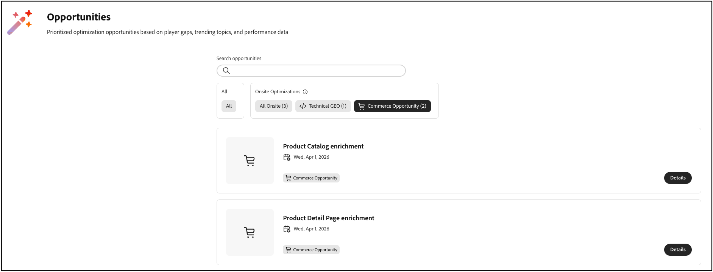
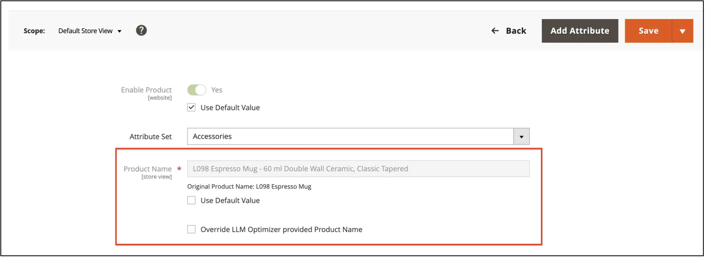
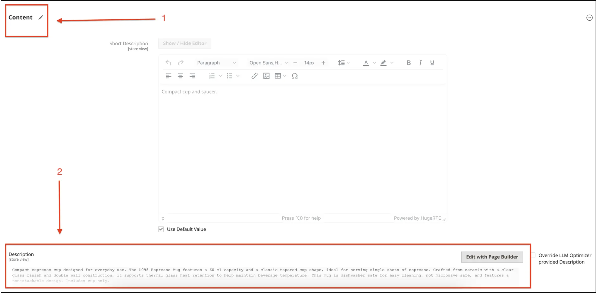

# Usar [!DNL Adobe LLM Optimizer] com [!DNL Adobe Commerce]

>[!IMPORTANT]
>
>O acesso a essa integração é restrito. Entre em contato com o Gerente técnico de conta para obter mais detalhes.

Depois de [conectar o Commerce ao LLM Optimizer](connect-to-llmo.md), você trabalha principalmente na interface do usuário do **[!DNL Adobe LLM Optimizer]** para revisar oportunidades e enviar alterações aprovadas para o catálogo quando estiver pronto. Este artigo descreve os dois tipos de otimização com foco na Commerce, como usar o **[!UICONTROL Opportunities]**, como as ações de implantação se comportam no [!DNL Adobe Commerce] e como as atualizações externas interagem com as sugestões do LLM Optimizer. Para obter uma visão geral mais ampla da integração, consulte a [visão geral da integração](../overview.md).

## Entender as otimizações do Commerce no LLM Optimizer {#understand-optimizations}

Para catálogos com suporte da Commerce, a LLM Optimizer oferece **[!UICONTROL Product Detail Page Enrichment]** e **[!UICONTROL Product Catalog Enrichment]**.

| Foco | Para que serve? |
| --- | --- |
| **[!UICONTROL Product Detail Page Enrichment]** (enriquecimento de PDP) | Sugestões que melhoram a leitura de uma página de produto para detecção orientada por IA, sem substituir o layout da loja. |
| **[!UICONTROL Product Catalog Enrichment]** | Sugestões de atualizações do **nome do produto** e da **descrição do produto** para produtos específicos que você pode revisar, editar, se necessário, e aplicar ao catálogo do Commerce. |

Use o **[!UICONTROL Opportunities]** para abrir a lista de produtos ou URLs e trabalhar com sugestões para o tipo selecionado.

## Navegar pelas oportunidades do Commerce {#navigate-commerce-opportunities}

**Para abrir oportunidades relacionadas ao Commerce:**

1. No painel à esquerda, clique em **[!UICONTROL Opportunities]**.
1. Clique em **[!UICONTROL Commerce Opportunity]** para mostrar os tipos de otimização que direcionam seu catálogo [!DNL Adobe Commerce].
1. Selecione **[!UICONTROL Product Catalog Enrichment]** ou **[!UICONTROL Product Detail Page Enrichment]**, dependendo do que você deseja trabalhar.

### Entender as métricas de oportunidade {#opportunity-metrics}

Cada visualização de oportunidade resume o impacto para que você possa priorizar o trabalho:

- **Páginas do Produto** ou **URLs**: as páginas ou os produtos avaliados para esse tipo de otimização.
- **Tráfego de agente**: visitas e interações iniciadas por agentes de IA que podem ajudá-lo a priorizar oportunidades de alto impacto primeiro.

### Entender estados de sugestão {#suggestion-states}

Ambos os tipos de enriquecimento usam as mesmas visualizações de fluxo de trabalho:

- **[!UICONTROL Current Suggestions]**: itens novos ou ativos para revisão.
- **[!UICONTROL Fixed Suggestions]**: itens que você já implantou ou resolveu.
- **[!UICONTROL Ignored Suggestions]**: itens que você excluiu intencionalmente da ação.

### Revisar e implantar o enriquecimento da PDP {#review-deploy-pdp}

O enriquecimento de PDP é para equipes que desejam mensagens mais claras na página do produto em descobertas orientadas por IA, mantendo a experiência da loja que seus merchandisers projetaram.

**Para revisar e implantar o enriquecimento de PDP:**

1. Abrir **[!UICONTROL Product Detail Page Enrichment]** de **[!UICONTROL Opportunities]**.
1. Na tabela **[!UICONTROL URLs with Suggestions]**, selecione **[!UICONTROL Current Suggestions]**.
1. Para uma URL ou SKU, clique em **[!UICONTROL Preview]** para revisar a análise de IA e o enriquecimento proposto.
1. Opcional: Clique em **[!UICONTROL Copy]** para colar o conteúdo em um editor externo ou clique em **[!UICONTROL Edit suggestion]** para editar no local.
1. Opcional: Se uma sugestão não corresponder à sua estratégia, mova-a para **[!UICONTROL Ignored Suggestions]**.
1. Depois de revisado e aprovado, selecione a linha da URL ou SKU a ser atualizada, clique em **[!UICONTROL Deploy optimizations]** e confirme.

Após a implantação, as sugestões são movidas para **[!UICONTROL Fixed Suggestions]** com um status de otimização no LLM Optimizer.

>[!NOTE]
>
>A implantação de enriquecimento de PDP requer a integração concluída de **Otimizar na Edge** no LLM Optimizer. Se a integração estiver incompleta, a interface solicitará que você conclua a instalação antes da implantação.

### Revisar e implantar o enriquecimento do catálogo de produtos {#review-deploy-catalog}

O enriquecimento do catálogo é para equipes que desejam restringir os nomes dos produtos e as descrições longas diretamente no Commerce, com sugestões que você pode analisar antes de salvar qualquer item.

**Para revisar e implantar o enriquecimento do catálogo de produtos:**

1. Abrir **[!UICONTROL Product Catalog Enrichment]** de **[!UICONTROL Opportunities]**.
1. Na tabela **[!UICONTROL URLs with Suggestions]**, selecione **[!UICONTROL Current Suggestions]**.
1. Clique no controle de expansão da linha de URL ou SKU para mostrar as atualizações propostas do **Nome do Produto** e da **Descrição do Produto**.
1. Opcional: clique no ícone de edição para ajustar o nome ou a descrição proposta antes de implantar.
1. Opcional: Se uma sugestão não corresponder à sua estratégia, mova-a para **[!UICONTROL Ignored Suggestions]**.
1. Depois de revisado e aprovado, selecione a linha da URL ou SKU a ser atualizada, clique em **[!UICONTROL Deploy optimizations]** e confirme.

Alterações de nome e descrição aprovadas são salvas no catálogo [!DNL Adobe Commerce] como outras atualizações de produto.

>[!IMPORTANT]
>
>Trate a implantação como uma alteração no catálogo de produção. Use suas práticas normais de controle de alterações, preparo e controle de qualidade. Implante somente depois que as partes interessadas em merchandising e SEO chegarem a um acordo sobre a cópia final.

Após a implantação, as sugestões são movidas para **[!UICONTROL Fixed Suggestions]** com o status **Aplicado**.

## Verificar atualizações no Administrador do Commerce {#verify-in-admin}

**Para verificar o enriquecimento do catálogo implantado:**

1. Faça logon no [!DNL Adobe Commerce] **Administrador**.
1. Vá para **[!UICONTROL Catalog]** > **[!UICONTROL Products]**.
1. Use filtros e o seletor de **exibição de repositório** conforme necessário (por exemplo, **[!UICONTROL Default Store View]**) e procure a **SKU**.
1. Abra o produto no modo de edição.

   O formulário de produto mostra o **nome do produto** enriquecido.

   

1. Opcional: selecione **[!UICONTROL Override LLM Optimizer provided Product Name]** se quiser manter um nome inserido manualmente.

As substituições manuais afetam como as oportunidades permanecem sincronizadas com o catálogo; consulte [Substituição manual no Administrador](#manual-override-in-the-admin).

1. Expanda a seção **[!UICONTROL Content]** e localize o campo **descrição**.

   A descrição enriquecida é exibida quando você implantou alterações de descrição.

   

1. Opcional: selecione **[!UICONTROL Override LLM Optimizer provided Description]** se quiser manter uma descrição inserida manualmente.

## Verificar atualizações na loja {#verify-storefront}

Procure o SKU na loja e abra o PDP. Confirme se o **nome** e qualquer região que supere a longa **descrição** refletem o que você aprovou. Confirme também todos os canais downstream que consomem os mesmos atributos de catálogo, quando relevante para a implantação.

<!--
## PDP enrichment rollback {#pdp-rollback}

If your project includes PDP enrichment opportunities, **rollback** behavior may support **bulk** or **per-URL** actions, depending on your LLM Optimizer release. Follow the in-product options for rollback. For **[!UICONTROL Product Catalog Enrichment]**, undoing a name or description in Commerce is effectively a new catalog edit or a follow-up opportunity, not a separate undo control in the Admin unless your team implements one.
-->

## Substituições, assimilação e oportunidades obsoletas {#overrides-ingestion}

Depois que o LLM Optimizer atualiza o nome ou a descrição de um produto, outros sistemas de assimilação, como chamadas da API REST, importações de CSV, feeds PIM ou processos semelhantes podem alterar os mesmos campos. As seções a seguir descrevem o que acontece nesse caso.

### A assimilação envia o valor do catálogo original novamente

Se um processo externo gravar o nome ou a descrição original (o valor existente antes da implantação do LLM Optimizer), a Commerce continuará a honrar o valor implantado pelo LLM Optimizer para esse campo, de acordo com as regras de integração. A oportunidade não pode ser revertida automaticamente apenas com base nessa assimilação.

### A assimilação envia um novo valor

Se o processo externo enviar um novo valor que não seja apenas uma repetição do texto pré-LLM Optimizer, por exemplo, renomear &quot;Sapatos Vermelhos&quot; para &quot;Sapatos Vermelhos Cônicos&quot;, esse novo valor de catálogo será respeitado e a oportunidade relacionada do LLM Optimizer normalmente será marcada como *Desatualizada* no LLM Optimizer, pois o catálogo em tempo real não corresponde mais ao contexto de sugestão.

### Substituição manual no administrador {#manual-override-in-the-admin}

Se você editar manualmente o nome ou a descrição do produto no [!DNL Adobe Commerce] *Administrador*:

- O valor *Admin* vence como o sistema de registro para essa alteração manual.
- A oportunidade do LLM Optimizer está marcada como *Desatualizada*.
- No LLM Optimizer, a interface do usuário volta ao estado original dessa oportunidade para que você possa criar uma nova linha de base ou aceitar uma nova sugestão se a análise for executada novamente.

Essas regras ajudam você a saber se o LLM Optimizer, os feeds de assimilação ou as edições de *Administrador* são autoritativas quando vários canais tocam a mesma SKU.

## Práticas recomendadas

- **Documente a propriedade do sistema** para obter o nome e a descrição do produto, de modo que os trabalhos do PIM ou do feed não entrem em conflito com as expectativas da LLM Optimizer.
- **Coordene com as equipes de SEO e marcas** antes de implantar títulos ou descrições em massa.
- **Ressincronizar** ou **reanalisar** após as principais importações de catálogo, para que as oportunidades reflitam o estado atual do catálogo.

## Experimente na demonstração

Use o ambiente de demonstração Frescopa para ver os dois tipos de oportunidade do Commerce em ação:

- [Exibir demonstração do Enriquecimento do catálogo de produtos](https://play.llmo.now/org/demo-org/opportunities/commerce-product-catalog-enrichment/e5f2a854-7477-421c-820f-74d5dd595647?siteId=9ae8877a-bbf3-407d-9adb-d6a72ce3c5e3)
- [Exibir demonstração de enriquecimento da página de detalhes do produto](https://play.llmo.now/org/demo-org/opportunities/commerce-product-page-enrichment/4e8b0428-0893-4864-a00e-fc1d77fb3372?siteId=9ae8877a-bbf3-407d-9adb-d6a72ce3c5e3)

## Tópicos relacionados

- [Conectar o Adobe Commerce ao LLM Optimizer](connect-to-llmo.md)
- [Visão geral da integração](../overview.md)
- [Limites e limites de integração](../boundaries-limits.md)
