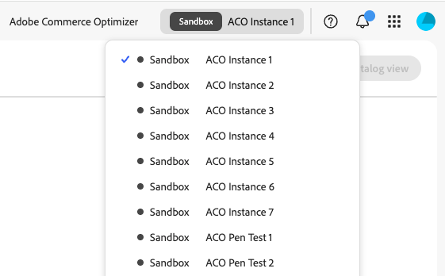

# Introdução

Este guia orienta você na configuração do [!DNL Adobe Commerce Optimizer] do início ao fim. Embora este guia cubra todas as funções, consulte a [documentação do desenvolvedor](https://developer.adobe.com/commerce/services/optimizer/) para obter o conteúdo detalhado específico do desenvolvedor.

## Pré-requisitos

Antes de começar, verifique se você tem:

- **Conta da Adobe Experience Cloud** com [!DNL Adobe Commerce Optimizer] direitos
- **Acesso de administrador da organização** para criar instâncias e gerenciar usuários
- **Conta do GitHub** (para carregar dados de exemplo e desenvolvimento de vitrine)
- **Noções básicas** sobre conceitos de comércio eletrônico

## Guia de início rápido

Siga estas etapas essenciais para executar o ambiente [!DNL Adobe Commerce Optimizer]:

### Etapa 1. Criar uma instância

1. Faça logon no [Adobe Experience Cloud](https://experience.adobe.com/).
1. Navegue até **Commerce** > **Commerce Cloud Manager**.
1. Clique em **Adicionar Instância** > **Commerce Optimizer**.

   {width="60%" zoomable="yes"}

1. Definir configurações de instância:
   - **Nome**: nome descritivo (por exemplo, &quot;Sandbox da minha empresa&quot;)
   - **Descrição**: breve descrição da finalidade
   - **Região**: selecione sua região preferencial
   - **Tipo de ambiente**: começar com um ambiente **Sandbox** para testes

1. Clique em **Adicionar instância**.

   A Cloud Manager é atualizada para incluir sua nova instância. Para obter detalhes sobre como acessá-lo e gerenciá-lo, consulte [Gerenciar uma instância](#manage-an-instance).

>[!NOTE]
>
>As instâncias de sandbox estão limitadas à região da América do Norte. Não é possível alterar a região após a criação.

### Etapa 2. Configurar o ambiente

Depois de criar sua instância:

1. [Gerencie sua instância](#manage-an-instance) pelo Commerce Cloud Manager.
1. Configure o acesso do usuário usando o [Guia de Gerenciamento de Usuários](./user-management.md).

### Etapa 3. Adicionar dados de amostra (opcional)

Para testes e aprendizado, siga as instruções em [Carregar Dados de Amostra](#add-sample-data).

## Fluxos de trabalho baseados em função

A configuração e o gerenciamento do [!DNL Adobe Commerce Optimizer] dependem de três funções principais. Cada função tem tarefas e responsabilidades específicas:

{zoomable="yes"}

### Tarefas do administrador

Os administradores gerenciam instâncias, usuários e configurações organizacionais.

| Tarefa | Descrição | Link |
|---|---|---|
| **Gerenciar usuários** | Adicionar usuários, desenvolvedores e administradores | [Gerenciamento de usuários](./user-management.md) |
| **Criar instâncias** | Configurar ambientes de sandbox e produção | [Criar Instância](#create-an-instance) |
| **Configurar Acesso** | Configurar exibições e políticas do catálogo | [Exibições do catálogo](./setup/catalog-view.md) |

### Tarefas do desenvolvedor

Os desenvolvedores lidam com a implementação técnica e a integração de dados, incluindo tarefas de arquitetura de plataforma.

| Tarefa | Descrição | Link |
|---|---|---|
| **Acessar o Developer Console** | Criar projetos e gerar credenciais | [Developer Console](https://developer.adobe.com/developer-console/docs/guides/getting-started) |
| **Assimilar Dados do Catálogo** | Importar dados do produto de sistemas existentes | [API de assimilação de dados](https://developer.adobe.com/commerce/services/optimizer/data-ingestion/) |
| **Configurar vitrine** | Configurar vitrine do Edge Delivery Services | [Instalação da Storefront](./storefront.md) |

### Tarefas do merchandiser

Os merchandisers otimizam e personalizam a experiência de compra por meio da descoberta de produtos e de recomendações. Eles também usam dados e análises do comprador para tomar decisões estratégicas sobre posicionamento de produtos, preços e promoções na loja.

| Tarefa | Descrição | Link |
|---|---|---|
| **Descoberta de Produto** | Configurar pesquisa e filtragem | [Visão geral do merchandising](./merchandising/overview.md) |
| **Recomendações** | Configurar recomendações de produtos alimentados por IA | [Recomendações de produto](./merchandising/recommendations/overview.md) |
| **Acompanhamento de Desempenho** | Monitorar métricas de sucesso | [Métricas de sucesso](./manage-results/success-metrics.md) |

## Gerenciar uma instância

1. Faça logon no [Adobe Experience Cloud](https://experience.adobe.com/).

1. Abra o Commerce Cloud Manager:
   - Em **Acesso rápido**, clique em **Commerce**.
   - Visualize suas instâncias disponíveis.

1. Acesse sua instância:

   Clique no nome da instância para abrir o aplicativo [!DNL Adobe Commerce Optimizer]. No aplicativo, você pode alternar entre diferentes instâncias do [!DNL Adobe Commerce Optimizer] usando o menu suspenso na parte superior da página:

   {zoomable="yes"}

   Todas as instâncias exibidas pertencem à mesma organização. Você pode alternar entre instâncias para exibir dados e configurações para cada uma, como entre ambientes de sandbox e produção.

1. Obter detalhes da instância:
   - Clique no ícone de informações ao lado do nome da instância.
   - Observe o ponto de extremidade do GraphQL, o ponto de extremidade do Serviço de catálogo para assimilação de dados e a ID da instância (também conhecida como `tenant ID`).

   {width="60%" zoomable="yes"}

   Os detalhes do endpoint e da ID da instância (ID do locatário) são necessários para integrar a aplicativos de front-end e sistemas de back-end. A URL para acessar o aplicativo [!DNL Adobe Commerce Optimizer] também é fornecida aqui.

   Nem todos os usuários do Adobe Commerce Optimizer têm acesso ao Cloud Manager e aos detalhes da instância. O acesso depende da função e das permissões atribuídas à conta de usuário. Se você não tiver acesso, entre em contato com o administrador da organização para obter os detalhes da instância.

1. Editar nome e descrição da instância:
   - Clique no ícone **Editar** ao lado do nome de uma instância.
   - Atualize o nome e a descrição conforme necessário.
   - Clique em **Salvar**.

   Você também pode usar as opções de pesquisa e filtro para encontrar rapidamente instâncias específicas.

## Adicionar dados de amostra

A Adobe fornece um repositório GitHub com dados e ferramentas de exemplo para ajudá-lo a aprender e testar os recursos do [!DNL Adobe Commerce Optimizer].
Os dados de amostra são baseados no [cenário comercial do Carvelo](./use-case/admin-use-case.md) e incluem:

- Catálogo de produtos com peças automotivas
- Vários catálogos de preços e cenários de preços
- Exibições de catálogo e políticas para diferentes negociantes
- Exemplos completos de fluxos de trabalho

**Carregar os dados de exemplo:**

1. Acesse o [repositório GitHub da Assimilação de dados do catálogo de amostra](https://github.com/adobe-commerce/aco-sample-catalog-data-ingestion).

1. Siga as instruções de configuração no arquivo README do repositório para concluir as seguintes tarefas:

   - Configurar o ambiente
   - Concluir o processo de assimilação de dados
   - Criar exibições e políticas de catálogo usando os dados de amostra
   - Verifique a assimilação de dados verificando os dados do Serviço de Catálogo na página [Sincronização de Dados](./setup/data-sync.md)

## Próximas etapas

Após concluir a instalação:

1. Configurar a loja:
   - Configurar [vitrine do Edge Delivery Services](./storefront.md)
   - Conectar-se aos dados do catálogo

1. Conheça o caso de uso Carvelo:
   - Siga o [fluxo de trabalho completo](./use-case/admin-use-case.md)
   - Praticar com cenários reais

1. Configurar merchandising:
   - Configurar a [descoberta de produto](./merchandising/overview.md)
   - Criar [recomendações](./merchandising/recommendations/overview.md)

1. Monitorar desempenho:
   - Rastrear [métricas de sucesso](./manage-results/success-metrics.md)
   - Analisar [desempenho da pesquisa](./manage-results/search-performance.md)

## Solução de problemas

### Problemas comuns

| Problema | Solução |
|---|---|
| **Não é possível criar uma instância** | Verifique se você tem [!DNL Adobe Commerce Optimizer] direitos e permissões de administrador. |
| **Instância não aparecendo** | Verifique sua organização do Adobe IMS e atualize a página. |
| **Não é possível acessar a instância** | Verifique se você foi adicionado como usuário no Admin Console. |
| **Dados de exemplo não carregam** | Verifique as credenciais da instância e os endpoints da API. |

### Obter ajuda

- **Recursos do desenvolvedor**: [Documentação do desenvolvedor](https://developer.adobe.com/commerce/services/optimizer/)
- **Recursos da Storefront**: [Documentação da Commerce Storefront](https://experienceleague.adobe.com/developer/commerce/storefront/?lang=pt-BR)
- **Suporte**: [recursos de Suporte da Adobe Commerce](https://experienceleague.adobe.com/pt-br/docs/commerce-knowledge-base/kb/overview)
