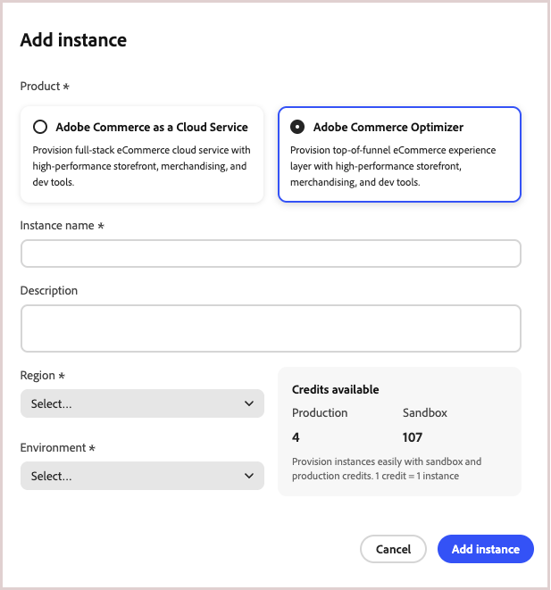
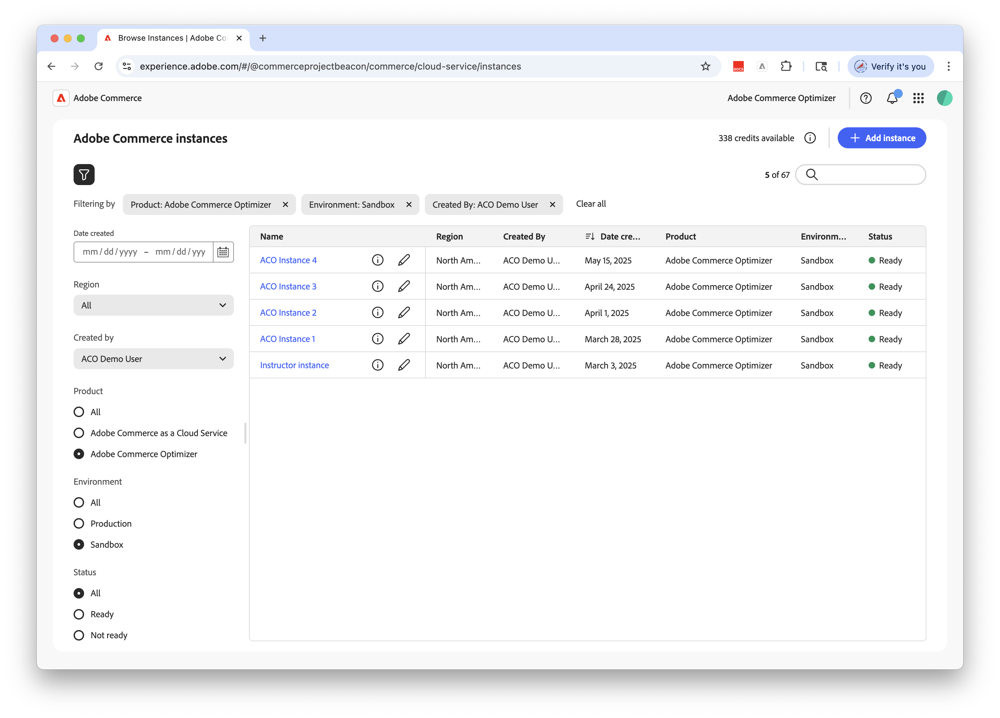

# Introdução

Este guia orienta você na configuração do [!DNL Adobe Commerce Optimizer] do início ao fim. Embora este guia cubra todas as funções, consulte a [documentação do desenvolvedor](https://developer.adobe.com/commerce/services/optimizer/) para obter o conteúdo detalhado específico do desenvolvedor.

## Tipos de instância e isolamento de ambiente

O Adobe Commerce Optimizer usa instâncias separadas para ambientes diferentes, como **sandbox** e **produção**. Cada instância tem sua própria ID de instância e seus próprios dados isolados, incluindo exibições de catálogo, políticas, configuração de pesquisa e recomendações de produto.

Ao integrar com o Adobe Commerce as a Cloud Service, plataformas de comércio de terceiros ou vitrines do Edge Delivery Services, sempre corresponda aos ambientes:

- Conecte **instâncias do Otimizador de sandbox** a ambientes de comércio e vitrine de não produção.
- Conecte **instâncias do Otimizador de produção** a ambientes de comércio e vitrine de produção.

A combinação de ambientes de sandbox com ambientes de produção causa dados de catálogo inconsistentes, comportamento inesperado de pesquisa e merchandising e métricas não confiáveis. Use o tipo de instância e a ID de instância no Commerce Cloud Manager como fonte da verdade ao configurar integrações.

## Pré-requisitos

Antes de começar, verifique se você tem:

- **Conta da Adobe Experience Cloud** com [!DNL Adobe Commerce Optimizer] direitos
- **Acesso de administrador da organização** para criar instâncias e gerenciar usuários
- **Conta do GitHub** para carregar dados de amostra e desenvolvimento de vitrine
- **Noções básicas** sobre conceitos de comércio eletrônico

## Guia de início rápido

Siga estas etapas essenciais para executar o ambiente [!DNL Adobe Commerce Optimizer]:

### Etapa 1. Criar uma instância

1. Faça logon na [Adobe Experience Cloud](https://experience.adobe.com/).
1. Navegue até **[!UICONTROL Commerce]** > **[!UICONTROL Commerce Cloud Manager]**.
1. Clique em **[!UICONTROL Add Instance]** > **[!UICONTROL Commerce Optimizer]**.

   {width="60%" zoomable="yes"}

1. Definir configurações de instância:
   - **Nome da instância**: nome descritivo (por exemplo, &quot;Sandbox da minha empresa&quot;)
   - **Descrição**: breve descrição da finalidade
   - **Tipo de ambiente**: começar com um ambiente **Sandbox** para testes
   - **Região**: selecione sua região preferencial

1. Clique em **[!UICONTROL Add Instance]**.

   A Cloud Manager é atualizada para incluir sua nova instância. Para obter detalhes sobre como acessá-lo e gerenciá-lo, consulte [Gerenciar uma instância](#manage-instances).

>[!NOTE]
>
>Você só pode criar ambientes de sandbox na região da América do Norte. Depois que uma instância é criada, não é possível alterar a região.

### Etapa 2. Configurar o ambiente

Depois de criar sua instância:

1. [Gerencie sua instância](#manage-instances) pelo Commerce Cloud Manager.
1. Configure o acesso do usuário usando o [Guia de Gerenciamento do Usuário](./user-management.md).

### Etapa 3. Adicionar dados de amostra (opcional)

Para testes e aprendizado, siga as instruções em [Carregar Dados de Amostra](#add-sample-data).

## Fluxos de trabalho baseados em função

A configuração e o gerenciamento do [!DNL Adobe Commerce Optimizer] dependem de três funções principais. Cada função tem tarefas e responsabilidades específicas:

![Fluxo de trabalho baseado em funções para a configuração [!DNL Adobe Commerce Optimizer] mostrando as tarefas de administrador, desenvolvedor e usuário](./assets/high-level-workflow.png){zoomable="yes"}

### Tarefas do administrador

Os administradores gerenciam instâncias, usuários e configurações organizacionais.

| Tarefa | Descrição | Link |
|---|---|---|
| **Gerenciar usuários** | Adicionar usuários, desenvolvedores e administradores | [Gerenciamento de usuários](./user-management.md) |
| **Criar instâncias** | Configurar ambientes de sandbox e produção | [Criar Instância](#step-1-create-an-instance) |
| **Gerenciar instâncias** | Verifique o status, atualize o nome e a descrição da instância e obtenha os URLs principais para acesso do aplicativo e da API | [Gerenciar instâncias](#manage-instances) |
| **Configurar Acesso** | Configure exibições e políticas de catálogo e, opcionalmente, crie uma [exibição de catálogo privado](./setup/private-catalog-view.md) para restringir o acesso | [Exibições do catálogo](./setup/catalog-view.md) |

### Tarefas do desenvolvedor

Os desenvolvedores lidam com a implementação técnica e a integração de dados, incluindo tarefas de arquitetura de plataforma.

| Tarefa | Descrição | Link |
|---|---|---|
| **Acessar o Developer Console** | Criar projetos e gerar credenciais | [Developer Console](https://developer.adobe.com/developer-console/docs/guides/getting-started) |
| **Assimilar Dados do Catálogo** | Importar dados do produto de sistemas existentes | Para assimilar dados diretamente na Adobe Commerce Optimizer, consulte a [API de Assimilação de Dados](https://developer.adobe.com/commerce/services/optimizer/data-ingestion/){target="_blank"}.  Para assimilar dados do Commerce em ambientes na nuvem ou locais ou outros sistemas de terceiros, consulte o tópico [Integrações](./integrations/integrations-overview.md){target="_blank"}. |
| **Configurar a vitrine eletrônica** | Configurar vitrine do Edge Delivery Services | [Instalação da Storefront](./storefront.md) |

### Tarefas do merchandiser

Os merchandisers otimizam e personalizam a experiência de compra por meio da descoberta de produtos e de recomendações. Eles também usam dados e análises do comprador para tomar decisões estratégicas sobre posicionamento de produtos, preços e promoções na loja.

| Tarefa | Descrição | Link |
|---|---|---|
| **Descoberta de Produto** | Configurar pesquisa e filtragem | [Visão geral do merchandising](./merchandising/overview.md) |
| **Configurações de pesquisa** | Gerenciar pesquisa semântica (ativada por padrão) e ajuste opcional | [Configurações — Pesquisa avançada](./settings.md#advanced-search) e [Pesquisa semântica](./setup/semantic-search.md) |
| **Recomendações** | Configurar recomendações de produtos alimentados por IA | [Recomendações de produto](./merchandising/recommendations/overview.md) |
| **Acompanhamento de Desempenho** | Monitorar métricas de sucesso | [Métricas de sucesso](./manage-results/success-metrics.md) |

## Gerenciar instâncias

Gerenciar instâncias no Commerce Cloud Manager.

>[!NOTE]
>
>Nem todos os usuários do [!DNL Adobe Commerce Optimizer] têm acesso ao Cloud Manager. O acesso depende da função e das permissões atribuídas à conta de usuário.

1. Faça logon na [Adobe Experience Cloud](https://experience.adobe.com/).

1. Abra o Commerce Cloud Manager:

   - Em **[!UICONTROL Quick access]**, clique em **[!UICONTROL Commerce]**.
   - Visualize suas instâncias disponíveis.

### Pesquisar e filtrar instâncias

Depois de fazer logon, o painel mostra todas as instâncias de produtos do Commerce disponíveis na organização.
A coluna Product indica para qual aplicativo do Commerce a instância está provisionada.

{zoomable="yes"}

Use as ferramentas Filtro e Pesquisa para localizar rapidamente instâncias específicas por data de criação, região, criador, tipo de produto, ambiente ou status.

### Acessar a interface do administrador do [!DNL Adobe Commerce Optimizer Studio]

Depois que o aplicativo for aberto, alterne facilmente entre ambientes como sandbox e produção para visualizar dados e configurações para cada um sem retornar ao Commerce Cloud Manager.

1. No Commerce Cloud Manager, clique no nome da instância para abrir [!DNL Adobe Commerce Optimizer Studio].

1. Alternar entre [!DNL Adobe Commerce Optimizer] instâncias sem sair do aplicativo.

   - Clique na lista suspensa de instâncias para exibir todas as instâncias do Otimizer disponíveis na organização.

     ![Lista suspensa do alternador de instância para selecionar [!DNL Adobe Commerce Optimizer] ambientes](./assets/context-switcher.png){zoomable="yes"}

- Selecione a instância a ser exibida.

>[!NOTE]
>
>Para retornar ao Commerce Cloud Manager para exibir os detalhes da instância ou gerenciar instâncias, clique no ícone  (Aplicativos) no canto superior esquerdo da navegação superior do Commerce Optimizer.

### Obter detalhes da instância

Exiba os detalhes da instância clicando no ícone de informações ao lado do nome da instância.

Painel de detalhes da instância ![[!DNL Adobe Commerce Optimizer] mostrando pontos de extremidade e ID da instância &#x200B;](./assets/aco-instance-details.png){width="60%" zoomable="yes"}

Observe as seguintes informações principais:

- **Ponto de extremidade do GraphQL** O ponto de extremidade do GraphQL usa o seu vitrine para consultar dados de catálogo e merchandising desta instância usando a [API de Serviço de Merchandising](https://developer.adobe.com/commerce/services/optimizer/merchandising-services/){target="_blank"}
- **Ponto de extremidade do catálogo** Ponto de extremidade da API REST que você usa para assimilar produtos e preços na Adobe Commerce Optimizer do seu sistema PIM ou de comércio. Consulte a [API de assimilação de dados](https://developer.adobe.com/commerce/services/optimizer/data-ingestion/)
- **URL do Commerce Optimizer** Abre a interface do administrador do [Adobe Commerce Optimizer Studio](overview.md) para configurar e gerenciar exibições de catálogo, políticas e merchandising.
- **ID da Instância**: identificador exclusivo (ID do locatário) para esta instância do Adobe Commerce Optimizer, usado por vitrines, APIs e ferramentas para se conectar ao ambiente correto.

Se você for um desenvolvedor, precisará desses detalhes para configurar seu ambiente de desenvolvimento e se conectar às APIs do [!DNL Adobe Commerce Optimizer].

>[!NOTE]
>
>Para acessar os detalhes da instância, você deve ter as permissões necessárias em sua organização do Adobe IMS. Se você não vir os detalhes da instância ou não puder acessar o aplicativo, entre em contato com o administrador da organização.

### Editar nome e descrição da instância

Atualize o nome e a descrição da instância, conforme necessário.

1. Clique no ícone **[!UICONTROL Edit]** ao lado do nome de uma instância.
1. Atualize o **[!UICONTROL Instance name]** e **[!UICONTROL Description]** conforme necessário.
1. Clique em **[!UICONTROL Save]**.

## Adicionar dados de amostra

A Adobe fornece um repositório GitHub com dados e ferramentas de exemplo para ajudá-lo a aprender e testar os recursos do [!DNL Adobe Commerce Optimizer].
Os dados de amostra são baseados no [cenário comercial do Carvelo](./use-case/admin-use-case.md) e incluem:

- Catálogo de produtos com peças automotivas
- Vários catálogos de preços e cenários de preços
- Exibições de catálogo e políticas para diferentes negociantes
- Exemplos completos de fluxos de trabalho

**Carregar os dados de exemplo:**

1. Acesse o [repositório GitHub da Assimilação de dados do catálogo de amostra](https://github.com/adobe-commerce/aco-sample-catalog-data-ingestion).

1. Siga as instruções de configuração no arquivo README do repositório para concluir as seguintes tarefas:

   - Configurar o ambiente
   - Concluir o processo de assimilação de dados
   - Criar exibições e políticas de catálogo usando os dados de amostra
   - Verifique a assimilação de dados verificando os dados do Serviço de Catálogo na página [Sincronização de Dados](./setup/data-sync.md)

## Próximas etapas

Após concluir a instalação:

1. Configurar a loja:
   - Configurar [vitrine do Edge Delivery Services](./storefront.md)
   - Conectar-se aos dados do catálogo

1. Conheça o caso de uso Carvelo:
   - Siga o [fluxo de trabalho completo](./use-case/admin-use-case.md)
   - Praticar com cenários reais

1. Configurar merchandising:
   - Configurar a [descoberta de produto](./merchandising/overview.md)
   - Criar [recomendações](./merchandising/recommendations/overview.md)

1. Monitorar desempenho:
   - Rastrear [métricas de sucesso](./manage-results/success-metrics.md)
   - Analisar [desempenho da pesquisa](./manage-results/search-performance.md)

## Solução de problemas

### Problemas comuns

| Problema | Solução |
|---|---|
| **Não é possível criar uma instância** | Verifique se você tem [!DNL Adobe Commerce Optimizer] direitos e permissões de administrador. |
| **Instância não aparecendo** | Verifique sua organização do Adobe IMS e atualize a página. |
| **Não é possível acessar a instância** | Verifique se você foi adicionado como usuário no Admin Console. |
| **Dados de exemplo não carregam** | Verifique as credenciais da instância e os endpoints da API. |

### Obter ajuda

- **Recursos do desenvolvedor**: [Documentação do desenvolvedor](https://developer.adobe.com/commerce/services/optimizer/)
- **Recursos da vitrine**: [documentação da vitrine da Commerce](https://experienceleague.adobe.com/developer/commerce/storefront/?lang=pt-BR)
- **Tutoriais**: [Tutoriais do Commerce Optimizer](https://experienceleague.adobe.com/pt-br/docs/commerce-learn/tutorials/adobe-commerce-optimizer/overview)
- **Suporte**: [recursos de Suporte da Adobe Commerce](https://experienceleague.adobe.com/pt-br/docs/commerce-knowledge-base/kb/overview)
