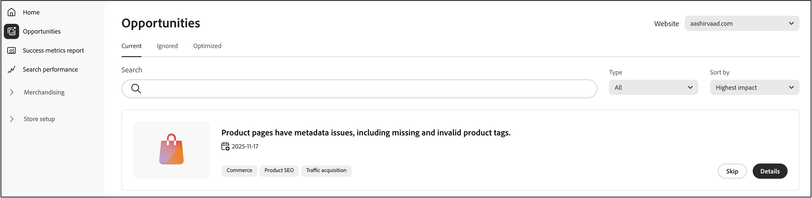
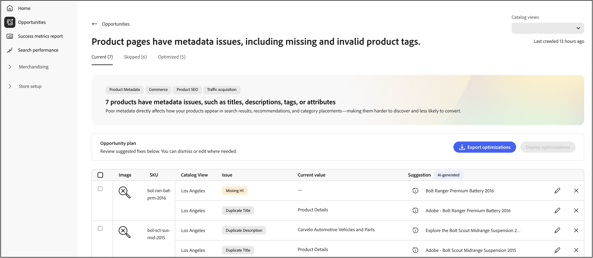
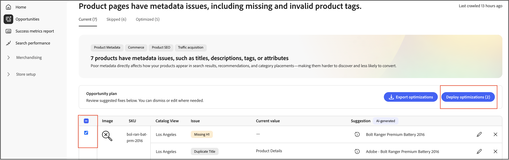
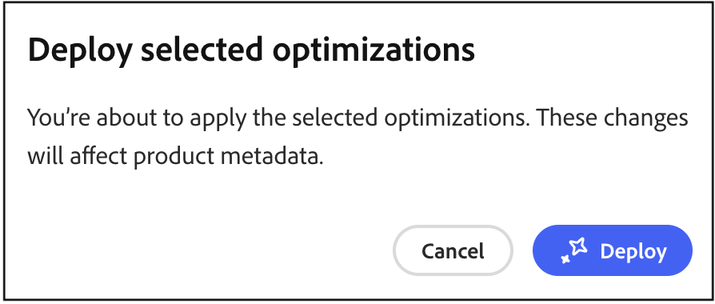
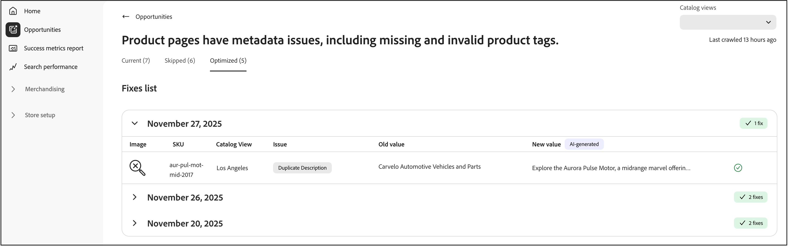
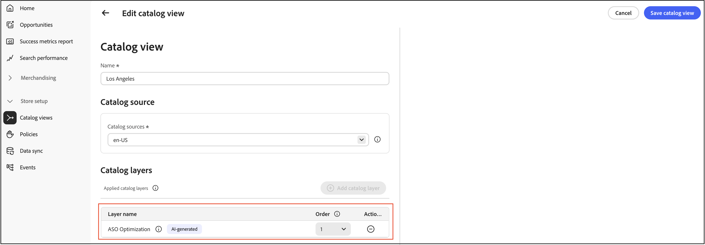

# Oportunidades

A página **Oportunidades** ajuda a identificar e implementar otimizações para melhorar o tráfego do site, o engajamento do usuário e as taxas de conversão por meio da integração com o Adobe Sites Optimizer.

## O que são oportunidades?

[Oportunidades](https://experienceleague.adobe.com/en/docs/experience-manager-sites-optimizer/content/documentation/opportunities/overview) são recomendações alimentadas por IA que ajudam os comerciantes a identificar e resolver problemas que afetam o desempenho do site de comércio. Estas recomendações são viabilizadas pelo [Adobe Experience Manager Sites Optimizer](https://experienceleague.adobe.com/en/docs/experience-manager-sites-optimizer/content/home), um serviço na nuvem que analisa e melhora o desempenho do site.

## Principais recursos

- **Detecção automatizada de problemas** — a Sites Optimizer verifica continuamente catálogos de produtos, logs de pesquisa e dados de recomendação para identificar problemas que afetam a descoberta.
- **Recomendações orientadas por IA**—Receba sugestões inteligentes para resolver problemas detectados.
- **Categorização de impacto** — Os problemas são categorizados por impacto nos negócios (Pesquisa, Recomendações, Navegação, Qualidade de Dados do Produto).
- **Relatórios do painel**—Exiba tendências de problemas, produtos ou consultas mais afetados e melhorias ao longo do tempo.

## Introdução

Para habilitar Oportunidades em [!DNL Adobe Commerce Optimizer], contate o gerente de sucesso do cliente (CSM). As oportunidades estão disponíveis com a **Ultima** licença do Adobe Sites Optimizer.

## Tour rápido

A página Oportunidades é organizada em três guias que ajudam a gerenciar as recomendações de otimização:

- **Atual (Ativo)**—Exibe oportunidades recém-detectadas que requerem revisão e ação. Esses são problemas ativos que podem estar afetando o desempenho do site.
- **Ignorado** — Contém oportunidades que você escolheu descartar ou adiar. Você pode mover oportunidades aqui se elas não forem relevantes para seus objetivos de negócios atuais.
- **Otimizado (Concluído)** — Mostra as oportunidades que foram resolvidas com êxito através da implantação de correção automática. Nenhuma oportunidade abordada manualmente aparecerá nessa guia. Essa guia ajuda a rastrear as oportunidades corrigidas automaticamente ao longo do tempo.

## Detecção automática de fluxo de trabalho

O fluxo de trabalho de detecção automática usa a análise habilitada por IA para identificar automaticamente oportunidades de otimização no catálogo de produtos. Esse processo automatizado de varredura monitora continuamente os dados do produto, os registros de pesquisa e o desempenho das recomendações para detectar problemas que podem afetar o desempenho do site, a SEO e o envolvimento do cliente.

### Como funciona

A detecção automática usa o Adobe Experience Manager Sites Optimizer para:

- **Analisar páginas de produto** — O sistema examina as 200 páginas e os filtros principais quanto às páginas de detalhes do produto para identificar destinos de otimização.
- **Extrair metadados** — as marcas Meta (títulos, descrições, cabeçalhos H1) são extraídas de cada página para análise.
- **Gerar recomendações de IA**—Os dados extraídos são processados por meio do fluxo de trabalho de IA da Adobe para criar sugestões de otimização acionáveis.
- **Preencher oportunidades**—As sugestões detectadas automaticamente aparecem na guia **Atual (Ativo)** para sua revisão.

### Pré-requisito

Antes que a detecção automática possa gerar recomendações, os dados do catálogo devem ser sincronizados e atualizados para garantir recomendações precisas.

### O que acontece a seguir

Depois que a detecção automática identifica oportunidades de otimização, você pode:

- Revise as otimizações sugeridas na guia **Atual (Ativo)**.
- Implante correções automaticamente usando o [fluxo de trabalho de correção automática](#auto-fix-workflow) (para [tipos de oportunidade](#supported-opportunity-types) compatíveis).
- Implemente as alterações manualmente no Administrador do Commerce.
- Ignore oportunidades que não estejam alinhadas aos seus objetivos de negócios.

## Fluxo de trabalho de correção automática

O fluxo de trabalho de correção automática permite implantar rapidamente otimizações geradas por IA com um único clique. Quando você aplica uma correção automática, o sistema cria uma camada de otimização de catálogo que substitui atributos específicos do produto sem modificar os dados originais do produto. Os dados originais do produto permanecem intactos, permitindo que você aplique otimizações com segurança e reverta as alterações a qualquer momento. Consulte [Como as camadas do catálogo funcionam com a correção automática](#how-catalog-layers-work-with-auto-fix) para saber mais.

### Tipos de oportunidade compatíveis

A seguir estão os tipos de oportunidade compatíveis:

- Título muito longo
- Título muito curto
- Duplicar título
- Título ausente
- Título vazio
- Descrição muito longa
- Descrição muito curta
- Descrição ausente
- Descrição vazia
- Descrição duplicada
- H1 ausente
- Duplicar H1
- H1 muito longo

>[!NOTE]
>
>Vários H1&#39;s na página não são suportados no momento.

### Pré-requisitos

Antes de usar a correção automática, verifique se:

- Seu catálogo de produtos está totalmente assimilado no [!DNL Adobe Commerce Optimizer].
- O tipo de oportunidade oferece suporte à correção automática (alguns tipos de otimização exigem implementação manual).
- Você tem permissões apropriadas para criar e gerenciar camadas de catálogo.

>[!IMPORTANT]
>
>O recurso de correção automática requer um catálogo de produtos totalmente assimilado. Se o catálogo ainda não tiver sido assimilado, ainda será possível visualizar oportunidades e implementar correções manualmente usando o arquivo CSV fornecido. Observe que as implementações manuais não são rastreadas na guia **Otimizado (Concluído)**.

### Implantar uma otimização de correção automática

Siga estas etapas para implementar uma otimização sugerida pela IA:

1. Navegue até **Gerenciar resultados** > **Oportunidades**.

1. Na guia **Atual (Ativo)**, revise as sugestões de otimização disponíveis.

1. Selecione uma oportunidade.

   

   >[!NOTE]
   >
   >O botão **Implantar Otimização** está disponível somente para [tipos de sugestões com suporte](#supported-opportunity-types). Para tipos não compatíveis, a caixa de seleção está desativada e você deve aplicar correções manualmente no catálogo.

1. Clique em **Implantar otimização** e em **Implantar** para acionar o processo de correção automática.

   

   O sistema executa as seguintes ações em segundo plano:

   - Cria uma nova camada de catálogo para o produto (caso ainda não exista uma).
   - Atualiza o atributo relevante (como metatítulo, descrição ou H1) com base na recomendação do AI.
   - Atribui a nova camada como a prioridade mais alta (número mais alto) na exibição de catálogo.
   - Valida a alteração por meio do serviço de vitrine do catálogo.

1. Monitore o status da implantação. O sistema atualiza o status da sugestão automaticamente quando a validação é concluída.

1. Depois de otimizada, a sugestão é movida para a guia **Otimizada (Concluída)** com um indicador de status:

   - **Marca de seleção verde** — A camada de otimização é definida como a primeira prioridade e é aplicada ativamente à sua vitrine eletrônica.
   - **Ícone de aviso** — A camada existe, mas não é a prioridade mais alta, o que significa que ela pode ser substituída por outra camada.

   

>[!NOTE]
>
>A correção automática oferece suporte à otimização de metadados para sites em qualquer idioma. O Sites Optimizer analisa as páginas de detalhes do produto em seu idioma original, gera recomendações de IA localizadas e cria camadas de catálogo com base no local de origem configurado na visualização do catálogo.

### Como as camadas de catálogo funcionam com a correção automática

Se uma camada do Adobe Sites Optimizer não existir na visualização de catálogo, a correção automática criará uma camada automaticamente e a atribuirá como a prioridade mais alta (número mais alto). Se você excluir essa camada, ela será recriada na próxima vez que a correção automática for executada e as camadas existentes serão deslocadas para números de ordem mais baixos. Se a camada do Adobe Sites Optimizer já existir em um número de pedido diferente, a correção automática não alterará sua prioridade. Se quiser manter uma camada de correção automática, mas não usá-la imediatamente, desative-a. Saiba mais sobre como gerenciar [camadas de catálogo](../setup/catalog-layer.md#manage-layer-activation-and-deletion).

O diagrama mostra uma única linha chamada **Otimização ASO**. Essa entrada representa todas as oportunidades que você escolhe para correção automática. Se você corrigir automaticamente uma única oportunidade ou várias oportunidades, todas aparecerão nesta única linha **Otimização ASO**. As camadas são específicas para cada exibição de catálogo, portanto, a exibição de catálogo **Los Angeles** mostrada aqui aplica sua camada **Otimização ASO** somente quando essa exibição está ativa.

### Considerações importantes

Lembre-se do seguinte ao usar a correção automática:

- O status mostrado para cada sugestão reflete o estado no momento em que o worker de correção automática foi executado. O status não é atualizado dinamicamente se você reordenar manualmente as camadas do catálogo posteriormente.

- Para garantir que suas otimizações permaneçam ativas, evite alterar manualmente as prioridades da camada de catálogo após implantar as recomendações de correção automática.

### Solução de problemas

Se uma otimização não parecer ser aplicada na loja:

1. Verifique o indicador de status na guia **Otimizado (Concluído)**.
1. Se você vir um ícone de aviso, verifique as configurações de prioridade da camada de catálogo.
1. Verifique se a camada de otimização está definida como a prioridade mais alta (número mais alto) na exibição do catálogo.
1. Confirme se a sincronização de dados do catálogo está ativa e atualizada.
1. Permita que as alterações se propaguem. Mesmo com uma camada configurada corretamente no número de pedido mais alto, as alterações podem demorar para aparecer na loja, de modo semelhante ao atraso na publicação de novos produtos.

## Como o Sites Optimizer e as métricas de sucesso funcionam juntos

As métricas de sucesso monitoram os principais indicadores de desempenho, como a descoberta de produtos e a eficiência dos negócios de catálogos, enquanto as oportunidades no Sites Optimizer permitem que você saiba como aumentar a SEO, a velocidade de carregamento, a acessibilidade e o engajamento. Juntos, os comerciantes e profissionais de marketing podem melhorar a eficiência operacional, proporcionando ganhos completos de desempenho e conversão mais rápidos com o mínimo de suporte de TI. Para saber como você pode aproveitar essas duas tecnologias para melhorar o desempenho e a experiência da sua vitrine eletrônica, consulte [Usando Métricas de Sucesso e o Sites Optimizer juntos](./success-metrics.md#using-success-metrics-and-sites-optimizer-together).

## Saiba mais sobre o Sites Optimizer

Para obter informações detalhadas sobre os recursos do Sites Optimizer, consulte a [documentação do Adobe Experience Manager Sites Optimizer](https://experienceleague.adobe.com/en/docs/experience-manager-sites-optimizer/content/home).

Recursos adicionais:

- [Tipos de oportunidade](https://experienceleague.adobe.com/en/docs/experience-manager-sites-optimizer/content/documentation/opportunities/overview) - Saiba mais sobre as oportunidades de otimização disponíveis.
- [Recursos do Sites Optimizer](https://experienceleague.adobe.com/en/docs/experience-manager-sites-optimizer/content/documentation/basics) - Explore o que o Sites Optimizer pode fazer.

## Veja mais aqui

- [Métricas de sucesso](success-metrics.md) - Monitore indicadores-chave de desempenho.
- [Desempenho da Pesquisa](search-performance.md) - Analise os termos de pesquisa e otimize a relevância.
- [Desempenho de Recomendação](recommendation-performance.md) - Monitore a eficácia da recomendação.
