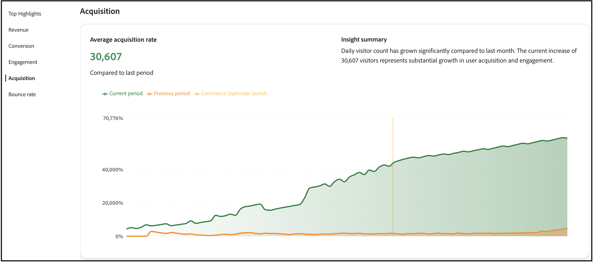

# Métricas de sucesso

Esta página fornece uma visão geral das métricas principais de desempenho do armazenamento [!DNL Adobe Commerce Optimizer]. O objetivo é que você entenda rapidamente os resultados da implementação do [!DNL Adobe Commerce Optimizer], depois ajude você e sua equipe a identificar oportunidades de crescimento e a destacar áreas para otimização.


As métricas no relatório são extraídas dos dados do evento da loja. [Saiba mais](../setup/events/overview.md) sobre os dados de evento coletados.

## Noções básicas sobre suas métricas

O relatório de métricas de sucesso fornece insights acionáveis em cinco áreas principais de desempenho que afetam diretamente os resultados de seus negócios. Cada métrica revela padrões de comportamento do cliente e armazena desempenho que ajudam a descobrir oportunidades e enfrentar desafios. Aproveite esses insights para tomar decisões mais inteligentes e otimizar sua experiência comercial.

**Principais destaques** resume as métricas principais de cada área de desempenho. Use esta seção para identificar rapidamente suas maiores oportunidades de melhoria.

Os principais indicadores de desempenho são:

- **Receita** — Sua métrica financeira principal que mostra o desempenho total das vendas.
- **Conversão** — A porcentagem de visitantes que concluíram compras.
- **Envolvimento** — como os usuários interagem ativamente com o seu site.
- **Aquisição** — a eficácia dos esforços de aquisição de clientes.
- **Taxa de Rejeição** — A porcentagem de visitantes que sai depois de visualizar apenas uma página.

### Atualização e precisão dos dados

**Frequência de atualização:** os dados de Métricas de sucesso são processados e atualizados regularmente à medida que os eventos de vitrine são coletados e processados.

**Quando verificar as métricas:** Para obter a análise de tendências mais precisa, revise as métricas depois de um tempo suficiente para coletar dados significativos. As flutuações diárias são normais; concentre-se em tendências semanais ou mensais para decisões estratégicas.

**Precisão dos dados:** as métricas são calculadas a partir das interações reais com o cliente capturadas pelos eventos da loja. Verifique se o repositório tem o [rastreamento de eventos adequado configurado](../setup/events/overview.md) para gerar relatórios precisos.

## Gerar um relatório

1. No painel esquerdo, selecione **Métricas de sucesso**.
1. Em **Configuração do Relatório**, especifique o **Intervalo de datas**, **Origem do catálogo**, com base na sua configuração de localidade e **Moeda**.
1. Clique em **[!UICONTROL Apply]**.

   Os **Principais Destaques**, **Receita**, **Conversão**, **Envolvimento**, **Aquisição** e **Taxa de devolução** são atualizações com base na configuração do seu relatório.

1. Clique em **[!UICONTROL Export]** para salvar o relatório como uma PDF.

## Uso de métricas de sucesso e do Sites Optimizer juntos

Métricas de sucesso e Sites Optimizer ([Oportunidades](opportunities.md)) são ferramentas complementares projetadas para trabalhar em conjunto, ajudando você a aprimorar o desempenho do site de comércio. Entender a diferença entre esses recursos ajuda você a tomar decisões melhores e alcançar resultados mensuráveis.

### Principais diferenças

| Aspecto | Métricas de sucesso | Sites Optimizer (Oportunidades) |
|---|---|---|
| **Finalidade** | Mede o desempenho e os resultados | Identifica problemas e fornece recomendações |
| **Tipo** | Painel analítico | Detecção proativa de problemas |
| **O que ele mostra** | Indicadores-chave de desempenho (Receita, Conversão, Envolvimento, Aquisição, Taxa de rejeição) | Recomendações alimentadas por IA para problemas que afetam o desempenho do site |
| **Fonte de dados** | Dados do evento da loja | Catálogos de produtos, logs de pesquisa, dados de recomendação |
| **Usar quando** | Você deseja rastrear os resultados ao longo do tempo | Você deseja identificar e corrigir problemas específicos |

### Como usar esses recursos juntos

A abordagem mais eficaz combina ambas as ferramentas em um ciclo de melhoria contínua:

1. **Medir com Métricas de Sucesso**: comece revisando seu painel Métricas de Sucesso para entender seu desempenho atual. Identifique quais KPIs precisam de melhoria (por exemplo, baixa taxa de conversão ou alta taxa de rejeição).

1. **Diagnosticar com Oportunidades**: navegue até a página Oportunidades para descobrir problemas específicos que possam estar causando baixo desempenho. O Sites Optimizer verifica o catálogo de produtos, os logs de pesquisa e os dados de recomendação para identificar problemas, como dados ausentes do produto, baixa relevância da pesquisa ou problemas de navegação.

1. **Implementar recomendações**: siga as recomendações orientadas por IA fornecidas em Oportunidades para solucionar problemas detectados. Isso pode incluir a correção de problemas de qualidade de dados do produto, o aprimoramento do SEO ou a otimização da pesquisa e descoberta.

1. **Controlar melhorias**: retorne às Métricas de sucesso para monitorar como as alterações afetam seus KPIs ao longo do tempo. Use o seletor de intervalo de datas para comparar o desempenho antes e depois de implementar as recomendações.

1. **Iterar e otimizar**: continue este ciclo, usando Oportunidades para identificar novos problemas e Métricas de Sucesso para medir o impacto de suas otimizações.

### Exemplo de fluxo de trabalho

Um comerciante percebe a taxa de conversão diminuir em Métricas de sucesso. Veja como eles podem usar ambos os recursos para lidar com isso:

1. **Identifique o problema**: o painel Métricas de Sucesso mostra que a taxa de conversão caiu 15% no último mês.

1. **Localizar a causa**: a página Oportunidades revela vários problemas:
   - Vários produtos não têm atributos principais que afetam a relevância da pesquisa.
   - Consultas de pesquisa populares que retornam resultados inadequados.
   - Tempos lentos de carregamento de página em páginas de categoria.

1. **Tome uma ação**: o comerciante prioriza a correção dos problemas de qualidade de dados do produto primeiro, já que a Sites Optimizer os classifica como oportunidades de alto impacto que afetam a pesquisa e as recomendações.

1. **Resultados de medidas**: depois de atualizar os atributos do produto e implementar as alterações recomendadas, o comerciante monitora as Métricas de sucesso semanalmente. No próximo mês, a taxa de conversão aumenta em 12% e as métricas de envolvimento de pesquisa melhoram significativamente.

1. **Continuar a otimização**: com a taxa de conversão melhorando, o comerciante muda o foco para a próxima prioridade mostrada em Oportunidades, otimizando a velocidade de carregamento da página para reduzir a taxa de rejeição.

### Quando usar cada recurso

**Use Métricas de Sucesso quando desejar:**

- Acompanhe o desempenho geral dos negócios.
- Meça o impacto das alterações ao longo do tempo.
- Identifique quais áreas da sua empresa precisam de atenção.
- Compartilhe relatórios de desempenho com as partes interessadas.
- Entenda as tendências de comportamento do cliente.

**Use o Sites Optimizer (Oportunidades) quando desejar:**

- Descubra problemas específicos que afetam o desempenho.
- Obtenha recomendações acionáveis para corrigir problemas.
- Entenda por que determinadas métricas estão diminuindo.
- Priorize quais otimizações devem ser abordadas primeiro.
- Aproveite a IA para identificar problemas que você pode perder manualmente.

Juntos, esses recursos fornecem uma solução completa: Métricas de Sucesso informam *o que* está acontecendo, enquanto a Sites Optimizer informa *por que* e *como corrigi-lo*.

## Próximas etapas e estratégias de otimização

Use seus dados de métricas de sucesso para identificar oportunidades de melhoria e implementar estratégias de otimização direcionadas. As seções a seguir fornecem orientação específica e acionável para cada área de métrica.

>[!BEGINTABS]

>[!TAB Otimização da receita]

Para a receita, seu objetivo é aumentar o valor total de vendas e o valor médio de pedido.


### Como entender a métrica de receita

**O que ele mede:** Receita total gerada pelo seu armazenamento durante o período selecionado.

**Como é calculado:** Receita é a soma de todos os pedidos concluídos (preço base × quantidade) de todos os produtos vendidos durante o período do relatório. O cálculo usa dados de `place-order` eventos capturados na sua vitrine.

>[!IMPORTANT]
>
>Os cálculos de receita excluem ordens canceladas, devoluções e ordens nas quais o evento `place-order` não foi capturado. Eventos podem estar ausentes devido a configurações de consentimento, problemas do navegador (bloqueadores de anúncios, falhas de script) ou erros técnicos de processamento.

**Fórmula:**

```
Total Revenue = Sum of (Product Base Price × Quantity) for all completed orders
```

**Fonte de dados:** eventos de vitrine (especificamente `place-order` eventos)

**O que está incluído:**

- Todas as ordens concluídas durante o intervalo de datas selecionado.
- Preços base do produto multiplicados pelas quantidades compradas.
- Receita de todos os canais de vendas rastreada pela Commerce Optimizer.

**Observações importantes:**

- A receita é calculada com base nos preços base capturados nos eventos da loja.
- O período do relatório é determinado pelo intervalo de datas selecionado na configuração do relatório.
- As métricas de receita são atualizadas à medida que novos eventos de pedido são processados.

### Estratégias

- **Implementar recomendações alimentadas por IA**: use o mecanismo de recomendação do otimizador para exibir produtos relevantes que impulsionam taxas de conversão mais altas. Implante *os clientes que viram isto também viram* e *Compraram isto, compraram aquilo* tipos de recomendações para aumentar as oportunidades de vendas cruzadas.

- **Criar regras de merchandising**: impulsione produtos de altas margens nos resultados da pesquisa usando [regras de merchandising](../merchandising/rules/overview.md). Fixe itens mais vendidos no topo dos resultados da pesquisa para consultas de alto tráfego.

- **Otimizar a descoberta de produtos**: use [facetas inteligentes](../merchandising/facets/overview.md) para ajudar os clientes a encontrar produtos com mais eficiência, resultando em taxas de conversão mais altas e aumento de receita.

- **Aproveite as oportunidades sazonais**: crie regras de merchandising baseadas em tempo para promover itens sazonais ou promocionais durante os períodos de pico de compras.

>[!TAB Aperfeiçoamento da taxa de conversão]

Para melhorar o índice de conversão, seu objetivo é converter mais visitantes em clientes.


### Como entender a métrica de taxa de conversão

**O que ele mede:** a porcentagem de visitantes que visualizam produtos e concluem uma compra, indicando com que eficiência sua loja converte navegadores em compradores.

**Como é calculado:** A taxa de conversão compara o número de visitantes únicos que compraram produtos com o número de visitantes únicos que visualizaram produtos.

**Fórmula:**

```
Conversion Rate = (Total Number of Orders ÷ Total Unique Visitors) × 100
```

**Fonte de dados:** eventos de vitrine eletrônica.

**Como funciona:**

- As **exibições de produtos** são rastreadas quando os visitantes exibem páginas de produtos (usando `product-view` eventos).
- **As compras** são rastreadas quando os pedidos são concluídos (usando `place-order` eventos).
- O cálculo corresponde os usuários que visualizaram produtos específicos com aqueles que os compraram.

**Observações importantes:**

- Um visitante que visualiza vários produtos, mas faz uma compra conta como uma conversão.
- A métrica rastreia visitantes únicos usando identificadores baseados em navegador.
- Os eventos de exibição de produto sempre incluem um clique, de modo que as exibições representam o interesse genuíno do usuário.

### Estratégias

- **Otimizar relevância da pesquisa**: implemente [sinônimos](../merchandising/synonyms/overview.md) para garantir que os clientes encontrem o que estão procurando, mesmo com termos de pesquisa diferentes. Use facetas dinâmicas para fornecer opções de filtragem relevantes.

- **Posicionamento de recomendação estratégica**: implante unidades de recomendação em páginas de alto tráfego, como páginas de detalhes do produto e páginas de categoria. Use as recomendações *Mais visualizados* e *Mais comprados* para criar confiança e urgência.

- **Melhore a visibilidade do produto**: use as regras de merchandising para garantir que os produtos com mais vendas e de alta conversão apareçam de forma destacada nos resultados da pesquisa.

- **Tipos de recomendação de teste A/B**: experimente com diferentes tipos e disposições de recomendação para encontrar o que funciona melhor para seu público-alvo.

>[!TAB Aprimoramento do compromisso]

Para aprimorar o engajamento, sua meta é aumentar a interação com o cliente e o tempo no local.


### Noções básicas sobre a métrica de envolvimento

**O que ele mede:** como os usuários interagem ativamente com seu armazenamento, rastreando ações significativas desde a navegação inicial até o processo de finalização.

**Como é calculado:** o engajamento rastreia todas as interações que indicam a participação ativa com sua loja, incluindo navegação de produto, atividades de carrinho de compras e ações de check-out.

**Fonte de dados:** eventos de vitrine

**O que conta como envolvimento:**

O contrato inclui as seguintes categorias e ações de evento:

- **Interações do produto:** exibições do produto, cliques no produto e comparações do produto.
- **Atividades do carrinho de compras:** adicionar itens ao carrinho, atualizar quantidades, remover itens.
- **Ações de check-out:** Iniciando check-out, concluindo etapas de check-out.
- **Navegação de categorias:** Exibição de páginas de categoria, filtragem por aspectos.
- **Atividades da lista de desejos:** Adicionando à lista de desejos, exibindo itens da lista de desejos.

**Detalhes do rastreamento de eventos:**

O sistema rastreia o engajamento quando os eventos têm:

- Categoria: `product`, `shopper`, `shopping-cart` ou `checkout`.
- Propriedade: `Product`, `Checkout`, `Cart`, `Category` ou `Wishlist`.

**Observações importantes:**

- Um engajamento maior normalmente se correlaciona a taxas de conversão mais altas.
- As métricas de engajamento ajudam a identificar onde os usuários estão mais ativos em suas jornadas.
- Use os dados de engajamento para otimizar páginas de alto tráfego e melhorar a experiência do usuário.

### Estratégias

- **Diversificar tipos de recomendação**: Evite mostrar as mesmas recomendações repetidamente. Use uma combinação de *Recomendado para você*, *Tendências* e *Visualizado recentemente* para manter o conteúdo atualizado e envolvente.

- **Implementar pesquisa inteligente**: use facetas dinâmicas orientadas por IA e reclassificação de resultados para adaptar os resultados da pesquisa em tempo real com base no comportamento do comprador.

- **Criar experiências personalizadas**: implante unidades &quot;Recomendado para você&quot; na página inicial e em toda a jornada do cliente para fornecer sugestões personalizadas de produtos.

- **Otimizar experiência de pesquisa**: use sinônimos para melhorar a relevância da pesquisa e garantir que os clientes encontrem o que estão procurando rapidamente.

>[!TAB Crescimento da aquisição]

Para adquirir mais crescimento, seu objetivo é atrair mais clientes novos e melhorar a eficiência da aquisição.



### Como entender a métrica de aquisição

**O que ele mede:** o número de visitantes novos e únicos que chegam à sua loja, ajudando você a entender a eficácia de suas iniciativas de marketing e aquisição de clientes.

**Como é calculado:** a aquisição conta visitantes únicos com base nos identificadores de navegador atribuídos durante sua primeira visita à sua loja.

**Fonte de dados:** eventos de vitrine eletrônica.

**Como funciona:**

- O navegador de cada visitante recebe um identificador exclusivo (`domain_userid`) por meio de um cookie próprio.
- Os novos visitantes são identificados quando o índice da sessão é igual a 1 (primeira visita).
- O sistema rastreia esses identificadores para distinguir novos visitantes dos recorrentes.

**Observações importantes:**

Este método de rastreamento tem algumas limitações conhecidas:

- **Usuários entre dispositivos:** A mesma pessoa que visita de diferentes dispositivos (desktop, celular, tablet) ou navegadores é contada como vários visitantes únicos, pois cada dispositivo e navegador recebe um identificador diferente.
- **Limpeza de cookies:** os usuários que limpam os cookies do navegador recebem um novo identificador e são contados como novos visitantes novamente.
- **Configurações de privacidade:** usuários com configurações de privacidade rígidas ou bloqueadores de cookies não podem ser rastreados.

**Recomendado para:**

- Rastrear novas tendências do visitante ao longo do tempo.
- Analisar a eficácia da campanha de marketing.
- Compreender os padrões de crescimento do tráfego.

**Dica de interpretação:** Embora não seja perfeitamente precisa devido às limitações acima, as métricas de aquisição são confiáveis para identificar tendências e comparar períodos em que a maioria dos usuários navega no mesmo dispositivo e não apaga cookies com frequência.

### Estratégias

- **Aproveite os dados de desempenho da pesquisa**: use o relatório de [desempenho da pesquisa](../manage-results/search-performance.md) para identificar produtos de tendência e termos de pesquisa populares. Crie regras de merchandising para destacar esses itens.

- **Otimizar o desempenho da recomendação**: Monitore as [métricas de desempenho da recomendação](../manage-results/recommendation-performance.md) para identificar quais tipos de recomendação direcionam mais tráfego e conversões.

- **Realçar itens novos e promocionais**: use as regras de merchandising para impulsionar novos produtos ou itens promocionais nos resultados da pesquisa para atrair a atenção de novos visitantes.

- **Rastrear fontes de tráfego**: use os dados do evento para entender quais canais proporcionam o tráfego mais valioso e otimizam adequadamente seus esforços de marketing.

>[!TAB Redução da taxa de rejeição]

Para reduzir a taxa de rejeição, seu objetivo é manter os visitantes envolvidos e reduzir as visitas de página única.


### Como entender a métrica de taxa de rejeição

**O que ele mede:** a porcentagem de visitantes que saem do site depois de visualizar apenas uma página, indicando possíveis problemas com a experiência do usuário, relevância da página ou envolvimento do site.

**Como é calculado:** a taxa de rejeição compara sessões de página única com o total de sessões para determinar a porcentagem de visitantes que sai sem mais interação.

**Fórmula:**

```
Bounce Rate = (Number of Bounced Sessions ÷ Total Sessions) × 100
```

**Fonte de dados:** eventos de vitrine eletrônica.

**Como funciona:**

- Uma **sessão com rejeição** é contada quando um visitante exibe apenas uma página durante toda a visita.
- O sistema rastreia as exibições de página em cada sessão para identificar visitas de página única.
- As sessões são determinadas pela atividade do usuário e pelo tempo entre interações.

**O que causa rejeições:**

- Visitantes que chegam em páginas irrelevantes (pesquisa/direcionamento inadequado de anúncios).
- Tempos lentos de carregamento de página.
- Experiência do usuário insatisfatória ou navegação confusa.
- Encontrar informações rapidamente sem precisar explorar mais.
- Problemas ou erros técnicos.

**Observações importantes:**

- Altas taxas de rejeição nem sempre são negativas — algumas páginas (como informações de contato ou especificações de produtos específicas) podem ter, naturalmente, altas taxas de rejeição.
- Compare as taxas de rejeição em diferentes tipos de página e fontes de tráfego para identificar áreas com problemas.
- Aumentos repentinos na taxa de rejeição geralmente indicam problemas técnicos ou direcionamento inadequado da campanha.

**Qual é uma boa taxa de rejeição?** Isso varia de acordo com o setor e o tipo de página, mas geralmente:

- 40-60%: média para sites de comércio eletrônico.
- Abaixo de 40%: excelente engajamento.
- Acima de 70%: pode indicar problemas que exigem investigação.

### Estratégias

- **Melhore a relevância da pesquisa**: use sinônimos e facetas inteligentes para garantir que os clientes encontrem produtos relevantes rapidamente. Resultados de pesquisa inadequados são a principal causa de altas taxas de rejeição.

- **Implementar unidades de recomendação**: implante unidades de recomendação nas páginas de categoria e resultados da pesquisa para fornecer opções de produto adicionais e manter os visitantes envolvidos.

- **Otimizar descoberta de produto**: use as regras de merchandising para garantir que os produtos mais relevantes e populares apareçam primeiro nos resultados da pesquisa.

- **Criar experiências envolventes na página inicial**: Use os tipos de recomendação &quot;Recomendado para você&quot; e &quot;Em tendência&quot; na página inicial para envolver imediatamente os visitantes com conteúdo relevante.

>[!ENDTABS]

## Solução de problemas e otimização

### Quando as métricas estão em declínio

**Receita em declínio**:

- Verifique se as unidades de recomendação ainda estão ativas e apresentando um bom desempenho.
- Revise as regras de merchandising para garantir que produtos com altas margens sejam promovidos.
- Analise o desempenho da pesquisa para identificar se os produtos populares ainda estão bem classificados.

**Descarte da taxa de conversão**:

- Verifique se a relevância da pesquisa é mantida (verifique sinônimos e aspectos).
- Verifique se as unidades de recomendação estão sendo exibidas corretamente.
- Revise as regras de merchandising para quaisquer conflitos ou problemas.

**Altas taxas de rejeição**:

- Verifique a relevância dos resultados da pesquisa e implemente sinônimos se necessário.
- Verifique se as unidades de recomendação estão sendo carregadas corretamente.
- Revise a qualidade e a disponibilidade dos dados do produto.

**Baixo envolvimento**:

- Diversificar tipos de recomendações para evitar a fadiga do cliente.
- Implemente estratégias de recomendação mais personalizadas.
- Otimize a experiência de pesquisa com melhores facetas e sinônimos.

## Descrições dos campos

### Configuração do relatório

| Campo | Descrição |
|---|---|
| Intervalo de datas | As opções incluem **Últimos 3 meses**, **Últimos 7 dias**, **Últimos 30 dias**, **Últimos 6 meses**, **Últimos 12 meses** e **Ano até a data**. Use intervalos mais curtos para insights de otimização imediata e intervalos mais longos para análise de tendências. |
| País | Com base na origem de catálogo especificada para a sua [exibição de catálogo](../setup/catalog-view.md). Selecione o mercado apropriado para uma análise de desempenho precisa. |
| Moeda | A moeda especificada para a exibição do catálogo. Verifique se isso corresponde ao mercado alvo para obter relatórios precisos de receita. |
| Exportar | Salva o relatório como um PDF para compartilhamento com as partes interessadas ou análise offline. |

## Veja mais aqui

- [Desempenho da Pesquisa](../manage-results/search-performance.md) - Analise os termos de pesquisa e otimize a relevância da pesquisa.
- [Desempenho de recomendação](../manage-results/recommendation-performance.md) - Monitore e otimize a eficácia da recomendação.
- [Visão geral das recomendações](../merchandising/recommendations/overview.md) - Saiba mais sobre as recomendações de produtos alimentados por IA.
- [Regras de merchandising](../merchandising/rules/overview.md) - Aumente, interrompa, fixe ou oculte produtos nos resultados da pesquisa.
- [Aspectos](../merchandising/facets/overview.md) - Aprimore a pesquisa com filtragem inteligente.
- [Sinônimos](../merchandising/synonyms/overview.md) - Melhore a relevância da pesquisa e a experiência do cliente.
- [Visão geral dos eventos](../setup/events/overview.md) - Entenda os dados que alimentam suas métricas.
