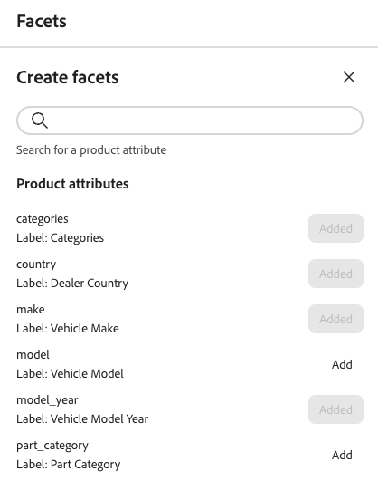

# Criar e gerenciar facetas

Qualquer atributo de produto filtrável pode ser usado como uma faceta. Os aspectos ajudam os clientes a filtrar e encontrar produtos mais facilmente em sua loja. Este artigo explica como adicionar, gerenciar e configurar facetas na loja.

## Criar uma faceta

1. No painel à esquerda, selecione _Merchandising_ > **Facetas** e clique em **Criar facetas**.
1. Na lista *Criar facetas*, cada atributo disponível tem um  separado. Conclua uma das opções a seguir:

   - Na lista *Atributos de facetas*, escolha o atributo de produto que deseja usar como faceta e clique em **Adicionar**.
   - Para localizar um atributo de produto específico, insira os primeiros caracteres do nome do atributo na caixa *Pesquisar*. Em seguida, clique em **Adicionar**.

   A faceta é adicionada à parte inferior da lista *Facetas dinâmicas* e o botão *Publicar alterações* fica disponível.

1. Se a faceta que você deseja adicionar não puder ser encontrada, use a [API de Metadados](https://developer.adobe.com/commerce/services/reference/rest/#tag/Metadata) para definir o parâmetro `filterable`:

   `"filterable": true`

   A faceta ficará disponível na loja na próxima vez que o catálogo for sincronizado com [!DNL Adobe Commerce Optimizer]. Se a faceta não estiver disponível após duas horas, consulte [sincronização de dados](../../setup/data-sync.md).

## Editar propriedades da faceta (opcional)

1. Localize a faceta que deseja editar.
1. Clique no () mais seletor.
1. No menu, clique em **Editar**. Em seguida, ajuste as seguintes propriedades conforme necessário:

   - Rótulo - Insira o rótulo de facetas que você deseja usar.
   - Tipo de classificação - Escolha uma das seguintes opções:
      - Alfabético - Classifica aspectos em ordem alfabética
      - Contagem - Classifica facetas com base no número de correspondências encontradas
   - Valor máximo - Insira o número máximo de valores de facetas exibidos na loja. Entradas válidas: 0 - 100; Padrão: 8.

1. Quando terminar, clique em **Salvar**.

## Fixar/desfixar facetas

O pin altera a cor quando clicado e é usado para mover a faceta para a seção *Facetas Fixadas* ou *Facetas Dinâmicas*.

1. Para fixar uma faceta na parte superior da lista *Filtros*, localize a faceta na lista *Facetas Dinâmicas* e clique no pino cinza ().

   O pin fica azul e a faceta é movida para a seção *Facetas Fixadas*.

1. Para desafixar uma faceta, localize-a na lista *Facetas Fixadas* e clique no pino azul ().

   O pino fica cinza e a faceta se move para a seção *Facetas Dinâmicas*.

>[!NOTE]
>
>A ordenação de facetas fixadas pode ser inconsistente se houver dois rótulos com o mesmo nome.

## Excluir facetas

1. Localize a faceta na lista e clique no seletor () mais.
1. Clique em **Excluir**.
1. Quando for solicitada a confirmação, clique em **Excluir faceta**.
A faceta é removida da loja após as alterações serem publicadas.

## Publicar alterações

1. Para atualizar a loja com suas alterações, clique em **[!UICONTROL Publish]**.
1. Aguarde cerca de 15 minutos para que as atualizações apareçam em sua loja.

## Informações adicionais

- Para configurar os intervalos e agrupamentos de facetas de preços, consulte [Configurações](../../settings.md).
- Saiba mais sobre os [tipos](type.md) de facetas.
