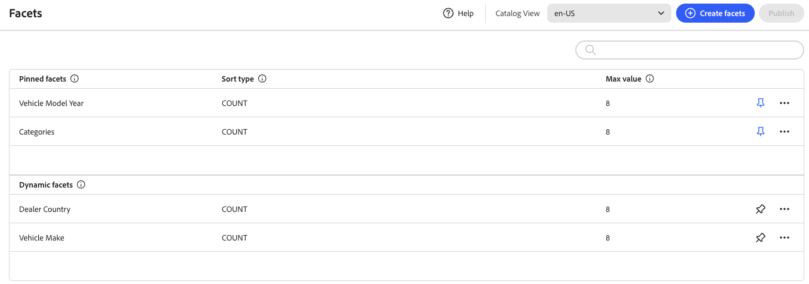

# Facets Workspace

O espaço de trabalho *Facetas* lista todas as facetas que estão disponíveis no momento e fornece acesso às ferramentas necessárias para configurar e gerenciar facetas. As facetas fixadas aparecem primeiro na lista de facetas existentes, seguidas pelas facetas dinâmicas. Você pode pesquisar a lista de aspectos.

## Descrições dos campos

| Campo | Descrição |
|--- |--- |
| Criar facetas | Abre o [editor de facetas](add.md). |
| Rótulo | O [rótulo de faceta](type.md#facet-labels) que está visível na vitrine pode ser editado para manter a consistência com sua marca. |
| Tipo de classificação | O método usado para [classificar](type.md#sort-type) facetas. Todas as [!DNL Adobe Commerce Optimizer] vitrines classificam os aspectos em ordem alfabética e por `Count`. Opções: Alfabético - Classifica aspectos em ordem alfabética. Contagem - Classifica facetas com base no número de correspondências encontradas. |
| Valor máximo | O número máximo de valores que podem ser exibidos na loja para cada faceta. Os aspectos que representam um intervalo de valores são distribuídos uniformemente. Entradas válidas: 0 - 100; Padrão: 8. |

## Controles

| Controle | Descrição |
|--- |--- |
|  | Fixa ou desfixa uma faceta na parte superior da lista *Filtros*. |
|  | Exibe um menu de mais ações que podem ser aplicadas à faceta selecionada. Opções: Editar, Excluir |
