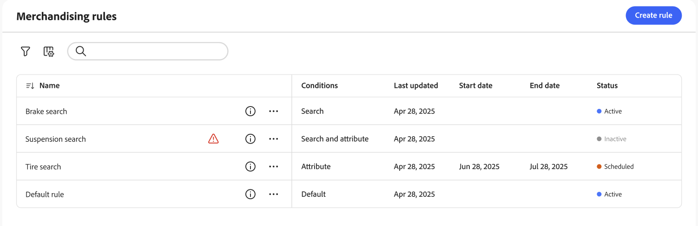

# Workspace de regras de merchandising

O espaço de trabalho *Regras de merchandising* lista a seleção atual de regras e seus status, e fornece acesso às ferramentas necessárias para criar e gerenciar regras. No espaço de trabalho, é possível:

- Pesquisar regras
- Exibir detalhes da regra
- Ativar/desativar regras
- Excluir regras
- Acessar o editor de regras

## Mostrar/ocultar colunas

1. No canto superior direito, clique em **Mostrar/ocultar**  colunas.

1. No menu, siga um destes procedimentos:

   - Para mostrar uma coluna oculta, clique em qualquer nome de coluna sem uma marca de seleção.
   - Para ocultar uma coluna visível, clique em qualquer nome de coluna com uma marca de seleção.

## Filtrar regras por status

1. Se o armazenamento tiver muitas regras, você poderá filtrar as regras por status para reduzir a lista. Por padrão, a lista Regras exibe todas as regras.

1. Para listar apenas as regras com uma configuração de status específica, defina **Status** como um dos seguintes:

   - Todos
   - Ativo
   - Inativo
   - Agendado
   - Rascunho

   Você também pode filtrar por **Condições**, **Data de início**, **Data de término** e **Última atualização**.

## Exibir detalhes

O painel de detalhes mostra o nome da regra, o status, as condições e os eventos, as datas de início e término, a descrição e a data da última edição. As regras podem ser ativadas, editadas e excluídas no painel de detalhes.

1. No espaço de trabalho *Regras de merchandising*, localize a regra na grade que você deseja exibir e clique no ícone ().

   Você pode executar qualquer um dos seguintes procedimentos no menu:

   - Editar regra
   - Excluir regra
   - Ativar/desativar regra

## Descrições da coluna

| Coluna | Descrição |
|--- |--- |
| Nome | O nome da regra. |
| Última atualização | A data em que a regra foi atualizada pela última vez. |
| Data de início | A data de início de uma regra agendada. |
| Data final | A data final de uma regra agendada. |
| Status | O status codificado por cores indica o estado atual da regra. Use o controle Status acima da grade para filtrar regras por status. Valores: Todos os status - Exibe todas as regras independentemente do status. Ativo (azul) - Exibe apenas as regras ativas. Agendado (Laranja) - exibe somente as regras agendadas. Inativo (cinza) - exibe somente regras inativas. |

## Controles

| Controle | Descrição |
|--- |--- |
| Adicionar regra | Abre o [editor de regras](add.md). |
| Status | Filtra a lista de regras por status. Opções: Todas, Ativas, Inativas, Programadas |
|  | Especifica as colunas que ficam visíveis na grade. Opções: Última atualização, Data inicial, Data final, Status |
| Pesquisar | Pesquisa uma regra por nome completo ou correspondência parcial. |
|  | Exibe um menu de mais ações que podem ser aplicadas à regra selecionada. Opções: Editar, Exibir detalhes, Excluir |

## Detalhes da regra

| Campo | Descrição |
|--- |--- |
| Status | O status atual da regra. |
| Condições | A consulta de pesquisa que descreve as condições associadas à regra. |
| Data de início | A data em que a regra entra em vigor, se programada. |
| Data final | A data em que a regra expira, se programada. |
| Descrição | Uma breve descrição da regra. |
| Última atualização | A data e a hora em que a regra foi atualizada pela última vez. |
| Ativado | Um controle que altera o status da regra. Opções: Ativado / Desativado |
