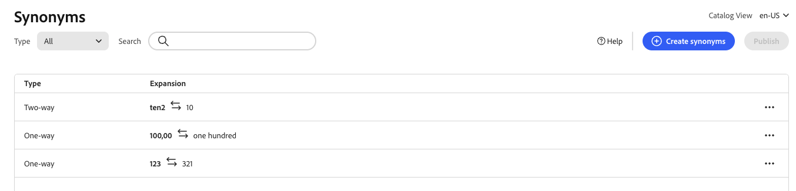

# Criar sinônimos

Aumente o engajamento do cliente adicionando sua própria lista com curadoria de sinônimos do [!DNL Adobe Commerce Optimizer]. Você pode adicionar até 200 sinônimos por loja.

## Etapa 1: adicionar um sinônimo

1. No painel esquerdo, vá para _Merchandising_ > **Synonyms**.
1. Clique no botão **[!UICONTROL Add synonyms]**.

## Etapa 2: definir o sinônimo por tipo

Siga as instruções para o [tipo de sinônimo](type.md) que você deseja criar.

### Sinônimo de bidirecional

1. Aceite a opção padrão **Bidirecional**.

   

1. Digite o termo ou frase **Palavra-chave** que deve ser correspondida.
1. Insira os termos de **Expansão** que você deseja adicionar como sinônimos para a palavra-chave. Separe vários termos com uma vírgula.
Neste exemplo, a palavra-chave a ser correspondida é &quot;calças&quot; e o conjunto de termos de expansão é &quot;calças, calças&quot;.

   

1. Quando terminar, clique em **Salvar**.

   O conjunto de sinônimos aparece na lista com uma seta bidirecional entre cada termo, o que significa que os termos são intercambiáveis.

   

### Sinônimo unidirecional

1. Clique no tipo de sinônimo **Unidirecional**.

   

1. Insira os termos da **Palavra-chave** e da **Expansão**. Separe vários termos com uma vírgula.

   

   Neste exemplo, a palavra-chave é &quot;calças&quot; e os termos de expansão unidirecional &quot;capris, peddle-pushers&quot; são um subconjunto de &quot;calças&quot;, mas com um significado específico.

1. Quando terminar, clique em **Salvar**.

   O conjunto de sinônimos aparece na lista com uma seta unidirecional apontando dos termos de expansão para a palavra-chave para indicar que os termos são subconjuntos da palavra-chave. Um sinal de mais separa cada termo de expansão.

   

## Etapa 3: publicar alterações

1. Quando seus sinônimos estiverem completos, clique em **Publicar**.
1. Aguarde até duas horas para que suas atualizações fiquem disponíveis na loja.

## Descrições dos campos

| Campo | Descrição |
|--- |--- |
| [Tipo](type.md) | Determina se os sinônimos têm o mesmo significado que a palavra-chave ou se são um subconjunto da palavra-chave. Opções: Bidirecional (padrão) - Termos que têm o mesmo significado que a palavra-chave e retornam os mesmos resultados de pesquisa Unidirecional - Termos que são um subconjunto da palavra-chave. Sinônimos unidirecionais retornam uma lista mais restrita de produtos específicos. |
| Palavra-chave | Uma palavra que é comumente associada a uma seleção de produtos em seu catálogo. |
| Expansão | Termos adicionais que têm o mesmo significado ou significado semelhante à palavra-chave. |

## Gerenciar sinônimos

Siga estas instruções para gerenciar [!DNL Adobe Commerce Optimizer] [sinônimos](overview.md) existentes.

## Localizar sinônimo

Para facilitar a localização de um sinônimo, você pode filtrar a lista por tipo e pesquisar por palavra-chave ou termo de expansão. Esses métodos podem ser usados individualmente ou em conjunto.

1. Para filtrar a lista, defina **Type** como um dos seguintes:

   - Todos
   - Unidirecional
   - Bidirecional

1. Para pesquisar uma palavra-chave ou termo de expansão, insira pelo menos três caracteres na caixa **[!UICONTROL Search]**.

## Editar sinônimo

1. Localize o sinônimo que você deseja editar e clique em **Mais** opções (...).

1. Clique em **Editar**.
A palavra-chave é o primeiro termo na lista e cada termo é separado por vírgula. A palavra-chave e os termos de expansão podem ser atualizados, mas o tipo do sinônimo não pode ser alterado.
1. Clique no item que deseja editar. Em seguida, atualize o texto conforme necessário.

1. Quando terminar, clique em **Salvar**.

## Excluir sinônimo

1. Localize o sinônimo que você deseja excluir na lista e clique em **Mais** opções (...).
1. Clique em **Excluir**.
1. Quando solicitado, clique em **Excluir sinônimo** para confirmar.

## Publicar alterações

Para concluir o processo, as alterações salvas devem ser publicadas na loja. Pode levar até duas horas para que as atualizações sejam ativadas.

1. Clique em **Publicar**.
1. Procure a mensagem na parte superior da página que confirma que as alterações foram publicadas.
