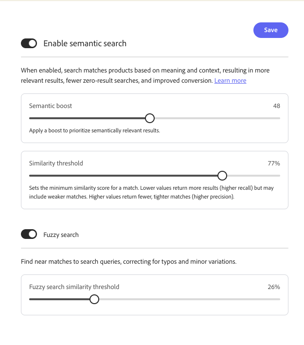

# Configurações

Use o espaço de trabalho *Configurações* para configurar a pesquisa e a descoberta de produtos para sua loja. As seguintes guias estão disponíveis:

- **Aspectos de preço** — Configure grupos de intervalos de preço e intervalos usados como filtros de pesquisa.
- **Idioma** — Defina o idioma de catálogo usado para indexação e pesquisa.
- **Pesquisa avançada** — Habilite a pesquisa semântica e a pesquisa difusa, e ajuste limites de aumento semântico e similaridade.

>[!BEGINTABS]

>[!TAB Facetas de preço]

## Aspectos de preço {#price-facets}

Você pode especificar o número de grupos de faixas de preços e como os valores de preços são distribuídos entre eles. Cada faixa de preços sobrepõe o grupo anterior em um. Por exemplo, ao usar cinco grupos com um intervalo de 20, você obtém faixas de preço como 0-20, 20-40, 40-60, 60-80 e >80. Se não houver produtos suficientes no catálogo para preencher todos os intervalos definidos, a exibição dos grupos disponíveis será ajustada de acordo. Por exemplo: 0-20, 60-80, >80.

**Para configurar aspectos de preço:**

1. No espaço de trabalho **Configurações**, selecione **[!UICONTROL Facets]**.
1. Na seção **Price facet**, faça o seguinte:
   - Insira o **[!UICONTROL Number of selections]** ou os agrupamentos de preços que estarão disponíveis. É possível definir até 100 agrupamentos de preço.
   - Insira o **[!UICONTROL Interval value]**, ou o intervalo de preços para cada grupo. O valor máximo é 40.000.000.
1. Clique em **[!UICONTROL Save]**.

   Leva aproximadamente 15 minutos para as configurações atualizadas estarem disponíveis na loja.

### Descrições dos campos

| Campo | Descrição |
| --- | --- |
| Número de seleções | Especifica o número de agrupamentos de intervalo de preços que podem ser usados como filtros de pesquisa na loja. Valor padrão: 8, Valor máximo: 100 |
| Valor do intervalo | Especifica o intervalo de preço para cada grupo. Por exemplo, cinco seleções com um valor de intervalo de 20 produzem agrupamentos de 0 a 20, 20 a 40, 40 a 60, 60 a 80 e >80. Valor padrão: 5, Valor máximo: 40.000.000 |

>[!TAB Idioma]

## Idioma {#language}

A configuração Idioma informa a [!DNL Adobe Commerce Optimizer] qual idioma esperar ao ler o catálogo e gravar o índice.

As línguas têm diferentes conjuntos de regras para a gramática: como as palavras são separadas, tempos verbais e formas de palavras, por exemplo.
A configuração Idioma garante que o conjunto correto de regras seja aplicado ao mecanismo de indexação.

Defina a configuração Idioma para o idioma principal do catálogo. Quando você altera o idioma do índice, pode levar de 5 a 60 minutos para que a alteração apareça na loja, dependendo do tamanho e da complexidade do catálogo.

| Idioma | Código |
|----|----|
| Árabe | ar |
| Armênio | hy |
| Basco | eu |
| Bengali | bn |
| Brasileiro | pt-br |
| Búlgaro | bg |
| Catalão | ca |
| Chinês (simplificado) | zh-cn |
| Chinês (tradicional) | zh-tw |
| Tcheco | cs |
| Dinamarquês | da |
| Holandês | nl |
| Inglês | en |
| Estoniano | et |
| Finlandês | fi |
| Francês | fr |
| Galego | gl |
| Alemão | de |
| Grego | el |
| Hindi | oi |
| Húngaro | hu |
| Indonésio | id |
| Irlandês | ga |
| Italiano | it |
| Japonês (Katakana) | ja |
| Coreano | ko |
| Letão | lv |
| Lituano | lt |
| Norueguês | não |
| Persa | fa |
| Português | pt |
| Romeno | ro |
| Russo | ru |
| Sorani | ku |
| Espanhol | es |
| Sueco | sv |
| Turco | tr |
| Tailandês | th |

>[!TAB Pesquisa avançada]

## Pesquisa avançada {#advanced-search}

Use a guia **[!UICONTROL Advanced search]** para gerenciar a pesquisa em um único local. O [!DNL Adobe Commerce Optimizer] fornece uma experiência de pesquisa unificada na loja; você não configura pesquisa por palavra-chave e pesquisa semântica separadamente para compradores. **[!UICONTROL Enable semantic search]** está **habilitado por padrão** para catálogos em inglês qualificados. A pesquisa semântica funciona com sua configuração existente; [regras de merchandising](./merchandising/rules/overview.md), [sinônimos](./merchandising/synonyms/overview.md), [facetas](./merchandising/facets/overview.md), impulsos e filtros continuam a ser aplicados. O sistema usa atributos de catálogo predefinidos automaticamente — você não seleciona nem prioriza atributos no Administrador. Nenhuma alteração da loja ou do desenvolvedor é necessária.

**Para gerenciar a pesquisa semântica:**

1. No espaço de trabalho **Configurações**, selecione a guia **[!UICONTROL Advanced search]**.
1. Em **[!UICONTROL Enable semantic search]**, confirme se a pesquisa semântica está habilitada ou desabilite-a se não quiser correspondência semântica.
1. Clique em **[!UICONTROL Save]** se você alterar os controles de alternância ou ajuste.

   Atualização dos resultados da pesquisa após a conclusão da indexação. Para um catálogo de médio porte, a indexação pode levar até meia hora. Para catálogos grandes com milhões de produtos, pode levar algumas horas.

### Ajuste opcional

Depois que a pesquisa semântica for habilitada, você poderá ajustar o seguinte na mesma guia:

- **[!UICONTROL Semantic boost]** — Aplique um aumento para priorizar resultados semanticamente relevantes na classificação. Aumente o valor quando correspondências semânticas devem pesar mais no conjunto de resultados; diminua-o quando os resultados se sentirem muito amplos.
- **[!UICONTROL Similarity threshold]** — Defina a pontuação mínima de similaridade (como uma porcentagem) para uma correspondência semântica. Valores mais baixos retornam mais resultados (recall mais alto), mas podem incluir matches mais fracos. Valores mais altos retornam menos correspondências mais estreitas (maior precisão).

  >[!NOTE]
  >
  > A pesquisa semântica é suportada somente para **catálogos em inglês**. Selecionar outro idioma na guia **[Idioma](#language)** desabilita **[!UICONTROL Enable semantic search]**.

- **[!UICONTROL Fuzzy search]** — Ative **em** para encontrar correspondências próximas para consultas de pesquisa, o que ajuda a corrigir erros de digitação e variações secundárias.
- **[!UICONTROL Fuzzy search similarity threshold]** — Defina a similaridade mínima (como uma porcentagem) necessária para que as correspondências difusas apareçam. Os limites mais baixos retornam correspondências mais aproximadas; aumente o limite se os resultados difusos forem muito amplos.

Para obter benefícios, orientação de validação, práticas recomendadas, solução de problemas e limitações, consulte [Pesquisa semântica](setup/semantic-search.md).

### Descrições dos campos

| Controle | Descrição |
| --- | --- |
| Habilitar pesquisa semântica | Quando ativada, a pesquisa usa significado e contexto juntamente com a correspondência de palavra-chave. Os atributos de catálogo predefinidos são usados automaticamente; nenhuma configuração de atributo é necessária no Administrador. Habilitado por padrão para [!DNL Adobe Commerce Optimizer] clientes. |
| Impulso semântico | Aumento aplicado para priorizar resultados semanticamente relevantes na classificação. |
| Limite de similaridade | Pontuação de similaridade mínima (porcentagem) para uma correspondência semântica. Valores mais baixos favorecem a recuperação; valores mais altos favorecem a precisão. |
| Pesquisa Difusa | Quando **em**, a pesquisa encontra quase correspondências para consultas (por exemplo, variações secundárias). |
| Limite de similaridade de pesquisa difusa | As correspondências difusas de similaridade mínima (porcentagem) devem ser atendidas para aparecerem nos resultados. |

>[!ENDTABS]
