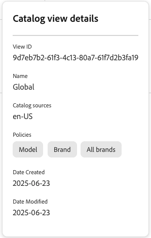

# Exibições de catálogo para Serviços de merchandising

Uma exibição de catálogo define os produtos e os preços que um cliente pode recuperar. Ele combina fontes de catálogo, camadas de catálogo, políticas e catálogos de preços para oferecer suporte a diferentes marcas, regiões, unidades de negócios ou canais.

## O que são visualizações de catálogo?

As exibições de catálogo definem como o catálogo de produtos é organizado e exibido. Eles atuam como filtros que determinam:

- **Quais produtos são visíveis** com base na estrutura comercial (marcas, regiões, revendedores)
- **Que preços são mostrados** por meio de catálogos de preços vinculados
- **Como os produtos são filtrados** usando políticas (atributos como marca, modelo, categoria)
- **Que [origem do catálogo](catalog-sources.md) é usada** com base em atributos como localidade
- **Quem pode acessar os dados da exibição** por meio da [Proteção de Catálogo](private-catalog-view.md) e das [chaves de acesso restrito](restricted-access-keys.md)

Por exemplo, é possível criar exibições de catálogo separadas para:

- Uma marca ou unidade de negócios
- Uma região geográfica
- Um canal de revendedor ou parceiro
- Um segmento de cliente com preços específicos

## Criar uma exibição de catálogo

Antes de criar uma visualização de catálogo, prepare os seguintes itens conforme necessário:

- Uma [origem do catálogo](catalog-sources.md)
- [Políticas](policies.md) que definem filtros de produto
- [Camadas do catálogo](catalog-layer.md) se precisar substituir atributos do produto
- [Catálogos de preços](pricebooks.md) para os preços exibidos na exibição
- [Chaves de acesso restrito](restricted-access-keys.md) se você deseja criar uma exibição de catálogo privado

### Configuração

Nesta seção, você cria uma exibição de catálogo, selecione uma [política](policies.md) e um [catálogo de preços](pricebooks.md).

1. No menu esquerdo, vá para **[!UICONTROL Store setup]** e clique em **[!UICONTROL Catalog views]**.

1. Clique em **[!UICONTROL Create catalog view]**. &#x200B;

1. Configure os detalhes de exibição do catálogo:

   - **Nome** — Digite o nome da exibição do catálogo, por exemplo `Celport`. &#x200B;
   - **Origens do catálogo** — Selecione a [origem do catálogo](catalog-sources.md), por exemplo `en-US`.
   - **Camadas do catálogo** — Revise as camadas e a prioridade assimiladas.
   - **Políticas** — use o menu suspenso para selecionar as políticas relevantes. Por exemplo, &quot;Marca&quot;, &quot;Modelo&quot;. &#x200B;Verifique se você já [criou uma política](policies.md).

1. Selecione o catálogo de preços a ser vinculado à exibição do catálogo.

   - **Usar todos os catálogos de preços disponíveis**—Esta opção extrai dados de preços de todos os catálogos de preços disponíveis.
   - **Permitir somente catálogos de preços selecionados**—Esta opção exibe a caixa de diálogo **Adicionar catálogos de preços permitidos**. Use esta caixa de diálogo para selecionar qual catálogo de preços específico usar para a exibição do catálogo.
   - **Somente catálogo de preços** — Selecione esta opção se somente um catálogo de preços se aplicar. Essa opção é necessária se você quiser configurar uma exibição de catálogo privado, que pode fazer referência a apenas um catálogo de preços. Consulte [Restrição de catálogo de preços em exibições de catálogo privado](private-catalog-view.md#price-book-restriction-on-private-catalog-views).
   - **Desabilitar preço**—Esta opção não está disponível no momento.

   >[!NOTE]
   >
   >Uma ID de catálogo de preços controla quais preços são solicitados. Ele não restringe o acesso à exibição do catálogo. Para restringir o acesso, habilite a Proteção de Catálogo para criar uma [exibição de catálogo privado](private-catalog-view.md).

1. (Opcional) Alterne **[!UICONTROL Catalog Protection]** para **[!UICONTROL Enabled]** para restringir os dados desta exibição de catálogo aos clientes com um token assinado válido. Consulte [Proteger uma exibição de catálogo](private-catalog-view.md#protect-a-catalog-view) para obter etapas de configuração.

1. Clique em **[!UICONTROL Add]** para criar a exibição de catálogo com as políticas e os catálogos de preços vinculados.

A página Exibições de catálogo é atualizada para exibir a nova exibição de catálogo.&#x200B;

Após concluir essas etapas, a exibição do catálogo agora está configurada para exibir produtos e preços com base nas fontes e políticas selecionadas.

### Especificar exibições de catálogo para recomendações e regras de descoberta de produtos

Você pode especificar uma exibição de catálogo ao [criar unidades de recomendação](../merchandising/recommendations/create.md) ou [regras de merchandising](../merchandising/rules/add.md).

## Camadas do catálogo

As camadas de catálogo permitem substituir atributos de produto selecionados sem alterar os dados do catálogo de origem. Use camadas para personalizar nomes, descrições, imagens, links ou metadados para uma exibição de catálogo.

Consulte [Camadas do catálogo](catalog-layer.md).

## Tornar uma exibição de catálogo privada

Por padrão, uma visualização de catálogo é pública para aplicativos clientes que podem acessar a API de merchandising do GraphQL. Para restringir o acesso, configure uma exibição de catálogo privado habilitando **[!UICONTROL Catalog Protection]**.

Para saber como proteger uma exibição de catálogo e verificar se o acesso é imposto, consulte [Exibições de catálogo privado](private-catalog-view.md).

## Gerenciar exibições do catálogo

Para atualizar ou exibir as propriedades de exibições de catálogo existentes, siga estas instruções.

### Editar uma exibição de catálogo

1. No espaço de trabalho **[!UICONTROL Catalog views]**, localize a exibição do catálogo.
1. Para abrir o menu de ações, selecione (**[!UICONTROL ...]**).
1. Selecione **[!UICONTROL Edit]** para acessar o editor de exibição de catálogo.
1. Atualize o nome, as fontes de catálogo, as políticas, as informações do catálogo de preços e as configurações de **[!UICONTROL Catalog Protection]** (incluindo chaves de acesso restrito atribuídas), conforme necessário.
1. Clique em **[!UICONTROL Save]**.

### Excluir uma exibição de catálogo

1. No espaço de trabalho **[!UICONTROL Catalog views]**, localize a exibição do catálogo.
1. Para abrir o menu de ações, selecione (**[!UICONTROL ...]**).
1. Selecione **[!UICONTROL Delete]**.
1. Confirme a exclusão.

   Quando a caixa de diálogo de confirmação for exibida, clique em **[!UICONTROL Delete]**.

### Exibir detalhes de exibição do catálogo

Esta opção fornece uma maneira rápida de ver todos os parâmetros de exibição do catálogo, permanecendo na tabela **[!UICONTROL Catalog views]**.

No espaço de trabalho **[!UICONTROL Catalog views]**, selecione o  para uma exibição de catálogo para exibir seus detalhes de configuração.

Aqui, você pode ver os detalhes de configuração da visualização do catálogo, como:

- ID da Visualização
- Nome
- Origens do catálogo
- Políticas
- Data de criação
- Dados modificados

Algumas dessas configurações são necessárias à medida que você configura sua loja ou usa a API de assimilação de dados.

## Visão geral da arquitetura

As exibições de catálogo são parte da estrutura de Serviços de merchandising que substitui a estrutura de site, loja e loja usada nas bases da Adobe Commerce por um modelo mais flexível:

Arquitetura ![[!DNL Merchandising Services]](../assets/merchandising-svcs-architecture.png)

### Como funciona

**1. Assimilação de dados**
Os dados do catálogo do PIM, ERP e outros sistemas são assimilados na estrutura de serviços de merchandising. Cada SKU contém informações de local e atributos de produto que mapeiam para exibições de catálogo, políticas e locais. Para obter mais informações sobre a assimilação de dados, consulte a [documentação do desenvolvedor](https://developer.adobe.com/commerce/services/optimizer/).

**2. Catálogo de base unificada**
Os dados assimilados criam um catálogo base unificado no pipeline de dados do Serviço de catálogo. Essa única fonte elimina a duplicação de dados nas unidades de negócios.

**3. Exibições do catálogo**
Várias exibições de catálogo representam unidades de negócios diferentes (por exemplo, &quot;Texas Retail&quot;, &quot;Texas Retail Seasonal&quot;). Locais, políticas e catálogos de preços podem ser compartilhados entre exibições de catálogo para maior flexibilidade.

**4. Entrega multicanal**
Os dados de catálogo filtrados são entregues a destinos como Edge Delivery Services, marketplaces, plataformas de publicidade e microlojas personalizadas. Para obter mais informações sobre a entrega de dados do catálogo, consulte a [documentação do desenvolvedor](https://developer.adobe.com/commerce/services/optimizer/).

Quando uma exibição de catálogo tem **[!UICONTROL Catalog Protection]** habilitada, a entrega para esse destino requer um token assinado válido de uma [chave de acesso restrito](restricted-access-keys.md) atribuída; solicitações não autorizadas são negadas em vez de receber dados de catálogo.

### Componentes principais

| Componente | Finalidade | Exemplo |
|---|---|---|
| **Exibição de catálogo** | Unidade de negócios ou canal de distribuição | Rede de revendedores, Loja regional |
| **Política** | Filtro de produto com base em atributos | Marca, modelo, categoria |
| **Localidade** | Configuração de idioma/região | en-US, fr-CA, es-MX |
| **Catálogo de Preços** | Estrutura de preços | Varejo, Atacado, Funcionário |
| **Chave de acesso restrito** | Credencial de token assinado que dá acesso a uma exibição de catálogo protegida | Chave do portal do parceiro, chave de preços B2B |

### Fluxo de dados

1. **Assimilar** - Dados de produto de sistemas PIM/ERP
2. **Processo** - Aplicar exibições de catálogo, políticas e preços
3. **Entrega** - Veicula o catálogo filtrado em vitrines, marketplaces etc.

## Principais recursos

| Recurso | Benefício |
|---|---|
| **Catálogo de Base Única** | Eliminar a duplicação de dados em unidades de negócios |
| **Preços flexíveis** | Vários catálogos de preços por SKU para diferentes segmentos de clientes |
| **Escalável** | Gerencie mais de 200 milhões de SKUs com eficiência |
| **Multicanal** | Oferece catálogos para vitrines, mercados e plataformas de publicidade |
| **Atualizações em tempo real** | Atualize rapidamente os dados do catálogo para promoções e campanhas |
| **Exibições de catálogo privado** | Restringir uma exibição de catálogo aos clientes autorizados usando a validação de token assinado |

## Casos de uso

### Conglomerado multimarcas

**Desafio**: gerenciar várias marcas, países e idiomas 
**Solução**: catálogo único com exibições de catálogo para cada combinação de marca/região

### Revendedor de peças automotivas

**Desafio**: 3.000 revendedores com os mesmos produtos, mas com preços diferentes 
**Solução**: um catálogo com exibições de catálogo e catálogos específicos de revendedores

### Retailer com vários locais

**Desafio**: preços e inventário diferentes por localização 
**Solução**: exibições de catálogo baseadas em localização com políticas específicas de região

>[!NOTE]
>
>Para obter informações detalhadas sobre a assimilação e a entrega de dados do catálogo, consulte a [documentação do desenvolvedor](https://developer.adobe.com/commerce/services/optimizer/).

## Veja mais aqui

- [Fontes do catálogo](catalog-sources.md) — Defina o escopo autoritativo de produtos, atributos e categorias para comportamento de pesquisa, filtro e classificação
- [Camadas do catálogo](catalog-layer.md)—Saiba como modificar dados do produto sem alterar a origem original
- [Exibições de catálogo privado](private-catalog-view.md) — Crie uma exibição de catálogo privado para restringir o acesso a clientes autorizados
- [Chaves de acesso restrito](restricted-access-keys.md)—Crie, atribua e gire as chaves usadas para assinar tokens para Proteção de Catálogo
- [Políticas](policies.md) — Crie políticas para filtrar produtos nas exibições de catálogo
- [Catálogos de preços](pricebooks.md) — Gerencie estruturas de preços para diferentes segmentos de clientes
