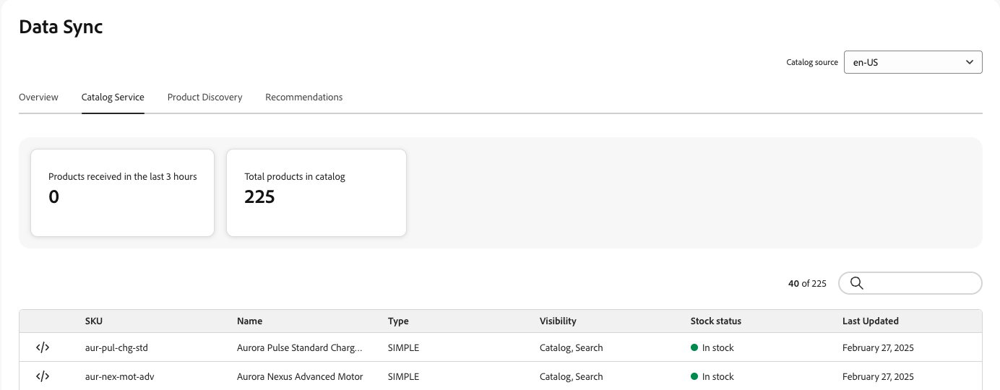

# Sincronização de dados

A página **Sincronização de Dados** exibe uma visão geral do status de sincronização dos dados do produto transferidos de sua fonte de dados (seu catálogo Commerce existente, sistema PIM (Gerenciamento de Informações do Produto), sistema ERP (Planejamento de Recursos Empresariais) etc.) para o [!DNL Adobe Commerce Optimizer].

A página **Sincronização de Dados** fornece informações valiosas sobre a disponibilidade de dados de produtos para a sua vitrine eletrônica, garantindo que eles possam ser exibidos imediatamente aos seus compradores.

A página **Sincronização de Dados** está localizada em *Configuração* > **Sincronização de dados**.

A página **Sincronização de Dados** contém os seguintes campos:

| Campo | Descrição |
|--- |--- |
| Origem do catálogo | Local específico dos dados sincronizados. |
| [!DNL Catalog Service] | Exibe a última atualização de sincronização, o total de produtos recebidos, um campo de pesquisa e uma tabela dos produtos sincronizados para [!DNL Catalog Service]. |
| Descoberta de produto | Exibe a última atualização de sincronização, o total de produtos recebidos, um campo de pesquisa e uma tabela dos produtos sincronizados para Pesquisa. |
| Recommendations | Exibe a última atualização de sincronização, o total de produtos recebidos, um campo de pesquisa e uma tabela dos produtos sincronizados para o Recommendations. |
| Produtos recebidos nas últimas 3 horas | Exibe o número de produtos que foram transferidos da origem do catálogo para o Adobe Commerce Optimizer nas últimas três horas. Se você fizer atualizações pouco frequentes no catálogo, esse valor será frequentemente zero. |
| Total de produtos no catálogo | Reflete o número total de produtos de catálogo disponíveis para o Adobe Commerce Optimizer. |
| Produtos sincronizados | Fornece detalhes sobre os produtos sincronizados com o Adobe Commerce Optimizer. Por padrão, essa tabela é classificada por &quot;Última atualização&quot;. Para localizar um produto específico, use o campo **[!UICONTROL Search by Name or SKU]**. |

## Lista de produtos sincronizados

Para ver os detalhes de um produto sincronizado no formato JSON, clique no ícone de código  na linha do produto da tabela de produtos sincronizados.

## Ressincronizar dados do catálogo

Se você não vir produtos específicos na página **Sincronização de Dados**, precisará iniciar uma ressincronização a partir do sistema upstream. No entanto, lembre-se de que uma ressincronização pode aumentar a carga dos recursos de hardware. No entanto, a ressincronização do catálogo pode ser necessária nos seguintes cenários:

- Quando são feitas alterações significativas no catálogo de produtos, como adicionar novos produtos, atualizar detalhes do produto ou modificar categorias

- Se você observar discrepâncias ou problemas de desempenho na exibição dos dados do produto em suas lojas

>[!IMPORTANT]
>
>O tempo necessário para concluir a sincronização varia de acordo com o tamanho do catálogo e o volume de dados atualizados.

## Monitorar status de sincronização de dados

Para projetos que usam o Adobe Commerce como fonte de dados de upstream, você pode monitorar o processo de exportação de dados e iniciar operações de ressincronização na [página de status de sincronização do feed de dados](../../data-export/data-synchronization.md) no administrador do Commerce.

