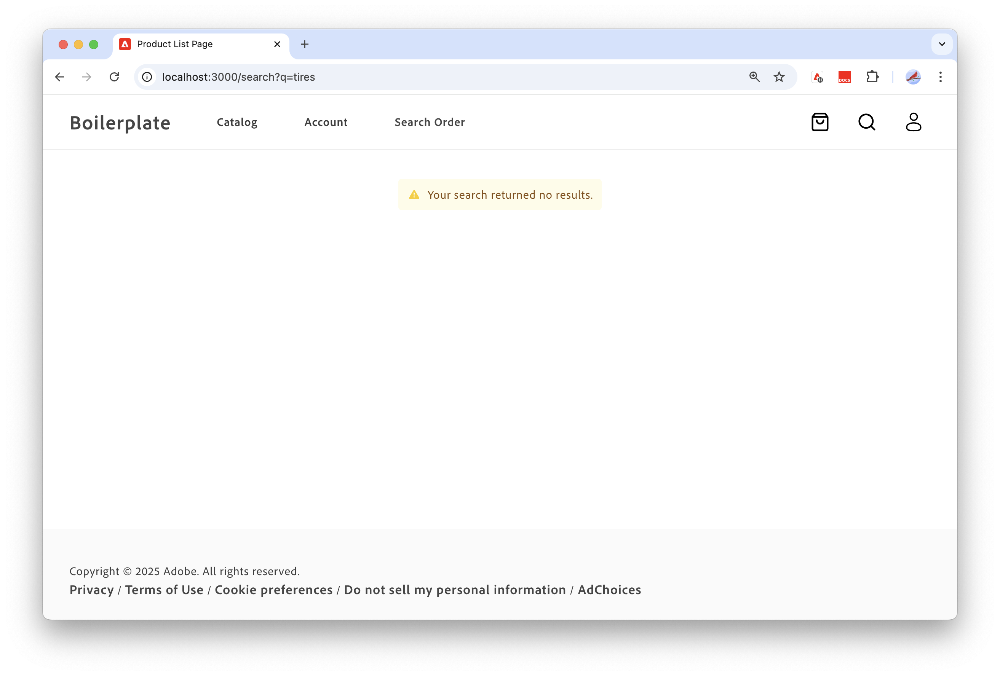

# Configurar a loja

>[!NOTE]
>
>Esta documentação descreve um produto em desenvolvimento de acesso antecipado e não reflete toda a funcionalidade destinada à disponibilidade geral.

Este tutorial demonstra como configurar e usar a [Loja do Adobe Commerce habilitada pelo Edge Delivery Services](https://experienceleague.adobe.com/developer/commerce/storefront/get-started/) para criar uma vitrine do Commerce eficiente, escalável e segura habilitada por dados da sua instância [!DNL Adobe Commerce Optimizer].


## Pré-requisitos

* Verifique se você tem uma conta GitHub (github.com) que pode criar repositórios e está configurada para desenvolvimento local.

* Saiba mais sobre os conceitos e o fluxo de trabalho para desenvolver vitrines do Commerce nos Serviços de entrega do Adobe Edge revisando a [Visão geral](https://experienceleague.adobe.com/developer/commerce/storefront/get-started) na documentação da Adobe Commerce Storefront.
* Configurar o ambiente de desenvolvimento


### Configurar o ambiente de desenvolvimento

Instale o Node.js e a extensão do navegador Sidekick necessária para desenvolver e testar sua vitrine do [!DNL Adobe Commerce Optimizer] no Edge Delivery Services.

#### Instalar Node.js

Instale o Gerenciador de versão do nó (NVM) e a versão necessária do Node.js (22.13.1 LTS).

1. Instale o Gerenciador de versão do nó (NVM).

   ```bash
   curl -o- https://raw.githubusercontent.com/nvm-sh/nvm/v0.40.1/install.sh | bash
   ```

1. Instale o Node.js e o NPM. Para obter mais informações, consulte [Node.js](https://nodejs.org/en/).

   ```bash
   nvm install 22
   ```

   ```bash
   npm install -g npm
   ```

1. Verifique a instalação.

   ```bash
   npm -v
   ```

>[!TIP]
>
>Recursos adicionais para estender e personalizar a solução do [!DNL Adobe Commerce Optimizer] estão disponíveis por meio do [App Builder para Adobe Commerce](https://experienceleague.adobe.com/en/docs/commerce-learn/tutorials/adobe-developer-app-builder/introduction-to-app-builder) e da [API Mesh para Adobe Developer App Builder](https://experienceleague.adobe.com/en/docs/commerce-learn/tutorials/adobe-developer-app-builder/api-mesh/getting-started-api-mesh). Para obter informações de acesso e uso, entre em contato com o representante de conta da Adobe.

#### Instalar o Sidekick

Instale a extensão do navegador Sidekick para editar, visualizar e publicar conteúdo na loja. Consulte [instruções de instalação do Sidekick](https://www.aem.live/docs/sidekick#installation).

## Criar sua loja

A vitrine criada para o projeto [!DNL Adobe Commerce Optimizer] usa uma versão personalizada do modelo da Adobe Commerce na Edge Delivery Services Storefront. O modelo é um conjunto de arquivos e pastas que fornecem um ponto de partida para o desenvolvimento da loja. Este processo de instalação é diferente do processo padrão para uma [Adobe Commerce na Edge Delivery Services Storefront](https://experienceleague.adobe.com/developer/commerce/storefront/get-started/).

>[!NOTE]
>
>Este tutorial usa macOS, Chrome e Visual Studio Code como ambiente de desenvolvimento. As capturas de tela e as instruções refletem essa configuração. Você pode usar um sistema operacional, navegador e editor de código diferentes, mas a interface do usuário exibida e as etapas executadas variam de acordo.

### Visão geral do fluxo de trabalho

Siga estas etapas para configurar uma vitrine para usar com o [!DNL Adobe Commerce Optimizer].

1. **[Criar um repositório de código](#step-1-create-site-code-repository)**-Crie um repositório GitHub a partir do modelo padrão do Adobe Commerce + Edge Delivery Services. Incluir todas as ramificações do repositório de origem.
1. **[Atualizar modelo padrão da loja](#step-2-update-the-storefront-boilerplate)**-Atualizar o modelo padrão personalizado na ramificação `aco` para conectar a pasta de conteúdo à loja.
1. **[Implantar alterações](#step-3-deploy-changes)**-Substituir o código na ramificação `main` pelo código atualizado da ramificação `aco`.
1. **[Adicionar o aplicativo CodeSync](#step-5-add-the-aem-code-sync-app)**-Conecte seu repositório ao Serviço Edge Delivery. Não conecte o aplicativo Sincronização de Código até concluir a personalização do código-fonte e ter enviado o código para a ramificação `main`.
1. **[Adicionar conteúdo](#step-6-add-content)**-Use a ferramenta de clonagem de conteúdo de demonstração para criar e inicializar o conteúdo da loja no ambiente de Autor de Documentos hospedado em `https://da.live`.
1. **[Visualizar site de demonstração](#step-7-preview-demo-site)**-Conecte-se ao site da loja para exibir o conteúdo de exemplo e os dados da instância de demonstração [!DNL Adobe Commerce Optimizer].
1. **[Desenvolver em seu ambiente local](#step-8-develop-in-your-local-environment)**-Instale as dependências necessárias. Inicie o servidor de desenvolvimento local e atualize a configuração da loja para se conectar à instância [!DNL Adobe Commerce Optimizer] que o Adobe provisionou para você.
1. **[Próximas etapas](#next-steps)** - Saiba mais sobre como gerenciar e exibir conteúdo e dados na loja.


### Etapa 1: criar repositório de código do site

Crie um repositório GitHub para o código do modelo do site da sua vitrine eletrônica usando o modelo do Edge Delivery Services + Adobe Commerce Boilerplate.

1. Faça logon em sua conta GitHub.

1. Navegue até o [aem-boilerplate-commerce](https://github.com/hlxsites/aem-boilerplate-commerce) repositório do GitHub.

1. Selecione **Usar este modelo** e **Criar um novo repositório** no menu suspenso.

   ![[!DNL Create github repo from storefront boilerplate template]](./assets/storefront-create-github-repo.png){width="700" zoomable="yes"}

   A página de configuração do repositório é exibida.

   ![[!DNL Configure github repo to pull all branches from boilerplate repo]](./assets/storefront-configure-github-repo.png){width="700" zoomable="yes"}

1. Preencha o formulário de configuração com os seguintes detalhes:

   * **Modelo de repositório**—`hlxsites/aem-boilerplate-commerce` (padrão).
   * **Incluir todas as ramificações** — Selecione a opção para incluir todas as ramificações.
   * **Proprietário** — Sua organização ou conta (obrigatório).
   * **Nome do repositório** — Um nome exclusivo para o novo repositório (obrigatório).
   * **Descrição** — Uma breve descrição do repositório (opcional).
   * **Público ou Privado**—A Adobe recomenda público (padrão).

1. Selecione **Criar repositório**.

   Após alguns minutos, o novo repositório será aberto.

   Ignore qualquer notificação de solicitação de pull exibida na interface do usuário do GitHub.

### Etapa 2: atualizar a placa estrutural da vitrine

Você precisa das seguintes informações para atualizar o código de modelo padrão da loja:

* **URL do repositório do GitHub da Etapa 2**— `github.com/{ORG}/{SITE}`

   * `{ORG}` é o nome da organização ou o nome de usuário do repositório

   * `{SITE}` é o seu nome de repositório

* **URL da pasta de conteúdo da Etapa 1**— `https://drive.google.com/drive/folders/{YOUR_FOLDER_ID}`

  `{YOUR_FOLDER_ID}` é a identificação da pasta que você criou com os dados de conteúdo de exemplo.

#### Vincular o repositório ao ambiente de Autor de documentos

1. Clonar o repositório no computador local.

   ```bash
   git clone https://github.com/{ORG}/{SITE}.git
   ```

   Se você encontrar erros ao clonar o repositório, consulte [Solucionar erros de clonagem](https://docs.github.com/en/repositories/creating-and-managing-repositories/troubleshooting-cloning-errors) na documentação do GitHub.

1. Abra o repositório no terminal ou IDE.

1. Confira a ramificação `aco`

   ```bash
   git checkout aco
   ```

1. Crie seu arquivo de configuração copiando o arquivo `default-fstab.yaml` para `fstab.yaml`.

   ```bash
   cp default-fstab.yaml fstab.yaml
   ```

1. Atualize o ponto de montagem no arquivo de configuração da loja para apontar para o URL do conteúdo.

   1. Abra o arquivo de configuração [fstab.yaml](https://experienceleague.adobe.com/developer/commerce/storefront/get-started/#vocabulary).

      ```yaml
      mountpoints:
        /:
          url: https://content.da.live/{org}/{site}/
          type: markup
      
      folders:
       /products/: /products/default
      ```

   1. Substitua as cadeias de caracteres `{ORG}` e `{SITE}` pelos valores do repositório GitHub criado para seu código padronizado.

      Por exemplo, o código atualizado deve ter esta aparência.

      ```yaml
      mountpoints:
        /:
          url: https://content.da.live/owner-name/aco-storefront/
          type: markup
      ```

   1. Salve o arquivo.

#### Configurar a extensão do Sidekick

1. Adicione a configuração do projeto para a extensão do Sidekick. Essa configuração garante que o Sidekick esteja disponível para gerenciar o conteúdo do projeto da loja.

>[!NOTE]
>
>Verifique se você instalou a [extensão do Sidekick](https://www.aem.live/docs/sidekick#installation) em seu navegador.

1. Abra o arquivo `tools/sidekick/config.json`.

   +++Arquivo de configuração do Sidekick

   ```json
   {
     "project": "Boilerplate",
     "plugins": [
       {
         "id": "cif",
         "title": "Commerce",
         "environments": [
           "edit"
         ],
         "url": "https://main--{SITE}--{ORG}.aem.live/tools/picker/dist/index.html",
         "isPalette": true,
         "paletteRect": "top: 54px; left: 5px; bottom: 5px; width: 300px; height: calc(100% - 59px); border-radius: var(--hlx-sk-button-border-radius); overflow: hidden; resize: horizontal;"
       },
       {
         "id": "personalisation",
         "title": "Personalisation",
         "environments": [
           "edit"
         ],
         "url": "https://main--{SITE}--{ORG}.aem.live/tools/segments/dist/index.html",
         "isPalette": true,
         "paletteRect": "top: 54px; left: 5px; bottom: 5px; width: 300px; height: calc(100% - 59px); border-radius: var(--hlx-sk-button-border-radius); overflow: hidden; resize: horizontal;"
       }
     ]
   }
   ```

   Consulte a [documentação da Biblioteca da Sidekick](https://www.aem.live/docs/sidekick-library) para obter mais informações.

+++

1. Atualize os valores da chave `url` com os valores do seu repositório GitHub.

   * Substitua a cadeia de caracteres `{ORG}` pela organização ou pelo nome de usuário de seu repositório.

   * Substituir a cadeia de caracteres `{SITE}` pelo nome do repositório

   +++Exemplo de arquivo de configuração atualizado

   Se o nome do repositório GitHub for `aco-storefront` e sua organização for `early-adopter`, a URL atualizada deverá ser semelhante a:

   ```json
   {
     "project": "Boilerplate",
     "plugins": [
       {
         "id": "cif",
         "title": "Commerce",
         "environments": [
           "edit"
         ],
         "url": "https://main--aco-storefront--early-adopter.aem.live/tools/picker/dist/index.html",
         "isPalette": true,
         "paletteRect": "top: 54px; left: 5px; bottom: 5px; width: 300px; height: calc(100% - 59px); border-radius: var(--hlx-sk-button-border-radius); overflow: hidden; resize: horizontal;"
       },
       {
         "id": "personalisation",
         "title": "Personalisation",
         "environments": [
           "edit"
         ],
         "url": "https://main--aco-storefront--early-adopter.aem.live/tools/segments/dist/index.html",
         "isPalette": true,
         "paletteRect": "top: 54px; left: 5px; bottom: 5px; width: 300px; height: calc(100% - 59px); border-radius: var(--hlx-sk-button-border-radius); overflow: hidden; resize: horizontal;"
       }
     ]
   }
   ```

+++

1. Salve o arquivo.

### Etapa 3: implantar alterações

Para usar o código de modelo personalizado da vitrine personalizada, substitua o código na ramificação `main` pelas atualizações.

1. A partir do editor ou do IDE, confirme e salve os arquivos atualizados.

   ```bash
   git add .
   ```

1. Verifique se você está confirmando os dois arquivos atualizados.

   ```bash
   git status
   On branch aco
   Your branch is up to date with 'origin/aco'.
   
   Changes to be committed:
    (use "git restore --staged <file>..." to unstage)
        new file:   fstab1.yaml
        modified:   tools/sidekick/config.json
   ```

1. Confirme as alterações na ramificação `aco`.

   ```bash
   git commit -m "Update storefront boilerplate for Adobe Commerce Optimizer"
   ```

1. Substituir a estrutura na ramificação `main` pelas alterações na ramificação `aco`.

   ```bash
   git push origin aco:main -f
   ```

### Etapa 5: adicionar o aplicativo Sincronização de código do AEM

Conecte seu repositório ao Edge Delivery Service adicionando o aplicativo GitHub da sincronização de código da AEM ao seu repositório.

>[!IMPORTANT]
>
>Não conecte o aplicativo Sincronização de código até ter carregado o código padronizado atualizado na ramificação principal do seu repositório GitHub.

1. Abra a página de configuração do [aplicativo de sincronização de código do AEM](https://github.com/apps/aem-code-sync).

1. Selecione **Configurar** e autentique com a **organização** ou a **conta** que contém o repositório criado.

1. No formulário, escolha **Selecionar apenas repositórios** e selecione o repositório criado.

1. Selecione **Instalar** para adicionar o aplicativo AEM Code Sync ao seu repositório.

   Você deve ver uma mensagem informando que o aplicativo foi instalado com êxito.

### Etapa 6: adicionar conteúdo

Crie e inicialize seu conteúdo da loja no ambiente de Autor de Documentos hospedado em `https://da.live` usando a ferramenta de clonagem de sites de demonstração. Essa ferramenta importa o conteúdo de amostra para o ambiente Autor do documento e conclui o processo de visualização e publicação de conteúdo para todos os documentos no conteúdo de amostra. O conteúdo de exemplo inclui os layouts de página, banners, rótulos e outros elementos para preencher sua loja.

1. Abra a [ferramenta de clone do conteúdo de demonstração](https://da.live/app/hlxsites/aem-boilerplate-commerce/tools/site-creator/site-creator).

   ![[!DNL AEM demo content clone tool]](./assets/storefront-demo-content-clone-tool.png){width="700" zoomable="yes"}

1. Cole a URL do GitHub para o projeto padrão da loja no campo [!UICONTROL **URL do GitHub do projeto**].


1. Importe, visualize e publique o conteúdo no ambiente de Autor de Documento selecionando **Criar site**.

   ![[!DNL AEM demo content clone tool]](./assets/storefront-edit-initial-content.png){width="700" zoomable="yes"}

   Depois que o site for criado, você poderá usar os links nas seções [!UICONTROL Edit content] e [!UICONTROL View Site] para explorar a loja de demonstração.

   Os links principais para seu conteúdo e site seguem estes formatos:

   * **Pasta de conteúdo raiz**— `https://da.live/#/{ORG}/{SITE}`
   * **Visualização do site**—   `https://main--{SITE}--{ORG}.aem.page/`
   * **Produção do site:**— `https:/main--{SITE}--{ORG}.ae.live/`

1. Abra o link da pasta de conteúdo raiz para exibir o conteúdo.

   ![[!DNL Storefront Document Author environment]](./assets/storefront-document-author-environment.png){width="700" zoomable="yes"}

   >[!TIP]
   >
   >Na navegação lateral, use os links [!UICONTROL **Aprender**] e [!UICONTROL **Descobrir**] para acessar os recursos de aprendizado e gerenciar o conteúdo do seu site.

### Etapa 7: visualizar o site de demonstração

Verifique se o conteúdo da amostra e os dados da instância de demonstração do Adobe Commerce Optimizer são exibidos corretamente.

* **O conteúdo de exemplo** é distribuído a partir da pasta de conteúdo no ambiente de Autor de Documento. Ele inclui layouts de página, banners e rótulos para o seu site.
* **Dados de exemplo** são fornecidos a partir da instância de demonstração [!DNL Adobe Commerce Optimizer]. Os dados incluem dados de produto com atributos de produto, imagens, descrições de produto e preços preenchidos com base nos valores de cabeçalho especificados no arquivo de configuração da loja, `config.json`.

#### Conecte-se ao site para exibir conteúdo e dados de amostra

1. Exiba seu site navegando até `https://main--{SITE}--{ORG}.aem.live`.

   Substitua `{ORG}` e `{SITE}` pela organização e pelo nome do seu repositório padrão.

   ![[!DNL ACO storefront site with boilerplate]](./assets/aco-storefront-site-boilerplate.png){width="700" zoomable="yes"}

   Se a página retornar um 404, verifique o seguinte:

   * [O ponto de montagem no arquivo `fstab.yaml` aponta para a URL de conteúdo correta](#link-the-repository-to-the-document-author-environment): `https://content.da.live/{ORG}/{SITE}/`
   * [Você configurou o aplicativo de Sincronização de Código para se conectar ao repositório do GitHub](#step-5%3A-add-the-aem-code-sync-app).
   * [Você publicou o conteúdo no ambiente de Autor de Documentos usando a ferramenta de clonagem de conteúdo de demonstração](#step-6%3A-add-content-documents-for-your-storefront).


1. Visualize os dados de catálogo de amostra provenientes da instância padrão do Commerce Optimizer.

   1. No cabeçalho da loja, clique na lupa para procurar por `tires`.

      ![[!DNL View product list page]](./assets/storefront-site-with-aco-data.png){width="675" zoomable="yes"}

   1. Pressione **Enter** para exibir a página de resultados da pesquisa.

      ![[!DNL View search results page]](./assets/storefront-with-aco-search-results-page.png){width="675" zoomable="yes"}

      Os componentes da página de resultados da pesquisa são definidos pelo documento de conteúdo `search`. Os dados de resultados da pesquisa são preenchidos com base na configuração da loja em `config.json`.

   1. Exiba a página de detalhes do produto selecionando qualquer produto de pneu na página.

      ![[!DNL View product details page]](./assets/storefront-with-aco-pdp-page.png){width="675" zoomable="yes"}

      Os componentes da página de detalhes do produto são definidos pelo documento de conteúdo `default` na pasta `product`.

### Etapa 8: desenvolver em seu ambiente local

Nesta seção, você atualiza a configuração da loja no ambiente de desenvolvimento local.

* Atualize a configuração da loja para se conectar ao ponto de extremidade do GraphQL para a instância [!DNL Adobe Commerce Optimizer] que o Adobe provisionou para você.
* Atualize os valores do cabeçalho para recuperar dados da instância.

#### Iniciar desenvolvimento local

1. No IDE, faça checkout da ramificação principal e redefina-a para a última confirmação na ramificação remota.

   ```bash
   git checkout main
   git reset --hard origin/main
   ```

1. Instale as dependências necessárias.

   ```bash
   npm install
   ```

1. Inicie o servidor de desenvolvimento local.

   ```bash
   npm start
   ```

   A primeira página da sua vitrine eletrônica deve estar visível em seu navegador em `http://localhost:3000`.

   ![[!DNL Configure github repo to pull all branches from boilerplate repo]](./assets/aco-storefront-local-dev-env.png){width="700" zoomable="yes"}


#### Atualizar a configuração da loja

Atualize o arquivo de configuração da loja e visualize as alterações no ambiente de desenvolvimento local.

1. No IDE, atualize a configuração da vitrine eletrônica para se conectar à instância [!DNL Adobe Commerce Optimizer] que o Adobe provisionou para você.

   1. Abra o arquivo `config.json`.

   1. Atualize os seguintes valores usando o ponto de extremidade para sua instância [!DNL Adobe Commerce Optimizer]:

      * **`commerce-endpoint`**-Substitua o valor existente pela URL do ponto de extremidade.

        ```json
        "commerce-endpoint": "https://na1-sandbox.api.commerce.adobe.com/{tenantId}/graphql"
        ```

      * **`ac-environment-id`** — Substitua o valor existente pela ID do locatário da URL do ponto de extremidade.

        ```json
        "ac-environment-id": "{tenantId}"
        ```

   1. Salve o arquivo.

      Se a visualização local estiver funcionando corretamente, as atualizações serão aplicadas à loja local.

1. Verifique o site para ver os resultados da alteração de configuração.

   1. No navegador, navegue até `http://localhost:3000` e atualize a página.

   1. No cabeçalho da loja, clique na lupa para procurar por `tires`.

      {width="675" zoomable="yes"}

   1. Pressione **Enter** para exibir a página Resultados da Pesquisa.

      {width="675" zoomable="yes"}

      A pesquisa não retorna nenhum resultado porque os valores do cabeçalho no arquivo de configuração da vitrine eletrônica são baseados na instância padrão. Agora que a configuração aponta para a instância [!DNL Adobe Commerce Optimizer] provisionada para você, esses valores são inválidos.

### Próximas etapas

Consulte o [caso de uso completo do Storefront e do Catalog Administrator](./use-case/admin-use-case.md) para saber mais sobre como gerenciar e exibir conteúdo e dados na loja.

>[!MORELIKETHIS]
>
> Consulte a [documentação da Adobe Commerce Storefront](https://experienceleague.adobe.com/developer/commerce/storefront/) para saber mais sobre a atualização do conteúdo do site e a integração com componentes de front-end e dados de back-end do Commerce.
