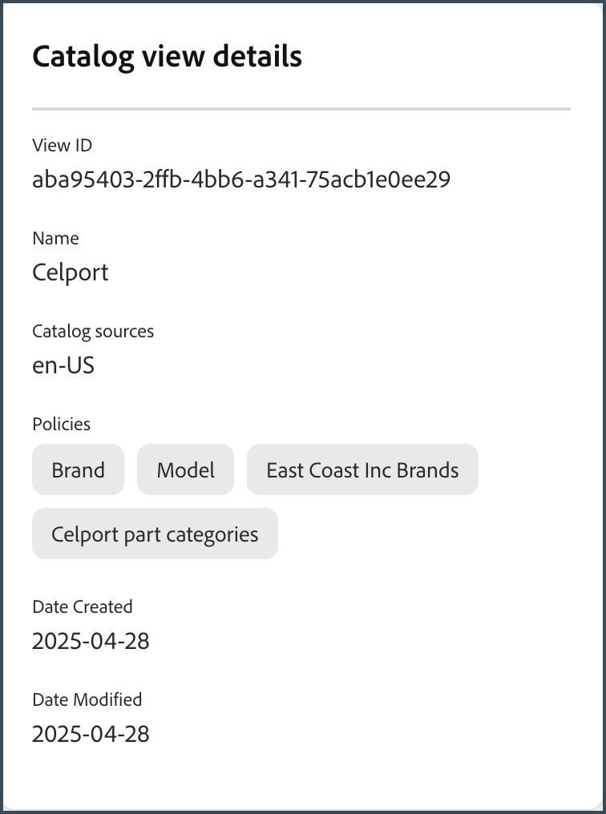

# Caso de uso completo do administrador de vitrine e catálogo

Esse caso de uso é baseado em um conglomerado fictício de automóveis chamado Carvelo Automobile, que tem uma configuração operacional complexa. Ele demonstra como usar o [!DNL Adobe Commerce Optimizer] para gerenciar um catálogo que oferece suporte a várias marcas, concessionárias e catálogos de preços, além de fornecer uma experiência de vitrine personalizada.

## Pré-requisitos

Este caso de uso foi projetado para administradores e desenvolvedores que desejam aprender a configurar uma vitrine e gerenciar um catálogo usando o [!DNL Adobe Commerce Optimizer]. Ele pressupõe que você tenha uma compreensão básica do [!DNL Adobe Commerce Optimizer] e de seus recursos.

**Tempo estimado para conclusão:** 45-60 minutos

### Configuração necessária

Antes de iniciar este tutorial, verifique se os seguintes pré-requisitos estão em vigor:

- **Instância do Adobe Commerce Optimizer**
   - Acesso a uma instância de teste no Cloud Manager
   - Consulte [Introdução](../get-started.md) para obter instruções de configuração

- **Permissões de usuário**
   - Acesso de administrador ao Adobe Admin Console
   - Consulte [Gerenciamento de usuários](../user-management.md) para obter a configuração da conta
   - Se você não tiver acesso, entre em contato com o representante de conta da Adobe.

- **Dados de Exemplo**
   - Dados de catálogo do Carvelo Automobile carregados em sua instância
   - Siga as instruções no [Repositório de assimilação de dados do catálogo de amostra](https://github.com/adobe-commerce/aco-sample-catalog-data-ingestion)
   - Você pode excluir dados de exemplo após a conclusão usando o script `reset.js` incluído

- **Ambiente de vitrine**
   - Ambiente de desenvolvimento local com Node.js
   - Projeto de vitrine da loja clonado e configurado
   - Consulte [Configuração de vitrine](../storefront.md) para obter instruções detalhadas

## Vamos começar

Nesse caso de uso, você está trabalhando com:

1. Interface do usuário do [!DNL Adobe Commerce Optimizer] - Configure exibições e políticas de catálogo para gerenciar a complexa configuração operacional de catálogo para o caso de uso Carvelo.

1. Commerce Storefront - renderize a loja usando os dados de catálogo de exemplo carregados em sua instância [!DNL Adobe Commerce Optimizer] e os arquivos de configuração da Commerce Storefront, `fstab.yaml` e `config.json`.

>[!NOTE]
>
> Saiba mais sobre os arquivos de configuração da loja revisando o [Tópico de introdução](https://experienceleague.adobe.com/developer/commerce/storefront/get-started/boilerplate-project/) na documentação da Adobe Commerce Storefront.

### ‌Principais pontos

No final deste artigo, você deverá:

- Saiba mais sobre os fundamentos do [!DNL Adobe Commerce Optimizer] com seu modelo de dados de catálogo escalável e de alto desempenho.
- Saiba como o modelo de dados de catálogo se integra a componentes de vitrine independentes de plataforma criados pela Adobe.
- Saiba como usar visualizações e políticas de catálogo do Adobe Commerce Optimizer para criar visualizações de catálogo personalizadas e filtros de acesso a dados, e enviar os dados para uma loja da Adobe Commerce habilitada pelo Edge Delivery.

## Cenário de negócios - Carvelo Automobile

Carvelo Automobile é um conglomerado de automóveis fictício com uma configuração operacional complexa.


Neste diagrama, você vê que a Carvelo vende automóveis de três marcas. Cada marca é uma empresa secundária diferente:

- Aurora (veículos elétricos)
- Parafuso (SUVs)
- Cruz (híbrido)

Ela vende essas marcas por meio de três revendedores:

- Arkbridge
- Kingsbluff
- Celport

Estes concessionários pertencem a duas sociedades-mãe diferentes:

- West Coast Inc. (Arkbridge)
- East Coast Inc. (Kingsbluff, Celport)

Cada empresa tem dois catálogos de preços usados para vender produtos a um preço específico para compradores diferentes (base, VIP).

- `west_coast_inc` e `vip_west_coast_inc`
- `east_coast_inc` e `vip_east_coast_inc`

Como você pode ver, esse é um caso de uso de negócios muito complexo. Com o [!DNL Adobe Commerce Optimizer], um comerciante pode oferecer suporte a uma estrutura de negócios complexa usando um catálogo de base única para agregar dados sem duplicação de catálogo, dimensionar catálogos de preços (mais de 30 mil catálogos de preços) e entregar todos esses dados a uma loja da Edge Delivery Services.

Agora que você tem uma visão geral do caso de uso de negócios, este é seu objetivo ao trabalhar neste tutorial:

>[!BEGINSHADEBOX]

A Carvelo quer vender peças em suas três marcas (Aurora, Bolt e Cruz) por meio de diferentes concessionárias (Arkbridge, Kingsbluff e Celport). A Carvelo quer garantir que as concessionárias tenham acesso apenas às peças e aos preços corretos de acordo com seus respectivos contratos de licenciamento.

Em última análise, Carvelo tem dois objetivos principais:

1. Mantenha um site &quot;global&quot;, que tenha todas as SKUs nas três marcas.
1. Forneça um caminho para que as concessionárias configurem suas próprias lojas com base na visibilidade exclusiva do SKU e nos preços de cada SKU para cada concessionária. Tudo isso ao usar um único catálogo básico, o que elimina a duplicação do catálogo.

>[!ENDSHADEBOX]

## &#x200B;1. Acessar a instância [!DNL Adobe Commerce Optimizer]

Navegue até o URL do aplicativo do Commerce Optimizer que é pré-configurado com os dados de amostra. Você pode encontrar o URL no Commerce Cloud Manager nos detalhes da instância do seu projeto do Commerce Optimizer ou obtê-lo do administrador do sistema. (Consulte [Acessar uma instância](../get-started.md#access-an-instance).)

Ao iniciar o [!DNL Adobe Commerce Optimizer], você verá o seguinte:

![[!DNL Adobe Commerce Optimizer] UI](../assets/user-interface.png)

>[!NOTE]
>
>Consulte o artigo [visão geral](../overview.md) para saber mais sobre os componentes principais da interface do usuário do [!DNL Adobe Commerce Optimizer].

Na navegação à esquerda, expanda a seção _Configuração de armazenamento_ e clique em **[!UICONTROL Catalog views]**. Observe que as concessionárias Arkbridge e Kingsbluff já têm visualizações de catálogo criadas:


>[!NOTE]
>
>Você pode ignorar a exibição do catálogo **Global** por enquanto.

Clique no ícone de informações para revisar os detalhes de exibição do catálogo.

A Arkbridge tem as seguintes políticas:

- Marca
- Modelo
- Marcas West Coast Inc
- Categorias de peças Arkbridge

Kingsbluff tem as seguintes políticas:

- Marca
- Modelo
- Marcas East Coast Inc
- Categorias de peças Kingsbluff

Na próxima seção, você criará uma visualização de catálogo e políticas para a concessionária Celport.

## &#x200B;2. Criar uma exibição de política e catálogo

O gerente de comércio da Carvelo precisa configurar uma nova loja para um revendedor chamado *Celport* que pertence à empresa *East Coast Inc*. A Celport venderá freios e suspensões para as marcas Bolt e Cruz.


Usando o [!DNL Adobe Commerce Optimizer], o gerente de comércio irá:

1. Crie uma nova política chamada *Categorias de peças do Celport* para o Celport vender somente peças de freio e suspensão.
1. Crie uma nova visualização de catálogo para a loja Celport.

   Esta exibição de catálogo usa sua política recém-criada *Categorias de partes do Celport* e as *Marcas da East Coast Inc* existentes para garantir que o Celport possa vender somente as marcas Bolt e Cruz como parte do contrato com a East Coast Inc. A exibição de catálogo do Celport usa o catálogo de preços `east_coast_inc` para dar suporte a cronogramas de preços de produtos que se alinham aos contratos de licenciamento de marca.
1. Atualize a configuração da loja de comércio para usar os dados da visualização do catálogo do Celport que você criou.

No final desta seção, a Celport estará pronta para vender os produtos da Carvelo.

### Criar uma política

Vamos criar uma nova política chamada *Categorias de peças do Celport* para filtrar as SKUs que o revendedor Celport vende, que incluem peças de freio e suspensão.

1. No painel à esquerda, expanda a seção _Configuração de armazenamento_ e clique em **[!UICONTROL Policies]**.

1. Clique em **[!UICONTROL Create Policy]**.

   Uma nova página é exibida para adicionar os detalhes da política.

1. Adicione os detalhes necessários:

   **Nome** = *Categorias De Partes Celport*

1. Clique em **[!UICONTROL Add Filter]**.

   Uma caixa de diálogo é exibida para adicionar detalhes do filtro.

1. Adicione os detalhes do filtro:

   - **Atributo** = *parte_categoria*
   - **Operador** = **EM**
   - **Source de Valor** = **ESTÁTICO**
   - **Valor** = *freios*, *suspensão*

   >[!IMPORTANT]
   >
   >Verifique se o nome do atributo especificado corresponde exatamente ao nome do atributo SKU no catálogo.

   Para saber mais sobre a diferença entre uma origem de valor STATIC e TRIGGER, consulte [tipos de origem de valor](../setup/policies.md#value-source-types).

1. Na caixa de diálogo **[!UICONTROL Filter details]**, clique em **[!UICONTROL Save]**.

1. Para habilitar o filtro recém-criado, clique nos pontos de ação (...) e selecione **Habilitar**.

1. Clique em **[!UICONTROL Save]**.

   >[!NOTE]
   >
   >Se o botão **[!UICONTROL Save]** não estiver ativo (azul), o nome da política pode estar ausente. Clique no ícone de lápis ao lado de *Nova política* para adicioná-la.

1. Volte para a lista de políticas clicando na seta para trás.

   Sua nova política de *Categorias de parte do Celport* aparece na lista.

**Para verificar se esta etapa foi concluída corretamente:**

- Política aparece na lista de políticas
- O status da política é exibido como ativado (indicador verde)
- Detalhes do filtro mostram &quot;part_category IN (freios, suspensão)&quot;
- O nome da política é &quot;Categorias de peças Celport&quot;

### Criar uma exibição de catálogo

Crie uma nova exibição de catálogo para o revendedor *Celport* e vincule as seguintes políticas: *Marcas da East Coast Inc* e *Categorias de Partes da Celport*.

1. No painel à esquerda, expanda a seção _Configuração de armazenamento_ e clique em **[!UICONTROL Catalog views]**.

   Observe as exibições existentes do catálogo: *Arkbridge*, *Kingsbluff* e *Global*.

   

1. Clique em **[!UICONTROL Add catalog view]**.

1. Preencha os detalhes de exibição do catálogo:

   - **Nome** = *Celport*
   - **Fontes do catálogo** = *en-US*
   - **Políticas** (use a lista suspensa) = *Marcas da East Coast Inc*; *Categorias de partes do Celport*; *Marca*; *Modelo*                          
1. Clique em **[!UICONTROL Add]** para criar a exibição do catálogo.

   A página Exibições de catálogo é atualizada para exibir a nova exibição de catálogo.

   

1. Obtenha a ID de visualização do catálogo do Celport.

   Clique no ícone de informações da exibição do catálogo do Celport na página **Exibições do catálogo**.

   

   Copie e salve a ID de exibição do catálogo. Você precisa dessa ID ao atualizar a configuração da loja para entregar dados ao seu novo catálogo do Celport.

   **Para verificar se esta etapa foi concluída corretamente:**
   - O nome da exibição do catálogo é &quot;Celport&quot;
   - A visualização do catálogo mostra quatro políticas associadas
   - A ID de exibição do catálogo é exibida e pode ser copiada
   - A origem do catálogo mostra &quot;en-US&quot;

Depois de criar a visualização de catálogo do Celport e as políticas associadas, o próximo passo é configurar a loja para usar seu novo catálogo do Celport.

## &#x200B;3. Atualize sua loja

A parte final deste tutorial envolve a atualização da loja que [você já criou](#prerequisite) para entregar dados ao novo catálogo do Celport. Nesta seção, você substitui a ID de visualização do catálogo no arquivo de configuração da loja pela ID de visualização do catálogo do Celport.

1. No ambiente de desenvolvimento local, abra a pasta onde você clonou o repositório GitHub com os arquivos de configuração padrão da loja.

1. No diretório raiz da pasta, abra o arquivo `config.json`.

   +++config.json código

   ```json
   {
    "public": {
      "default": {
      "commerce-core-endpoint": "https://www.aemshop.net/graphql",
      "commerce-endpoint": "https://na1-sandbox.api.commerce.adobe.com/Fwus6kdpvYCmeEdcCX7PZg/graphql",
      "headers": {
         "cs": {
            "ac-view-id": "9ced53d7-35a6-40c5-830e-8288c00985ad",
            "ac-price-book-id": "west_coast_inc",
            "ac-source-locale": "en-US"
           }
         },
         "analytics": {
            "base-currency-code": "USD",
            "environment": "Production",
            "store-id": 1,
            "store-name": "ACO Demo",
            "store-url": "https://www.aemshop.net",
            "store-view-id": 1,
            "store-view-name": "Default Store View",
            "website-id": 1,
            "website-name": "Main Website"
          }
       }
      }
   }
   ```

   Observe que o cabeçalho de exibição de catálogo inclui os seguintes valores:

   - `commerce-endpoint`: `"https://na1-sandbox.api.commerce.adobe.com/Fwus6kdpvYCmeEdcCX7PZg/graphql"`
   - `ac-view-id`:`"9ced53d7-35a6-40c5-830e-8288c00985ad"`
   - `ac-price-book-id`: `"west_coast_inc"`
   - `ac-source-locale`: `"en-US"`

1. No valor `commerce-endpoint`, substitua a ID do locatário na URL pela URL da instância [!DNL Adobe Commerce Optimizer].

   Você pode encontrar a ID do locatário no URL da interface do usuário do Commerce Optimizer. Por exemplo, na URL a seguir, a ID do locatário é `XDevkG9W6UbwgQmPn995r3`.

   ```text
   https://experience.adobe.com/#/@commerceprojectbeacon/in:XDevkG9W6UbwgQmPn995r3/commerce-optimizer-studio/catalog
   ```

1. Substitua o valor `ac-view-id` pela ID de exibição de catálogo do Celport copiada anteriormente.

1. Substitua o valor `ac-price-book-id` por `"east_coast_inc"`.

   Depois que você fizer essas alterações, o arquivo `config.json` deverá ter a seguinte aparência, com os espaços reservados `ACO-tenant-id` e `celport-catalog-view-id` substituídos por seus valores:

   ```json
   {
     "public": {
        "default": {
        "commerce-core-endpoint": "https://www.aemshop.net/graphql",
        "commerce-endpoint": "https://na1-sandbox.api.commerce.adobe.com/{{ACO-tenant-id}}/graphql",
        "headers": {
            "cs": {
                "ac-view-id": "{{celport-catalog-view-id}}",
                "ac-price-book-id": "east_coast_inc",
                "ac-source-locale": "en-US"
              }
            },
            "analytics": {
                "base-currency-code": "USD",
                "environment": "Production",
                "store-id": 1,
                "store-name": "ACO Demo",
                "store-url": "https://www.aemshop.net",
                "store-view-id": 1,
                "store-view-name": "Default Store View",
                "website-id": 1,
                "website-name": "Main Website"
             }
         }
     }
   }
   ```

1. Salve o arquivo.

   Ao salvar as alterações, atualize a configuração do catálogo para usar a visualização do catálogo Carvelo que foi configurada para vender somente peças de freio e suspensão.

## &#x200B;4. Visualizar a loja

Agora que você atualizou a configuração da loja para usar a visualização de catálogo do Celport, é possível visualizar a loja para ver como ela renderiza os dados do catálogo.

1. Inicie a loja para visualizar a experiência de catálogo específica do Celport criada pela configuração da loja.

   1. Na janela do terminal no IDE, inicie a visualização da vitrine local.

      ```shell
      npm start
      ```

      O navegador abre para a visualização de desenvolvimento local em `http://localhost:3000`.

      Se o comando falhar ou o navegador não abrir, revise as [instruções para desenvolvimento local](../storefront.md) no tópico de configuração Loja.

1. No navegador, procure por `brakes` e pressione **Enter**.

   A loja atualiza para exibir a página da lista de produtos mostrando as peças de freio.

   

   Clique em uma imagem de peça de freio para visualizar os detalhes do produto com informações de preço e anotar as informações de preço do produto.

1. Procure por `tires`, que é outra categoria de parte disponível nos dados de caso de uso na sua instância [!DNL Adobe Commerce Optimizer].

   

   Observe que nenhum resultado é retornado. Isso ocorre porque a visualização do catálogo Celport foi configurada para vender somente peças de freio e suspensão.

1. Experimente atualizar o arquivo de configuração da loja (`config.json`).

   1. Altere os valores de `ac-view-id` e `ac-price-book`.

   Por exemplo, você pode alterar a ID de exibição do catálogo para a exibição do catálogo Kingsbluff e a ID do catálogo de preços para `east_coast_inc`. Você pode ver as categorias de partes disponíveis para Kingsbluff revisando a política *categorias de partes Kingsbluff*.

   1. Salve o arquivo.

      Ao salvar o arquivo, a visualização da vitrine local é atualizada automaticamente.

   1. Pré-visualize as alterações no navegador usando o recurso Pesquisar para localizar as partes do pneu.

      Observe os diferentes tipos de peças disponíveis e observe os preços atribuídos à visualização do catálogo Kingsbluff.

   Esses experimentos demonstram a flexibilidade do Adobe Commerce Optimizer — você pode alternar rapidamente entre diferentes exibições de catálogo e catálogos de preços para criar experiências de compra personalizadas para públicos diferentes sem duplicar os dados do catálogo.

## Solução de problemas

Se você encontrar problemas durante este tutorial, tente as seguintes soluções:

### Problemas de criação de política

**Problema:** o botão Salvar não está ativo

- **Solução:** verifique se o nome da política foi inserido e se todos os campos necessários foram preenchidos

**Problema:** O filtro não está funcionando como esperado

- **Solução:** verifique se o nome do atributo corresponde exatamente ao atributo SKU no catálogo

### Problemas de visualização do catálogo

**Problema:** a exibição do catálogo não aparece na lista

- **Solução:** verifique se todas as políticas associadas estão habilitadas e configuradas corretamente

### Problemas de configuração da vitrine

**Problema:** Storefront não está carregando

- **Solução:** verifique se a ID do locatário e a ID da exibição do catálogo foram inseridas corretamente no arquivo config.json

**Problema:** nenhum produto sendo exibido

- **Solução:** verifique se a ID do catálogo de preços corresponde à ID disponível em sua instância do Adobe Commerce Optimizer

**Problema:** pesquisa não retornou resultados

- **Solução:** confirme se as políticas de exibição de catálogo permitem a categoria de produto pesquisada

Para obter ajuda adicional, consulte a [documentação do Adobe Commerce Optimizer](../overview.md) ou entre em contato com o suporte da Adobe.

## Resumo

Neste tutorial, você pode:

- Criação de uma nova política para filtrar categorias de produtos para a concessionária Celport
- Configurar uma visualização de catálogo com várias políticas para controlar a visibilidade do produto
- Configurada uma vitrine para usar a nova visualização de catálogo
- Verificada a configuração testando a visibilidade e o preço do produto

## Próximas etapas

Para continuar aprendendo sobre o Adobe Commerce Optimizer:

- Explore os [recursos de merchandising](../merchandising/overview.md) para personalizar a experiência de compra
- Saiba mais sobre [configurações avançadas de política](../setup/policies.md)
- Configurar [exibições adicionais do catálogo](../setup/catalog-view.md) para outras concessionárias
- Revise a [documentação da API](https://developer.adobe.com/commerce/services/optimizer/) para obter gerenciamento programático de catálogos
- Saiba como configurar componentes integrados para a sua loja do Edge Delivery Services para criar experiências personalizadas de vitrine para descobertas de produtos, recomendações e outros recursos da loja. Consulte a [documentação da Storefront](https://experienceleague.adobe.com/developer/commerce/storefront/dropins/all/introduction/)
